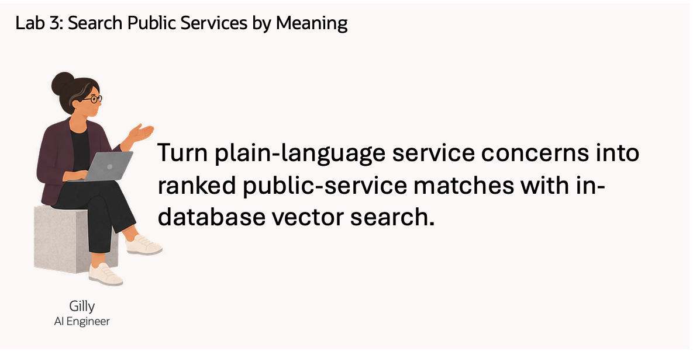
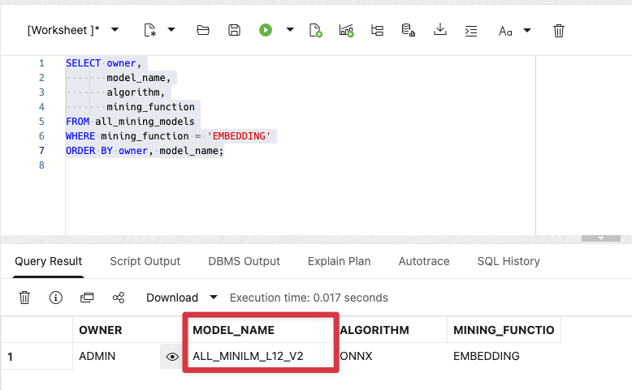
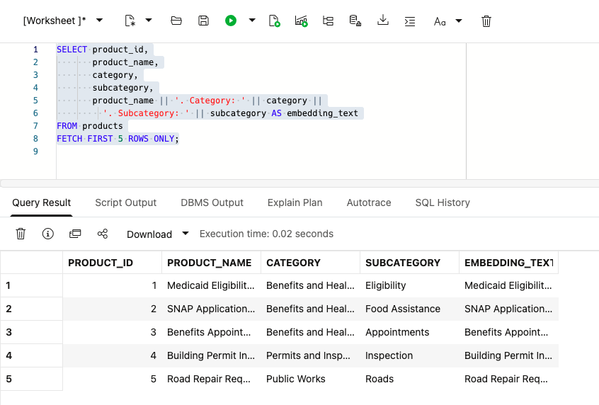
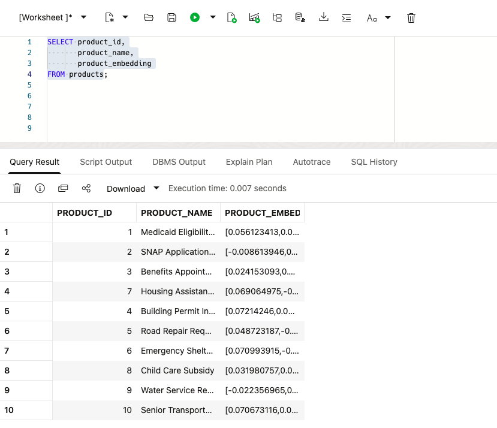
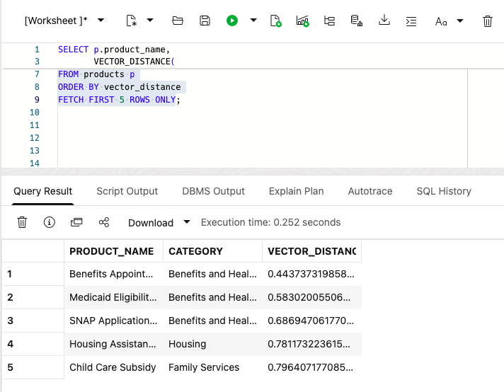
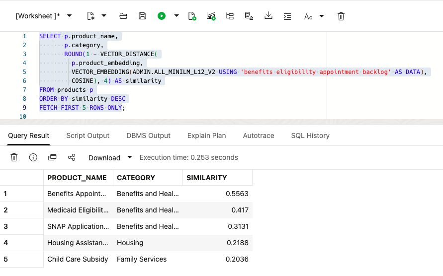
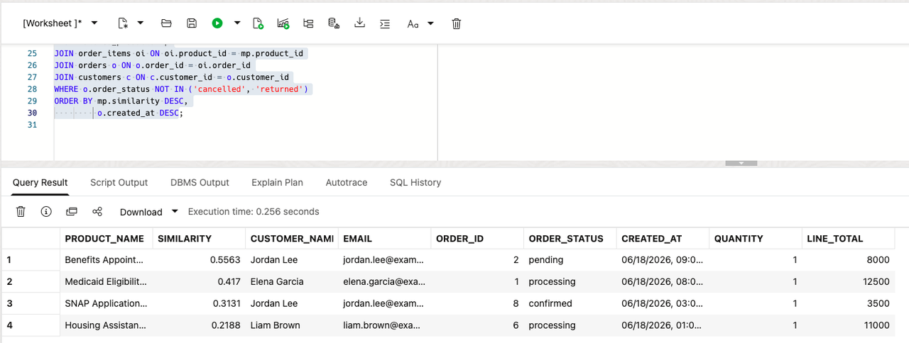

# Search Public Services by Meaning

## Introduction

Gilly Bourne is an AI engineer supporting Colorado's State and Local Government services. Her team has built a search feature for the Public Service Command Center. A public-service team can enter a concern such as **benefits eligibility appointment backlog**. The application should find related public services first, then show the residential customers whose service requests include them.

Gilly already has the public-service, service-request, and residential-customer data in the database. Her design problem is connecting a plain-language concern to those existing rows. She needs to turn public-service descriptions into vectors, rank the closest services, and join those matches to service requests and residential customers. A useful result must show more than a similarity score. It must give the public-service team a focused list they can review.

She could export the text and embeddings to a separate vector service. That would add a second copy of sensitive public-service language, another index to refresh, and another set of access rules to manage. Gilly wants the search to run where the underlying rows already live, so one SQL statement can compare meaning, join public-service data to service requests and residential customers, and return a result for the application.

In this lab, you review Gilly's implementation from the embedding model to the final residential-customer service-request list. You see why Oracle AI Database fits the job: vector search finds relevant public services, and SQL joins connect them to exact service-request and residential-customer data in the same database.



<details>
<summary><strong>Key terms: embedding, vector, vector distance, and semantic search</strong></summary>

> - An **embedding** is a numerical profile of what text means. In this lab, public-service descriptions are embedded so similar service ideas sit near each other mathematically, even when the wording is different.
>
> - An **ONNX embedding model** is a portable machine-learning model saved in the Open Neural Network Exchange (ONNX) format. It turns text into a vector of numbers that captures meaning. Oracle AI Database can load and run this model inside the database, close to the public-service rows.
>
> - A **vector** is the stored numerical form of an embedding. Oracle Database can store vectors beside the public-service rows they describe, so the search stays connected to service names, categories, service-request activity, and other business columns.
>
> - **Vector distance** measures how close two vectors are. A smaller distance means the meanings are more similar; a larger distance means they are farther apart. In this lab, distance helps rank which public services or resident concerns best match a public-service team's question.
>
> - **Semantic search** means searching by meaning instead of exact words. A search for "benefits eligibility appointment backlog" can find related public services even when the service names use different wording.

</details>

Gilly has already built the public-service search for the Public Service Command Center. In this lab, you review how she built the search. The search area lets a public-service team enter a concern in ordinary language and receive ranked public services by meaning.

### Objectives

- Check the embedding model Gilly needs for semantic search.
- Create a vector from public-service descriptions inside the database.
- Review a semantic public-service search for a service concern.
- Turn public-service matches into a residential-customer service-request review list.
- Explain why vector search belongs beside public-service data and access controls.

Estimated Time: **10 minutes**

### Hands-on Scenario

| Step                | State and Local Government focus                                                                                                            |
| ---------------------| ---------------------------------------------------------------------------------------------------------------------------------------------|
| Business Problem    | Public-service teams need to find relevant services without knowing the exact terms used in the service descriptions.                       |
| Technical Challenge | Gilly must search by meaning while keeping public-service data, vectors, service requests, residential customers, and access controls together. |
| Persona Focus       | You review Gilly's implementation as she explains how the search connects a service concern to public services, service requests, and residential customers. |
| What You Will See   | Vector search ranks public services by meaning, then SQL adds service-request and residential-customer details.                            |
| Database Capability | `VECTOR_EMBEDDING`, vector columns, and `VECTOR_DISTANCE` run beside relational public-service data.                                       |
| Outcome             | The application can turn a plain-language concern into a residential-customer service-request review list without a separate vector database or copied public-service text. |

Persona focus: You are reviewing the public-service search tool Gilly built for the Public Service Command Center.


> **SQL Worksheet reminder:** Need a reminder on how to open and use the SQL Worksheet? Return to [Getting Started Task 2: Open SQL Worksheet](?lab=getting-started#Task2:OpenSQLWorksheet) for the step-by-step guide showing how to run SQL statements.


## Task 1: Check the embedding model

Start with Gilly's first design question: **what does similarity search need?** It needs vectors for the text being searched and an embedding model that converts a question into a vector.

Gilly asks Jessica to load an ONNX embedding model into Oracle AI Database. Oracle AI Database can store and run the ONNX model inside the database, so it creates the question embedding where the public-service data already live. The application does not have to send public-service text to a separate service and bring the vector back.

1. Run the following query to see which embedding models are available:

    ```sql
    <copy>
    SELECT owner,
           model_name,
           algorithm,
           mining_function
    FROM all_mining_models
    WHERE mining_function = 'EMBEDDING'
    ORDER BY owner, model_name;
    </copy>
    ```

    **Expected output: Available Embedding Models**

    

    The result should include an embedding model owned by `ADMIN`, such as `ALL_MINILM_L12_V2`. This compact model turns text into 384-number vectors. The `EMBEDDING` value confirms that the model can turn text into vectors for similarity search.

2. Review what this means for Gilly's application.

    Gilly can call the model from SQL with `VECTOR_EMBEDDING(...)`. Jessica manages the model inside the database, while Gilly uses it in her search query. The public-service data, vectors, and access controls stay in the same database.

    > **Note:** This is the key Oracle AI Database differentiator in this lab. The embedding model runs inside the database, so Gilly does not need a separate embedding service or a data pipeline to move public-service text between systems.

## Task 2: Create a public-service vector

Gilly decides that one vector per public service is enough. Each service record is short and describes one service, so she combines its name, category, and subcategory into one text value before creating the vector.

1. Review the text Gilly will embed:

    ```sql
    <copy>
    SELECT product_id,
           product_name,
           category,
           subcategory,
           product_name || '. Category: ' || category ||
             '. Subcategory: ' || subcategory AS embedding_text
    FROM products
    FETCH FIRST 5 ROWS ONLY;
    </copy>
    ```

    **Expected output: Public-Service Embedding Text**

    

    The combined text gives the model the public-service name and its business classification. Gilly does not need to embed price, dates, or other values that do not describe what the service is.

2. Add a vector column to `PRODUCTS`:

    ```sql
    <copy>
    ALTER TABLE products ADD (product_embedding VECTOR(384));
    </copy>
    ```

    The column has 384 dimensions because `ALL_MINILM_L12_V2` produces 384-dimensional vectors.

3. Create the public-service vectors inside Oracle Database:

    ```sql
    <copy>
    UPDATE products
    SET product_embedding = VECTOR_EMBEDDING(
      ADMIN.ALL_MINILM_L12_V2 USING
        product_name || '. Category: ' || category ||
        '. Subcategory: ' || subcategory AS DATA)
    WHERE product_embedding IS NULL;

    COMMIT;
    </copy>
    ```

    The model reads the text in each row and writes the vector back to that same row. No public-service text leaves the database.

4. Verify the new column and its data:

    ```sql
    <copy>
    SELECT product_id,
           product_name,
           product_embedding
    FROM products;
    </copy>
    ```

    

    Each public service now has its own 384-dimensional vector. Gilly can use this column directly when the application searches for services by meaning.

    > **Note:** Chunking is not relevant for this data. Each row describes one short public service, so splitting it would create several vectors for one service without adding useful detail. Chunking becomes useful for long documents, such as policies or regulatory bulletins, where each section may answer a different question.

## Task 3: Test the public-service vector

Now Gilly tests the new column with a simple vector query. She asks for public services related to benefits eligibility appointment backlog and lets the database rank them by meaning.

1. Run the following query:

    The SQL creates an embedding for the phrase `benefits eligibility appointment backlog`, compares it with the vectors in `PRODUCTS.PRODUCT_EMBEDDING`, and returns the cosine distance. A smaller distance means the two vectors are closer in meaning, so the query orders the smallest distance first.

    <details>
    <summary><strong>Why this matters to Gilly</strong></summary>

    > Gilly could export the text to an external embedding pipeline or search service. That would create extra copies of sensitive public-service text and make it harder to show which data the application searched.
    >
    > Oracle AI Vector Search keeps the public-service data, vectors, SQL query, and vector distance together. Gilly can check the search and use the result in the application without adding another data store.

    </details>

    ```sql
    <copy>
    SELECT p.product_name,
           p.category,
           VECTOR_DISTANCE(
             p.product_embedding,
             VECTOR_EMBEDDING(ADMIN.ALL_MINILM_L12_V2 USING 'benefits eligibility appointment backlog' AS DATA),
             COSINE) AS vector_distance
    FROM products p
    ORDER BY vector_distance
    FETCH FIRST 5 ROWS ONLY;
    </copy>
    ```

    **Expected output: Benefits Eligibility Matches**

    

2. Review the ranked public services.
    The query embeds the analyst phrase at runtime and compares it to the `PRODUCTS.PRODUCT_EMBEDDING` column. `VECTOR_DISTANCE` calculates the distance between the two vectors using the `COSINE` metric. A lower value means a closer match.

    In the broader workflow, these ranked public services can become the next filter for Public Service Command Center review and service-pressure analysis.

3. Show the result as a similarity score:

    Vector distance is useful for checking the search, but business users may not know what a cosine distance means. Gilly changes the display to a similarity score. She subtracts the distance from `1`, so a higher score means a closer match, and rounds the result to four decimal places.

    ```sql
    <copy>
    SELECT p.product_name,
           p.category,
           ROUND(1 - VECTOR_DISTANCE(
             p.product_embedding,
             VECTOR_EMBEDDING(ADMIN.ALL_MINILM_L12_V2 USING 'benefits eligibility appointment backlog' AS DATA),
             COSINE), 4) AS similarity
    FROM products p
    ORDER BY similarity DESC
    FETCH FIRST 5 ROWS ONLY;
    </copy>
    ```

    The query uses the same vectors and the same cosine calculation. It only changes how the result is shown to the person using the application.

    

## Task 4: Find residential customers with related service requests

Gilly now connects the ranked public-service matches to service-request and residential-customer rows. A public-service team can enter a concern and find residential customers whose service requests include related services. The result gives the team a focused list for review, with the service match, request status, request date, and residential-customer contact details.

1. Run the following query for the concern `benefits eligibility appointment backlog`:

    ```sql
    <copy>
    WITH matched_products AS (
        SELECT p.product_id,
               p.product_name,
               ROUND(1 - VECTOR_DISTANCE(
                 p.product_embedding,
                 VECTOR_EMBEDDING(
                   ADMIN.ALL_MINILM_L12_V2
                   USING 'benefits eligibility appointment backlog' AS DATA
                 ),
                 COSINE), 4) AS similarity
        FROM products p
        ORDER BY similarity DESC
        FETCH FIRST 5 ROWS ONLY
    )
    SELECT mp.product_name,
           mp.similarity,
           c.first_name || ' ' || c.last_name AS customer_name,
           c.email,
           o.order_id,
           o.order_status,
           o.created_at,
           oi.quantity,
           oi.line_total
    FROM matched_products mp
    JOIN order_items oi ON oi.product_id = mp.product_id
    JOIN orders o ON o.order_id = oi.order_id
    JOIN customers c ON c.customer_id = o.customer_id
    WHERE o.order_status NOT IN ('cancelled', 'returned')
    ORDER BY mp.similarity DESC,
             o.created_at DESC;
    </copy>
    ```

    The first part ranks public services by meaning. The remaining joins use ordinary relational keys to find matching requested services, service requests, and residential customers.

    **Expected output: Residential-Customer Service-Request Review List**

    The result shows residential customers with service requests that include public services related to the concern. The similarity score explains why a service was included, while the request and residential-customer columns give the public-service team enough information to decide what to review next.


    

2. Review the business result.

    Gilly does not vectorize every service request or residential customer. She vectorizes the public-service descriptions once, then builds a converged query that combines vector search with SQL joins for exact service-request and contact details. This keeps the search flexible while the final review list remains precise and easy to act on.

## Conclusion

Gilly has built the search behind the application and connected it to a public-service review action. A plain-language concern can produce ranked public services and a residential-customer service-request review list using vectors, relational joins, and SQL in Oracle AI Database.

## Acknowledgements

* **Author** - Pat Shepherd
* **Last Updated By/Date** - Pat Shepherd, September 2026
