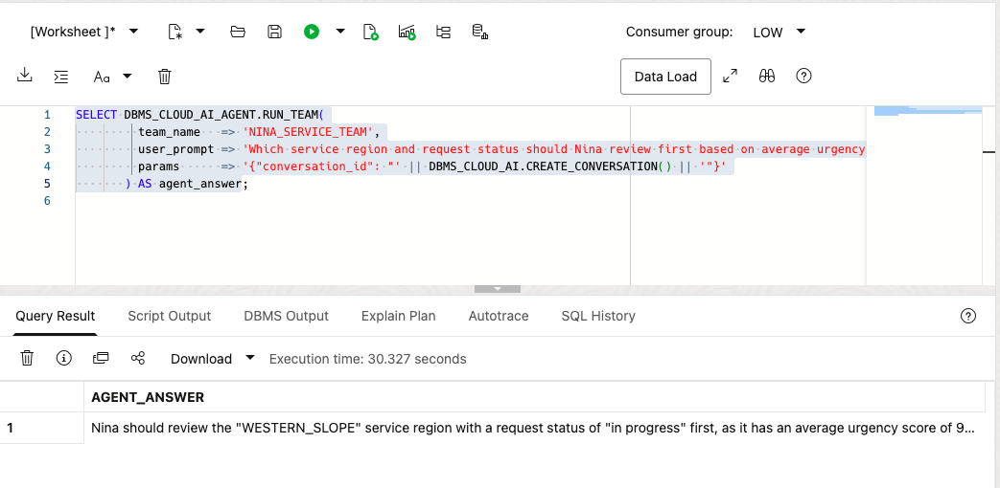
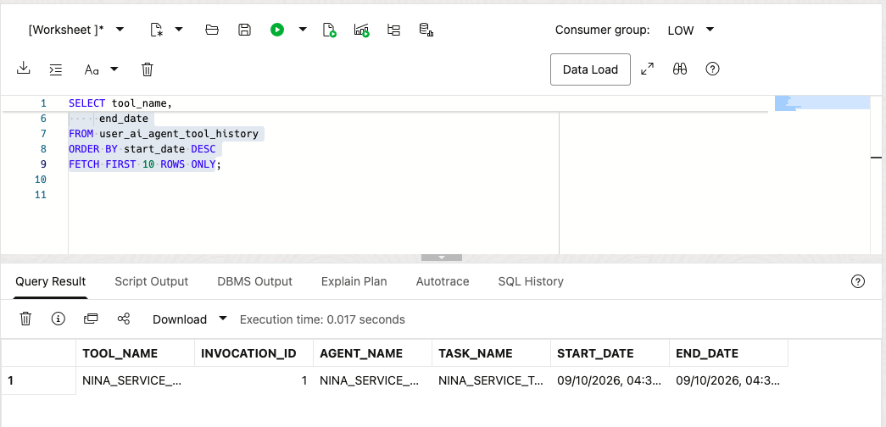

# Build a Governed Public-Service AI Agent

## Introduction

Nina Patel has used Select AI to ask one public-service question at a time. That works for a quick answer, but her operations review needs a repeatable assistant that can answer a service-demand question through an approved tool.

Jessica, the DBA, does not want to give an AI system unrestricted access to the database. She gives Nina's agent one approved tool: a read-only SQL tool that uses the `GENAI` profile and the two service views prepared in the previous lab.

In this lab, you create the agent objects, connect the agent to the SQL tool, and run a question through the team. The agent uses the approved tool and returns an answer. The tool remains read-only, and the SQL still runs with the database user's privileges.

<details>
<summary><strong>Key terms: agent, tool, task, and team</strong></summary>

> - An **agent** is a configured role that follows instructions when it handles a request.
>
> - A **tool** is a capability the agent is allowed to call. In this lab, the tool runs SQL through the `GENAI` profile.
>
> - A **task** tells the agent what to do and which tools it may use.
>
> - A **team** connects the agent and task so an application or SQL session can run them together.

</details>

### Objectives

- Confirm that the `GENAI` profile from the previous lab is available.
- Verify which approved public-service views the SQL tool may use.
- Register a read-only SQL tool for the governed public-service schema.
- Create an agent, task, and team with `DBMS_CLOUD_AI_AGENT`.
- Run a public-service demand question through the team.
- Review the agent's tool history and explain why the tool boundary matters.

Estimated Time: **15 minutes**

### Hands-on Scenario

| Step                | Public-service focus                                                                          |
| ------------------- | ---------------------------------------------------------------------------------------------- |
| Business Problem    | Nina needs a service-demand answer that can support an operations review.                      |
| Technical Challenge | The agent must use database data through one approved, read-only capability.                   |
| Persona Focus       | You follow Nina as she turns a Select AI question into a controlled public-service assistant. |
| What You Will See   | An agent receives a request, calls its SQL tool, and returns a public-service answer.           |
| Database Capability | Select AI Agent, `DBMS_CLOUD_AI_AGENT`, AI profiles, and a built-in SQL tool.                   |
| Outcome             | Nina has a controlled agent that can answer service questions from the governed schema.        |

> **Prerequisite:** Complete [Lab 7: Ask Public-Service Questions with Select AI](?lab=selectai). This lab uses the `GENAI` profile and its `object_list`.

## Task 1: Check the profile and approved view access

The agent's SQL tool uses the existing `GENAI` profile. The profile's `object_list` limits the service views Select AI may use when it generates SQL. Database privileges provide the second control: the SQL still runs as the current database user and cannot read objects that user cannot access.

1. Check the profile:

    ```sql
    <copy>
    SELECT profile_name,
           status
    FROM user_cloud_ai_profiles
    WHERE profile_name = 'GENAI';
    </copy>
    ```

    The profile should be enabled. If it is not present, complete Lab 7 first or ask the DBA which profile to use.

2. Check the approved views listed in the profile:

    ```sql
    <copy>
    SELECT profile_name,
           attribute_name,
           attribute_value
    FROM user_cloud_ai_profile_attributes
    WHERE profile_name = 'GENAI'
      AND attribute_name = 'object_list';
    </copy>
    ```

    The list should contain only the approved views from Lab 7: `SELECT_AI_SERVICE_REGION_V` and `SELECT_AI_SERVICE_DEMAND_V`. The `object_list` guides SQL generation; it is not a replacement for database grants.

3. Check the agent objects already in your schema:

    ```sql
    <copy>
    SELECT agent_name,
           status
    FROM user_ai_agents
    ORDER BY agent_name;
    </copy>
    ```

    The workshop objects use names beginning with `NINA_SERVICE_`. If you already ran this lab, you can reuse the existing objects or run the reset block in the appendix before starting again.

## Task 2: Register the SQL tool

The SQL tool is the agent's only database capability in this lab. It uses the `GENAI` profile, so the profile's object list limits the schema metadata available for generated SQL.

1. Register the tool:

    ```sql
    <copy>
    BEGIN
      DBMS_CLOUD_AI_AGENT.CREATE_TOOL(
        tool_name   => 'NINA_SERVICE_SQL_TOOL',
        attributes  => '{"tool_type": "SQL", "tool_params": {"profile_name": "genai"}}',
        description => 'Read-only SQL access to approved public-service views'
      );
    END;
    /
    </copy>
    ```

    The tool does not create a second data store. It gives the agent a named, controlled way to ask Select AI to generate and run SQL against the approved service views. The tool uses the profile's view list, and the database user's privileges still apply when the SQL runs.
  
2. Confirm the tool definition:

    ```sql
    <copy>
    SELECT tool_name,
           status,
           description
    FROM user_ai_agent_tools
    WHERE tool_name = 'NINA_SERVICE_SQL_TOOL';
    </copy>
    ```
  
## Task 3: Create Nina's agent, task, and team

The tool by itself does nothing. Nina's agent needs a role, a task needs instructions, and a team connects the two.

1. Create the agent:

    ```sql
    <copy>
    BEGIN
      DBMS_CLOUD_AI_AGENT.CREATE_AGENT(
        agent_name  => 'NINA_SERVICE_AGENT',
        attributes  => '{"profile_name": "genai", "role": "You are Nina Patel''s public-service data assistant. Answer questions using the approved SQL tool. Use database results for service region, request status, request count, and urgency. Do not invent values."}',
        description => 'Public-service assistant for Nina Patel'
      );
    END;
    /
    </copy>
    ```

2. Create the task:

    ```sql
    <copy>
    BEGIN
      DBMS_CLOUD_AI_AGENT.CREATE_TASK(
        task_name  => 'NINA_SERVICE_TASK',
        attributes => '{"instruction": "Answer Nina''s public-service question: {query}. Use NINA_SERVICE_SQL_TOOL once to retrieve the required data. Return a concise answer based on the database result. Do not repeat the same tool call and do not make changes to database records.", "tools": ["NINA_SERVICE_SQL_TOOL"], "enable_human_tool": "false"}',
        description => 'Answer read-only public-service questions'
      );
    END;
    /
    </copy>
    ```
  
3. Create the team:

    ```sql
    <copy>
    BEGIN
      DBMS_CLOUD_AI_AGENT.CREATE_TEAM(
        team_name  => 'NINA_SERVICE_TEAM',
        attributes => '{"agents": [{"name": "NINA_SERVICE_AGENT", "task": "NINA_SERVICE_TASK"}], "process": "sequential"}',
        description => 'Read-only public-service question team'
      );
    END;
    /
    </copy>
    ```

    The team is the runnable unit. It connects Nina's role, the task instructions, and the SQL tool.
  
## Task 4: Run a public-service question

Database Actions does not support the `SELECT AI AGENT` command directly. Use `DBMS_CLOUD_AI_AGENT.RUN_TEAM` in SQL Worksheet and provide the team name in the function call.

1. Ask the agent:

    ```sql
    <copy>
    SELECT DBMS_CLOUD_AI_AGENT.RUN_TEAM(
             team_name   => 'NINA_SERVICE_TEAM',
             user_prompt => 'Which service region and request status should Nina review first based on average urgency? Include the average urgency score and service request count.',
             params      => '{"conversation_id": "' || DBMS_CLOUD_AI.CREATE_CONVERSATION() || '"}'
           ) AS agent_answer;
    </copy>
    ```
  
    Database Actions does not keep an agent conversation ID for this call, so the query creates one and passes it to `RUN_TEAM`. The ID lets Oracle record the prompt and response in the agent conversation history.

    

2. Review the answer.

    Look for a service region, request status, average urgency score, and service request count. The exact wording may vary because an AI provider generates the response, but the answer should be based on the approved service views available through `GENAI`.
  
    > **Note:** This team has a read-only SQL tool. It can query the data, but the task instructions do not give it a tool for inserting, updating, or deleting records.

## Task 5: Inspect what the agent did

Nina needs more than a final answer. She also wants to know whether the agent called the approved tool and how the request was processed.

1. Review the latest team runs:

    ```sql
    <copy>
    SELECT team_name,
         team_exec_id,
         state,
         start_date,
         end_date
    FROM user_ai_agent_team_history
    WHERE team_name = 'NINA_SERVICE_TEAM'
    ORDER BY start_date DESC
    FETCH FIRST 5 ROWS ONLY;
    </copy>
    ```

2. Review the latest tool calls:

    ```sql
    <copy>
    SELECT tool_name,
         invocation_id,
         agent_name,
         task_name,
         start_date,
         end_date
    FROM user_ai_agent_tool_history
    ORDER BY start_date DESC
    FETCH FIRST 10 ROWS ONLY;
    </copy>
    ```

    

    The history should show `NINA_SERVICE_SQL_TOOL` and `NINA_SERVICE_TEAM`. This gives Nina and Jessica a database record of the agent activity instead of treating the answer as an unexplained response.

## Conclusion: Give the agent a controlled way to work

In Lab 7, Nina used Select AI to turn a public-service question into SQL. In this lab, she gives an agent a role, a task, and one approved SQL tool. The agent can handle a broader service question, while the database still controls the profile, object list, privileges, and tool history.

That is the next step from Select AI to Select AI Agent: an application can call a defined public-service assistant instead of assembling every question and database call itself. Jessica can review the tool available to the agent and remove access by disabling the tool or team.

The data boundary has two parts. The profile's `object_list` tells the SQL tool which approved views to consider, while database grants decide which objects and rows the session can actually read. Both should be kept narrow when an agent is used by an application.

The example remains read-only on purpose. Before an agent is allowed to change data, the team should add a narrowly defined function tool, clear instructions, and a confirmation step for the user.

## Appendix: Reset the workshop objects

Run this block only if you want to recreate the objects used in this lab. It removes the four State and Local agent objects created here. It does not remove the existing `GENAI` profile or its approved view list.

```sql
<copy>
BEGIN
  DBMS_CLOUD_AI_AGENT.DROP_TEAM('NINA_SERVICE_TEAM', TRUE);
  DBMS_CLOUD_AI_AGENT.DROP_TASK('NINA_SERVICE_TASK', TRUE);
  DBMS_CLOUD_AI_AGENT.DROP_AGENT('NINA_SERVICE_AGENT', TRUE);
  DBMS_CLOUD_AI_AGENT.DROP_TOOL('NINA_SERVICE_SQL_TOOL', TRUE);
END;
/
</copy>
```

## Next Steps

Read the [Oracle AI Database Select AI Agent documentation](https://docs.oracle.com/en/database/oracle/oracle-database/26/selai/).

## Acknowledgements

* **Author** - Pat Shepherd
* **Last Updated By/Date** - Pat Shepherd, September 2026
