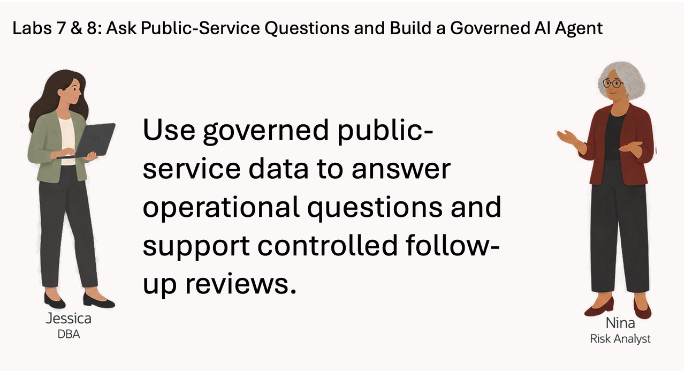
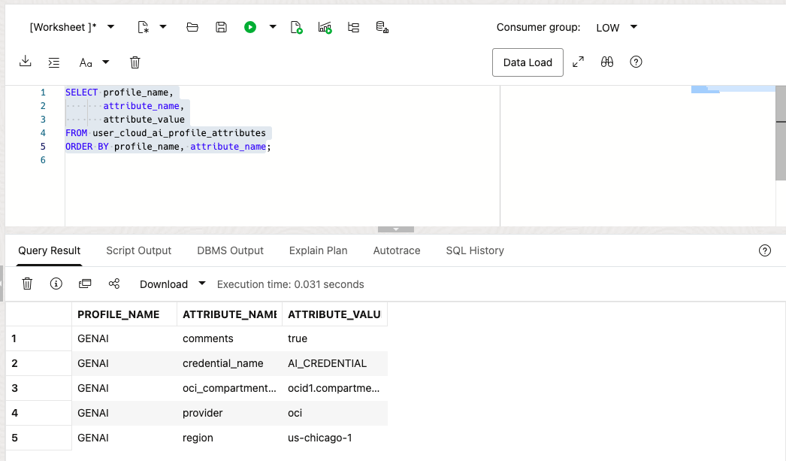
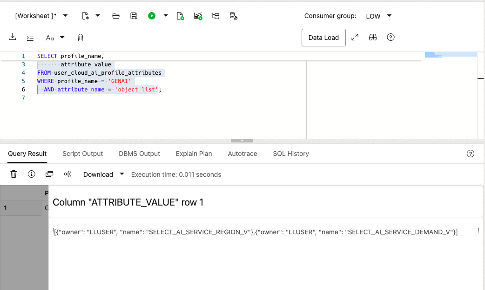
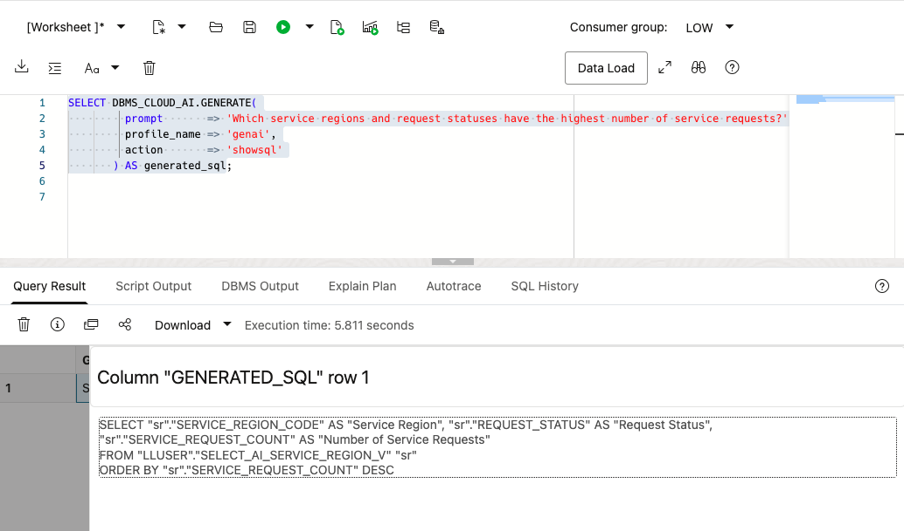
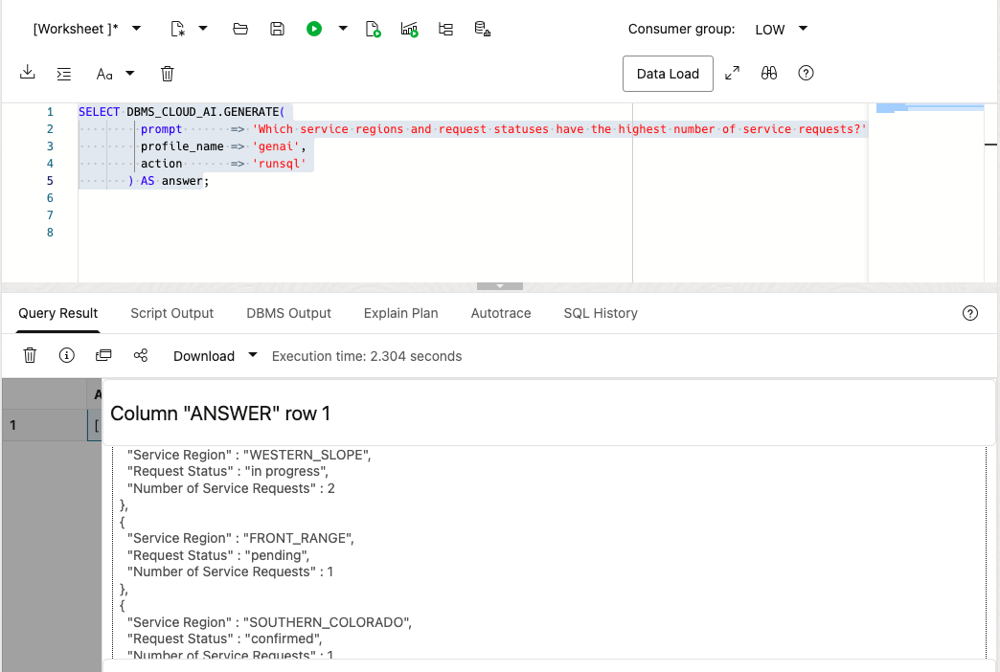
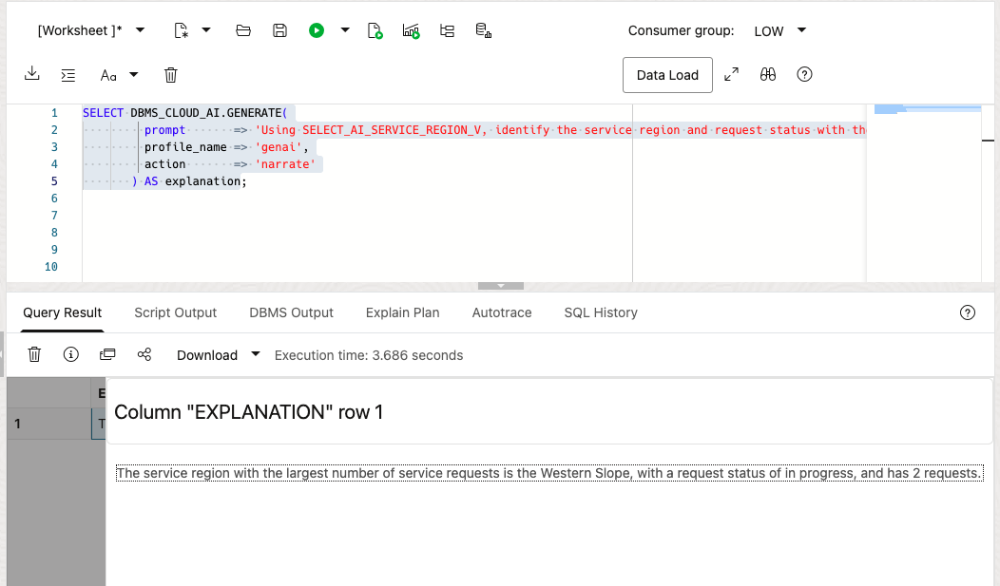

# Ask Public-Service Questions with Select AI

## Introduction

Nina Patel is a risk analyst on a State and Local Government service-operations team. She needs answers about request volume and urgency, but she does not want every answer to depend on finding the right table, column, join, and filter first.

Jessica, the DBA, has already configured a Select AI profile for the public-service schema. Nina can ask a question in ordinary language. Select AI uses the profile and the database metadata to generate SQL, run it, or explain the result.

Nina still needs to review the generated SQL. The model can misunderstand a question or choose the wrong columns. Her working pattern is simple: ask a question, inspect the SQL, run it, refine the question, and compare the answer with the database result.

In this lab, you prepare two approved service views, ask a public-service question, inspect the SQL, and refine the question for an operations review.



<details>
<summary><strong>Key terms: Select AI, AI profile, generated SQL, and natural-language prompt</strong></summary>

> - **Select AI** lets a user work with database information through a natural-language question.
>
> - An **AI profile** connects Select AI to an AI provider and identifies the database objects that may be used for the question.
>
> - **Generated SQL** is the SQL statement created from the question. Nina should inspect it before relying on the result.
>
> - A **natural-language prompt** is the question sent to Select AI, such as `Which service regions and request statuses have the highest number of service requests?`

</details>

### Objectives

- Check which Select AI profile is available in the schema.
- Create two read-only service summary views and add only those views to the Select AI profile.
- Generate SQL from a public-service question and inspect it.
- Run a natural-language question through `DBMS_CLOUD_AI.GENERATE`.
- Improve a question so the result includes request volume and urgency.
- Explain why generated SQL still requires review.

Estimated Time: **10 minutes**

### Hands-on Scenario

| Step                | Public-service focus                                                                          |
| ---------------------| ----------------------------------------------------------------------------------------------|
| Business Problem    | Nina needs quick answers about service demand and request status for an operations review.    |
| Technical Challenge | The question must use approved views and produce SQL Nina can inspect before relying on it.  |
| Persona Focus       | You follow Nina as she asks, checks, runs, and refines a public-service question.             |
| What You Will See   | A direct database result, generated SQL, and a bounded narrated answer for comparison.        |
| Database Capability | Select AI, `DBMS_CLOUD_AI`, AI profiles, and natural-language-to-SQL generation.             |
| Outcome             | Nina gets a concise answer tied to approved service data and a reviewable SQL statement.      |

> **SQL Worksheet reminder:** Need a reminder on how to open and use the SQL Worksheet? Return to [Getting Started Task 2: Open SQL Worksheet](?lab=getting-started#Task2:OpenSQLWorksheet) for the step-by-step graphic showing where to paste and run SQL statements.

## Task 1: Check the Select AI profile

Select AI uses an AI profile to identify the AI provider and the database objects available for natural-language questions. The workshop database should already contain a profile for the `LLUSER` schema.

1. Run this query:

    ```sql
    <copy>
    SELECT profile_name,
           status,
           description
    FROM user_cloud_ai_profiles
    ORDER BY profile_name;
    </copy>
    ```

    The workshop profile is expected to be named `GENAI`. Confirm that it is enabled. If the query shows a different profile name, use that name in the following tasks.

2. Review the profile attributes:
  
    ```sql
    <copy>
    SELECT profile_name,
           attribute_name,
           attribute_value
    FROM user_cloud_ai_profile_attributes
    ORDER BY profile_name, attribute_name;
    </copy>
    ```

    The attributes show how the profile is configured and which database objects are available to Select AI. Do not copy credentials. In Task 2, you will create two learner-owned summary views and set the profile's `object_list` to those views.

    

## Task 2: Prepare the approved Select AI context

The inherited service views contain useful data, but they expose more detail and less focused business vocabulary than Nina's questions need. Jessica creates two small, read-only summary views for service demand and region status. Their names, column names, and comments give Select AI a clear vocabulary while keeping the approved object list narrow.

1. Create the AI-ready service views:

    ```sql
    <copy>
    CREATE OR REPLACE VIEW select_ai_service_region_v AS
    SELECT service_region_code,
           request_status,
           COUNT(*) AS service_request_count,
           ROUND(AVG(urgency_score), 2) AS average_urgency_score,
           ROUND(SUM(service_value_exposure), 2) AS total_service_value_exposure
    FROM sled_service_requests_v
    GROUP BY service_region_code, request_status;

    CREATE OR REPLACE VIEW select_ai_service_demand_v AS
    SELECT service_region_code,
           service_name,
           COUNT(DISTINCT service_request_id) AS service_request_count,
           SUM(requested_quantity) AS requested_unit_count,
           ROUND(SUM(line_service_value), 2) AS total_service_value
    FROM sled_service_request_lines_v
    GROUP BY service_region_code, service_name;

    COMMENT ON TABLE select_ai_service_region_v IS
      'Approved summary of State and Local Government service requests by region and request status.';
    COMMENT ON COLUMN select_ai_service_region_v.service_region_code IS
      'State or local service region code.';
    COMMENT ON COLUMN select_ai_service_region_v.request_status IS
      'Current learner-facing status of a service request.';
    COMMENT ON COLUMN select_ai_service_region_v.service_request_count IS
      'Number of service requests in the region and status.';
    COMMENT ON COLUMN select_ai_service_region_v.average_urgency_score IS
      'Average demand urgency score for the service requests.';
    COMMENT ON COLUMN select_ai_service_region_v.total_service_value_exposure IS
      'Total service-value exposure represented by the requests.';
    COMMENT ON TABLE select_ai_service_demand_v IS
      'Approved summary of requested public services by service region.';
    COMMENT ON COLUMN select_ai_service_demand_v.service_name IS
      'Name of the requested public service.';
    COMMENT ON COLUMN select_ai_service_demand_v.requested_unit_count IS
      'Total units requested for the public service.';

    SELECT object_name,
           object_type,
           status
    FROM user_objects
    WHERE object_name IN ('SELECT_AI_SERVICE_REGION_V', 'SELECT_AI_SERVICE_DEMAND_V')
    ORDER BY object_name;
    </copy>
    ```

    The result should show two `VALID` views. These views are created in your schema for this lab; the platform data loader remains unchanged. The comments describe the columns that Select AI will see as database metadata.

2. Set the approved object list:

    ```sql
    <copy>
    BEGIN
      DBMS_CLOUD_AI.SET_ATTRIBUTE(
        profile_name    => 'genai',
        attribute_name  => 'object_list',
        attribute_value => '[{"owner": "' || USER || '", "name": "SELECT_AI_SERVICE_REGION_V"},' ||
                           '{"owner": "' || USER || '", "name": "SELECT_AI_SERVICE_DEMAND_V"}]'
      );
    END;
    /
    </copy>
    ```

    Select AI now has only two focused, read-only summaries to consider. This reduces ambiguity in generated SQL and keeps the question path separate from the broader service tables.

3. Confirm the object list:

    ```sql
    <copy>
    SELECT profile_name,
           attribute_name,
           attribute_value
    FROM user_cloud_ai_profile_attributes
    WHERE profile_name = 'GENAI'
      AND attribute_name = 'object_list';
    </copy>
    ```

    The result should list only `SELECT_AI_SERVICE_REGION_V` and `SELECT_AI_SERVICE_DEMAND_V`. Select AI can now use these approved views when it translates Nina's questions into SQL.

    

## Task 3: Ask a public-service question and inspect the SQL

Nina starts with a plain-language question: which service regions and request statuses have the highest number of service requests? She first asks Select AI to show the SQL without running it.

Database Actions does not support the `SELECT AI` keyword. In SQL Worksheet, use `DBMS_CLOUD_AI.GENERATE` and provide the profile name directly.

1. Run the question with the `GENAI` profile:

    ```sql
    <copy>
    SELECT DBMS_CLOUD_AI.GENERATE(
             prompt       => 'Which service regions and request statuses have the highest number of service requests?',
             profile_name => 'genai',
             action       => 'showsql'
           ) AS generated_sql;
    </copy>
    ```

    

2. Read the generated SQL before running it.

    Check whether the statement uses `SELECT_AI_SERVICE_REGION_V`, returns the service region, request status, and request count, and orders the results by request count. Select AI can generate a valid-looking statement that does not answer the question precisely, so the generated SQL is part of the result Nina reviews.

## Task 4: Run the question in the database

Nina has reviewed the SQL. She now asks Select AI to run the question and return the database result.

1. Run the same question with the `runsql` action:

    ```sql
    <copy>
    SELECT DBMS_CLOUD_AI.GENERATE(
             prompt       => 'Which service regions and request statuses have the highest number of service requests?',
             profile_name => 'genai',
             action       => 'runsql'
           ) AS answer;
    </copy>
      ```

    

2. Compare the answer with the SQL you inspected in Task 3.

    Select AI has generated and run SQL against the approved service view. The query still runs under Nina's database privileges, and the result comes from the database rather than from a separate copy of the service data.

    > **Note:** Select AI can generate incorrect SQL or misunderstand a question. Use `showsql` when the exact query matters, and treat the generated answer as a starting point for review.

## Task 5: Improve the public-service question

Nina's first question identifies high-volume region and status groups, but she also needs urgency context for an operations review. She changes the question to request the average urgency score with the request count.

1. Use `showsql` to inspect this revised prompt:

    ```sql
    <copy>
    SELECT DBMS_CLOUD_AI.GENERATE(
             prompt       => 'Show the five service-region and request-status groups with the highest service request count. Include the service region, request status, service request count, and average urgency score.',
             profile_name => 'genai',
             action       => 'showsql'
           ) AS generated_sql;
    </copy>
    ```

2. Review the generated SQL, then run the revised question with `runsql`:

    ```sql
    <copy>
    SELECT DBMS_CLOUD_AI.GENERATE(
             prompt       => 'Show the five service-region and request-status groups with the highest service request count. Include the service region, request status, service request count, and average urgency score.',
             profile_name => 'genai',
             action       => 'runsql'
           ) AS answer;
    </copy>
    ```

3. Compare the first and second questions.

    The second prompt gives Nina request volume and urgency context for an operations review. She did not need to know the view name or write the SQL, but she still checked the generated statement and made the required columns explicit.

## Task 6: Explain the public-service result

Nina wants a short, verifiable explanation of the revised result. Select AI can ask the AI provider to identify the highest-volume region and status in one sentence.

1. Run the revised question with the `narrate` action:

    ```sql
    <copy>
    SELECT DBMS_CLOUD_AI.GENERATE(
             prompt       => 'Using SELECT_AI_SERVICE_REGION_V, identify the service region and request status with the largest service_request_count. Reply in exactly one sentence that includes the region, status, and count.',
             profile_name => 'genai',
             action       => 'narrate'
           ) AS explanation;
    </copy>
    ```

    

2. Review the explanation against the SQL result.

    The explanation is a convenience for an operations user. Nina should compare the one-sentence response with the SQL result. The SQL result remains the record she can inspect, repeat, and use to check whether the explanation is accurate.

  > **Note:** The `narrate` action sends the query result to the AI provider configured in the profile. Use it only for data approved for that provider.

## Conclusion: Ask, Inspect, and Refine

Nina used Select AI to turn a public-service question into SQL, reviewed the generated statement, ran it in Oracle AI Database, and refined the question when the first result lacked the urgency detail she needed. Select AI reduces the amount of SQL an operations user has to write, while SQL review keeps the database operation visible.

This is the practical value of Select AI in Oracle AI Database. The question, generated SQL, and result stay connected to the governed public-service schema. Nina can ask in ordinary language, but she does not have to give up database access controls or the ability to inspect the query behind the answer.

Select AI does not replace judgment. A good workflow is to show the SQL, check the tables and filters, run the statement, and compare the answer with the business question.

## Next Steps

For the full list of Select AI actions, profile attributes, and supported providers, see the [Oracle AI Database 26ai Select AI documentation](https://docs.oracle.com/en/database/oracle/oracle-database/26/selai/).

## Acknowledgements

* **Author** - Pat Shepherd
* **Last Updated By/Date** - Pat Shepherd, September 2026
