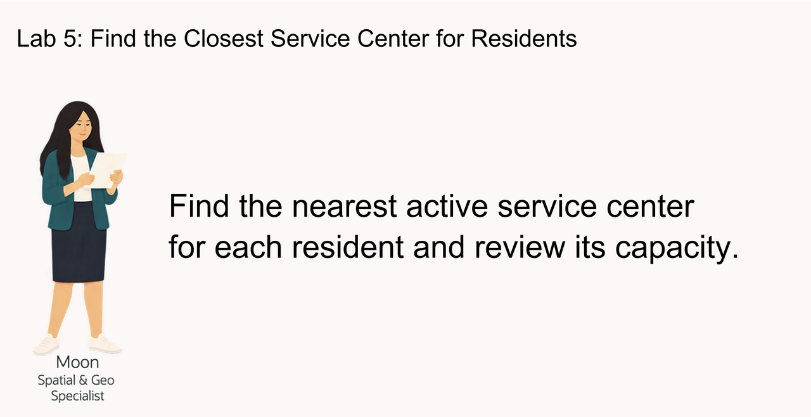
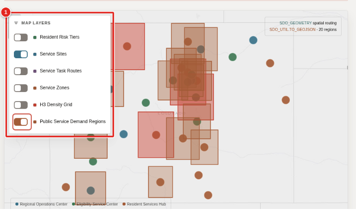
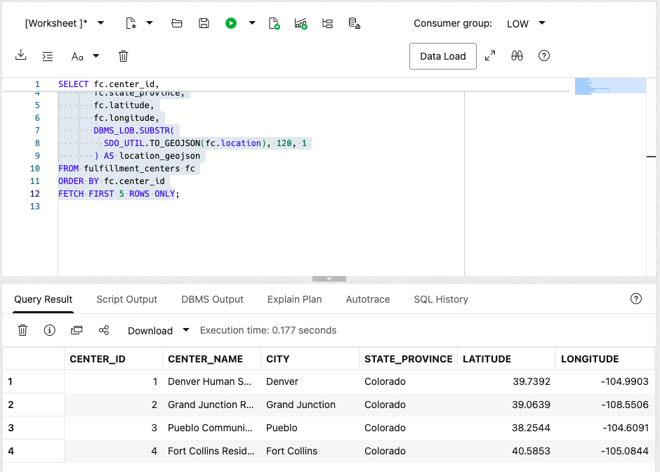
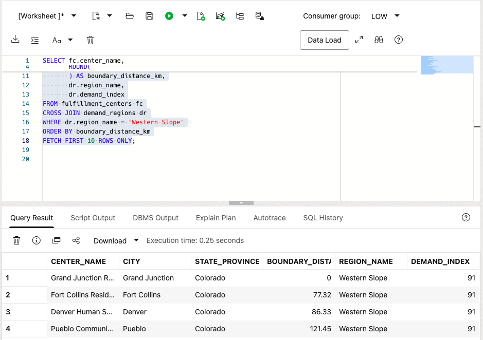
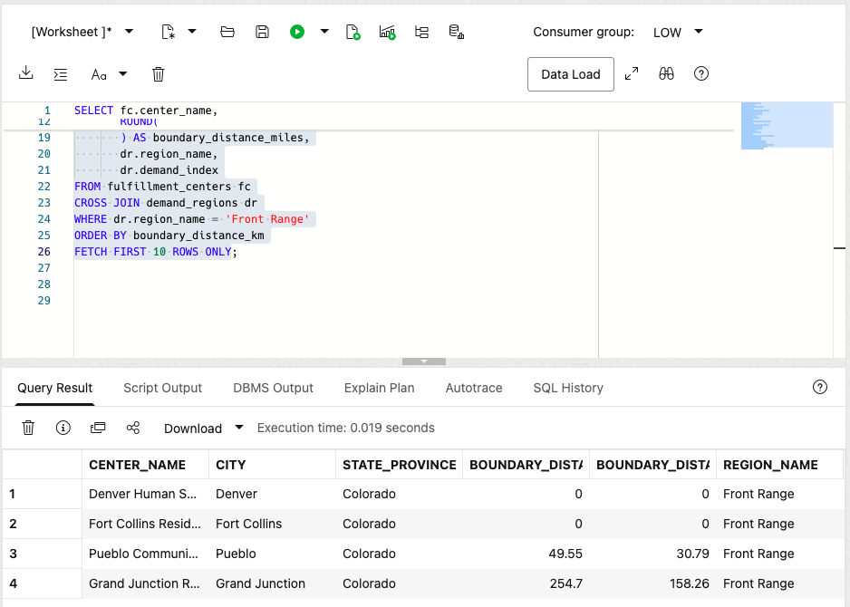
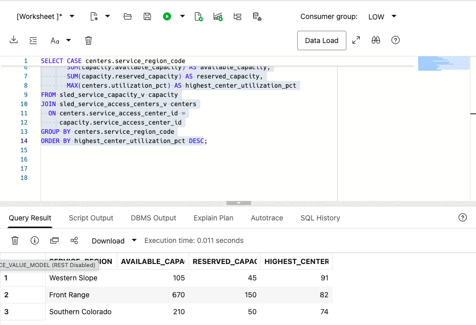
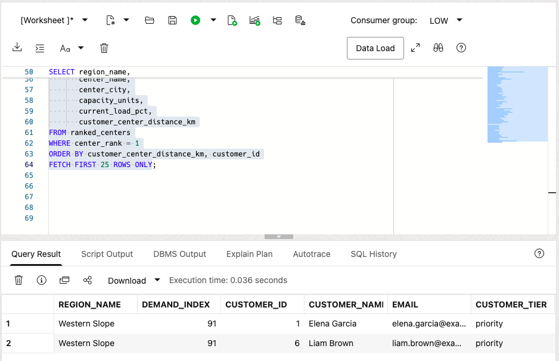
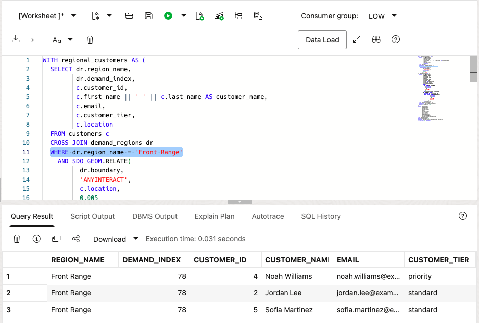

# Find the Closest Service Center for Residents

<!-- markdownlint-configure-file
{
  "MD013": {
    "code_blocks": false,
    "tables": false
  },
  "MD033": {
    "allowed_elements": [
      "details",
      "summary",
      "strong"
    ]
  }
}
-->

## Introduction

Moon Kai is the spatial specialist on Jessica Chan's public-service team. She
helps the operations team find nearby service centers for residents in a region
with growing demand.

The team already stores the required data in Oracle AI Database. Public-service
centers and residents are stored as map points. Demand regions are stored as map
areas, and each region has a demand score.

Moon wants operations users to answer a simple question with SQL that can power
a business-user dashboard and map:

> A region needs more service support. **Which residents are in that region, and
> which public-service center is closest to each one?**

In this lab, you follow Moon's approach. You start with a single point, measure
distance to a region, find residents inside that region, and finish with a
routing result that combines location and public-service data.



<details>
<!-- markdownlint-disable-next-line MD013 -->
<summary><strong>Key terms: point, polygon, distance, spatial relationship, and GeoJSON</strong></summary>

> * A **point** is one location, represented by longitude and latitude. In this
>   lab, a public-service center or resident is stored as an `SDO_GEOMETRY`
>   point.
>
> * A **polygon** is an area made from connected points. Demand regions are
>   stored as polygons.
>
> * **Distance** measures how far two spatial objects are from each other. Here,
>   it shows how far a service center is from a demand-region boundary. A
>   distance of zero means the center is inside or touching the region.
>
> * A **spatial relationship** describes how two shapes relate to each other.
>   `SDO_GEOM.RELATE` can test whether a resident point is inside or touches a
>   demand region.
>
> * **GeoJSON** is a JSON format for map locations and shapes.
>   `SDO_UTIL.TO_GEOJSON` lets an application display the same database location
>   on a map.
>
</details>

The State and Local Government LiveStack uses the same data in its
public-service coverage view. The map helps users see the result; the SQL in
this lab shows how Oracle calculates it.



### Objectives

* Identify spatial points and polygons in the State and Local Government data.
* Convert a database point to GeoJSON for an application map.
* Measure which service centers are closest to a demand region.
* Find residents inside a demand region.
* Match each resident to the closest active service center.

Estimated Time: **10 minutes**

### Hands-on Scenario

| Step | State and Local Government focus |
| --- | --- |
| Business Problem | Operations needs to route service work to a center that can respond to regional demand. |
| Technical Challenge | Moon needs to compare resident points with a region, then find the closest center for each resident. |
| Persona Focus | You review Moon's spatial approach and interpret the result for an operations user. |
| What You Will See | Oracle Spatial turns location data into resident routing results with SQL. |
| Database Capability | `SDO_GEOMETRY`, `SDO_GEOM.SDO_DISTANCE`, `SDO_GEOM.RELATE`, and GeoJSON conversion support the analysis. |
| Outcome | An operations user can see which residents need service in a region and which center is closest to each one. |

> **SQL Worksheet reminder:** See [Getting Started, Task 2][link-1] for the
> steps to open SQL Worksheet and run a query.

## Task 1: Look at the locations as points

Moon starts with the simplest spatial question: **where are the service
centers?** The database stores each center as an `SDO_GEOMETRY` point, while the
application can use the same point as GeoJSON.

An `SDO_GEOMETRY` point is Oracle Spatial's structured representation of one
location. A public-service center or resident is stored with a point type, a
WGS84 coordinate system, and a longitude-and-latitude pair. Because Oracle
stores the location as geometry, Spatial functions can calculate distance and
test spatial relationships instead of treating the coordinates as two unrelated
numbers.

`SDO_UTIL.TO_GEOJSON` converts that geometry into a standard JSON map object
such as `{ "type": "Point", "coordinates": [-74.4121, 40.5187] }`. The
application can send this object to a map without maintaining a second location
format or a separate conversion service. Oracle uses the same stored geometry
for SQL analysis and application display.

That is the Oracle AI Database advantage in this lab: one location supports
spatial calculations, relational joins, and JSON map output without copying the
data between systems.

1. Run this query:

    ```sql
    <copy>
    SELECT fc.center_id,
           fc.center_name,
           fc.city,
           fc.state_province,
           fc.latitude,
           fc.longitude,
           DBMS_LOB.SUBSTR(
             SDO_UTIL.TO_GEOJSON(fc.location), 120, 1
           ) AS location_geojson
    FROM fulfillment_centers fc
    ORDER BY fc.center_id
    FETCH FIRST 5 ROWS ONLY;
    </copy>
    ```

    `LOCATION` is the database point. `LATITUDE` and `LONGITUDE` make the value
    easy to read, and `LOCATION_GEOJSON` gives an application a map-ready
    representation of the same point. GeoJSON lists longitude first and latitude
    second. `SDO_UTIL.TO_GEOJSON` returns a CLOB, so `DBMS_LOB.SUBSTR` limits
    the displayed text to 120 characters; it does not change the stored
    geometry.

    **Expected output: Service Center Points**

    

2. Review the point data.

    Moon has not created a second map database. The point used by the
    application and the point used by SQL are the same value. The database can
    calculate with it, and the application can display it.

    This is the converged-database advantage. Moon can keep the center's
    location beside its name, capacity, operating status, and current load. SQL
    can calculate distance and return those center details, while
    `SDO_UTIL.TO_GEOJSON` gives the application the same location for a map. The
    team does not have to copy coordinates into a separate mapping system and
    keep the copies synchronized.

## Task 2: Find the closest centers to a demand region

The Western Slope is a useful region for the first routing review. Moon now
measures the distance from each public-service center point to the region
boundary.

1. Run the distance query:

    ```sql
    <copy>
    SELECT fc.center_name,
           fc.city,
           fc.state_province,
           ROUND(
             SDO_GEOM.SDO_DISTANCE(
               fc.location,
               dr.boundary,
               0.005,
               'unit=KM'
             ), 2
           ) AS boundary_distance_km,
           dr.region_name,
           dr.demand_index
    FROM fulfillment_centers fc
    CROSS JOIN demand_regions dr
    WHERE dr.region_name = 'Western Slope'
    ORDER BY boundary_distance_km
    FETCH FIRST 10 ROWS ONLY;
    </copy>
    ```

    `SDO_GEOM.SDO_DISTANCE` compares the service-center point with the
    demand-region polygon. The function returns the shortest distance between
    the two shapes. A value of `0` means the point is inside or touching the
    region.

    The four arguments in this query have simple roles:

    * `fc.location` is the first geometry: the service-center point.
    * `dr.boundary` is the second geometry: the demand-region polygon.
    * `0.005` is the tolerance used when Oracle compares the geometries. It
      helps Oracle handle small differences in the stored coordinates.
    * `'unit=KM'` tells Oracle to return the distance in kilometers. Change it
      to `'unit=MILE'` when the application needs miles.

    The `ROUND(..., 2)` around the function result only formats the answer to
    two decimal places. It does not change the spatial calculation.

    The query also returns `DEMAND_INDEX`, so Moon can read location and demand
    together. The center with the smallest distance is the first center
    operations should check for available capacity.

    **Expected output: Western Slope Service Coverage**

    The result ranks the public-service centers by distance to the Western Slope
    demand region and includes the region's demand score. Use the closest center
    as the starting point for the capacity review.

    

2. Try another region.

    Change the region name to `Front Range`, add a miles calculation, and run
    the modified query:

    ```sql
    <copy>
    SELECT fc.center_name,
           fc.city,
           fc.state_province,
           ROUND(
             SDO_GEOM.SDO_DISTANCE(
               fc.location,
               dr.boundary,
               0.005,
               'unit=KM'
             ), 2
           ) AS boundary_distance_km,
           ROUND(
             SDO_GEOM.SDO_DISTANCE(
               fc.location,
               dr.boundary,
               0.005,
               'unit=MILE'
             ), 2
           ) AS boundary_distance_miles,
           dr.region_name,
           dr.demand_index
    FROM fulfillment_centers fc
    CROSS JOIN demand_regions dr
    WHERE dr.region_name = 'Front Range'
    ORDER BY boundary_distance_km
    FETCH FIRST 10 ROWS ONLY;
    </copy>
    ```

    

    The `unit` parameter controls the measurement unit. The result may change
    because the query is measuring against a different public-service region.
    Compare the kilometer and mile columns rather than treating the distance as
    an assignment by itself.

    This is a useful regional result, but distance to the region boundary does
    not identify the residents who need service. Moon now uses the region
    polygon to find those residents and then assigns each one to the closest
    active center.

3. Compare regional service capacity.

    Distance alone is not enough. Use the public-service capacity view to
    compare available and reserved workload with the highest center utilization
    in each region.

    ```sql
    <copy>
    SELECT CASE centers.service_region_code
             WHEN 'FRONT_RANGE' THEN 'Front Range'
             WHEN 'WESTERN_SLOPE' THEN 'Western Slope'
             WHEN 'SOUTHERN_COLORADO' THEN 'Southern Colorado'
           END AS service_region,
           SUM(capacity.available_capacity) AS available_capacity,
           SUM(capacity.reserved_capacity) AS reserved_capacity,
           MAX(centers.utilization_pct) AS highest_center_utilization_pct
    FROM sled_service_capacity_v capacity
    JOIN sled_service_access_centers_v centers
      ON centers.service_access_center_id =
         capacity.service_access_center_id
    GROUP BY centers.service_region_code
    ORDER BY highest_center_utilization_pct DESC;
    </copy>
    ```

    **Expected output: Regional Public-Service Capacity**

    The result returns one row per service region with available workload,
    reserved workload, and the highest center utilization. Moon can use these
    values with the distance results to identify a practical center for further
    review.

    

## Task 3: Route residents to the closest center

Moon now needs a result that a public-service operations application can use:
residents inside the Western Slope, their demand region, and the closest active
service center. The query uses the customer point (**`c.location`**) and
demand-region polygon (**`dr.boundary`**) to find the residents first. It then
compares each customer point with every active center and keeps the closest one.

1. Run the resident routing query:

    ```sql
    <copy>
    WITH regional_customers AS (
      SELECT dr.region_name,
             dr.demand_index,
             c.customer_id,
             c.first_name || ' ' || c.last_name AS customer_name,
             c.email,
             c.customer_tier,
             c.location
      FROM customers c
      CROSS JOIN demand_regions dr
      WHERE dr.region_name = 'Western Slope'
        AND SDO_GEOM.RELATE(
              dr.boundary,
              'ANYINTERACT',
              c.location,
              0.005
            ) = 'TRUE'
    ), ranked_centers AS (
      SELECT rc.region_name,
             rc.demand_index,
             rc.customer_id,
             rc.customer_name,
             rc.email,
             rc.customer_tier,
             fc.center_name,
             fc.city AS center_city,
             fc.capacity_units,
             fc.current_load_pct,
             ROUND(
               SDO_GEOM.SDO_DISTANCE(
                 rc.location,
                 fc.location,
                 0.005,
                 'unit=KM'
               ), 2
             ) AS customer_center_distance_km,
             ROW_NUMBER() OVER (
               PARTITION BY rc.customer_id
               ORDER BY SDO_GEOM.SDO_DISTANCE(
                          rc.location,
                          fc.location,
                          0.005,
                          'unit=KM'
                        )
             ) AS center_rank
      FROM regional_customers rc
      CROSS JOIN fulfillment_centers fc
      WHERE fc.is_active = 1
    )
    SELECT region_name,
           demand_index,
           customer_id,
           customer_name,
           email,
           customer_tier,
           center_name,
           center_city,
           capacity_units,
           current_load_pct,
           customer_center_distance_km
    FROM ranked_centers
    WHERE center_rank = 1
    ORDER BY customer_center_distance_km, customer_id
    FETCH FIRST 25 ROWS ONLY;
    </copy>
    ```

    `SDO_GEOM.RELATE` keeps residents whose point falls inside or touches the
    Western Slope polygon. `SDO_GEOM.SDO_DISTANCE` then measures the distance
    from each matching resident to every active center. `ROW_NUMBER` keeps the
    nearest center for each resident.

2. Review the result as an operations decision.

    Each row identifies a resident and the closest active service center, with
    the region’s demand score, center capacity, current load, and distance. The
    query ranks centers by distance; it does not filter or rank them by
    available capacity. Review those values before assigning a request.

    A dashboard can show the residents in a selected region, the nearest active
    center for each resident, and the distance. Use the capacity and load
    columns to assess whether that center can take the request.

    

3. Change the query to `Front Range`.

    Compare the residents and assigned centers with the Western Slope result.
    The spatial predicates stay the same; only the region changes. This is the
    kind of query a public-service operations dashboard can run when a user
    selects a different demand region.

    

## Conclusion: Turn Location into a Service Decision

Moon's analysis moves from a point, to distance, to resident routing. An
operations user can select a high-demand region and get a list of residents,
their closest service center, and the distance to that center. That is a useful
dashboard result because it tells the user what action to review, not just where
the data is located.

This shows why Spatial in Oracle AI Database matters. One convergent query can
identify residents with spatial functions, join them to relational customer and
center data, and include capacity and current load in the same result. The
dashboard can show the map and the business details from one database, without
moving data between a mapping system, a customer system, and a public-service
operations system.

## Next Steps

You used Oracle Spatial to identify residents in a region and compare their
nearest active service centers. For a deeper hands-on workshop focused on Oracle
Spatial, open the
<!-- markdownlint-disable-next-line MD013 -->
[Oracle Spatial LiveLabs workshop](https://livelabs.oracle.com/ords/r/dbpm/livelabs/view-workshop?clear=RR,180&wid=800).

## Acknowledgements

* **Author** - Pat Shepherd
* **Last Updated By/Date** - Pat Shepherd, September 2026

[link-1]: ?lab=getting-started#Task2:OpenSQLWorksheet
