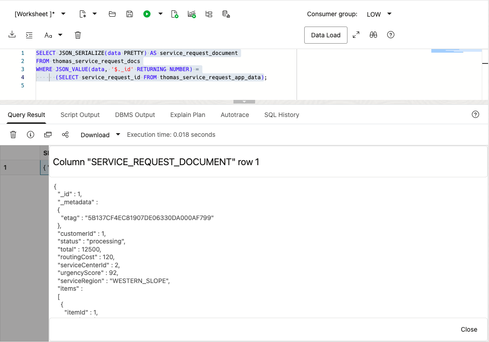
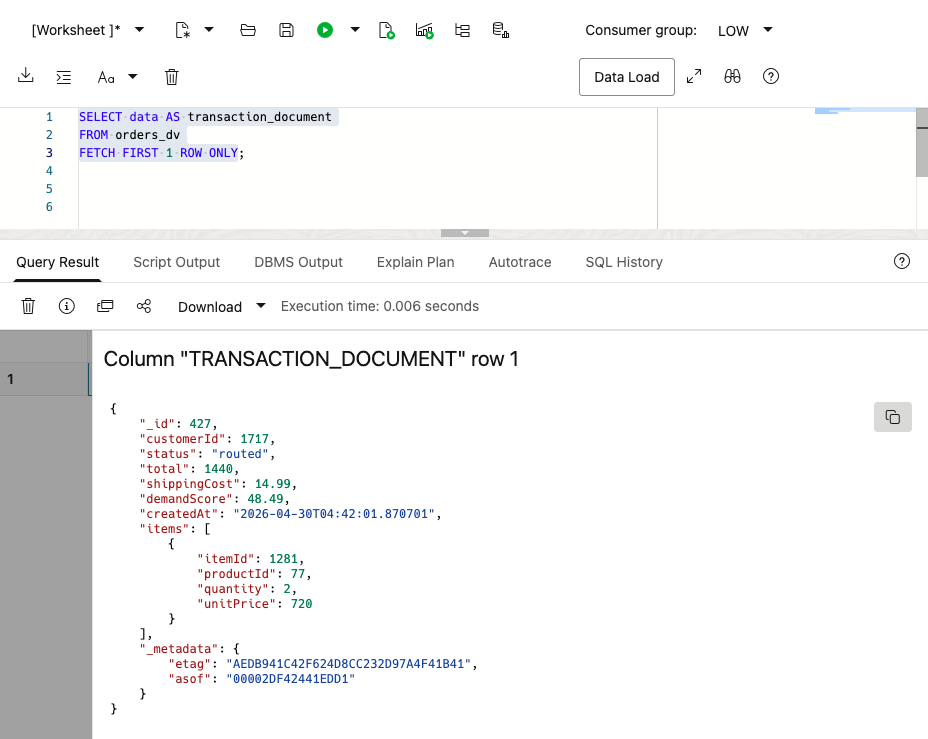
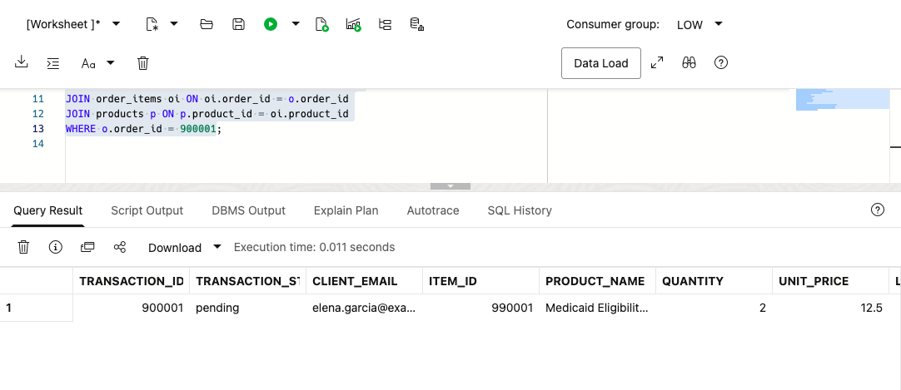
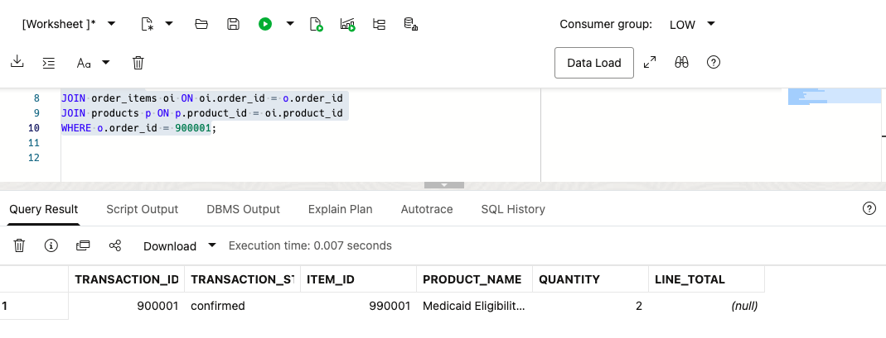
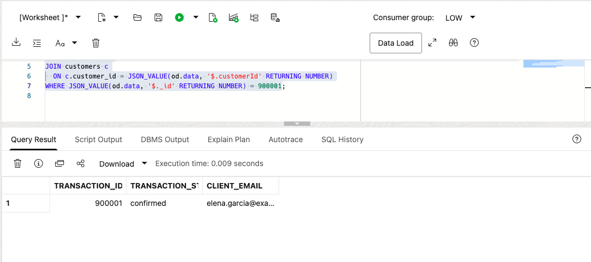
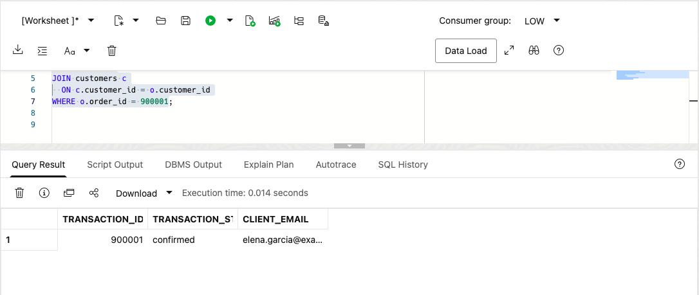

# Build a JSON Application Model

## Introduction

Thomas Brune is an application developer supporting Colorado's State and Local Government services. He and his team are building a new web and mobile application for customers. The team wants a faster residential customer experience, with fewer round trips and payloads that match the screens and services they are building.

Thomas needs service-request data as a JSON payload that a web or mobile application can consume directly. One payload can group residential-customer details, request status, requested services, and optional app-specific attributes. JSON lets him evolve that payload as public-service applications change. The data already lives in Oracle AI Database, so his question is how to use JSON without giving up relational keys, SQL, transactions, and database controls.

Thomas asks Jessica, the DBA, to walk through three ways to work with JSON in Oracle AI Database. They start with a JSON value in a relational table, then a collection of JSON documents, and finally a JSON Relational Duality View over existing relational rows. The goal is to choose the right approach for each application feature without creating a second copy of residential-customer data.


<details>
<summary><strong>Key terms: JSON columns, JSON collections, and JSON Relational Duality</strong></summary>

> - A **JSON column** stores a JSON value in a relational table alongside normal typed columns, keys, and constraints. Thomas can use it for optional or changing application attributes without turning every new attribute into a schema change.
>
> - A **JSON collection** is a special table or view that provides a set of JSON documents through one `JSON`-typed `DATA` column. Each document can have a top-level `_id` used to identify it.
>
> - **JSON Relational Duality** lets Oracle Database expose relational data as JSON documents without copying it into a separate document database. The application gets the document shape Thomas wants for its API. The database keeps the relational rows and controls.
>

</details>

Thomas's application needs a payload with the service request and its requested services together, such as this:

```json
{
  "_id": 900001,
  "customerId": 2,
  "status": "pending",
  "total": 8000,
  "routingCost": 80,
  "serviceCenterId": 1,
  "urgencyScore": 83,
  "serviceRegion": "FRONT_RANGE",
  "items": [
    {
      "itemId": 990001,
      "productId": 3,
      "quantity": 1,
      "serviceValue": 8000,
      "lineServiceValue": 8000,
      "serviceCenterId": 1,
      "serviceRegion": "FRONT_RANGE"
    }
  ]
}
```

The application uses this document shape, while the database keeps the service request and requested services in relational form. In this lab, you build and read this type of payload in three ways.

### Objectives

- Store flexible application attributes as JSON in a relational table.
- Create and query a JSON Collection Table of service-request documents.
- Read and update relational service-request data through `ORDERS_DV`.
- Compare the three JSON approaches and choose the right one for an application feature.

Estimated Time: **10 minutes**

### Hands-on Scenario

| Step | State and Local Government focus |
| --- | --- |
| Business Problem | Thomas's team needs flexible JSON payloads for a new residential-customer web and mobile application. |
| Technical Challenge | The team needs application-friendly documents while the database keeps relational keys, joins, and controls. |
| Persona Focus | Thomas tests JSON storage, collections, and duality with Jessica's database guidance. |
| What You Will See | One Oracle AI Database supports several JSON access patterns over public-service data. |
| Database Capability | Native JSON, SQL/JSON functions, and JSON Relational Duality work together. |
| Outcome | Thomas can choose an application shape without creating a second residential-customer data store. |

Persona focus: You are Thomas, working with Jessica to decide how the new application should store, assemble, and read service-request data.

### Thomas's three JSON choices

Thomas does not need one JSON pattern for every feature. A JSON column holds optional application attributes in a relational table. A JSON Collection Table holds documents owned by the application. A duality view assembles a document from existing relational tables. Thomas uses the document shape in the application, while Jessica works with the underlying rows using SQL.

This keeps the service request in one database and avoids complex, expensive integration between separate systems. Thomas gets the document shape his application needs, and Jessica keeps the relational rows, SQL access, and database controls.

> **SQL Worksheet reminder:** Need a reminder on how to open and use the SQL Worksheet? Return to [Getting Started Task 2: Open SQL Worksheet](?lab=getting-started#Task2:OpenSQLWorksheet) for the step-by-step guide on how to run SQL statements.

## Task 1: Store flexible application data as JSON

Thomas starts with data that belongs to the application but does not need its own relational columns. The workshop database already contains the service-request rows. He adds a small application-data table with a native `JSON` column for optional screen and residential-customer experience settings.

1. Create the application-data table and add one sample payload.

    ```sql
    <copy>
    CREATE TABLE thomas_service_request_app_data (
        service_request_id  NUMBER PRIMARY KEY,
        app_data  JSON NOT NULL
    );

    INSERT INTO thomas_service_request_app_data (service_request_id, app_data)
    SELECT order_id,
           JSON_OBJECT(
               'screen'     VALUE 'service-request-detail',
               'showStatus' VALUE 'true' FORMAT JSON,
               'features'   VALUE JSON_ARRAY('live-status', 'service-access', 'resident-notifications')
               RETURNING JSON
           )
    FROM (
        SELECT order_id
        FROM orders
        ORDER BY order_id
        FETCH FIRST 1 ROW ONLY
    );

    COMMIT;
    </copy>
    ```

2. Read values from the JSON column.

    ```sql
    <copy>
    SELECT service_request_id,
           JSON_VALUE(app_data, '$.screen') AS screen_name,
           JSON_VALUE(app_data, '$.showStatus' RETURNING BOOLEAN) AS show_status,
           JSON_QUERY(app_data, '$.features') AS app_features
    FROM thomas_service_request_app_data;
    </copy>
    ```

    `SERVICE_REQUEST_ID` remains a relational key. `APP_DATA` can change as the application changes. Thomas can query both with SQL in one table.

## Task 2: Create a JSON Collection Table

Thomas now needs a collection of service-request documents. Unlike the JSON column in Task 1, this object is a JSON Collection Table: each row is a document, the document is stored in `DATA`, and `_id` identifies the document.

1. Create the collection and add the sample service-request document.

    ```sql
    <copy>
    CREATE JSON COLLECTION TABLE thomas_service_request_docs
    WITH ETAG;

    INSERT INTO thomas_service_request_docs (data)
    SELECT JSON_OBJECT(
               '_id'             VALUE o.order_id,
               'customerId'      VALUE o.customer_id,
               'status'          VALUE o.order_status,
               'total'           VALUE o.order_total,
               'routingCost'     VALUE o.shipping_cost,
               'serviceCenterId' VALUE o.fulfillment_center_id,
               'urgencyScore'    VALUE o.demand_score,
               'serviceRegion'   VALUE o.service_region_code,
               'items'           VALUE (
                   SELECT JSON_ARRAYAGG(
                              JSON_OBJECT(
                                  'itemId'           VALUE oi.item_id,
                                  'productId'        VALUE oi.product_id,
                                  'quantity'         VALUE oi.quantity,
                                  'serviceValue'     VALUE oi.unit_price,
                                  'lineServiceValue' VALUE oi.line_total,
                                  'serviceCenterId'  VALUE oi.fulfilled_from,
                                  'serviceRegion'    VALUE oi.service_region_code
                                  RETURNING JSON
                              ) ORDER BY oi.item_id RETURNING JSON
                          )
                   FROM order_items oi
                   WHERE oi.order_id = o.order_id
               ) FORMAT JSON
               RETURNING JSON
           )
    FROM orders o
    JOIN thomas_service_request_app_data t
      ON t.service_request_id = o.order_id;

    COMMIT;
    </copy>
    ```

    `WITH ETAG` adds an `_metadata.etag` value to each document. Oracle changes the tag whenever the document changes. Thomas's application can send the tag it last read when it updates a document. If the tag no longer matches, the application knows that someone else changed the document first and can avoid overwriting the newer version. This protects residential-customer and service-request data when web and mobile requests try updating the same document at the same time.

2. Query the collection as documents.

    ```sql
    <copy>
    SELECT JSON_SERIALIZE(data PRETTY) AS service_request_document
    FROM thomas_service_request_docs
    WHERE JSON_VALUE(data, '$._id' RETURNING NUMBER) =
          (SELECT service_request_id FROM thomas_service_request_app_data);
    </copy>
    ```

    **Expected output: Service Request Document**

    

    Thomas now has a document collection that a document API can access, and SQL can query the same `DATA` column. The collection stores the documents; it is separate from the relational `ORDERS` and `ORDER_ITEMS` tables that hold the workshop's service-request records.

## Task 3: Read a service-request document from relational data

Thomas now tests the document shape his application can consume directly.

1. Run this query:


    This query selects the JSON `DATA` column from `ORDERS_DV` so Thomas can inspect the document shape in SQL Worksheet.

    <details>
    <summary><strong>Why this matters to Thomas</strong></summary>

    > Thomas can use a JSON Collection Table when the application owns the document. But the service request already has relational tables that Jessica and other teams rely on.
    > The duality view gives Thomas a document over those existing rows. He can choose the application shape without copying the service request into another store.

    </details>

    ```sql
    <copy>
    SELECT data AS transaction_document
    FROM orders_dv
    FETCH FIRST 1 ROW ONLY;
    </copy>
    ```

    **Expected output:**

    

2. Expand the document in SQL Worksheet.
    The query reads the duality view as a document source. Oracle constructs the JSON shape from relational data, so the application gets a service-request payload without a second copy of the service-request record.

    The \_id value appears in the JSON document while the source data remains relational. The payload includes a residential-customer identifier, `status`, totals, timestamps, and requested-service lines. The application gets these fields without a second service-request store.

    The same service request now has two useful forms: API-ready JSON for the application and relational rows for analysis.

    > **Note:** Look for `_metadata.etag` in the document. The ETAG changes when the document changes, so Thomas's application can detect a newer version before updating the service request and avoid overwriting another request.

## Task 4: Enable document inserts and updates

The existing `ORDERS_DV` lets an application update an existing service-request document. In this task, you extend that contract so the application can also create one. The database continues to control the relational tables, keys, and constraints. The duality view can also act as a security boundary. Thomas's application receives only the document fields and write operations exposed by the view, without direct access to the underlying tables.

1. Check the current document-write capabilities.

    ```sql
    <copy>
    SELECT view_name,
           allow_insert,
           allow_update,
           allow_delete
    FROM user_json_duality_views
    WHERE view_name = 'ORDERS_DV';
    </copy>
    ```

    **Expected output: Current Document Capabilities**

    

    The view currently allows updates but not new top-level documents. The root `ORDERS` table controls document insertion. The nested `ORDER_ITEMS` rows must also allow inserts so the document can include line items.

2. Enable insert and update for the document and its line items.

    You are changing the duality-view definition, not creating a second API store. The two `WITH INSERT UPDATE` clauses allow developers to create and update the JSON document. Oracle still enforces the relational keys and data types.

    ```sql
    <copy>
    CREATE OR REPLACE JSON RELATIONAL DUALITY VIEW orders_dv AS
    SELECT JSON {
        '_id'         : o.order_id,
        'customerId'  : o.customer_id,
        'status'      : o.order_status,
        'total'       : o.order_total,
        'shippingCost': o.shipping_cost,
        'demandScore' : o.demand_score,
        'createdAt'   : o.created_at,
        'items' : [
            SELECT JSON {
                'itemId'    : oi.item_id,
                'productId' : oi.product_id,
                'quantity'  : oi.quantity,
                'unitPrice' : oi.unit_price
            }
            FROM order_items oi WITH INSERT UPDATE
            WHERE oi.order_id = o.order_id
        ]
    }
    FROM orders o WITH INSERT UPDATE;
    </copy>
    ```

    This duality view uses two relational tables. `ORDERS` provides the document root. Related `ORDER_ITEMS` rows become the nested `items` collection. The `WITH INSERT UPDATE` clauses let Thomas write the complete JSON document while Oracle maintains the rows and relationships.

    **Expected output: View Definition Updated**

    Oracle created or replaced the duality view. Verify the new capabilities in the next step.

2. Run the capability query again.

    ```sql
    <copy>
    SELECT view_name,
           allow_insert,
           allow_update,
           allow_delete
    FROM user_json_duality_views
    WHERE view_name = 'ORDERS_DV';
    </copy>
    ```

    **Expected output: Document Capabilities Enabled**

    

    The view can now receive a new JSON service-request document and apply a document update. Thomas has a document API over the existing relational service-request data. He can use it for a public-service feature such as submitting a new service request. The application sends one document, and the database writes the request and its requested-service lines to the relational tables.

## Task 5: Create and update a JSON service request

Thomas now tests a complete residential-customer service request. He creates it as one nested JSON document, then confirms that Jessica can immediately see the same data as structured relational rows.

1. Insert the supplied workshop service-request document.

    The `INSERT` targets `ORDERS_DV`, the JSON Relational Duality View, rather than the underlying `ORDERS` or `ORDER_ITEMS` tables. The database uses the view definition to write the document to those relational tables. The document uses service-request ID `900001`, residential customer `1`, and public service `1`. It includes one nested requested-service line. The statement is safe to run again: after the service request exists, it inserts zero rows and preserves the existing record. On the first run, the new service request has status `pending`.

    ```sql
    <copy>
    INSERT INTO orders_dv (data)
    SELECT JSON(
      '{
        "_id": 900001,
        "customerId": 1,
        "status": "pending",
        "total": 25.00,
        "shippingCost": 0,
        "items": [
          {
            "itemId": 990001,
            "productId": 1,
            "quantity": 2,
            "unitPrice": 12.50
          }
        ]
      }'
    )
    WHERE NOT EXISTS (
      SELECT 1
      FROM orders
      WHERE order_id = 900001
    );

    COMMIT;
    </copy>
    ```

    **Expected output: Service Request Document Created**

    On the first run, you insert one document. On later runs, the `NOT EXISTS` check returns zero rows because the workshop service request is already present.

2. Confirm the JSON document became relational rows.

    >**Note**: We are querying here the relational tables `ORDERS` and `ORDER_ITEMS`!

    ```sql
    <copy>
    SELECT o.order_id AS transaction_id,
           o.order_status AS transaction_status,
           c.email AS client_email,
           oi.item_id,
           p.product_name,
           oi.quantity,
           oi.unit_price,
           oi.line_total
    FROM orders o
    JOIN customers c ON c.customer_id = o.customer_id
    JOIN order_items oi ON oi.order_id = o.order_id
    JOIN products p ON p.product_id = oi.product_id
    WHERE o.order_id = 900001;
    </copy>
    ```

    **Expected output: Created Service-Request Rows**

    

3. Update the document status through the duality view.

    This update changes JSON data through `ORDERS_DV`. The allowed modification here is the document's `status` field, which Oracle maps to `ORDERS.ORDER_STATUS`; Thomas's application is not given unrestricted updates to the underlying tables. He does not need application-side parsing or a second service-request store.

    ```sql
    <copy>
    UPDATE orders_dv
    SET data = JSON_TRANSFORM(data, SET '$.status' = 'confirmed')
    WHERE JSON_VALUE(data, '$._id' RETURNING NUMBER) = 900001;

    COMMIT;
    </copy>
    ```

    **Expected output: Service-Request Status Updated**

    Oracle updates one document. The following query confirms that the relational service-request row now has status `confirmed`.

4. Verify the updated relational status.

    ```sql
    <copy>
    SELECT o.order_id AS transaction_id,
           o.order_status AS transaction_status,
           oi.item_id,
           p.product_name,
           oi.quantity,
           oi.line_total
    FROM orders o
    JOIN order_items oi ON oi.order_id = o.order_id
    JOIN products p ON p.product_id = oi.product_id
    WHERE o.order_id = 900001;
    </copy>
    ```

    **Expected output: Updated Service-Request Rows**

    

## Task 6: Project JSON fields with SQL

Thomas has confirmed that the application can display and update the document. Jessica now checks the same service request with SQL before the feature goes live. She uses the relational tables for normal reporting and analysis. Here, she queries `ORDERS_DV` to verify the exact JSON contract that Thomas's application receives. She can also project fields from the document to test residential-customer service searches and status filters. In this context, "project" means pulling selected values out of the JSON document and displaying them as SQL result columns.

1. Run this SQL/JSON projection query:

    Thomas's document is still available for SQL analysis. The same service-request shape can be queried, filtered, and joined to relational residential-customer data.

    The SQL uses `JSON_VALUE` to extract service-request fields from the duality document. That is the projection step. It returns the service-request ID and status, reads the embedded residential-customer identifier, joins that identifier to `CUSTOMERS`, and orders the result for review.

    Thomas does not need to hand-build this document in the application or copy the service request to a separate document store. The application gets JSON, while Jessica still has SQL access to the same service-request rows.

    ```sql
    <copy>
    SELECT JSON_VALUE(od.data, '$._id' RETURNING NUMBER) AS transaction_id,
           JSON_VALUE(od.data, '$.status') AS transaction_status,
           c.email AS client_email
    FROM orders_dv od
    JOIN customers c
      ON c.customer_id = JSON_VALUE(od.data, '$.customerId' RETURNING NUMBER)
    WHERE JSON_VALUE(od.data, '$._id' RETURNING NUMBER) = 900001;
    </copy>
    ```

    **Expected output: JSON Field Projection**

    

2. Run the equivalent query against the relational tables.

    ```sql
    <copy>
    SELECT o.order_id AS transaction_id,
           o.order_status AS transaction_status,
           c.email AS client_email
    FROM orders o
    JOIN customers c
      ON c.customer_id = o.customer_id
    WHERE o.order_id = 900001;
    </copy>
    ```

    

    Compare the result with the previous query. The service-request ID, status, and residential-customer email should match. Thomas's application is reading the JSON document, while Jessica's relational query reads the underlying rows.

## Conclusion: Choose the right JSON approach

Thomas does not have to choose one JSON model for the whole application. He can choose based on who owns the data and whether the application needs a document over existing relational rows.

| Approach                          | Use it when                                                                                 | Example in Thomas's application                                                                            | Where the data lives                                                                                           |
| -----------------------------------| ---------------------------------------------------------------------------------------------| ------------------------------------------------------------------------------------------------------------| ----------------------------------------------------------------------------------------------------------------|
| JSON column in a relational table | A relational record needs optional or changing attributes.                                  | Store screen settings or residential-customer experience options alongside a service-request key.          | A normal relational table with a native `JSON` column.                                                         |
| JSON Collection Table             | The application owns a set of JSON documents and needs document-style access.               | Store saved service-request drafts that may change as residential customers add or update requested services. | A JSON Collection Table with one document in each `DATA` row.                                                  |
| JSON Relational Duality View      | The data already belongs in relational tables, but the application needs one JSON document. | Return a residential-customer service request with its status and requested-service lines, or accept a new service-request document from the app. | Relational tables such as `ORDERS` and `ORDER_ITEMS`; the duality view defines the JSON shape for Thomas' app. |

For Thomas, `ORDERS_DV` is the right choice for the service-request feature because `ORDERS` and `ORDER_ITEMS` already hold governed public-service data. The application gets the JSON payload it needs, while Jessica keeps SQL, relational constraints, and controlled access to the same data.


## Acknowledgements

* **Author** - Pat Shepherd
* **Last Updated By/Date** - Pat Shepherd, September 2026
