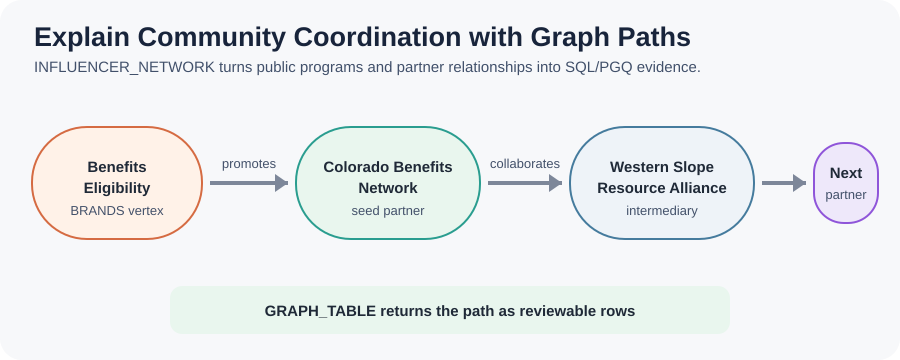
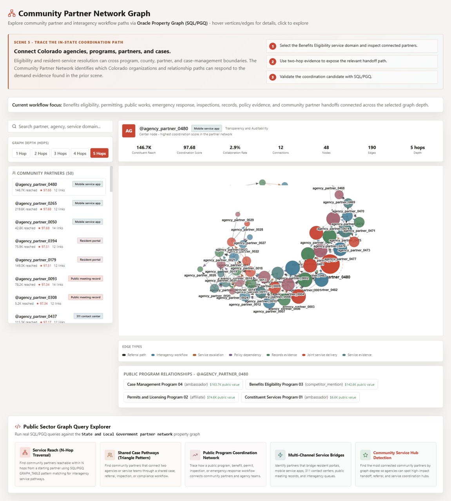
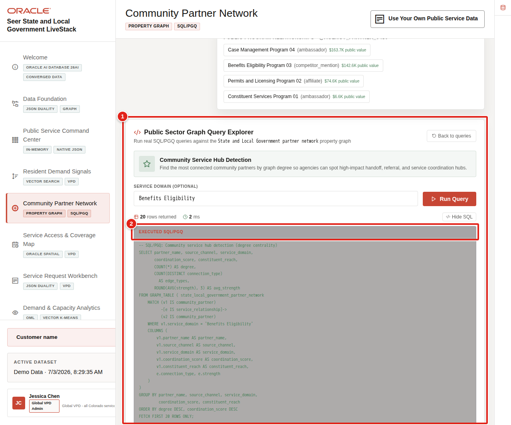

# Community Partner Network with Property Graph

## Introduction

Resident-service resolution can cross program, county, nonprofit, and regional boundaries. **Jessica** needs to know which organizations connect to **Benefits Eligibility** and which two-step handoffs can extend the response.

You are the community-service coordination analyst supporting Jessica. In this lab, you query the `INFLUENCER_NETWORK` property graph and translate inherited physical object names into public-service meaning:
- `INFLUENCERS` represent community partners and signal sources.
- `BRANDS` represent public programs.
- `PRODUCTS` represent public services.
- `SOCIAL_POSTS` represent resident signals.

<details>
<summary><strong>Key terms: property graph, vertex, edge, seed partner, and hop</strong></summary>

> - A **property graph** represents entities and the relationships between them.
>
> - A **vertex** is an entity, such as a public program or community partner.
>
> - An **edge** is a typed relationship, such as `collaborates` or `follows`, with properties such as coordination strength.
>
> - A **seed partner** is the starting organization for a traversal.
>
> - A **hop** follows one relationship. Two hops reveal an indirect coordination path through an intermediary.

</details>

The diagram shows the path from a public program to a partner, then through one or two relationship hops to other response organizations.



The application image below is the Community Partner Network Graph. It gives the coordination analyst a broad view of partner reach, relationship types, and multi-hop paths across the full demonstration network. The SQL in this lab narrows that dense network to a named program and reviewable one-hop and two-hop rows.



The property graph query returns the same relationship evidence as a table that teams can review and share. A focused application result appears after the two-hop query.

### Objectives

- Identify the partners connected to **Benefits Eligibility** so the response can begin with the right organizations.
- Trace two-hop coordination paths that reveal indirect handoffs through an intermediary.
- Explain the public-service meaning of graph vertices, edges, and coordination strength.

Estimated Time: **12 minutes**

### Business Scenario

| Step | State and local government focus |
| --- | --- |
| Business Problem | Service resolution may require several organizations and handoffs. |
| Technical Challenge | Flat lists do not explain why partners connect or how a handoff continues. |
| Persona Focus | A community-service coordination analyst supports Jessica. |
| What You Will Do | Use `GRAPH_TABLE` to query one-hop and two-hop patterns. |
| Database Capability | Oracle Property Graph and SQL Property Graph Queries expose relationship evidence. |
| Outcome | Jessica can explain which partners are relevant and how coordination can proceed. |

**Persona focus:** You help Jessica replace an unstructured organization list with queryable coordination paths.

## Task 1: Find partners connected to Benefits Eligibility

Start with the direct Benefits Eligibility partner connections so Jessica can see the first organizations involved in the response network.

1. Run the program-to-partner graph query.

    > **SQL Worksheet reminder:** Need a reminder on how to open and use SQL Worksheet? Return to [Getting Started Task 2: Open SQL Worksheet](/workshops/sandbox/index.html?lab=getting-started#Task2:OpenSQLWorksheet).

    Inside `GRAPH_TABLE`, the `MATCH` clause describes the business pattern. A public program receives a `promotes` relationship from a starting partner, and that partner has a `connects_to` relationship to another partner. The `COLUMNS` clause returns graph properties as a normal SQL result.

    <details>
    <summary><strong>Why this matters: relationship logic stays close to service data</strong></summary>

    > A separate graph-only system requires teams to copy program and partner records before they can traverse relationships. Oracle Property Graph lets SQL analysis and graph patterns use connected database evidence.

    </details>

    ```sql
    <copy>
    SELECT public_program,
           starting_partner,
           connected_partner,
           handoff_type,
           coordination_strength
    FROM GRAPH_TABLE (
      influencer_network
      MATCH (program IS brand)
            <-[program_link IS promotes]-
            (source IS influencer)
            -[handoff IS connects_to]->
            (partner IS influencer)
      WHERE program.brand_name = 'Benefits Eligibility'
      COLUMNS (
        program.brand_name AS public_program,
        source.display_name AS starting_partner,
        partner.display_name AS connected_partner,
        handoff.connection_type AS handoff_type,
        handoff.strength AS coordination_strength
      )
    )
    ORDER BY coordination_strength DESC, connected_partner;
    </copy>
    ```

    **Expected output: Benefits Partner Connections**

    | Public Program | Starting Partner | Connected Partner | Handoff Type | Coordination Strength |
    | --- | --- | --- | --- | --- |
    | Benefits Eligibility | Colorado Benefits Network | Western Slope Family Resource Alliance | collaborates | 0.92 |
    | Benefits Eligibility | Colorado Benefits Network | County Human Services Collaborative | follows | 0.88 |
    | Benefits Eligibility | Western Slope Family Resource Alliance | Front Range Housing Partnership | collaborates | 0.81 |

2. Interpret the one-hop evidence.

    The result explains who starts the handoff, who receives it, and how strong the recorded coordination relationship is. Jessica can prioritize the strongest path while still seeing the program context.

3. 🎯 **Interactive challenge: Focus on stronger coordination evidence.**

    Starting with the one-hop query above, add `AND handoff.strength >= 0.85` to the `WHERE` clause to investigate only the stronger recorded Benefits Eligibility relationships. Run your revised query. Which partner connections should Jessica use as candidates for initial human outreach?

    **Expected output: Stronger Benefits Partner Connections**

    Two deterministic paths should remain: Colorado Benefits Network to Western Slope Family Resource Alliance at `0.92`, and Colorado Benefits Network to County Human Services Collaborative at `0.88`. The `0.81` path should leave the result.

    <details>
    <summary><strong>Challenge answer: Prioritize stronger paths without treating them as authorization</strong></summary>

    > The two remaining paths are the strongest recorded coordination candidates for initial outreach. Relationship strength supports prioritization, but it does not authorize a referral or prove that coordination will succeed. Oracle AI Database 26ai keeps graph relationships, public-program records, and partner context together, so teams can investigate without copying sensitive service-network data into disconnected systems.

    If you need the runnable solution, use this query:

    ```sql
    <copy>
    SELECT public_program,
           starting_partner,
           connected_partner,
           handoff_type,
           coordination_strength
    FROM GRAPH_TABLE (
      influencer_network
      MATCH (program IS brand)
            <-[program_link IS promotes]-
            (source IS influencer)
            -[handoff IS connects_to]->
            (partner IS influencer)
      WHERE program.brand_name = 'Benefits Eligibility'
        AND handoff.strength >= 0.85
      COLUMNS (
        program.brand_name AS public_program,
        source.display_name AS starting_partner,
        partner.display_name AS connected_partner,
        handoff.connection_type AS handoff_type,
        handoff.strength AS coordination_strength
      )
    )
    ORDER BY coordination_strength DESC, connected_partner;
    </copy>
    ```

    </details>

## Task 2: Trace two-hop coordination paths

Trace two-hop paths to find which intermediary partners can connect the starting organization to a broader response network.

1. Run the two-hop query.

    The `MATCH` pattern names each step explicitly: source to intermediary, then intermediary to destination. This is easier to review than a long chain of self-joins and makes the handoff path clear in the output.

    ```sql
    <copy>
    SELECT source_partner,
           first_handoff,
           intermediary_partner,
           second_handoff,
           destination_partner
    FROM GRAPH_TABLE (
      influencer_network
      MATCH (source IS influencer)
            -[first_edge IS connects_to]->
            (middle IS influencer)
            -[second_edge IS connects_to]->
            (destination IS influencer)
      WHERE source.handle = '@co-benefits'
      COLUMNS (
        source.display_name AS source_partner,
        first_edge.connection_type AS first_handoff,
        middle.display_name AS intermediary_partner,
        second_edge.connection_type AS second_handoff,
        destination.display_name AS destination_partner
      )
    )
    ORDER BY destination_partner;
    </copy>
    ```

    **Expected output: Two-Hop Coordination Paths**

    | Source Partner | First Handoff | Intermediary Partner | Second Handoff | Destination Partner |
    | --- | --- | --- | --- | --- |
    | Colorado Benefits Network | follows | County Human Services Collaborative | mentioned | Emergency Services Coalition |
    | Colorado Benefits Network | collaborates | Western Slope Family Resource Alliance | collaborates | Front Range Housing Partnership |

2. Use the path to support a coordination decision.

    A two-hop result does not automatically authorize a referral. It tells Jessica which intermediate organization connects the starting partner to a broader response network. That evidence supports a targeted conversation instead of a blanket outreach campaign.

    The **Graph Query Explorer** below shows the application form of the same SQL/PGQ pattern, so the learner can connect the worksheet query to the experience shown in the application.

    

## Acknowledgements

* **Author** - Oracle LiveLabs Team
* **Last Updated By/Date** - Oracle LiveLabs Team, August 2026
