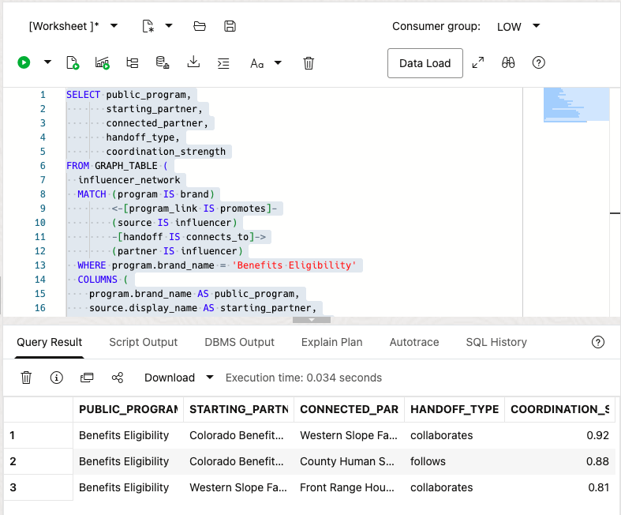
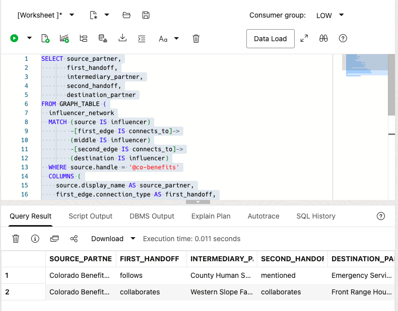
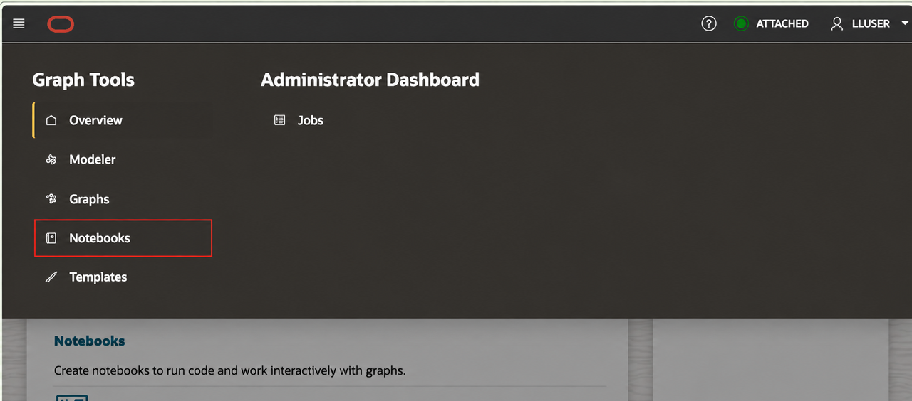
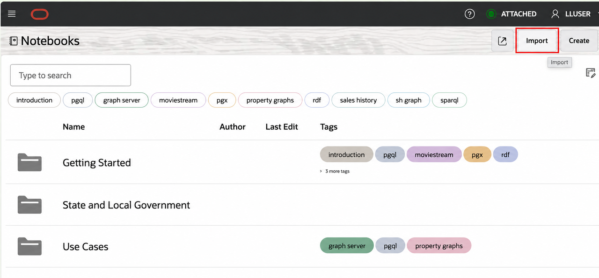
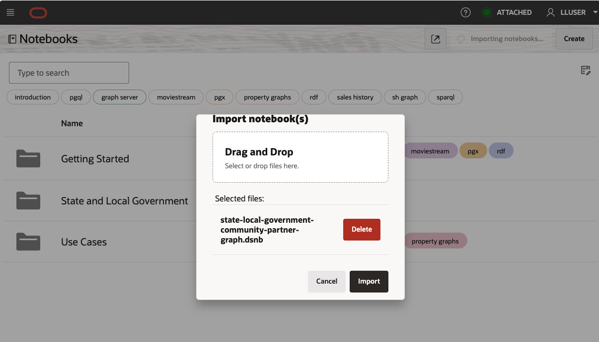

# Community Partner Network with Property Graph

## Introduction

Resident-service resolution can cross program, county, nonprofit, and regional boundaries. **Maya**, the Resident Services Operations Leader, needs to know which organizations connect to **Benefits Eligibility** and which two-step handoffs can extend the response.

You work with Maya and **Jordan**, the Database Administrator. In this lab, you query the `INFLUENCER_NETWORK` property graph and translate inherited physical object names into public-service meaning:
- `INFLUENCERS` represent community partners and signal sources.
- `BRANDS` represent public programs.
- `PRODUCTS` represent public services.
- `SOCIAL_POSTS` represent resident signals.

<details>
<summary><strong>Key terms: property graph, vertex, edge, seed partner, and hop</strong></summary>

> - A **property graph** represents entities and the relationships between them.
>
> - A **vertex** is an entity, such as a public program or community partner.
>
> - An **edge** is a typed relationship, such as `collaborates` or `follows`, with properties such as coordination strength.
>
> - A **seed partner** is the starting organization for a traversal.
>
> - A **hop** follows one relationship. Two hops reveal an indirect coordination path through an intermediary.

</details>

The diagram shows the path from a public program to a partner, then through one or two relationship hops to other response organizations.


The application image below is the Community Partner Network Graph. It gives the coordination analyst a broad view of partner reach, relationship types, and multi-hop paths across the full demonstration network. The SQL in this lab narrows that dense network to a named program and reviewable one-hop and two-hop rows.


The property graph query returns the same relationship details as a table that teams can review and share. A focused application result appears after the two-hop query.

### Objectives

- Identify the partners connected to **Benefits Eligibility** so the response can begin with the right organizations.
- Trace two-hop coordination paths that reveal indirect handoffs through an intermediary.
- Explain the public-service meaning of graph vertices, edges, and coordination strength.
- Open Graph Studio from Database Actions, then import and run the supplied notebook.
- Compare the SQL rows with the two visual graph exercises.

Estimated Time: **20 minutes**

### Business Scenario

| Step | State and local government focus |
| --- | --- |
| Business Problem | Service resolution may require several organizations and handoffs. |
| Technical Challenge | Flat lists do not explain why partners connect or how a handoff continues. |
| Persona Focus | Maya coordinates the response; Jordan keeps partner relationships queryable in the governed database. |
| What You Will Do | Use `GRAPH_TABLE` to query one-hop and two-hop patterns. |
| Database Capability | Oracle Property Graph and SQL Property Graph Queries expose relationship paths. |
| Outcome | Maya can explain which partners are relevant and how coordination can proceed. |

**Persona focus:** You join Maya and Jordan as you replace an unstructured organization list with queryable coordination paths.

## Task 1: Find partners connected to Benefits Eligibility

Maya needs to know which organizations are directly connected to Benefits Eligibility before she starts outreach. Inspect the one-hop partner rows and their relationship strengths now; they give Maya a focused set of organizations to review with Jessica instead of an unstructured list.

Start with the direct Benefits Eligibility partner connections so Maya can see the first organizations involved in the response network.

1. Run the program-to-partner graph query.

    > **SQL Worksheet reminder:** Need a reminder on how to open and use SQL Worksheet? Return to [Getting Started Task 2: Open SQL Worksheet](/workshops/sandbox/index.html?lab=getting-started#Task2:OpenSQLWorksheet).

    Inside `GRAPH_TABLE`, the `MATCH` clause describes the business pattern. A public program receives a `promotes` relationship from a starting partner, and that partner has a `connects_to` relationship to another partner. The `COLUMNS` clause returns graph properties as a normal SQL result.

    <details>
    <summary><strong>Why this matters: relationship logic stays close to service data</strong></summary>

    > A separate graph-only system requires teams to copy program and partner records before they can traverse relationships. Oracle Property Graph lets SQL analysis and graph patterns use connected database records.

    </details>

    ```sql
    <copy>
    SELECT public_program,
           starting_partner,
           connected_partner,
           handoff_type,
           coordination_strength
    FROM GRAPH_TABLE (
      influencer_network
      MATCH (program IS brand)
            <-[program_link IS promotes]-
            (source IS influencer)
            -[handoff IS connects_to]->
            (partner IS influencer)
      WHERE program.brand_name = 'Benefits Eligibility'
      COLUMNS (
        program.brand_name AS public_program,
        source.display_name AS starting_partner,
        partner.display_name AS connected_partner,
        handoff.connection_type AS handoff_type,
        handoff.strength AS coordination_strength
      )
    )
    ORDER BY coordination_strength DESC, connected_partner;
    </copy>
    ```

    **Expected output: Benefits Partner Connections**

    

2. Interpret the one-hop paths.

    The result explains who starts the handoff, who receives it, and how strong the recorded coordination relationship is. Maya can prioritize the strongest path while still seeing the program context.

3. 🎯 **Interactive challenge: Focus on stronger coordination paths.**

    Starting with the one-hop query above, add `AND handoff.strength >= 0.85` to the `WHERE` clause to investigate only the stronger recorded Benefits Eligibility relationships. Run your revised query. Which partner connections should Maya use as candidates for initial human outreach?

    **Expected output: Stronger Benefits Partner Connections**

    Two deterministic paths should remain: Colorado Benefits Network to Western Slope Family Resource Alliance at `0.92`, and Colorado Benefits Network to County Human Services Collaborative at `0.88`. The `0.81` path should leave the result.

    <details>
    <summary><strong>Challenge answer: Prioritize stronger paths without treating them as authorization</strong></summary>

    > The two remaining paths are the strongest recorded coordination candidates for initial outreach. Relationship strength supports prioritization, but it does not authorize a referral or prove that coordination will succeed. Oracle AI Database keeps graph relationships, public-program records, and partner context together, so teams can investigate without copying sensitive service-network data into disconnected systems.

    If you need the runnable solution, use this query:

    ```sql
    <copy>
    SELECT public_program,
           starting_partner,
           connected_partner,
           handoff_type,
           coordination_strength
    FROM GRAPH_TABLE (
      influencer_network
      MATCH (program IS brand)
            <-[program_link IS promotes]-
            (source IS influencer)
            -[handoff IS connects_to]->
            (partner IS influencer)
      WHERE program.brand_name = 'Benefits Eligibility'
        AND handoff.strength >= 0.85
      COLUMNS (
        program.brand_name AS public_program,
        source.display_name AS starting_partner,
        partner.display_name AS connected_partner,
        handoff.connection_type AS handoff_type,
        handoff.strength AS coordination_strength
      )
    )
    ORDER BY coordination_strength DESC, connected_partner;
    </copy>
    ```

    </details>

## Task 2: Trace two-hop coordination paths

Direct partners may not show the full response network, so Maya now needs to see who can extend a handoff through an intermediary. Inspect the source, intermediary, destination, and path strength in the two-hop result; this gives her a concrete coordination path to discuss, not an automatic referral decision.

Trace two-hop paths to find which intermediary partners can connect the starting organization to a broader response network.

1. Run the two-hop query.

    The `MATCH` pattern names each step explicitly: source to intermediary, then intermediary to destination. This is easier to review than a long chain of self-joins and makes the handoff path clear in the output.

    ```sql
    <copy>
    SELECT source_partner,
           first_handoff,
           intermediary_partner,
           second_handoff,
           destination_partner
    FROM GRAPH_TABLE (
      influencer_network
      MATCH (source IS influencer)
            -[first_edge IS connects_to]->
            (middle IS influencer)
            -[second_edge IS connects_to]->
            (destination IS influencer)
      WHERE source.handle = '@co-benefits'
      COLUMNS (
        source.display_name AS source_partner,
        first_edge.connection_type AS first_handoff,
        middle.display_name AS intermediary_partner,
        second_edge.connection_type AS second_handoff,
        destination.display_name AS destination_partner
      )
    )
    ORDER BY destination_partner;
    </copy>
    ```

    **Expected output: Two-Hop Coordination Paths**

    

2. Use the path to support a coordination decision.

    A two-hop result does not automatically authorize a referral. It tells Maya which intermediate organization connects the starting partner to a broader response network. That path supports a targeted conversation instead of a blanket outreach campaign.

    The **Graph Query Explorer** below shows the application form of the same SQL/PGQ pattern, so the learner can connect the worksheet query to the experience shown in the application.

    

## Task 3: Open Graph Studio

The SQL/PGQ tasks gave Maya repeatable rows to review. Now open Graph Studio to see the same `INFLUENCER_NETWORK` relationships as an interactive map. SQL gives a precise result set; Graph Studio makes the program, partner, and handoff paths easier to explore and explain.

1. From Database Actions, open **Development** > **Graph Studio**.

    

2. Confirm that the upper-right corner shows `LLUSER`. On the Graph Studio home page, locate **Graphs**, **Notebooks**, **Templates**, and **Jobs** in the left navigation.

    Graph Studio is the visual workspace for property graphs. Use SQL/PGQ when you need a precise, repeatable result set. Use Graph Studio to see connected paths and explain the relationship map to another reviewer.

## Task 4: Download and import the State and Local Government notebook

The supplied `.dsnb` file is a native Graph Studio notebook. It combines beginner-friendly explanation with runnable graph paragraphs and visualizations, so every learner starts from the same documented State and Local Government graph.

1. Download [state-local-government-community-partner-graph.dsnb](files/state-local-government-community-partner-graph.dsnb).

    If the notebook opens in your browser instead of downloading, right-click the link and select **Save Link As**.

2. In Graph Studio, select **Notebooks** in the left navigation.

    

3. Select **Import** in the upper-right corner. Browse to the downloaded `state-local-government-community-partner-graph.dsnb` file, select it, and choose **Import**.

    

    

4. When the import completes, open **State and Local Government / Community Partner Network**.

    

## Task 5: Run and interpret the Graph Studio notebook

The notebook uses the same `INFLUENCER\_NETWORK` graph as the SQL exercises, but presents the connections as a visual investigation map. In this graph model, a `brand` vertex represents a public-service program and an `influencer` vertex represents a community partner. The visual result supports a coordination conversation and does not authorize a referral.

1. Read the notebook introduction and **Visual exercise 1: direct partner handoffs**, then run the SQL paragraph below it with its play button. The `MATCH` pattern starts at **Benefits Eligibility**, follows a `promotes` relationship to a source partner, and then follows a `connects_to` handoff to a connected partner. The `WHERE` clause anchors the search on one program, and `COLUMNS` supplies the vertex and edge identifiers that Graph Studio draws.

    **Expected result: Direct partner graph**

    The graph shows Benefits Eligibility, its starting community partners, and the `promotes` and `connects_to` relationships that join them. Look for the path from the program through the source partner to the connected partners. A graph layout can vary, but the same program, partners, and relationships should remain available.

    

2. Continue to **Visual exercise 2: two-hop coordination path** and run its graph paragraph. It starts with **Colorado Benefits Network** (`@co-benefits`), follows two `connects_to` edges, and names the three roles in the path: `source`, `middle` (the intermediary), and `destination` (the partner reached through the second handoff). The `WHERE` clause focuses the query on one known partner, while `COLUMNS` returns both handoff identifiers for the visualization.

    **Expected result: Two-hop coordination graph**

    The graph shows five partner vertices and four recorded `connects_to` edges in the current workshop data. Use the intermediary and destination to focus a human coordination review, not as an automatic referral or eligibility decision.

    

3. If Graph Studio first displays a table, select the **Graph** result tab. Select a vertex or edge to inspect its available properties, then compare the visual path with the SQL results from Tasks 1 and 2.

> **Generated result note:** Graph layouts and node positions can vary between runs. The graph entities, relationship types, and query results are the stable points to compare.

### What have I achieved when the lab ends?

You have traced direct and two-hop partner relationships in SQL and explored the same paths in Graph Studio. Maya can see direct and indirect partner paths, then start a focused coordination conversation with the right organizations.

## Acknowledgements

* **Author** - Pat Shepherd, Senior Principal Database Product Manager
* **Last Updated By/Date** - Oracle Database Product Management, September 2026
