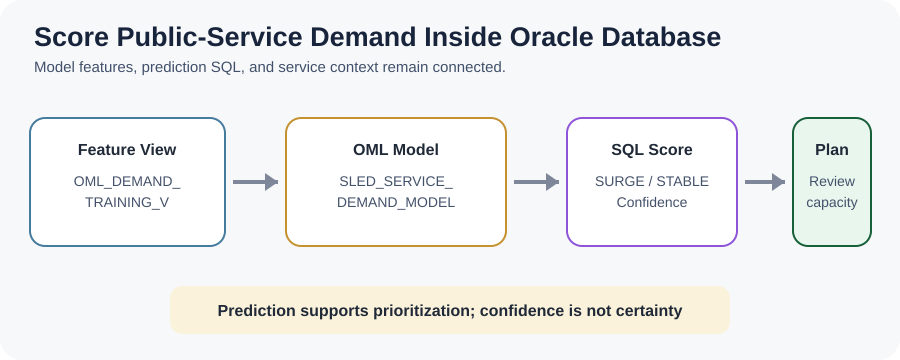
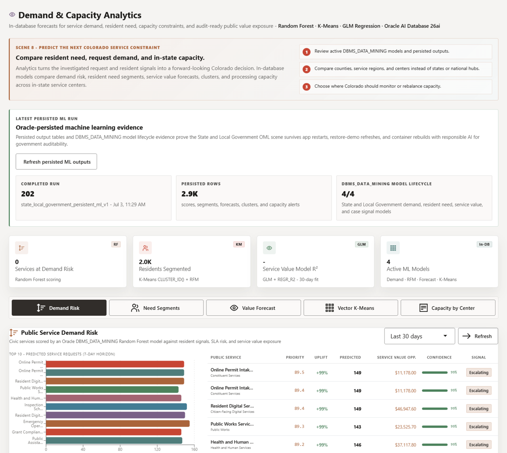

# Demand and Capacity Analytics with Oracle Machine Learning

## Introduction

Jessica has reviewed current requests, resident signals, partner paths, and geographic capacity. She now needs predictive evidence that helps identify which public services may face rising demand.

You are the analytics engineer supporting Jessica. In this lab, you inventory the four **State and Local Government Oracle Machine Learning (OML) models**, score the service-demand classification model, and compare predicted labels with deterministic training labels.

<details>
<summary><strong>Key terms: model, feature, classification, regression, clustering, and confidence</strong></summary>

> - A **model** is a trained pattern that scores new or current data.
>
> - A **feature** is an input value, such as service demand, signal urgency, request volume, or capacity.
>
> - **Classification** predicts a category such as `SURGE` or `STABLE`.
>
> - **Regression** predicts a number, such as service value or future workload.
>
> - **Clustering** groups similar services or residents without a predefined label.
>
> - **Confidence** is the model probability associated with a prediction. It helps rank results, but it is not certainty.

</details>

The diagram follows governed service data into OML models and then back to a planning decision.



The application image below is the Demand and Capacity Analytics page. It gives Jessica and the analytics engineer a view of persisted model runs, active models, demand-risk scores, resident segments, service-value forecasts, clusters, and capacity evidence. The SQL in this lab exposes the deployed model catalog and classification scores directly.



The compact deterministic workshop dataset uses 10 services; the full LiveStack application uses a separate, larger demonstration dataset.

### Objectives

- Inventory the four active SLED OML models before using their scores.
- Score service-demand classifications in SQL so model evidence remains connected to service context.
- Run a simple agreement check between known and predicted labels without presenting it as production accuracy.

Estimated Time: **12 minutes**

### Business Scenario

| Step | State and local government focus |
| --- | --- |
| Business Problem | Jessica needs to know where future demand may pressure service capacity. |
| Technical Challenge | Predictions must remain connected to governed service rows and reviewable SQL. |
| Persona Focus | An analytics engineer supports statewide planning. |
| What You Will Do | Inspect model metadata, score service demand, and compare labels. |
| Database Capability | OML stores and scores models inside Oracle Database. |
| Outcome | Jessica receives predictive evidence without exporting sensitive operating data. |

**Persona focus:** You connect OML model output to the service names and demand evidence that Jessica recognizes.

## Task 1: Inventory the active OML models

Confirm which models are available before using their scores, so Jessica knows the prediction comes from a persisted model in the workshop schema.

1. Run the model inventory query.

    > **SQL Worksheet reminder:** Need a reminder on how to open and use SQL Worksheet? Return to [Getting Started Task 2: Open SQL Worksheet](/workshops/sandbox/index.html?lab=getting-started#Task2:OpenSQLWorksheet).

    `USER_MINING_MODELS` lists OML models owned by `LLUSER`. The model names identify the public-service decision, while `MINING_FUNCTION` and `ALGORITHM` explain what kind of result the model produces.

    <details>
    <summary><strong>Why this matters: model evidence remains in the database</strong></summary>

    > Exporting service records to another machine learning platform creates more data movement and another governance boundary. OML keeps the model, input rows, SQL score, and business context close together.

    </details>

    ```sql
    <copy>
    SELECT model_name,
           mining_function,
           algorithm
    FROM user_mining_models
    WHERE model_name IN (
      'SLED_SERVICE_DEMAND_MODEL',
      'SLED_RESIDENT_NEED_SEGMENT_MODEL',
      'SLED_SERVICE_VALUE_MODEL',
      'SLED_CASE_SIGNAL_CLUSTER_MODEL'
    )
    ORDER BY model_name;
    </copy>
    ```

    **Expected output: Active SLED OML Models**

    | Model Name | Mining Function | Algorithm |
    | --- | --- | --- |
    | SLED\_CASE\_SIGNAL\_CLUSTER\_MODEL | CLUSTERING | KMEANS |
    | SLED\_RESIDENT\_NEED\_SEGMENT\_MODEL | CLUSTERING | KMEANS |
    | SLED\_SERVICE\_DEMAND\_MODEL | CLASSIFICATION | RANDOM\_FOREST |
    | SLED\_SERVICE\_VALUE\_MODEL | REGRESSION | GENERALIZED\_LINEAR\_MODEL |

2. Connect each model to a planning job.

    The classification model predicts service-demand state. The regression model estimates service value. The clustering models group residents and service signals into similar operating patterns. This lab scores the classification model because it connects directly to the capacity question from Jessica.

## Task 2: Score public-service demand

Score each service as `SURGE` or `STABLE` so Jessica can prioritize public services for demand review.

1. Run the classification query.

    `OML_DEMAND_TRAINING_V` is a saved query that packages consistent model features for each service. `PREDICTION` returns the predicted label, and `PREDICTION_PROBABILITY` returns confidence. The outer query joins `SLED_PUBLIC_SERVICES_V` so the result shows business names rather than only IDs.

    ```sql
    <copy>
    SELECT scores.service_id,
           services.service_name,
           scores.known_label,
           scores.predicted_label,
           scores.confidence
    FROM (
      SELECT product_id AS service_id,
             surge_flag AS known_label,
             PREDICTION(
               SLED_SERVICE_DEMAND_MODEL USING *
             ) AS predicted_label,
             ROUND(PREDICTION_PROBABILITY(
               SLED_SERVICE_DEMAND_MODEL USING *
             ), 4) AS confidence
      FROM oml_demand_training_v
    ) scores
    JOIN sled_public_services_v services
      ON services.service_id = scores.service_id
    ORDER BY scores.service_id;
    </copy>
    ```

    **Expected output: Service Demand Scores**

    The development ADB produced the following scores from the deterministic workshop data and tuned compact training configuration.

    | Service Id | Service Name | Known Label | Predicted Label | Confidence |
    | --- | --- | --- | --- | --- |
    | 1 | Medicaid Eligibility Review | SURGE | SURGE | 1 |
    | 2 | SNAP Application Support | STABLE | STABLE | 1 |
    | 3 | Benefits Appointment Scheduling | SURGE | SURGE | 1 |
    | 4 | Building Permit Inspection | STABLE | STABLE | 1 |
    | 5 | Road Repair Request | STABLE | STABLE | 1 |
    | 6 | Emergency Shelter Referral | STABLE | STABLE | 1 |
    | 7 | Housing Assistance Intake | SURGE | SURGE | 1 |
    | 8 | Child Care Subsidy | STABLE | STABLE | 1 |
    | 9 | Water Service Restoration | STABLE | STABLE | 1 |
    | 10 | Senior Transportation | SURGE | SURGE | 1 |

2. Interpret label and confidence together.

    A `SURGE` label helps Jessica prioritize services for capacity review. Confidence ranks model support for that label. Here, confidence of `1` reflects fit on the compact training rows being scored; it is not holdout accuracy or certainty about future demand. The result does not authorize an intervention or establish that service capacity caused the eligibility warning.

    The model output supports planning only when Jessica combines it with the capacity, geography, and request evidence from earlier labs.

## Task 3: Check model agreement

Count how often predicted labels match the known deterministic labels so the learner can verify the SQL scoring path.

1. Run the agreement query.

    The inner query scores each row. The outer query groups known and predicted combinations. Matching labels provide a quick learning check; mismatches show where a planner should inspect more context. This is not a full production model evaluation.

    ```sql
    <copy>
    SELECT known_label,
           predicted_label,
           COUNT(*) AS service_count
    FROM (
      SELECT surge_flag AS known_label,
             PREDICTION(
               SLED_SERVICE_DEMAND_MODEL USING *
             ) AS predicted_label
      FROM oml_demand_training_v
    )
    GROUP BY known_label, predicted_label
    ORDER BY known_label, predicted_label;
    </copy>
    ```

    **Expected output: Demand Model Agreement**

    | Known Label | Predicted Label | Service Count |
    | --- | --- | --- |
    | STABLE | STABLE | 6 |
    | SURGE | SURGE | 4 |

2. Use the check responsibly.

    Agreement on all **10 compact training rows** confirms that the SQL scoring path is working. It is not a production accuracy measure. A production review would also test holdout data, error rates, fairness, drift, and whether the features remain appropriate for the public-service decision.

## Acknowledgements

* **Author** - Oracle LiveLabs Team
* **Last Updated By/Date** - Oracle LiveLabs Team, August 2026
