# Demand and Capacity Analytics with Oracle Machine Learning

## Introduction

Jessica has reviewed current requests, resident signals, partner paths, and geographic capacity. **Priya**, the Government AI Engineer, now prepares predictive signals that help identify which public services may face rising demand, while Maya plans the operational response.

You work with Priya as the analytics engineer supporting Jessica and Maya. In this lab, you inventory the four **State and Local Government Oracle Machine Learning (OML) models**, score service-demand and service-value models, and compare predicted demand labels with deterministic training labels.

<details>
<summary><strong>Key terms: model, feature, classification, regression, clustering, and confidence</strong></summary>

> - A **model** is a trained pattern that scores new or current data.
>
> - A **feature** is an input value, such as service demand, signal urgency, request volume, or capacity.
>
> - **Classification** predicts a category such as `SURGE` or `STABLE`.
>
> - **Regression** predicts a number, such as service value or future workload.
>
> - **Clustering** groups similar services or residents without a predefined label.
>
> - **Confidence** is the model probability associated with a prediction. It helps rank results, but it is not certainty.

</details>

The diagram follows governed service data into OML models and then back to a planning decision.


The application image below is the Demand and Capacity Analytics page. It gives Jessica and the analytics engineer a view of persisted model runs, active models, demand-risk scores, resident segments, service-value forecasts, clusters, and capacity information. The SQL in this lab exposes the deployed model catalog and classification scores directly.


The compact deterministic workshop dataset uses 10 services; the full LiveStack application uses a separate, larger demonstration dataset.

### Objectives

- Inventory the four active SLED OML models before using their scores.
- Score service-demand classifications and service-value estimates in SQL so model results remain connected to recognizable operating records.
- Run a simple agreement check between known and predicted labels without presenting it as production accuracy.
- Use the OML AutoML workspace to compare candidate demand-surge models without deploying one.

Estimated Time: **25 minutes**

### Business Scenario

| Step | State and local government focus |
| --- | --- |
| Business Problem | Jessica needs to know where future demand may pressure service capacity. |
| Technical Challenge | Predictions must remain connected to governed service rows and reviewable SQL. |
| Persona Focus | Priya prepares the model results; Jessica reviews risk; Maya uses them for service-capacity planning. |
| What You Will Do | Inspect model metadata, score service demand and service value, compare labels, and evaluate candidate demand-surge models. |
| Database Capability | OML stores and scores models inside Oracle Database. |
| Outcome | Jessica receives predictive context without exporting sensitive operating data. |

**Persona focus:** You join Priya, Jessica, and Maya as you connect OML model output to recognizable service names and demand context.

## Task 1: Inventory the active OML models

Priya needs to know which persisted models are available before Jessica uses any prediction in a planning discussion. Inspect the model names, functions, and algorithms now; this shows the team what each model can contribute and keeps the later scores tied to a visible database object.

Confirm which models are available before using their scores, so Jessica knows the prediction comes from a persisted model in the workshop schema.

1. Run the model inventory query.

    > **SQL Worksheet reminder:** Need a reminder on how to open and use SQL Worksheet? Return to [Getting Started Task 2: Open SQL Worksheet](/workshops/sandbox/index.html?lab=getting-started#Task2:OpenSQLWorksheet).

    `USER_MINING_MODELS` lists OML models owned by `LLUSER`. The model names identify the public-service decision, while `MINING_FUNCTION` and `ALGORITHM` explain what kind of result the model produces.

    <details>
    <summary><strong>Why this matters: model results remain in the database</strong></summary>

    > Exporting service records to another machine learning platform creates more data movement and another governance boundary. OML keeps the model, input rows, SQL score, and business context close together.

    </details>

    ```sql
    <copy>
    SELECT model_name,
           mining_function,
           algorithm
    FROM user_mining_models
    WHERE model_name IN (
      'SLED_SERVICE_DEMAND_MODEL',
      'SLED_RESIDENT_NEED_SEGMENT_MODEL',
      'SLED_SERVICE_VALUE_MODEL',
      'SLED_CASE_SIGNAL_CLUSTER_MODEL'
    )
    ORDER BY model_name;
    </copy>
    ```

    **Expected output: Active SLED OML Models**

    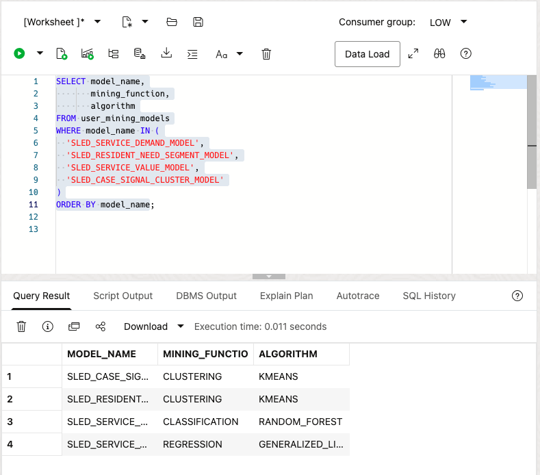

2. Connect each model to a planning job.

    The classification model predicts service-demand state. The regression model estimates service value. The clustering models group residents and service signals into similar operating patterns. The next two tasks score the two predictive models; the clustering models remain available for segmentation work.

## Task 2: Score public-service demand

Jessica needs an early view of which services may face a demand surge, but the label must be read beside its confidence and service name. Score the services now and inspect the predicted label and probability; Priya can use the result to help Jessica choose which services enter a human planning review.

Score each service as `SURGE` or `STABLE` so Jessica can prioritize public services for demand review.

1. Run the classification query.

    `OML_DEMAND_TRAINING_V` is a saved query that packages consistent model features for each service. `PREDICTION` returns the predicted label, and `PREDICTION_PROBABILITY` returns confidence. The outer query joins `SLED_PUBLIC_SERVICES_V` so the result shows business names rather than only IDs.

    ```sql
    <copy>
    SELECT scores.service_id,
           services.service_name,
           scores.known_label,
           scores.predicted_label,
           scores.confidence
    FROM (
      SELECT product_id AS service_id,
             surge_flag AS known_label,
             PREDICTION(
               SLED_SERVICE_DEMAND_MODEL USING *
             ) AS predicted_label,
             ROUND(PREDICTION_PROBABILITY(
               SLED_SERVICE_DEMAND_MODEL USING *
             ), 4) AS confidence
      FROM oml_demand_training_v
    ) scores
    JOIN sled_public_services_v services
      ON services.service_id = scores.service_id
    ORDER BY scores.service_id;
    </copy>
    ```

    **Expected output: Service Demand Scores**

    The development ADB produced the following scores from the deterministic workshop data and tuned compact training configuration.

    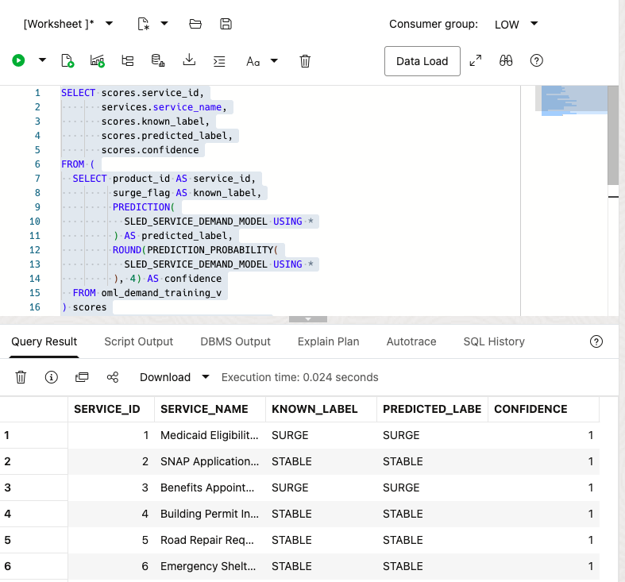

2. Interpret label and confidence together.

    A `SURGE` label helps Jessica prioritize services for capacity review. Confidence ranks model support for that label. Here, confidence of `1` reflects fit on the compact training rows being scored; it is not holdout accuracy or certainty about future demand. The result does not authorize an intervention or establish that service capacity caused the eligibility warning.

    The model output supports planning only when Jessica combines it with the capacity, geography, and request details from earlier labs.

3. 🎯 **Interactive challenge: Build a demand-review queue.**

    Starting with the classification query above, add `WHERE scores.predicted_label = 'SURGE'` before the `ORDER BY` clause to investigate only services with a predicted demand surge. Run your revised query. Which services should enter Jessica's human demand-and-capacity review queue?

    **Expected output: Predicted Surge Review Queue**

    With the current compact model and fixed workshop data, the result should include Medicaid Eligibility Review, Benefits Appointment Scheduling, Housing Assistance Intake, and Senior Transportation. Predicted labels and confidence are model outputs and may change if the model is rebuilt or retrained.

    <details>
    <summary><strong>Challenge answer: Review predicted-surge services with operating context</strong></summary>

    > The predicted-surge services should enter human review, where Jessica can compare them with request, resident-signal, geographic, and capacity details. A predicted label and its confidence support prioritization; they are not certainty or authority to intervene. Oracle AI Database keeps the model, feature rows, scores, and operational context together, so teams can investigate without copying sensitive service data into disconnected systems.

    If you need the runnable solution, use this query:

    ```sql
    <copy>
    SELECT scores.service_id,
           services.service_name,
           scores.known_label,
           scores.predicted_label,
           scores.confidence
    FROM (
      SELECT product_id AS service_id,
             surge_flag AS known_label,
             PREDICTION(
               SLED_SERVICE_DEMAND_MODEL USING *
             ) AS predicted_label,
             ROUND(PREDICTION_PROBABILITY(
               SLED_SERVICE_DEMAND_MODEL USING *
             ), 4) AS confidence
      FROM oml_demand_training_v
    ) scores
    JOIN sled_public_services_v services
      ON services.service_id = scores.service_id
    WHERE scores.predicted_label = 'SURGE'
    ORDER BY scores.service_id;
    </copy>
    ```

    </details>

## Task 3: Estimate service-request value

After identifying possible demand pressure, Jessica needs one more planning input about the relative scale of the affected requests. Inspect the estimated value beside each recognizable service request now; Maya can use the comparison to prepare a more informed capacity conversation, not to make an automatic funding decision.

Use the regression model to estimate the value associated with each recognizable service request. Jessica can use this result as one planning input when deciding where a demand surge may have the greatest operational impact.

1. Run the regression scoring query.

    `OML_COMMITMENT_VALUE_TRAINING_V` supplies a consistent feature row for each service request. In a regression query, `PREDICTION` returns a number rather than a category. The aliases in this query use public-service language while preserving the underlying governed data structure.

    ```sql
    <copy>
    SELECT order_id AS service_request_id,
           customer_tier,
           service_count,
           target_commitment_value,
           ROUND(PREDICTION(
             SLED_SERVICE_VALUE_MODEL USING *
           ), 2) AS predicted_commitment_value
    FROM oml_commitment_value_training_v
    ORDER BY order_id;
    </copy>
    ```

    **Expected output: Service-Request Value Scores**

    The deterministic workshop data returns **eight rows**, one per service request. The predicted value should be numeric for every row. In the current compact training configuration, the predicted value matches the displayed target value for each row; this confirms the scoring path only and is not a forecast-quality claim.

    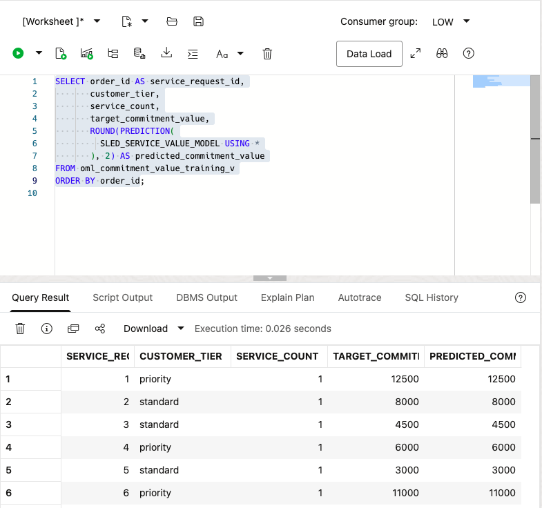

2. Keep the result in context.

    A regression estimate helps compare the relative scale of service requests. It does not determine funding, eligibility, or a resident outcome. OML performs this score beside the governed input rows inside Oracle Database, so Jessica's team can review the query and result without exporting operating data to a separate machine learning service.

## Task 4: Check model agreement

Before relying on the score pattern for a training exercise, Priya and Jessica need a simple way to compare known labels with the results of the same SQL path. Inspect the matching and non-matching counts now; this shows what deserves more context without presenting the compact dataset as a production accuracy test.

Count how often predicted labels match the known deterministic labels so the learner can verify the SQL scoring path.

1. Run the agreement query.

    The inner query scores each row. The outer query groups known and predicted combinations. Matching labels provide a quick learning check; mismatches show where a planner should inspect more context. This is not a full production model evaluation.

    ```sql
    <copy>
    SELECT known_label,
           predicted_label,
           COUNT(*) AS service_count
    FROM (
      SELECT surge_flag AS known_label,
             PREDICTION(
               SLED_SERVICE_DEMAND_MODEL USING *
             ) AS predicted_label
      FROM oml_demand_training_v
    )
    GROUP BY known_label, predicted_label
    ORDER BY known_label, predicted_label;
    </copy>
    ```

    **Expected output: Demand Model Agreement**

    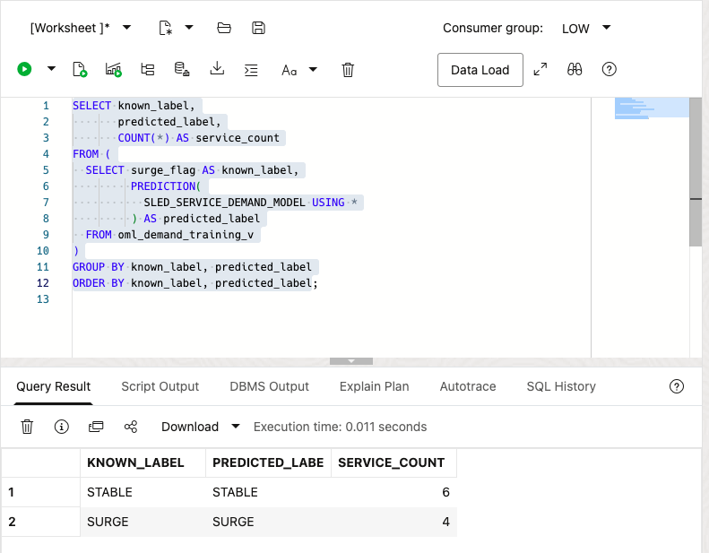

2. Use the check responsibly.

    Agreement on all **10 compact training rows** confirms that the SQL scoring path is working. It is not a production accuracy measure. A production review would also test holdout data, error rates, fairness, drift, and whether the features remain appropriate for the public-service decision.

## Task 5: Build and compare demand-surge models in the OML AutoML UI

The earlier tasks inspected an existing model, and Maya now needs a transparent way to compare candidate approaches before any team considers deployment. Run the AutoML comparison and inspect the completed status, leaderboard, and feature list; these results help Priya, Jessica, and Maya discuss which model criterion supports the planning question.

The previous tasks score an existing demand model. In this task, you use the OML AutoML workspace to compare candidate models that predict whether a public service has a `SURGE` or `STABLE` demand state. The data, experiment settings, candidates, and feature analysis remain in Oracle Database.

AutoML compares multiple candidate approaches from a saved view and a business label. This gives Jessica a repeatable way to evaluate candidate demand-surge models before a team considers deployment. A leaderboard ranks modeling approaches; it does not determine a staffing, funding, eligibility, or resident-service decision.

1. Open the AutoML workspace.

    From the Autonomous Database landing page, select **Database Actions**, then **View all database actions**. Under **Development**, select **Machine Learning**.

    

    Sign in with your workshop database credentials if prompted. The OML home page groups the database machine-learning tools. Select **AutoML**.

    

    The **AutoML Experiments** page is where you create, rerun, or compare experiments. Select **Create**.

    

2. Create a State and Local Government demand-surge experiment.

    Use the following settings. Add your initials to the experiment name so it is easy to find in the experiment list.

    | Setting | Value |
    | --- | --- |
    | Name | `STATE_LOCAL_GOV_DEMAND_SURGE_AUTOML_<YOUR_INITIALS>` |
    | Data Source | Schema: `LLUSER`; View: `OML_DEMAND_TRAINING_V` |
    | Predict | `SURGE_FLAG` |
    | Prediction Type | `Classification` |
    | Case ID | `PRODUCT_ID` |

    `SURGE_FLAG` is the same public-service demand label you scored in Task 2. `PRODUCT_ID` gives the experiment a stable service identifier for sampling and split decisions. Confirm the name, source view, prediction target, classification type, and case ID before you start.

    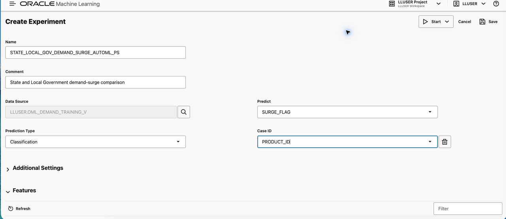

    When choosing the data source, select the `LLUSER` schema and then `OML_DEMAND_TRAINING_V`.

    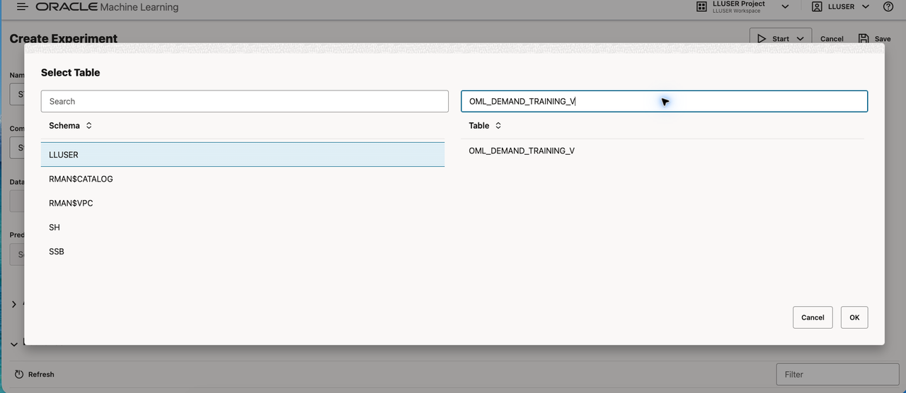

3. Set a short comparison run and review the results.

    Expand **Additional Settings**. Set **Maximum Top Models** to `2`, set **Database Service Level** to **Low**, and keep **Balanced Accuracy** as the model metric. Leave the other settings at their defaults unless your sandbox guidance says otherwise.

    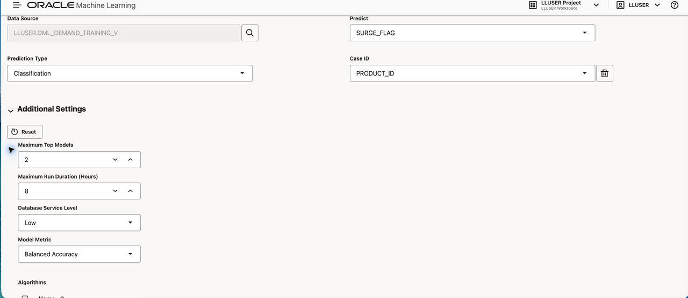

    Open the arrow beside **Start**, then choose **Faster Results**.

    

    The progress panel shows stages such as initialization, algorithm selection, adaptive sampling, feature selection, and model tuning. Wait for the run to complete before reviewing the results.

    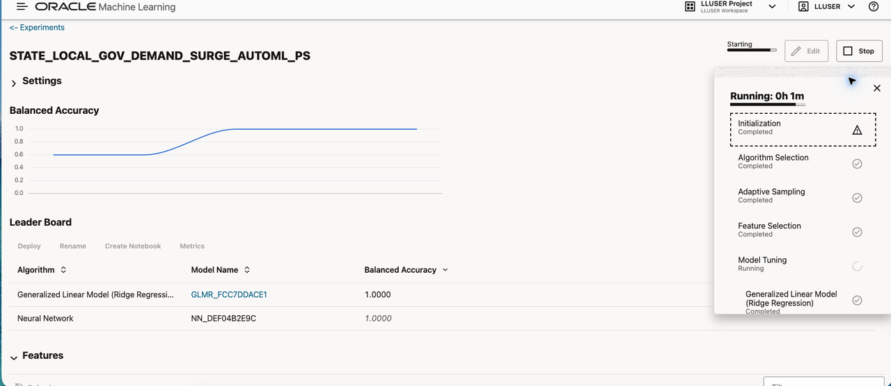

    Wait for the status to show **Completed**. The leaderboard will show up to two ranked candidate models and the **Features** grid will show relative feature importance. The winning algorithm, score, and importance ranking can change with the run; do not expect a fixed result.

    

    **Expected result: completed AutoML comparison**

    The experiment shows a completed status, a leaderboard with up to two candidate models ranked by Balanced Accuracy, and feature importance for the demand-training inputs. Use the result to choose what deserves more analysis, not as an automatic operating decision.

    

4. Interpret the result for public-service planning.

    Review the top-ranked candidate and the feature list with Jessica. For example, `UNITS_REQUESTED`, service category, public attention, and request activity can help frame follow-up questions about capacity. Feature importance indicates how the candidate used the supplied inputs; it does not prove that any input caused demand pressure.

    Before a candidate can support a real public-service decision, teams should evaluate it on newer, unseen data; assess error rates, fairness, feature quality, and drift; and agree on the human review and accountability process. Oracle Database keeps that candidate-model review close to the governed service data rather than moving the data to a separate machine learning platform.

5. 🎯 **Interactive challenge: compare the decision criterion.**

    Create a second experiment from the same view. Name it `STATE_LOCAL_GOV_DEMAND_SURGE_F1_<YOUR_INITIALS>` and change only the model metric to **F1 Macro**. In **Additional Settings**, choose **F1** as the model metric and **Macro** as its weight option; keep the two-model limit and **Low** service level so the comparison remains consistent. Start it with **Faster Results**. Does the same candidate lead both experiments? Which metric better supports a planning team that needs balanced attention to both `SURGE` and `STABLE` services?

    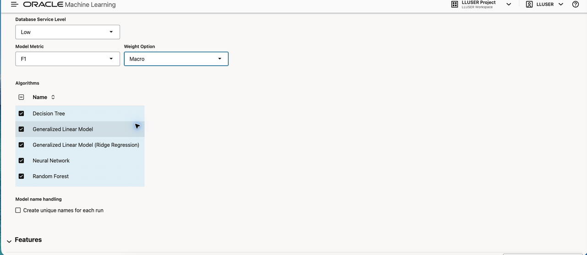

    <details>
    <summary><strong>Challenge answer: choose the metric that matches the planning question</strong></summary>

    > There is no guaranteed winning candidate or score. If the ranking changes, the comparison shows that model selection depends on the decision criterion, not only on one headline result. **Balanced Accuracy** is the clearer first comparison when planners want equal recall weight for `SURGE` and `STABLE` services. Review F1 Macro as a complementary measure because it also accounts for false positives through precision.

    The F1 Macro leaderboard and feature grid provide the second comparison. The metric heading identifies the decision criterion used to rank the candidates, while the feature grid shows the relative importance of the same demand-training inputs. Results are dynamic; use the screenshots as orientation rather than a fixed score target.

    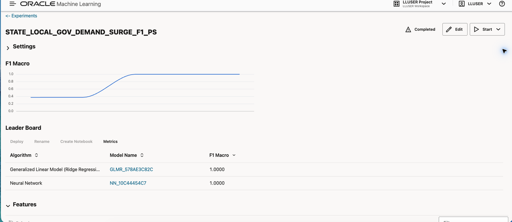

    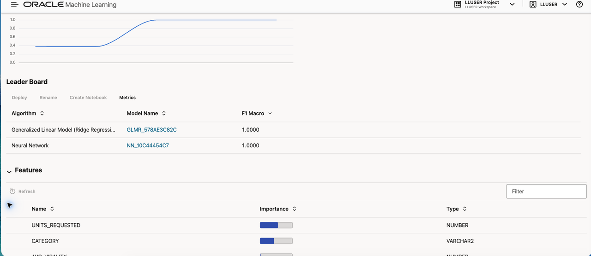

    </details>

## Conclusion

You used persisted OML models to score named public services and service requests directly in Oracle Database, then compared candidate demand-surge models in AutoML. Jessica can combine demand labels, confidence, service-value estimates, candidate rankings, feature context, and earlier capacity details in a human planning review, without exporting governed operating data for scoring elsewhere.

### What have I achieved when the lab ends?

You have inspected persisted models, scored demand and value, compared known and predicted labels, and reviewed candidate AutoML models. Priya can show which services may need capacity attention and help Jessica and Maya frame the next planning discussion.

## Acknowledgements

* **Author** - Pat Shepherd, Senior Principal Database Product Manager
* **Last Updated By/Date** - Oracle Database Product Management, September 2026
