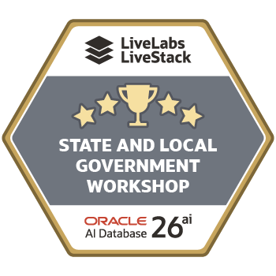

# Final Quiz

```quiz-config
passing: 75
badge: images/state-local-government-badge.svg
```

## Introduction

Use this scored quiz to check whether you can connect each Colorado resident-services outcome to the database results and supporting records that Jessica, Jordan, Sam, Priya, and Maya use in the workshop.

### Objectives

- Review the active database capabilities used across the Colorado resident-services decision path.
- Connect public-service outcomes to SQL, JSON, vector, graph, spatial, OML, Select AI, and Select AI Agent capabilities.
- Earn the workshop badge.

Estimated Time: **5 minutes**

## Task 1: Answer the quiz questions

Use the quiz now to check whether you can connect each database result to the public-service decision it supports. As you answer, inspect how the foundation, request, demand, partner, location, model, and governed-answer tasks help Jessica's team move from an early warning to a reviewable response.

1. Complete the scored quiz.

    ```quiz score
    Q: Why does the workshop begin with the data foundation?
    - To install every object manually in SQL Worksheet.
    * To map the shared information used by each later workflow.
    - To replace all application pages with catalog reports.
    - To export Colorado records into separate analysis files.
    > The foundation maps the SLED views, JSON, vector, graph, spatial, and OML objects used by the active labs.

    Q: What is the main value of recreating command-center measures with SQL?
    - It makes the configured eligibility rate a legal determination.
    - It removes the need to inspect individual requests.
    * It connects summary measures to reviewable service-request rows.
    - It hides regional and service details from operators.
    > SQL drill-through gives Jessica named requests, services, regions, urgency, and service value behind the summary.

    Q: What does JSON Relational Duality provide in the request lab?
    * An application-friendly document and relational access to the same source.
    - A copied request stored in a separate document database.
    - A replacement for relational keys and constraints.
    - A JSON export that analysts cannot query with SQL.
    > `ORDERS_DV` exposes a nested request document while the governed request and line-item rows remain relational.

    Q: Why is in-database AI Vector Search useful for resident demand?
    - It limits searches to exact keywords in service names.
    - It removes source text after creating embeddings.
    - It proves that every related signal has the same cause.
    * It ranks related services and signals by meaning inside the governed database.
    > Semantic search connects different wording to similar intent while the text, vectors, and business rows remain together.

    Q: Why should Jessica inspect `SHOWSQL` before relying on a Select AI answer?
    - To make the notebook change the source service requests.
    - To turn the response into a dashboard screenshot.
    * To confirm that the proposed read-only SQL uses the approved service views.
    - To let Select AI choose new database objects automatically.
    > `SHOWSQL` lets Jessica and Priya review the generated statement before they use its result in a planning conversation.

    Q: What partner-coordination problem does Property Graph solve?
    - It estimates the driving distance to a service center.
    - It builds a JSON request document.
    * It explains one-hop and two-hop relationships among programs and partners.
    - It predicts future service demand from model features.
    > SQL/PGQ expresses the coordination path as vertices and edges, so Jessica can explain why a partner is relevant.

    Q: Why does the service-access lab use Oracle Spatial?
    * To measure resident-to-center distance and connect it to capacity.
    - To infer VPD scope from an untrusted worksheet variable.
    - To replace service-center records with static map labels.
    - To calculate the application-configured eligibility rate.
    > Spatial SQL makes geographic feasibility measurable while center and capacity data remain connected.

    Q: What does idempotency protect against in the Select AI Agent workflow?
    - A repeat request changing the original source service data.
    * A repeat request creating a duplicate planning-review record.
    - Jessica needing to review the agent history.
    - Priya using approved database tools.
    > The agent's controlled function recognizes an existing review, so Maya can confirm that rerunning the same request does not create a duplicate record.

    Q: What does OML confidence mean?
    - It guarantees that the predicted service-demand state will occur.
    * It is model probability that helps rank results and still needs review.
    - It is the number of models in `USER_MINING_MODELS`.
    - It replaces the need for business context or validation.
    > Confidence supports comparison between predictions, but it is not certainty or authorization to act.

    Q: What is the main advantage of Oracle AI Database as the workshop foundation?
    - Each capability requires a separate specialist data store.
    - Application screenshots replace database results.
    * SQL, JSON, vector, graph, spatial, OML, Select AI, and controlled agent workflows stay connected.
    - Teams must reconcile copied records before each investigation.
    > Different access patterns support different jobs, while connected data and governance reduce copying and reconciliation.
    ```

2. Review the completion badge.

    

### What have I achieved when the lab ends?

You have checked that you can explain what each result means, why it appears at that point in the investigation, and how it helps the Colorado team make a better-informed review decision.

## Acknowledgements

* **Author** - Pat Shepherd, Senior Principal Database Product Manager
* **Last Updated By/Date** - Oracle Database Product Management, September 2026
