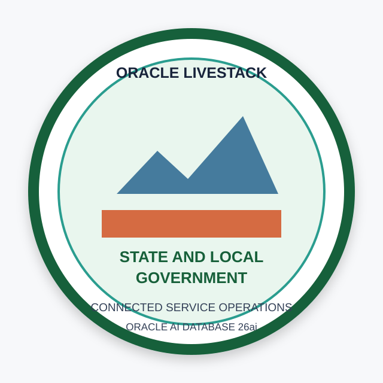

# Final Quiz

```quiz-config
passing: 75
badge: images/state-local-government-badge.svg
```

## Introduction

Use this scored quiz to check whether you can connect each Colorado resident-services outcome to the database evidence you inspected.

### Objectives

- Review the active database capabilities.
- Connect public-service outcomes to supporting evidence.
- Earn the workshop badge.

Estimated Time: **5 minutes**

## Task 1: Answer the quiz questions

1. Complete the scored quiz.

    ```quiz score
    Q: Why does the workshop begin with the data foundation?
    - To install every object manually in SQL Worksheet.
    * To map the shared evidence used by each later workflow.
    - To replace all application pages with catalog reports.
    - To export Colorado records into separate analysis files.
    > The foundation maps the SLED views, JSON, vector, graph, spatial, and OML objects used by the active labs.

    Q: What is the main value of recreating command-center measures with SQL?
    - It makes the configured eligibility rate a legal determination.
    - It removes the need to inspect individual requests.
    * It connects summary measures to reviewable service-request rows.
    - It hides regional and service details from operators.
    > SQL drill-through gives Jessica named requests, services, regions, urgency, and service value behind the summary.

    Q: What does JSON Relational Duality provide in the request lab?
    * An application-friendly document and relational access to the same source.
    - A copied request stored in a separate document database.
    - A replacement for relational keys and constraints.
    - A JSON export that analysts cannot query with SQL.
    > `ORDERS_DV` exposes a nested request document while the governed request and line-item rows remain relational.

    Q: Why is in-database AI Vector Search useful for resident demand?
    - It limits searches to exact keywords in service names.
    - It removes source text after creating embeddings.
    - It proves that every related signal has the same cause.
    * It ranks related services and signals by meaning inside the governed database.
    > Semantic search connects different wording to similar intent while the text, vectors, and business rows remain together.

    Q: How should you interpret the vector similarity score?
    - A lower value always means a closer semantic match.
    * A higher value means a closer match, but the result still needs review.
    - It is the number of urgent requests in the dashboard.
    - It is a legal confidence score for program eligibility.
    > The lab uses `1 - VECTOR_DISTANCE(...)`, so higher similarity ranks closer meaning. It is a review aid, not a final decision.

    Q: What partner-coordination problem does Property Graph solve?
    - It estimates the driving distance to a service center.
    - It builds a JSON request document.
    * It explains one-hop and two-hop relationships among programs and partners.
    - It predicts future service demand from model features.
    > SQL/PGQ expresses the coordination path as vertices and edges, so Jessica can explain why a partner is relevant.

    Q: Why does the service-access lab use Oracle Spatial?
    * To measure resident-to-center distance and connect it to capacity.
    - To infer VPD scope from an untrusted worksheet variable.
    - To replace service-center records with static map labels.
    - To calculate the application-configured eligibility rate.
    > Spatial SQL makes geographic feasibility measurable while center and capacity data remain connected.

    Q: What does the regional-access evidence protect?
    - The order in which quiz questions appear.
    - Only the colors and labels on the application map.
    - A separate copy of resident data in a mapping service.
    * Which protected operational rows an application identity may use.
    > The current application uses trusted Oracle VPD context for statewide, regional, and restricted views. The learner worksheet does not claim to establish that context.

    Q: What does OML confidence mean?
    - It guarantees that the predicted service-demand state will occur.
    * It is model probability that helps rank results and still needs review.
    - It is the number of models in `USER_MINING_MODELS`.
    - It replaces the need for business context or validation.
    > Confidence supports comparison between predictions, but it is not certainty or authorization to act.

    Q: What is the main advantage of Oracle AI Database 26ai as the workshop foundation?
    - Each capability requires a separate specialist data store.
    - Application screenshots replace database evidence.
    * SQL, JSON, vector, graph, spatial, and OML evidence stay connected.
    - Teams must reconcile copied records before each investigation.
    > Different access patterns support different jobs, while connected data and governance reduce copying and reconciliation.
    ```

2. Review the completion badge.

    

## Acknowledgements

* **Author** - Oracle LiveLabs Team
* **Last Updated By/Date** - Oracle LiveLabs Team, August 2026
