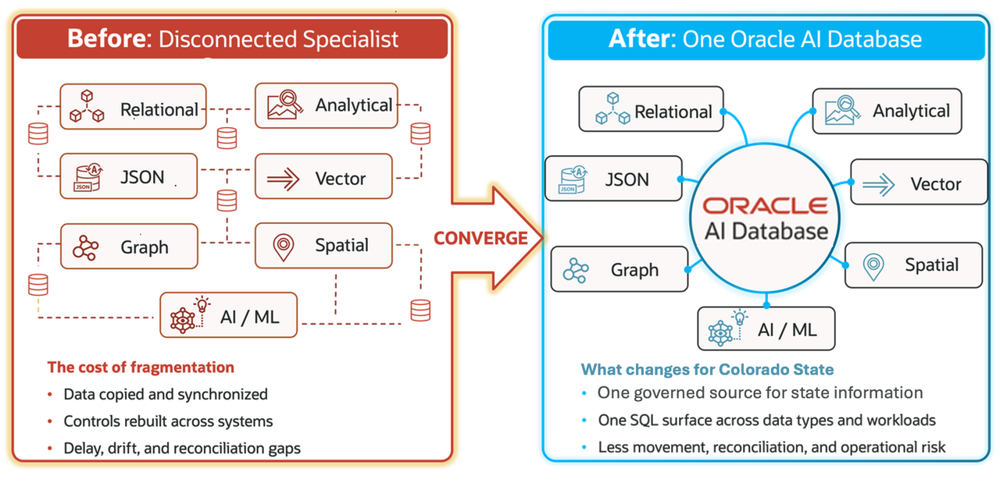

# Build Connected State and Local Government Service Operations with Oracle AI Database

## Introduction

When a service measure begins to drift, Colorado teams need to understand what is happening before residents feel the impact. A dashboard warning can start that conversation, but a useful response also depends on service requests, resident concerns, partner handoffs, geography, capacity, and predictive signals that stay connected and easy to explain.

In this workshop, **Jessica**, the State Services Risk Analyst, sees a **Medicaid Eligibility Error Rate** of **2.7%**. The measure remains within the stakeholder-provided **3.0%** threshold, but its **Approaching Threshold** status gives Jessica a reason to investigate before the operating margin narrows further.

The eligibility measure is the early warning, not the whole story. This workshop is **not a Medicaid-only scenario**, a legal determination, or a funding-penalty calculation. The same connected operating model can support benefits, permits, inspections, public works, emergency response, and other resident services.

Colorado cannot respond confidently when service requests, resident concerns, partner handoffs, maps, and predictive signals live in separate systems. Data copies drift, teams reconcile conflicting results, and each handoff may need its own security and access rules. Oracle AI Database keeps relational records, JSON documents, AI Vector Search, property graph relationships, spatial data, and machine learning models with the same public-service records and controls. Teams make fewer sensitive copies, spend less time reconciling data, and can explain how an early warning led to a service decision.

You join a five-person Colorado public-service team. **Jordan**, the Database Administrator, keeps the shared foundation and access controls ready. **Jessica** investigates the early warning as the State Services Risk Analyst. **Sam**, the Public-Service Application Developer, exposes service requests in application-friendly form. **Priya**, the Government AI Engineer, prepares meaning-based search and predictive assistance.
**Maya**, the Resident Services Operations Leader, turns the findings into a practical response.

You begin with the shared data foundation, calculate operating measures, inspect one service request, search demand signals by meaning, follow community-partner relationships, measure service access, and review predictive capacity signals.

You follow one path from warning to action. Start with a State Services Risk question. Check the transaction, text, relationships, locations, and predictions behind it. In Lab 8, ask the database a natural-language question, then inspect the generated SQL and answer. In Lab 9, a constrained Select AI Agent records one controlled review action for Maya to inspect. Jessica can follow the work from risk question to reviewable answer to auditable action.

In Labs 3 through 7, a 🎯 **Interactive challenge** follows the baseline result. Try the stated SQL change before opening the collapsed **Challenge answer**; each investigation changes one business parameter and asks you to make one bounded review decision.

Expandable sections add optional context without interrupting the main service-operations path. Open one for a definition, database explanation, or public-sector context. Keep it closed when you want to focus on the hands-on SQL.

<strong>Learn more: What does "converged database" mean?</strong>

> A converged database supports several data models and workloads in one database. Relational rows, JSON documents, vectors, property graphs, spatial data, and machine learning models stay connected to the same business records and security rules.
>
> A fragmented design often copies each data type into a specialist system. Teams then rebuild access controls, synchronize records, and reconcile results. Oracle AI Database lets Colorado use the best access pattern for each public-service question while keeping the underlying records and their context together.

The application image below is the Colorado Resident Services Overview page. This focused capture introduces the statewide operating question that starts the LiveStack demonstration and the application areas backed by validated learner SQL.

### Objectives

- Query the Colorado resident-services data that supports each later decision.
- Use relational SQL, JSON Relational Duality, AI Vector Search, Property Graph, Oracle Spatial, and Oracle Machine Learning (OML) against connected records.
- Trace application measures and pages back to database results your team can inspect.
- Explain how a connected database foundation reduces sensitive data copies, reconciliation work, and fragmented controls.

Estimated Workshop Time: **95 minutes**

### Business Scenario

| Step | State and local government focus |
| --- | --- |
| Business Problem | Colorado must respond to emerging resident-service pressure before accuracy or timeliness deteriorates. |
| Technical Challenge | Application, operations, and analytics teams need one connected path across requests, text, relationships, geography, and predictions. |
| Persona Focus | Jessica leads the statewide review; Jordan, Sam, Priya, and Maya provide database, application, AI, and operations support. |
| What You Will Do | Trace an early warning through the records, database answer, and controlled review action that support the next service decision. |
| Database Capability | Relational SQL, JSON, vectors, graphs, spatial analysis, and OML work over connected data. |
| Outcome | Teams can prioritize service intervention with reviewable, repeatable results. |

**Persona focus:** You work with Jessica, Jordan, Sam, Priya, and Maya as a database developer and analyst. Your job is to turn application measures into details public-service teams can inspect, explain, and use responsibly.

## Acknowledgements

* **Author** - Pat Shepherd, Senior Principal Database Product Manager
* **Last Updated By/Date** - Oracle Database Product Management, September 2026
