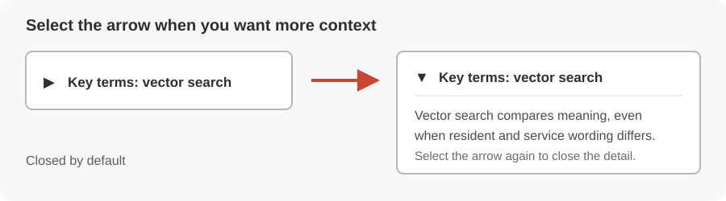

# Build Connected State and Local Government Service Operations with Oracle AI Database 26ai

## Introduction

State and local government leaders must act quickly when resident-service performance begins to narrow, but they also need evidence that explains each decision. A dashboard warning may start the investigation, yet the response can depend on service requests, resident concerns, community partners, geography, capacity, and predictive signals.

In this workshop, **Jessica Chen**, the statewide digital services lead for Colorado, sees a **Medicaid Eligibility Error Rate of 2.7%**. The measure is still within the stakeholder-provided **3.0% threshold**, but its **Approaching Threshold** status gives Jessica a reason to investigate before the operating margin becomes smaller.

The eligibility measure is an early warning inside a broader Colorado resident-services workflow. This is not a Medicaid-only workshop, a legal determination, or a funding-penalty calculation. The same operating model supports benefits, permits, inspections, public works, emergency response, and other services.

You will support Jessica and **Maria Santos**, a Western Slope regional manager, by connecting each business question to governed database evidence. You will move from the shared data foundation to operational measures, inspect one service request, search demand signals by meaning, follow community-partner relationships, measure service access, and review predictive capacity evidence.

Throughout the workshop, small arrows identify expandable sections. Select an arrow when you want extra context about a term or Oracle Database capability. These sections stay closed by default so the main lab remains focused.

<strong>Learn more: What does "converged database" mean?</strong>

> A converged database supports several data models and workloads in one governed database foundation. Relational rows, JSON documents, vectors, property graphs, spatial data, and machine learning models can stay connected to the same business records and security rules.
>
> A fragmented design often copies each data type into a specialist system. Teams then rebuild access controls, synchronize records, and reconcile results. Oracle AI Database 26ai lets Colorado use the best access pattern for each public-service question without breaking the chain of evidence.

The seven-stage journey graphic above is the workshop map. It contains only the application capabilities backed by hands-on database evidence in these labs.

### Objectives

- Query the governed Colorado resident-services data foundation.
- Use relational SQL, JSON Relational Duality, AI Vector Search, Property Graph, Oracle Spatial, and Oracle Machine Learning (OML) in one decision path.
- Connect application pages to reviewable database evidence.
- Explain how a converged database reduces sensitive data copies and reconciliation work.

Estimated Workshop Time: **95 minutes**

### Business Scenario

| Step | State and local government focus |
| --- | --- |
| Business Problem | Colorado needs to respond to emerging resident-service pressure before accuracy or timeliness deteriorates. |
| Technical Challenge | Application, operations, and analytics teams need one evidence path across requests, text, relationships, geography, and predictions. |
| Persona Focus | Jessica Chen leads the statewide decision; Maria Santos investigates regional service access and request evidence. |
| What You Will Do | Trace an early warning through seven database-backed public-service decisions. |
| Database Capability | Relational SQL, JSON, vectors, graphs, spatial analysis, and OML work over connected data. |
| Outcome | Teams can prioritize service intervention with evidence that remains governed, reviewable, and repeatable. |

**Persona focus:** You are the database developer and analyst supporting Colorado service leaders. Your job is to turn application measures into evidence that public-service teams can inspect and explain.

## Acknowledgements

* **Author** - Oracle LiveLabs Team
* **Last Updated By/Date** - Oracle LiveLabs Team, August 2026
