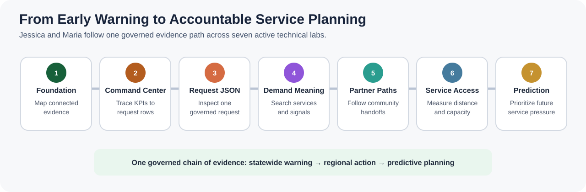
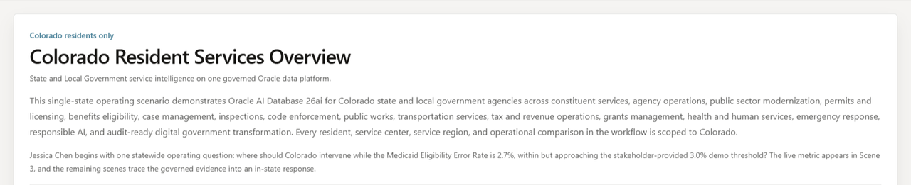

# Build Connected State and Local Government Service Operations with Oracle AI Database 26ai

## Introduction

State and local government leaders must respond before resident-service performance deteriorates, but each decision still needs clear evidence. A dashboard warning can start the investigation, yet the response often depends on service requests, resident concerns, partner handoffs, geography, capacity, and predictive signals that must remain governed and explainable.

In this workshop, **Jessica Chen**, the statewide digital services lead for Colorado, sees a **Medicaid Eligibility Error Rate** of **2.7%**. The measure remains within the stakeholder-provided **3.0%** threshold, but its **Approaching Threshold** status gives Jessica a reason to investigate before the operating margin narrows further.

The eligibility measure is the early warning, not the whole story. This workshop is **not a Medicaid-only scenario**, a legal determination, or a funding-penalty calculation. The same connected operating model can support benefits, permits, inspections, public works, emergency response, and other resident services.

You support **Jessica** and **Maria Santos**, a **Western Slope** regional manager, by connecting each public-service question to governed database evidence. You move from the shared data foundation to operating measures, inspect one service request, search demand signals by meaning, follow community-partner relationships, measure service access, and review predictive capacity evidence.

Throughout the workshop, expandable sections provide optional context without interrupting the main service-operations path. Open them when you want a definition, a database explanation, or the public-sector reason the capability matters; keep them closed when you want to stay focused on the hands-on SQL flow.

<strong>Learn more: What does "converged database" mean?</strong>

> A converged database supports several data models and workloads in one governed database foundation. Relational rows, JSON documents, vectors, property graphs, spatial data, and machine learning models can stay connected to the same business records and security rules.
>
> A fragmented design often copies each data type into a specialist system. Teams then rebuild access controls, synchronize records, and reconcile results. Oracle AI Database 26ai lets Colorado use the best access pattern for each public-service question without breaking the chain of evidence.

The application image below is the Colorado Resident Services Overview page. This focused capture introduces the statewide operating question that starts the LiveStack demonstration. The seven-stage workshop map above identifies the application areas backed by validated learner SQL.

The seven-stage journey graphic above is the workshop map. It contains only the application capabilities backed by hands-on database evidence in these labs.

### Objectives

- Query the governed Colorado resident-services data foundation that supports each later decision.
- Use relational SQL, JSON Relational Duality, AI Vector Search, Property Graph, Oracle Spatial, and Oracle Machine Learning (OML) in one connected evidence path.
- Trace application measures and pages back to reviewable database evidence.
- Explain how a connected database foundation reduces sensitive data copies, reconciliation work, and fragmented controls.

Estimated Workshop Time: **95 minutes**

### Business Scenario

| Step | State and local government focus |
| --- | --- |
| Business Problem | Colorado needs to respond to emerging resident-service pressure before accuracy or timeliness deteriorates. |
| Technical Challenge | Application, operations, and analytics teams need one evidence path across requests, text, relationships, geography, and predictions. |
| Persona Focus | Jessica Chen leads the statewide decision; Maria Santos investigates regional service access and request evidence. |
| What You Will Do | Trace an early warning through seven database-backed public-service decisions. |
| Database Capability | Relational SQL, JSON, vectors, graphs, spatial analysis, and OML work over connected data. |
| Outcome | Teams can prioritize service intervention with evidence that remains governed, reviewable, and repeatable. |

**Persona focus:** You are the database developer and analyst supporting Colorado service leaders. Your job is to turn application measures into evidence that public-service teams can inspect, explain, and use responsibly.

## Acknowledgements

* **Author** - Oracle LiveLabs Team
* **Last Updated By/Date** - Oracle LiveLabs Team, August 2026
