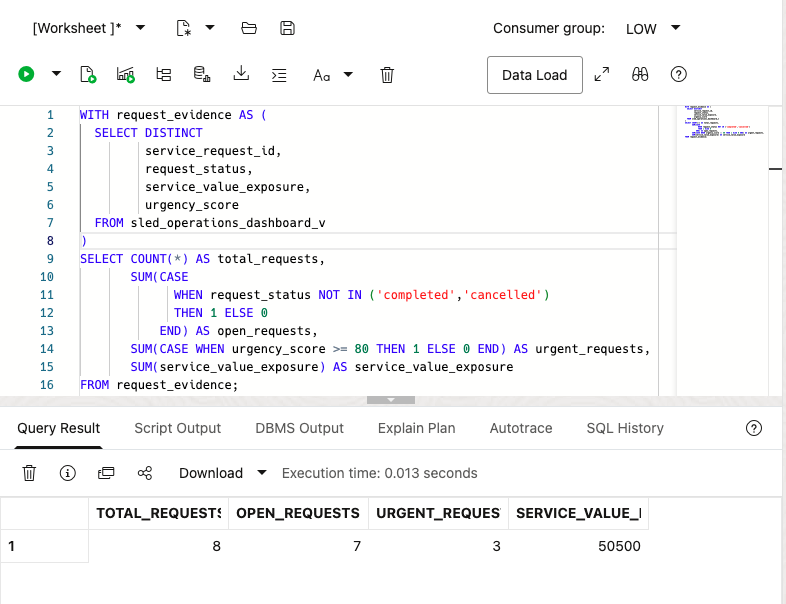
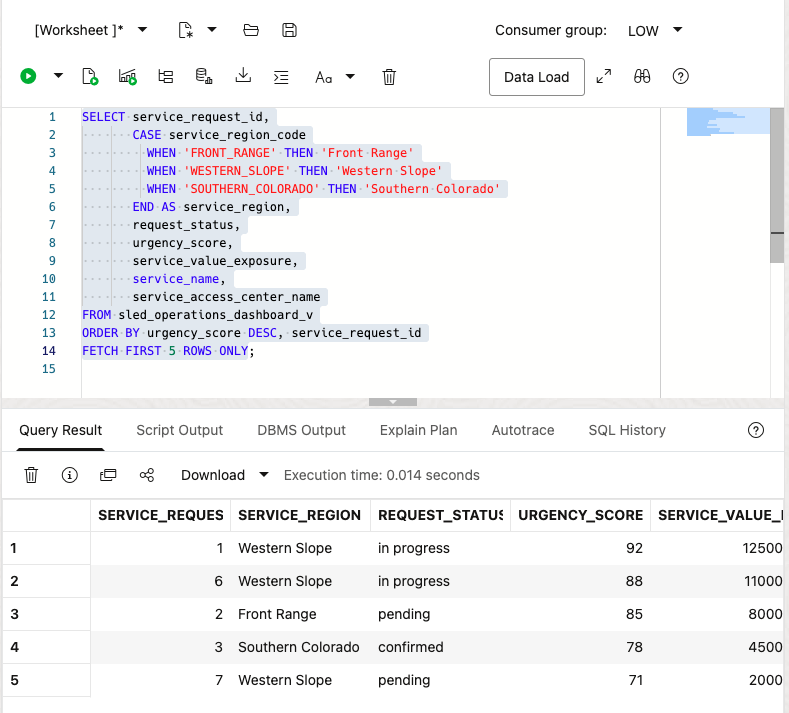

# Public Service Command Center

## Introduction

**Jessica**, the State Services Risk Analyst, begins with an early warning: the **Colorado Medicaid Eligibility Error Rate** is **2.7%**, approaching but still within the stakeholder-provided **3.0%** threshold. The measure tells Jessica to investigate, but it does not identify the requests, regions, or services that deserve attention first.

You support Jessica as the service operations analyst, while **Maya**, the Resident Services Operations Leader, prepares the follow-up response. In this lab, you recreate the database-backed operating measures around that warning and then drill into the request rows behind them. Application configuration supplies the eligibility rate, so the learner SQL does not claim to calculate it.

<details>
<summary><strong>Key terms: early warning, key performance indicator, urgency, and drill-through</strong></summary>

> - An **early warning** signals that operating margin is narrowing. It prompts investigation; it is not a legal finding or a declared failure.
>
> - A **key performance indicator (KPI)** summarizes an operating condition, such as open requests, urgent work, or service value exposure.
>
> - **Urgency** ranks requests and resident signals that may need attention sooner. High urgency still requires human review.
>
> - **Drill-through** moves from a summary measure to the business rows behind it. That link makes a dashboard result explainable.

</details>

The concept graphic shows the path from the command-center summary to SQL results the team can inspect.


The application page below gives Jessica a statewide operating view. Look for service pressure and request details around the eligibility warning. The full application uses a larger demonstration dataset, while the compact learner dataset keeps the SQL repeatable. The SQL explains the database-backed request measures, not the configured warning rate.


### Objectives

- Calculate request, urgency, and service-value measures that help Jessica understand the current workload.
- Drill from statewide summaries into business-readable request rows.
- Explain which command-center measures are database-backed and which measures come from application configuration.

Estimated Time: **10 minutes**

### Business Scenario

| Step | State and local government focus |
| --- | --- |
| Business Problem | Jessica needs to know where service pressure may narrow the operating margin for Colorado. |
| Technical Challenge | Dashboard summaries must lead to reviewable request and service rows. |
| Persona Focus | Jessica interprets the warning; Maya plans the service response; Jordan provides the database results behind it. |
| What You Will Do | Calculate request KPIs and inspect the highest-urgency work. |
| Database Capability | Converged SQL aggregates and drills through the same SLED semantic view. |
| Outcome | Jessica can prioritize review without treating a screenshot as the source of truth. |

**Persona focus:** You join Jessica, Maya, and Jordan as you connect statewide measures to named services, regions, and requests.

## Task 1: Calculate statewide operating measures

Jessica needs to understand the pressure behind the early warning before Maya can plan a response. Calculate the statewide KPI row now and inspect total requests, open work, urgent work, and service-value exposure; those measures show where the team should focus its review.

Start with one summary row so Jessica can see workload size, urgency, and service-value exposure before opening individual requests:

1. Run the KPI query to recreate the database-backed operating measures behind the command-center review:

    > **SQL Worksheet reminder:** Need a reminder on how to open and use SQL Worksheet? Return to [Getting Started Task 2: Open SQL Worksheet](/workshops/sandbox/index.html?lab=getting-started#Task2:OpenSQLWorksheet).

    `SLED_OPERATIONS_DASHBOARD_V` is a saved query that connects requests to residents, service centers, public services, programs, and resident signals. The common table expression keeps one row per service request before the outer query calculates statewide measures.

    ```sql
    <copy>
    WITH request_evidence AS (
      SELECT DISTINCT
             service_request_id,
             request_status,
             service_value_exposure,
             urgency_score
      FROM sled_operations_dashboard_v
    )
    SELECT COUNT(*) AS total_requests,
           SUM(CASE
                 WHEN request_status NOT IN ('completed','cancelled')
                 THEN 1 ELSE 0
               END) AS open_requests,
           SUM(CASE WHEN urgency_score >= 80 THEN 1 ELSE 0 END) AS urgent_requests,
           SUM(service_value_exposure) AS service_value_exposure
    FROM request_evidence;
    </copy>
    ```

    **Expected output: Statewide Request KPIs**

    

2. Interpret the measures.

    `Total Requests` establishes workload size. `Open Requests` shows work still moving through the lifecycle. `Urgent Requests` identifies rows with an urgency score of at least 80, and `Service Value Exposure` supplies a planning proxy for the public-service value tied to the requests.

    `Total Requests` establishes workload size. `Open Requests` shows work still moving through the lifecycle. `Urgent Requests` identifies rows with an **urgency score of at least 80**, and `Service Value Exposure` supplies a planning proxy for the public-service value tied to the requests.

    These measures do not explain why the eligibility rate is **2.7%**. They tell Jessica which operating details to review around that early warning.

## Task 2: Drill into the highest-urgency requests

The KPI row identifies pressure, but it cannot tell Jessica which service request needs attention first. Drill into the highest-urgency rows now and inspect the named service, region, center, and urgency score so Maya has a reviewable queue for the next conversation.

Move from the summary to named services, regions, and centers so the operating pressure becomes an actionable review queue.

1. Run the drill-through query to identify the highest-urgency requests and the service centers connected to them:

    The query uses the same semantic view as Task 1. `CASE` turns region codes into readable names, and `ORDER BY` places the highest-urgency requests first. Because the loader gives each sample request one primary service line, each request appears once.

    ```sql
    <copy>
    SELECT service_request_id,
           CASE service_region_code
             WHEN 'FRONT_RANGE' THEN 'Front Range'
             WHEN 'WESTERN_SLOPE' THEN 'Western Slope'
             WHEN 'SOUTHERN_COLORADO' THEN 'Southern Colorado'
           END AS service_region,
           request_status,
           urgency_score,
           service_value_exposure,
           service_name,
           service_access_center_name
    FROM sled_operations_dashboard_v
    ORDER BY urgency_score DESC, service_request_id
    FETCH FIRST 5 ROWS ONLY;
    </copy>
    ```

    **Expected output: Highest-Urgency Service Requests**

    

2. Review the rows as an operations queue.

    Jessica can now see which service, region, and access center sits behind each urgent request. The result supports a concrete next step: inspect one regional request, then compare its details with resident demand, partner, geography, and capacity information.

    The application view below highlights services under pressure. Use it to connect the SQL queue to the page Jessica reviews.

    

3. Consider dashboard performance.

    In production, indexes on request status, urgency, region, service ID, and center ID can support filters and joins. A materialized view may help when many users run the same statewide totals. This lab uses direct SQL so the calculation remains visible and traceable.

### What have I achieved when the lab ends?

You have connected the command-center summary to the specific service requests behind it. Jessica can turn a statewide measure into a short list of services and requests that deserve attention first, while Maya can use the same results to plan a service response.

## Acknowledgements

* **Author** - Pat Shepherd, Senior Principal Database Product Manager
* **Last Updated By/Date** - Oracle Database Product Management, September 2026
