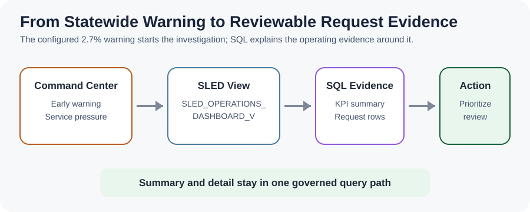
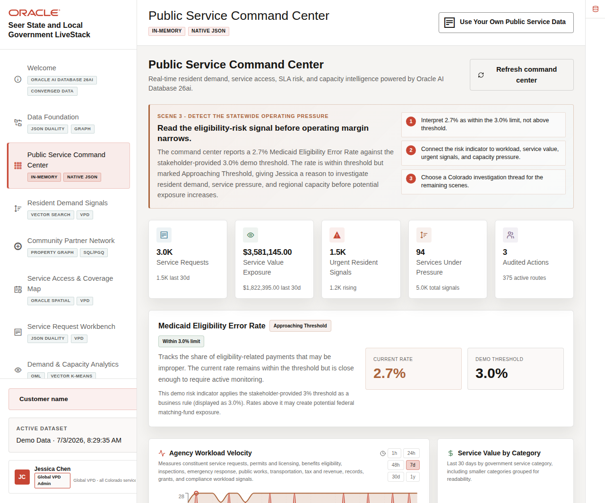
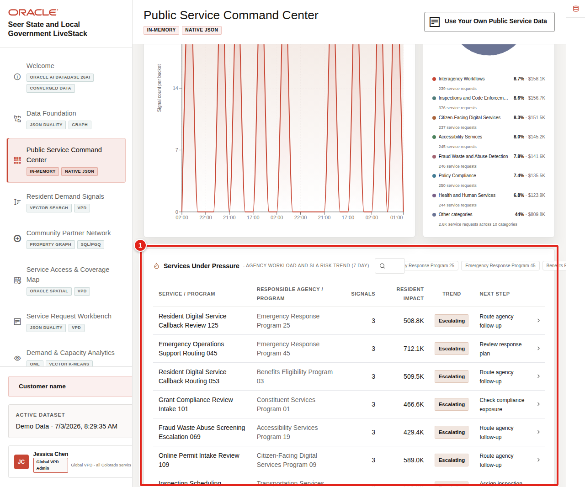

# Public Service Command Center

## Introduction

Jessica Chen begins with an early warning: the Colorado Medicaid Eligibility Error Rate is 2.7%, approaching but still within the stakeholder-provided 3.0% threshold. The measure tells Jessica to investigate, but it does not identify the requests, regions, or services that deserve attention first.

You are the service operations analyst supporting Jessica. In this lab, you recreate the database-backed operating measures around that warning and then drill into the request rows behind them. Application configuration supplies the eligibility rate, so the learner SQL does not claim to calculate it.

<details>
<summary><strong>Key terms: early warning, key performance indicator, urgency, and drill-through</strong></summary>

> - An **early warning** signals that operating margin is narrowing. It prompts investigation; it is not a legal finding or a declared failure.
>
> - A **key performance indicator (KPI)** summarizes an operating condition, such as open requests, urgent work, or service value exposure.
>
> - **Urgency** ranks requests and resident signals that may need attention sooner. High urgency still requires human review.
>
> - **Drill-through** moves from a summary measure to the business rows behind it. That link makes a dashboard result explainable.

</details>

The concept graphic shows the path from the command-center summary to reviewable SQL evidence.



The application page below gives Jessica a statewide operating view. Look for service pressure and request evidence around the eligibility warning. The SQL in this lab explains the database-backed request measures, not the configured warning rate.



### Objectives

- Calculate request, urgency, and service-value KPIs.
- Drill from summaries into business-readable request rows.
- Explain which dashboard measures are database-backed.

Estimated Time: **10 minutes**

### Business Scenario

| Step | State and local government focus |
| --- | --- |
| Business Problem | Jessica needs to know where service pressure may narrow the operating margin for Colorado. |
| Technical Challenge | Dashboard summaries must lead to reviewable request and service rows. |
| Persona Focus | A service operations analyst supports the statewide prioritization led by Jessica. |
| What You Will Do | Calculate request KPIs and inspect the highest-urgency work. |
| Database Capability | Converged SQL aggregates and drills through the same SLED semantic view. |
| Outcome | Jessica can prioritize review without treating a screenshot as the evidence source. |

**Persona focus:** You support Jessica by connecting statewide measures to named services, regions, and requests.

## Task 1: Calculate statewide operating measures

Start with one row that summarizes the current request workload.

1. Run the KPI query.

    > **SQL Worksheet reminder:** Need a reminder on how to open and use SQL Worksheet? Return to [Getting Started Task 2: Open SQL Worksheet](/workshops/sandbox/index.html?lab=getting-started#Task2:OpenSQLWorksheet).

    `SLED_OPERATIONS_DASHBOARD_V` is a saved query that connects requests to residents, service centers, public services, programs, and resident signals. The common table expression keeps one row per service request before the outer query calculates statewide measures.

    ```sql
    <copy>
    WITH request_evidence AS (
      SELECT DISTINCT
             service_request_id,
             request_status,
             service_value_exposure,
             urgency_score
      FROM sled_operations_dashboard_v
    )
    SELECT COUNT(*) AS total_requests,
           SUM(CASE
                 WHEN request_status NOT IN ('completed','cancelled')
                 THEN 1 ELSE 0
               END) AS open_requests,
           SUM(CASE WHEN urgency_score >= 80 THEN 1 ELSE 0 END) AS urgent_requests,
           SUM(service_value_exposure) AS service_value_exposure
    FROM request_evidence;
    </copy>
    ```

    **Expected output: Statewide Request KPIs**

    | Total Requests | Open Requests | Urgent Requests | Service Value Exposure |
    | --- | --- | --- | --- |
    | 8 | 7 | 3 | 50500 |

2. Interpret the measures.

    `Total Requests` establishes workload size. `Open Requests` shows work still moving through the lifecycle. `Urgent Requests` identifies rows with an urgency score of at least 80, and `Service Value Exposure` supplies a planning proxy for the public-service value tied to the requests.

    These measures do not prove why the eligibility rate is 2.7%. They tell Jessica which operating evidence to review around that early warning.

## Task 2: Drill into the highest-urgency requests

Move from the summary to named services, regions, and centers.

1. Run the drill-through query.

    The query uses the same semantic view as Task 1. `CASE` turns region codes into readable names, and `ORDER BY` places the highest-urgency requests first. Because the loader gives each sample request one primary service line, each request appears once.

    ```sql
    <copy>
    SELECT service_request_id,
           CASE service_region_code
             WHEN 'FRONT_RANGE' THEN 'Front Range'
             WHEN 'WESTERN_SLOPE' THEN 'Western Slope'
             WHEN 'SOUTHERN_COLORADO' THEN 'Southern Colorado'
           END AS service_region,
           request_status,
           urgency_score,
           service_value_exposure,
           service_name,
           service_access_center_name
    FROM sled_operations_dashboard_v
    ORDER BY urgency_score DESC, service_request_id
    FETCH FIRST 5 ROWS ONLY;
    </copy>
    ```

    **Expected output: Highest-Urgency Service Requests**

    | Service Request Id | Service Region | Request Status | Urgency Score | Service Value Exposure | Service Name | Service Access Center Name |
    | --- | --- | --- | --- | --- | --- | --- |
    | 1 | Western Slope | in progress | 92 | 12500 | Medicaid Eligibility Review | Grand Junction Regional Service Center |
    | 6 | Western Slope | in progress | 88 | 11000 | Housing Assistance Intake | Grand Junction Regional Service Center |
    | 2 | Front Range | pending | 85 | 8000 | Benefits Appointment Scheduling | Denver Human Services Hub |
    | 3 | Southern Colorado | confirmed | 78 | 4500 | Building Permit Inspection | Pueblo Community Access Center |
    | 7 | Western Slope | pending | 71 | 2000 | Senior Transportation | Grand Junction Regional Service Center |

2. Review the rows as an operations queue.

    Jessica can now see which service, region, and access center sits behind each urgent request. The result supports a concrete next step: inspect one regional request, then compare its details with resident demand, partner, geography, and capacity evidence.

    The application view below highlights services under pressure. Use it to connect the SQL queue to the page Jessica reviews.

    

3. Consider dashboard performance.

    In production, indexes on request status, urgency, region, service ID, and center ID can support filters and joins. A materialized view may help when many users run the same statewide totals. This lab uses direct SQL so the calculation remains visible and traceable.

## Acknowledgements

* **Author** - Oracle LiveLabs Team
* **Last Updated By/Date** - Oracle LiveLabs Team, August 2026
