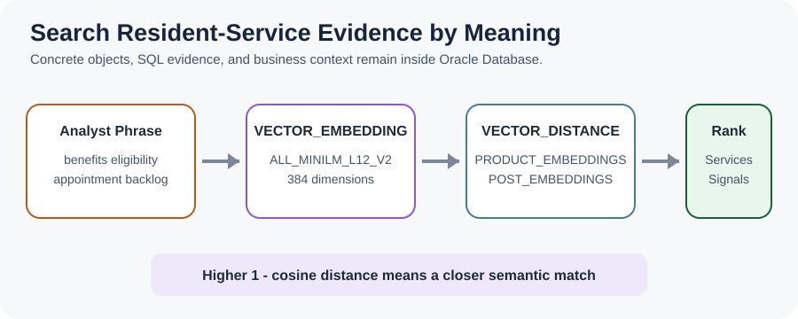
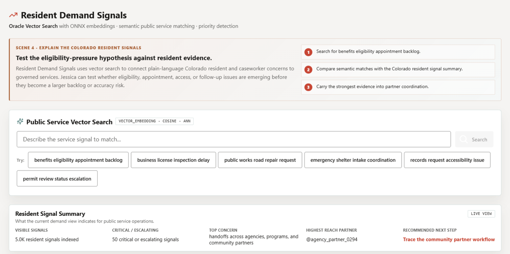

# Resident Demand Signals with AI Vector Search

## Introduction

Residents and caseworkers may describe the same service problem in different words. A search for benefits eligibility appointment backlog should find relevant services and signals even when the stored text says application review delay or caseworker scheduling.

You are the service intelligence analyst supporting **Jessica**. In this lab, you turn a plain-language concern into an embedding, compare it with stored vectors, and rank the closest public-service evidence.

<details>
<summary><strong>Key terms: embedding, vector, vector distance, and semantic search</strong></summary>

> - An **embedding** is a numerical representation of meaning. `VECTOR_EMBEDDING` creates one from the phrase entered by the analyst.
>
> - A **vector** stores that representation beside the service or resident signal it describes.
>
> - **Vector distance** measures how far two meanings are from each other. With cosine distance, a smaller distance means a closer match.
>
> - **Semantic search** ranks results by meaning rather than exact keywords. The expression `1 - VECTOR_DISTANCE(...)` converts distance into a similarity score, where a higher value is a closer match.

</details>

The concept graphic follows the query from plain-language concern to service action.



The **Resident Demand Signals** page gives the service intelligence analyst a plain-language vector search, a demand summary, and resident-signal evidence to review. The full application uses a larger demonstration dataset; the SQL in this lab reproduces the same meaning-based search pattern over compact deterministic workshop data.



### Objectives

- Search public services by meaning, not just by exact keyword match.
- Search resident signals with the same vector pattern.
- Interpret similarity as a ranking signal, not a final decision.

Estimated Time: **12 minutes**

### Business Scenario

| Step | State and local government focus |
| --- | --- |
| Business Problem | Residents and caseworkers use different language for related service pressure. |
| Technical Challenge | Analysts need semantic search without exporting governed text to another service. |
| Persona Focus | A service intelligence analyst supports the statewide investigation led by Jessica. |
| What You Will Do | Create a query embedding and compare it with stored service and signal vectors. |
| Database Capability | Oracle AI Vector Search stores vectors and runs similarity SQL in the database. |
| Outcome | Jessica receives a ranked review queue even when wording differs. |

**Persona focus:** You help Jessica connect an operating concern to relevant services and resident signals.

## Task 1: Search public services by meaning

Start with services so Jessica can translate a plain-language concern into the programs and service types most likely to need attention.

1. Run the semantic service query.

    > **SQL Worksheet reminder:** Need a reminder on how to open and use SQL Worksheet? Return to [Getting Started Task 2: Open SQL Worksheet](/workshops/sandbox/index.html?lab=getting-started#Task2:OpenSQLWorksheet).

    `PRODUCT_EMBEDDINGS` is an inherited physical table that stores vectors for public-service descriptions. `SLED_PUBLIC_SERVICES_V` supplies the learner-facing service names. The shared `ADMIN.ALL_MINILM_L12_V2` model embeds the search phrase inside the database.

    <details>
    <summary><strong>Why this matters: meaning stays connected to source rows</strong></summary>

    > Exporting service text to an external vector store creates another sensitive copy and another access-control boundary. Oracle AI Vector Search keeps the text, vectors, SQL, and public-service context together.

    </details>

    ```sql
    <copy>
    SELECT services.service_name,
           services.service_category,
           ROUND(1 - VECTOR_DISTANCE(
             embeddings.embedding,
             VECTOR_EMBEDDING(
               ADMIN.ALL_MINILM_L12_V2
               USING 'benefits eligibility appointment backlog' AS DATA
             ),
             COSINE
           ), 4) AS similarity
    FROM product_embeddings embeddings
    JOIN sled_public_services_v services
      ON services.service_id = embeddings.product_id
    ORDER BY similarity DESC
    FETCH FIRST 5 ROWS ONLY;
    </copy>
    ```

    **Expected output: Related Public Services**

    The rows below were validated with the workshop seed data and shared MiniLM model. Similarity decimals can vary slightly if the database model build changes.

    | Service Name | Service Category | Similarity |
    | --- | --- | --- |
    | Benefits Appointment Scheduling | Benefits and Health | 0.7087 |
    | Medicaid Eligibility Review | Benefits and Health | 0.5255 |
    | Housing Assistance Intake | Housing | 0.3726 |
    | Child Care Subsidy | Family Services | 0.3397 |
    | SNAP Application Support | Benefits and Health | 0.2958 |

2. Interpret the ranking.

    Similarity helps Jessica decide which service definitions to inspect first. It does not prove that a service caused the early warning. The ranking narrows the review queue while the source rows remain available for normal SQL analysis.

## Task 2: Search resident signals by meaning

Search resident signals next so Jessica can compare the service match with the concerns residents and caseworkers actually expressed.

1. Run the signal search.

    `POST_EMBEDDINGS` stores vectors for signal text, while `SLED_RESIDENT_SIGNALS_V` presents the source, urgency, and public-service wording. The query returns an excerpt so the analyst can read the evidence behind each score.

    ```sql
    <copy>
    SELECT signals.resident_signal_id,
           signals.source_channel,
           signals.urgency_band,
           SUBSTR(signals.signal_text, 1, 100) AS signal_excerpt,
           ROUND(1 - VECTOR_DISTANCE(
             embeddings.embedding,
             VECTOR_EMBEDDING(
               ADMIN.ALL_MINILM_L12_V2
               USING 'benefits eligibility appointment backlog' AS DATA
             ),
             COSINE
           ), 4) AS similarity
    FROM post_embeddings embeddings
    JOIN sled_resident_signals_v signals
      ON signals.resident_signal_id = embeddings.post_id
    ORDER BY similarity DESC, resident_signal_id
    FETCH FIRST 5 ROWS ONLY;
    </copy>
    ```

    **Expected output: Related Resident Signals**

    These results use the same validated query embedding as the service search. Close scores can shift slightly if the shared model build changes.

    | Resident Signal Id | Source Channel | Urgency Band | Signal Excerpt | Similarity |
    | --- | --- | --- | --- | --- |
    | 2 | resident portal | urgent | My benefits renewal is waiting for eligibility review and I cannot get an appointment. | 0.6767 |
    | 1 | caseworker | critical | Eligibility appointments are booking three weeks out in the Western Slope. | 0.5740 |
    | 6 | partner hotline | urgent | Housing intake and benefits reviews need a shared appointment plan. | 0.4537 |
    | 7 | caseworker | rising | Senior transportation requests are delaying scheduled eligibility visits. | 0.3980 |
    | 5 | partner hotline | steady | Emergency shelter referrals remain available across southern Colorado. | 0.2260 |

2. Compare meaning with urgency.

    A high similarity score means the text is close to the search intent. `Urgency Band` supplies a separate operating signal. Jessica should review both: meaning identifies relevance, while urgency helps prioritize the response.

    The SQL keeps the underlying text and scores reviewable, so a team can compare semantic relevance with urgency before acting.

3. 🎯 **Interactive challenge: Reframe the resident-service concern.**

    Starting with the resident-signal query above, replace the phrase `benefits eligibility appointment backlog` with `emergency shelter intake coordination` to investigate a different service concern. Run your revised query. Which returned row should enter Jessica's human review queue first when semantic relevance and urgency are considered together?

    **Expected output: Re-Ranked Resident Signals**

    Emergency-shelter, housing-intake, or partner-coordination evidence should move relative to the eligibility-focused baseline. Exact row order and similarity decimals are dynamic because they depend on the deployed embedding-model build.

    <details>
    <summary><strong>Challenge answer: Combine semantic relevance with urgency</strong></summary>

    > In the validated result, signal `5` is the closest semantic match, but its urgency band is `steady`. Signal `6` ranks second and is `urgent`, so it should enter Jessica's human review queue first when both signals are weighed together. This is a review priority, not an automatic action; exact rankings can change with the embedding-model build. Oracle AI Database 26ai keeps the source text, vectors, urgency evidence, and service context together, so teams can investigate without copying sensitive resident-service data into disconnected systems.

    If you need the runnable solution, use this query:

    ```sql
    <copy>
    SELECT signals.resident_signal_id,
           signals.source_channel,
           signals.urgency_band,
           SUBSTR(signals.signal_text, 1, 100) AS signal_excerpt,
           ROUND(1 - VECTOR_DISTANCE(
             embeddings.embedding,
             VECTOR_EMBEDDING(
               ADMIN.ALL_MINILM_L12_V2
               USING 'emergency shelter intake coordination' AS DATA
             ),
             COSINE
           ), 4) AS similarity
    FROM post_embeddings embeddings
    JOIN sled_resident_signals_v signals
      ON signals.resident_signal_id = embeddings.post_id
    ORDER BY similarity DESC, resident_signal_id
    FETCH FIRST 5 ROWS ONLY;
    </copy>
    ```

    </details>

## Acknowledgements

* **Author** - Oracle LiveLabs Team
* **Last Updated By/Date** - Oracle LiveLabs Team, August 2026
