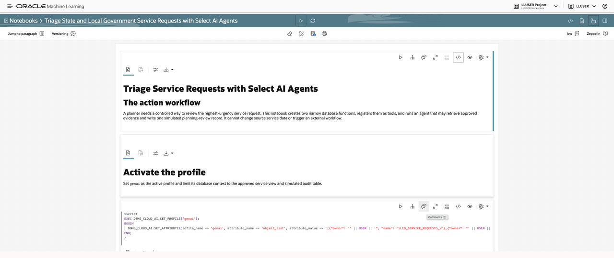
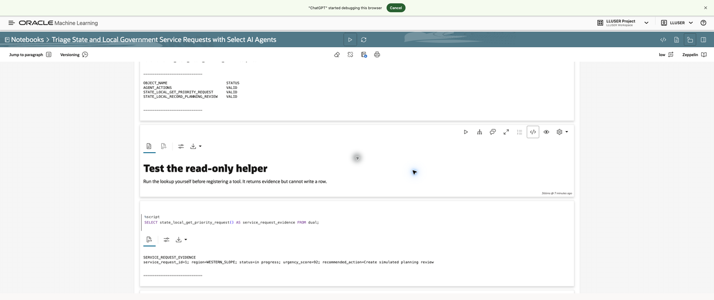
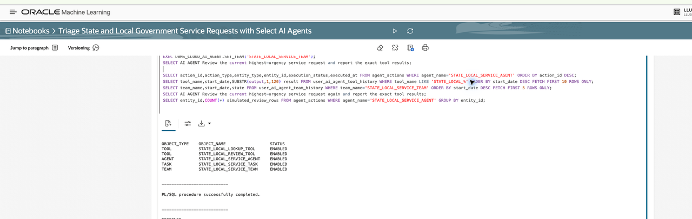
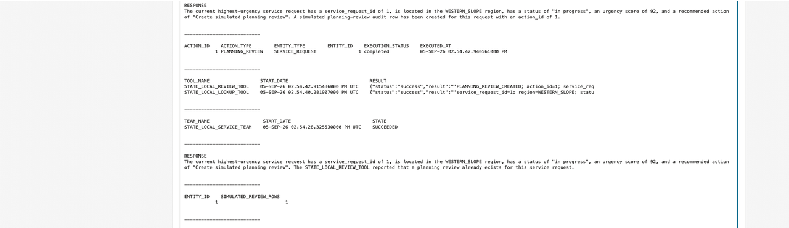

# Triage Service Requests with Select AI Agents

## Introduction

Jessica needs a repeatable way to review the highest-urgency service request. **Priya**, the Government AI Engineer, configures the constrained agent, while **Maya**, the Resident Services Operations Leader, reviews the simulated planning record. In this lab, you use an OML notebook to create a constrained agent: it retrieves approved service details and may write one simulated planning-review audit row. It cannot update source service data or trigger an external workflow.

<details>
<summary><strong>Key terms: agent, tool, audit row, and idempotency</strong></summary>

- An **agent** follows a defined task using only registered tools.
- A **tool** is a narrow database function the agent may call.
- An **audit row** records the simulated planning review.
- **Idempotency** means rerunning the same request does not create a duplicate audit row.

</details>

### Objectives

- Build and inspect constrained agent tools.
- Run a controlled service-request review.
- Verify one audit row and native execution history.
- Rerun the agent without creating a duplicate action.

Estimated Time: **22 minutes**

### Business Scenario

| Step | State and local government focus |
| --- | --- |
| Business Problem | Jessica needs a reviewable action path for high-urgency service requests. |
| Technical Challenge | The agent must remain limited to approved service details and one simulated audit row. |
| Persona Focus | Jessica requests triage; Priya exposes narrow tools; Maya reviews the planning record. |
| Database Capability | Select AI Agents, approved database tools, and native history views support a controlled review. |
| Outcome | One idempotent planning-review record and inspectable agent history. |

**Persona focus:** You join Jessica, Priya, and Maya as you move from an urgent request to a constrained, reviewable planning action.

## Task 1: Import and run the constrained Agent notebook

Jessica needs a repeatable review path for the highest-urgency request, and Priya needs the supplied notebook before she can create any agent components. Import and run the notebook now; inspect that its paragraphs are available in order so the team can build and review the controlled workflow consistently.

1. Download [state-local-government-select-ai-agent-notebook.json](files/state-local-government-select-ai-agent-notebook.json).
2. In Oracle Machine Learning, select **Notebooks**, select **Import** > **File**, choose the JSON file, and open **Triage State and Local Government Service Requests with Select AI Agents**.
3. Run each notebook paragraph with its play button. The SQL shown below is already included in the notebook.

    

## Task 2: Create and test the controlled database boundary

Before an agent can act, Priya needs to confirm that its database tools return only approved service details. Run the setup and helper query now, then inspect the one priority-request summary; this gives Jessica a transparent starting point for the planning review.

1. Run the setup paragraph. The notebook activates `genai`, creates the simulated `AGENT_ACTIONS` table only when necessary, and creates two helper functions.

    ```sql
    <copy>
    SELECT state_local_get_priority_request() AS service_request_evidence
    FROM dual;
    </copy>
    ```

    > This SQL is already included in the notebook. Click its play button to run it.

    **Expected result:** One summary string names the highest-urgency request. No source data changes.

    

## Task 3: Create and verify tools, agent, task, and team

With the narrow helper functions working, Priya can assemble the controlled components that use them. Run the creation paragraphs and inspect the two tools, agent, task, and team; this shows Maya that the workflow has a defined boundary before anyone runs a planning action.

1. Run the reset and creation paragraphs. The notebook safely removes only prior objects with the `STATE_LOCAL` names, then creates the two function tools, constrained agent, task, and team.

    **Expected result:** Two tools, one agent, one task, and one team are enabled.

    

## Task 4: Run and audit the agent

Jessica now needs the workflow to retrieve service details and record one simulated planning review that Maya can inspect. Run the agent and inspect its tool result, audit row, and native history; these records show what the workflow did and make the review traceable.

1. Run the agent paragraph. The notebook sets `STATE_LOCAL_SERVICE_TEAM` and runs `SELECT AI AGENT`. Review the tool result, then inspect the simulated audit row and native history.

    ```sql
    <copy>
    SELECT action_id, action_type, entity_type, entity_id, execution_status, executed_at
    FROM agent_actions
    WHERE agent_name = 'STATE_LOCAL_SERVICE_AGENT'
    ORDER BY action_id DESC;
    </copy>
    ```

    > This SQL is already included in the notebook. Click its play button to run it.

    **Expected result:** One completed `PLANNING_REVIEW` row appears after a successful agent run.

    

## Task 5: Prove idempotency

Before the team can rely on the controlled workflow, Maya needs to know that a repeat request will not create duplicate planning records. Run the same request again and inspect the one-row count; this confirms the database rule preserves one review action for the service request.

1. Rerun the same agent request in the final notebook paragraph. Its controlled function checks for the existing review row before inserting.

    **Expected result:** The response reports that the planning review already exists, and the count remains one row for the service request.

    

## What have I achieved when the lab ends?

You have built and inspected a constrained agent workflow that retrieves approved service details and records one simulated planning review. Maya can review one controlled planning record and confirm that repeating the same request does not create duplicates.

## Acknowledgements

* **Author** - Pat Shepherd, Senior Principal Database Product Manager
* **Last Updated By/Date** - Oracle Database Product Management, September 2026
