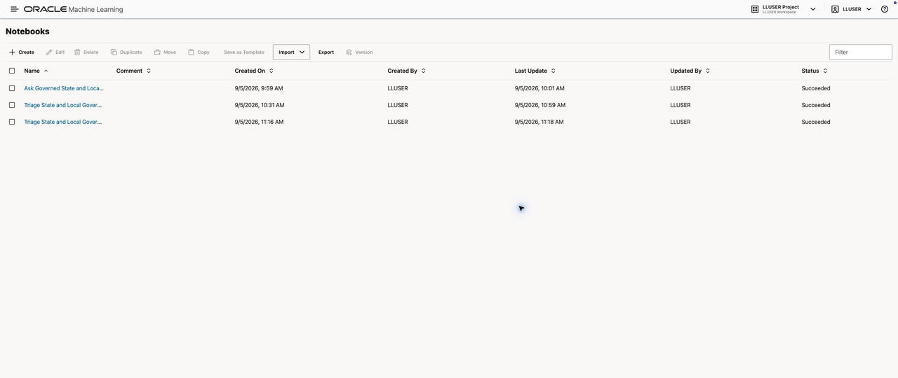
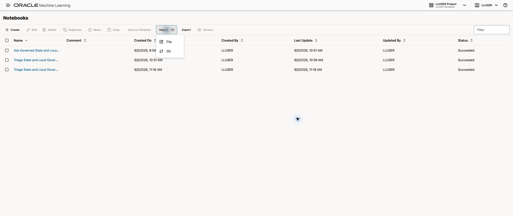
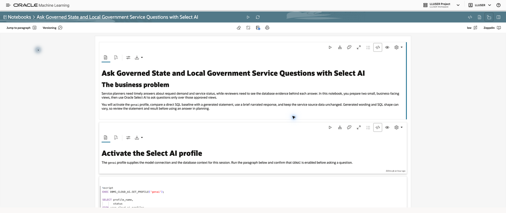
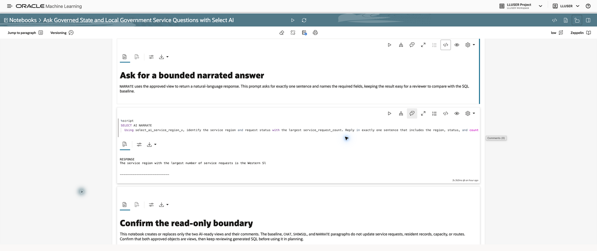
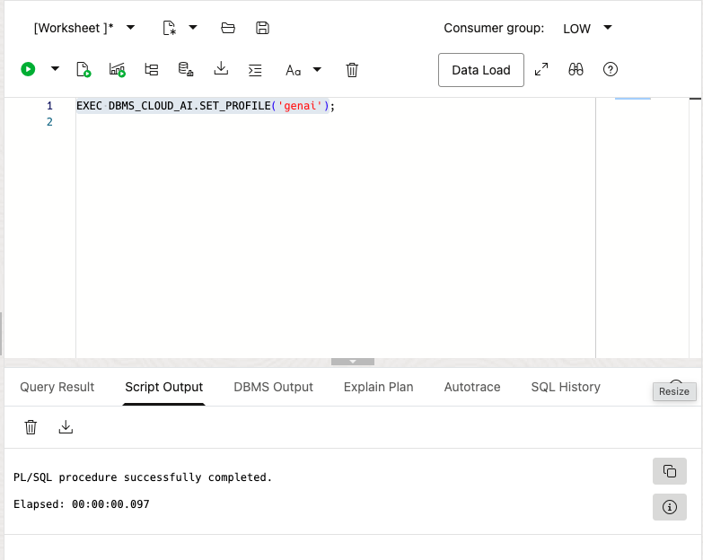

# Ask Governed State and Local Government Service Questions with Select AI

## Introduction

Service planners need timely answers about demand and request status, while reviewers need to see the SQL and database results behind each answer. **Jessica**, the State Services Risk Analyst, asks the questions, and **Priya**, the Government AI Engineer, prepares the approved Select AI context. In this lab, you run an Oracle Machine Learning notebook that prepares two approved service views and then uses Select AI to ask clear, reviewable questions.

Select AI can translate a natural-language request into SQL or a database-grounded response using the active `genai` profile. Generated wording and SQL shape can vary, so review the generated SQL and result before using an answer in planning.

<details>
<summary><strong>Key terms: Select AI, AI profile, CHAT, SHOWSQL, and NARRATE</strong></summary>

- **Select AI** uses an active profile to turn a natural-language question into SQL or a database-grounded response.
- An **AI profile** supplies the approved database context for the current session.
- **CHAT** explains a general concept; **SHOWSQL** reveals generated SQL before it runs; **NARRATE** summarizes approved database results.

</details>

### Objectives

- Import and run a State and Local Government Select AI notebook.
- Activate the `genai` profile and focus it on approved service views.
- Compare direct SQL results with `SHOWSQL` and a bounded `NARRATE` answer.
- Confirm the question path remains read-only for service source data.

Estimated Time: **18 minutes**

### Business Scenario

| Step | State and local government focus |
| --- | --- |
| Business Problem | Service planners need quick answers without losing the details behind them. |
| Technical Challenge | Natural-language questions must use approved objects and reviewable SQL. |
| Persona Focus | Jessica asks the service question; Priya controls the approved context and reviewable SQL. |
| What You Will Do | Prepare service views, inspect a SQL baseline, and ask governed questions. |
| Database Capability | Oracle Select AI, `DBMS_CLOUD_AI`, comments, approved views, and OML notebooks. |
| Outcome | Jessica receives a concise answer that remains connected to database results, while Priya keeps the question path governed. |

**Persona focus:** You join Jessica and Priya as you compare a natural-language question with the approved views, generated SQL, and database result.

## Task 1: Import the State and Local Government Select AI notebook

Jessica needs a repeatable, approved way to ask service questions before Priya can show any generated answer. Import the notebook now and inspect that it opens with the supplied paragraphs; this gives the team one guided path for preparing, checking, and comparing governed answers.

1. Download [state-local-government-select-ai-notebook.json](files/state-local-government-select-ai-notebook.json).

2. In Oracle Machine Learning, select **Notebooks**.

    

3. Select **Import** > **File**, then choose the downloaded JSON file.

    

4. Open **Ask Governed State and Local Government Service Questions with Select AI** from the Notebooks list.

    

5. Select **Run Paragraphs** and confirm the prompt. Run paragraphs in order if you prefer to inspect each result before continuing.

    

## Task 2: Activate the Select AI profile

Before a natural-language question can use approved service context, Priya needs to activate the profile that defines that boundary. Run the setup paragraph now and inspect the enabled `genai` profile; this confirms that the next questions use the intended database connection and context.

1. Run the first SQL paragraph to activate `genai` and confirm the profile is enabled. Select AI uses the active profile for the model connection and approved database context.

    ```sql
    <copy>
    EXEC DBMS_CLOUD_AI.SET_PROFILE('genai');
    </copy>
    ```

    > This SQL is already included in the notebook. Click its play button to run it.

    

**Expected result:** `GENAI` has status `ENABLED`.

## Task 3: Create AI-ready service views and comments

Priya now needs clear, limited business names for the service facts that Select AI may describe. Create the views and comments, then inspect that both views are valid; this gives Jessica a focused vocabulary for requests, demand, region, urgency, and value.

1. Run the next SQL paragraph to create `SELECT_AI_SERVICE_REGION_V` and `SELECT_AI_SERVICE_DEMAND_V`. Their clear business names and comments give Select AI a focused vocabulary for service requests, demand, region, urgency, and value.

    > The complete view and comment SQL is already included in the notebook. Click its play button to run it.

**Expected result:** Both objects are `VALID` views.

## Task 4: Set the approved object list and establish a SQL baseline

Before Jessica trusts a generated answer, the team needs a direct SQL result to compare with it. Set the approved object list and inspect the largest region-and-status groups now; this baseline gives Priya and Jessica a concrete result that later generated SQL and narration must match.

1. Run the object-list and baseline paragraphs. The notebook sets `genai` to the two AI-ready views, then returns the ten largest region-and-status request groups directly with SQL.

    ```sql
    <copy>
    SELECT service_region_code, request_status, service_request_count, average_urgency_score
    FROM select_ai_service_region_v
    ORDER BY service_request_count DESC, service_region_code, request_status
    FETCH FIRST 10 ROWS ONLY;
    </copy>
    ```

    > This SQL is already included in the notebook. Click its play button to run it.

**Expected result:** The object inventory lists two approved views, followed by a ranked service-request result.

## Task 5: Compare a general explanation with governed SQL

Jessica needs to see the difference between a general explanation and an answer grounded in the approved service views. Run `CHAT`, then inspect the generated statement from `SHOWSQL` before accepting it; this lets her and Priya review the exact SQL that Select AI proposes to run.

1. Run the `CHAT` paragraph for a one-sentence explanation of why planners compare request volume with urgency. Then run `SHOWSQL` and inspect the statement before trusting it.

    ```sql
    <copy>
    SELECT AI SHOWSQL
      Show service_region_code, request_status, service_request_count, and average_urgency_score from select_ai_service_region_v ordered by service_request_count descending;
    </copy>
    ```

    > This SQL is already included in the notebook. Click its play button to run it.

**Expected result:** `CHAT` provides general explanatory text. `SHOWSQL` returns a read-only `SELECT` over `SELECT_AI_SERVICE_REGION_V`; do not continue if the generated statement includes `INSERT`, `UPDATE`, `DELETE`, `MERGE`, or DDL.

## Task 6: Ask for a bounded narrated answer

Now that the direct baseline and generated SQL are visible, Jessica can ask for a short answer that is easy to verify. Run the bounded narration and inspect the region, status, and count in its response; this shows whether the plain-language answer agrees with the governed SQL result.

1. Run the `NARRATE` paragraph. Its prompt requests exactly one sentence containing the service region, request status, and largest request count, making the response easy to compare with the SQL baseline.

    ```sql
    <copy>
    SELECT AI NARRATE
      Using select_ai_service_region_v, identify the service region and request status with the largest service_request_count. Reply in exactly one sentence that includes the region, status, and count;
    </copy>
    ```

    > This SQL is already included in the notebook. Click its play button to run it.

**Expected result:** A single-sentence, database-grounded response. Its wording can vary.

## Task 7: Confirm the read-only question boundary

Before Maya uses the answer in a planning conversation, the team needs to confirm that asking the question did not alter source service data. Inspect the two valid views and the read-only notebook behavior now; this shows that Select AI improved access to information without changing the underlying requests.

1. Confirm both approved objects are `VALID` views. The notebook creates or replaces only those two views and their comments; the baseline, `CHAT`, `SHOWSQL`, and `NARRATE` paragraphs do not update source service data.

## What have I achieved when the lab ends?

You have prepared a limited service context, compared direct SQL with generated SQL, and checked a bounded narrated answer against the result. Jessica can ask a faster service question while Priya can show the approved views and SQL behind the answer.

## Acknowledgements

* **Author** - Pat Shepherd, Senior Principal Database Product Manager
* **Last Updated By/Date** - Oracle Database Product Management, September 2026
