# Service Access and Coverage Map with Oracle Spatial

## Introduction

**Maya**, the Resident Services Operations Leader, now asks whether regional service capacity is close enough to the residents and requests that need it. A useful response plan needs a reachable service location, an available center, and an authorized viewer who can see the supporting records.

You work with **Jordan**, the Database Administrator, as the regional operations planner supporting Maya. In this lab, you measure distance with **Oracle Spatial**, summarize capacity by Colorado service region, and connect the SQL results to governed statewide, regional, and restricted application views.

<details>
<summary><strong>Key terms: point, boundary, spatial reference system, distance, capacity, and Virtual Private Database</strong></summary>

> - A **point** stores a precise location. Residents and service centers use longitude and latitude points in this workshop.
>
> - A **boundary** stores an area, such as a public-service demand region.
>
> - A **spatial reference system** tells the database how coordinates map to the Earth. The sample data uses Spatial Reference System Identifier (SRID) 4326.
>
> - **Distance** measures separation between spatial objects. `SDO_GEOM.SDO_DISTANCE` returns a value in the requested unit.
>
> - **Capacity** is the available service workload a center can accept, not warehouse inventory.
>
> - **Oracle Virtual Private Database (VPD)** adds database-enforced row filtering from trusted application context. The screenshots show that application behavior; the learner worksheet does not establish a VPD identity.

</details>

The diagram connects resident and center points to distance, regional capacity, and an authorized planning decision.


The application map below shows Colorado service centers, demand regions, route layers, capacity, and the global VPD context used by Maya. The full application displays 31 centers; the compact learner dataset uses four centers so the SQL remains quick and deterministic. The SQL makes those geographic relationships measurable rather than relying on visual judgment.


### Objectives

- Calculate distance from a resident location to service access centers.
- Summarize available and reserved capacity by region.
- Distinguish spatial results from application-enforced VPD scope so learners do not treat a distance query as an authorization test.

Estimated Time: **10 minutes**

### Business Scenario

| Step | State and local government focus |
| --- | --- |
| Business Problem | Maya needs an accessible service location with enough capacity for regional work. |
| Technical Challenge | Location, capacity, request, and access-control details must remain connected. |
| Persona Focus | Maya evaluates coverage; Jordan provides distance and capacity results with spatial SQL. |
| What You Will Do | Measure point-to-point distance and aggregate capacity by region. |
| Database Capability | Oracle Spatial geometry and SQL calculations work with operational rows. |
| Outcome | Maya can compare geographic feasibility with service capacity. |

**Persona focus:** You join Maya and Jordan as you turn map locations and center capacity into SQL results the team can review.

## Task 1: Find service centers nearest to a resident

Maya needs a reachable service location before she can discuss a response for a resident. Calculate the nearest centers now and inspect the distance, center name, and available capacity; those rows show which options are practical enough for a capacity review.

Start with the resident's nearest service centers so Maya can connect the request to reachable support options.

1. Run the distance query.

    > **SQL Worksheet reminder:** Need a reminder on how to open and use SQL Worksheet? Return to [Getting Started Task 2: Open SQL Worksheet](/workshops/sandbox/index.html?lab=getting-started#Task2:OpenSQLWorksheet).

    `CUSTOMERS.LOCATION` and `FULFILLMENT_CENTERS.LOCATION` are `SDO_GEOMETRY` points. The SLED semantic views provide public-service names. `SDO_GEOM.SDO_DISTANCE` measures kilometers between each center and the location for Elena, and `SDO_UTIL.TO_GEOJSON` exposes the same center point in a map-friendly format.

    <details>
    <summary><strong>Why this matters: geography stays with operations data</strong></summary>

    > A separate mapping system would need copies of resident and center locations. Oracle Spatial lets teams measure distance while the location remains connected to requests, services, capacity, and database governance.

    </details>

    ```sql
    <copy>
    SELECT centers.service_access_center_name,
           centers.city,
           centers.service_access_center_type,
           ROUND(SDO_GEOM.SDO_DISTANCE(
             residents_base.location,
             centers_base.location,
             0.005,
             'unit=KM'
           ), 1) AS distance_km,
           SDO_UTIL.TO_GEOJSON(centers_base.location) AS center_geojson
    FROM sled_residents_v residents
    JOIN customers residents_base
      ON residents_base.customer_id = residents.resident_id
    CROSS JOIN sled_service_access_centers_v centers
    JOIN fulfillment_centers centers_base
      ON centers_base.center_id = centers.service_access_center_id
    WHERE residents.resident_display_name = 'Elena Garcia'
    ORDER BY distance_km;
    </copy>
    ```

    **Expected output: Nearest Colorado Service Centers**

    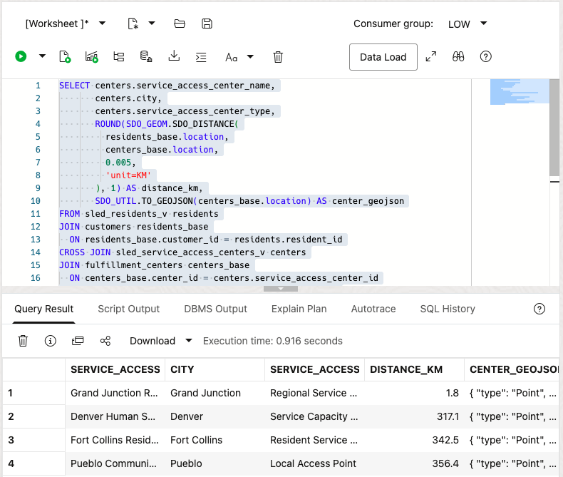

    These values were captured from the development ADB by using the fixed workshop coordinates and one-decimal geodesic rounding. GeoJSON whitespace can vary by client formatting, but the geometry type and coordinates remain the same.

2. Interpret the distance.

    Grand Junction is the nearest center for Elena, so Maya should review its available capacity first. Distance supports prioritization, but it does not decide work assignments by itself.

3. 🎯 **Interactive challenge: Recalculate access for another resident.**

    Starting with the distance query above, change the resident-name filter from `Elena Garcia` to `Maya Patel` to investigate service access from Pueblo. Run your revised query. Which service center should enter Maya's capacity review first?

    **Expected output: Maya Patel's Nearest Service Centers**

    Pueblo Community Access Center should rank first at approximately `1.1` kilometers. The remaining Colorado centers should follow at substantially greater distances. With the fixed workshop coordinates, one-decimal distances are stable; GeoJSON whitespace can vary by SQL client.

    <details>
    <summary><strong>Challenge answer: Review the nearest center before routing work</strong></summary>

    > Pueblo Community Access Center should enter the capacity review first because it is nearest to Maya Patel. Distance supports that priority, but Maya still needs capacity and authorization details before assigning work. Oracle AI Database keeps resident points, center locations, capacity, and operational records together, so teams can investigate without copying sensitive location data into disconnected systems.

    If you need the runnable solution, use this query:

    ```sql
    <copy>
    SELECT centers.service_access_center_name,
           centers.city,
           centers.service_access_center_type,
           ROUND(SDO_GEOM.SDO_DISTANCE(
             residents_base.location,
             centers_base.location,
             0.005,
             'unit=KM'
           ), 1) AS distance_km,
           SDO_UTIL.TO_GEOJSON(centers_base.location) AS center_geojson
    FROM sled_residents_v residents
    JOIN customers residents_base
      ON residents_base.customer_id = residents.resident_id
    CROSS JOIN sled_service_access_centers_v centers
    JOIN fulfillment_centers centers_base
      ON centers_base.center_id = centers.service_access_center_id
    WHERE residents.resident_display_name = 'Maya Patel'
    ORDER BY distance_km;
    </copy>
    ```

    </details>

## Task 2: Compare regional service capacity

Distance alone is not enough, because the nearest center may not have room to take more work. Compare regional capacity now and inspect available work, reserved work, and utilization; Maya can use those totals to decide whether a region can absorb demand or needs a different plan.

Compare regional service capacity so the distance result sits beside the workload Maya can realistically route or rebalance.

1. Run the capacity query.

    `SLED_SERVICE_CAPACITY_V` translates inherited inventory columns into public-service capacity. The query joins capacity to center regions, totals available and reserved work, and reports the highest center utilization in each region.

    ```sql
    <copy>
    SELECT CASE centers.service_region_code
             WHEN 'FRONT_RANGE' THEN 'Front Range'
             WHEN 'WESTERN_SLOPE' THEN 'Western Slope'
             WHEN 'SOUTHERN_COLORADO' THEN 'Southern Colorado'
           END AS service_region,
           SUM(capacity.available_capacity) AS available_capacity,
           SUM(capacity.reserved_capacity) AS reserved_capacity,
           MAX(centers.utilization_pct) AS highest_center_utilization_pct
    FROM sled_service_capacity_v capacity
    JOIN sled_service_access_centers_v centers
      ON centers.service_access_center_id =
         capacity.service_access_center_id
    GROUP BY centers.service_region_code
    ORDER BY highest_center_utilization_pct DESC;
    </copy>
    ```

    **Expected output: Regional Capacity Summary**

    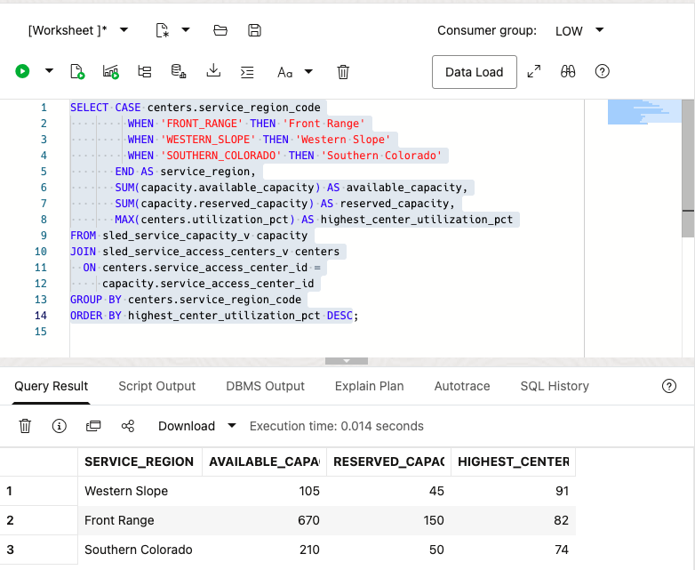

2. Connect capacity to the service decision.

    The Western Slope has the smallest available-capacity total and the highest center utilization. That combination supports a closer review of scheduling, partner handoffs, or workload rebalancing. It does not prove that capacity caused the eligibility warning.

## Task 3: Understand governed application views

Before using the map in an operations discussion, Maya needs to understand what the application shows and what SQL Worksheet does not prove. Compare the regional and restricted views now and inspect which rows are visible in each; this keeps the spatial results separate from the application's authorization behavior.

Review the application screenshots as governed views of the same operational results, not as SQL Worksheet proof of VPD behavior.

1. Compare the current regional and restricted screenshots.

    

    

2. Keep the validation boundary clear.

    These screenshots document current application behavior. This SQL Worksheet session does not set the trusted application context, so this lab does not claim that the learner query validates VPD. Spatial results and VPD work together in the application, but they are separate checks.

## Task 4: Build a Western Slope service access project in Spatial Studio

The SQL results give Maya exact distance and capacity measurements, and a map makes the coverage discussion easier to share with an operations team. Build the Western Slope project now and inspect the demand boundary, service centers, and filtered region together; this gives Maya a visual companion to the repeatable SQL review.

Use Spatial Studio when a map makes location and coverage easier to discuss with an operations team. The project in this task uses the same database-backed `SDO_GEOMETRY` columns as the SQL above: `DEMAND_REGIONS.BOUNDARY` supplies the regional boundary and `FULFILLMENT_CENTERS.LOCATION` supplies center points. The map complements the repeatable SQL distance calculation; it does not replace it.

1. Return to the **Database Actions Launchpad**. Under **Development**, select **Spatial Studio** and click **Open**. If prompted, sign in as `LLUSER`.

    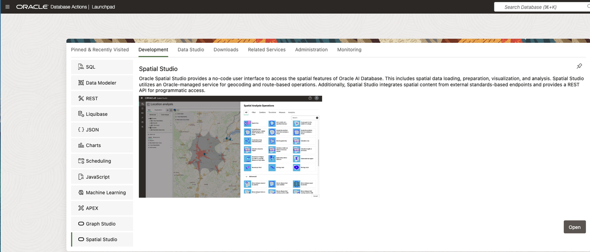

    Spatial Studio opens on the **Projects** page. This is where you can create, reopen, and save map projects backed by your database objects.

    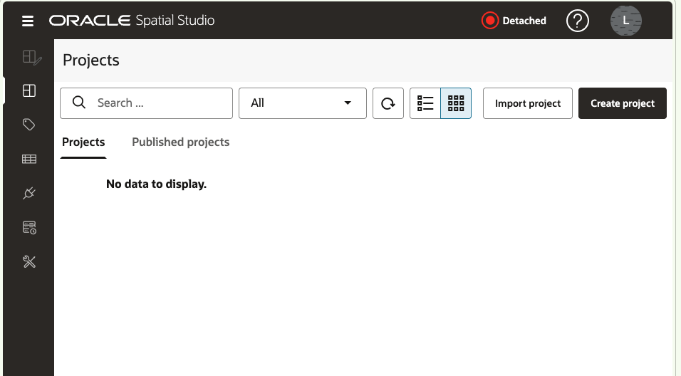

2. Select **Datasets** in the left navigation, then click **Create dataset**. Choose **Database table/view**, keep `DEFAULT_CONNECTION`, and click **Create**.

    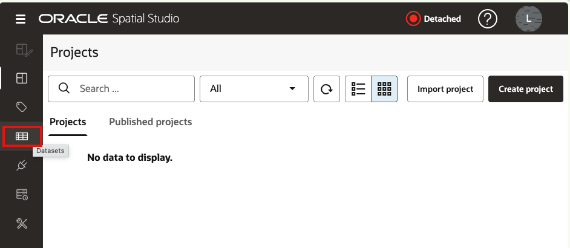

    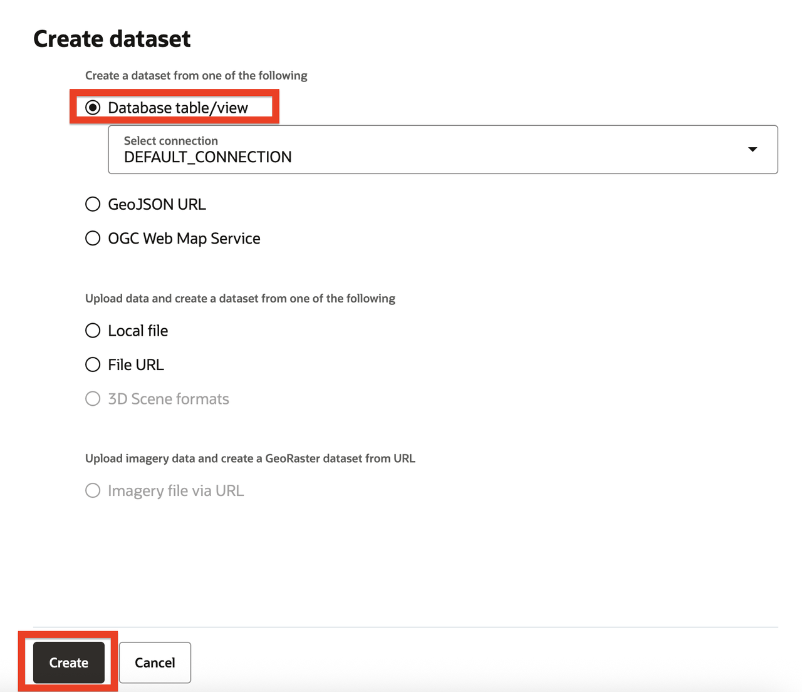

3. Expand `DEFAULT_CONNECTION`, then expand **Tables**.

4. Select `DEMAND_REGIONS`, then click **OK**. Spatial Studio confirms that the dataset was created.

5. Repeat Steps 2 through 4 for `FULFILLMENT_CENTERS`.

    `DEMAND_REGIONS` appears as a boundary layer because it uses `BOUNDARY`. `FULFILLMENT_CENTERS` appears as a point layer because it uses `LOCATION`. The two datasets remain backed by the database tables; creating a dataset does not export a separate copy of the spatial data.

    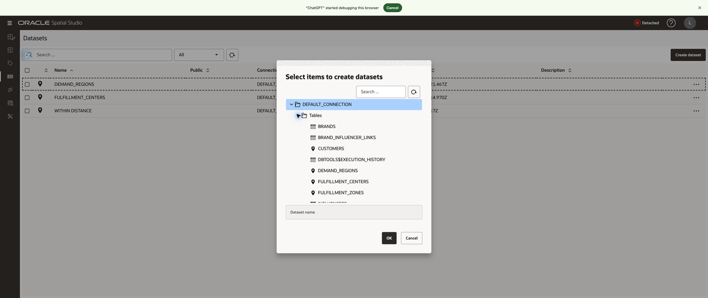

    **Zoom in:** Use the tree in this order: `DEFAULT_CONNECTION`, **Tables**, then the named table. The red frames mark the two table names and the **OK** button.

    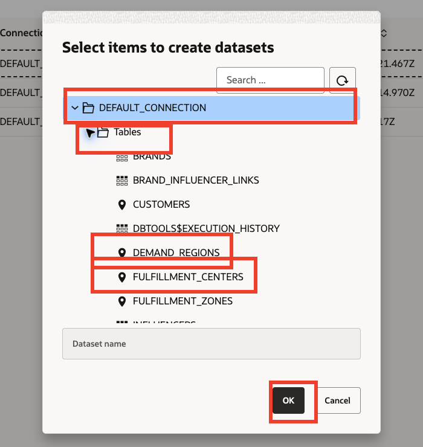

6. In the Datasets list, open the context menu for `DEMAND_REGIONS`, then select **Create project**. Spatial Studio opens an untitled project with the demand-region dataset already available in the project tree.

7. In the project, click **Add dataset**. Select `FULFILLMENT_CENTERS`, then click **OK**.

8. In the left-side project tree, open the context menu for `DEMAND_REGIONS`, then select **Add to current visualization**.

9. Repeat the previous step for `FULFILLMENT_CENTERS`. Spatial Studio adds the regional boundaries and service-center points to the map.

    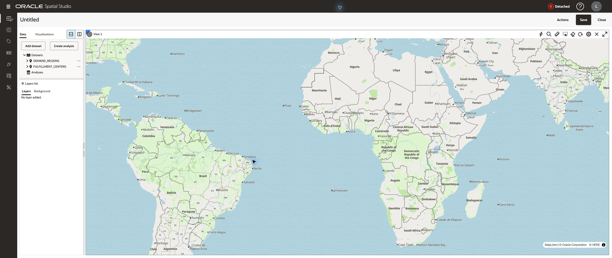

10. In the **Layers** list, open the `DEMAND_REGIONS` context menu and select **Settings**. In **Configure**, choose **Filter**, then configure and apply this filter:

    - Column: `REGION_NAME`
    - Operator: `=`
    - Value: `Western Slope`

    This focuses the map on the region Maya is reviewing instead of displaying every demand region at once.

    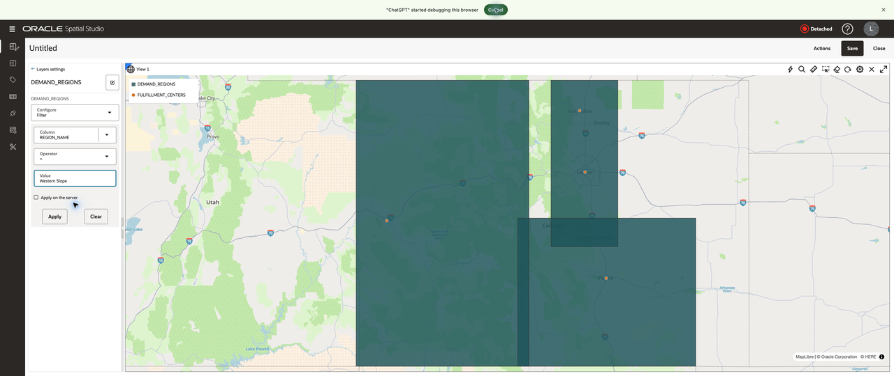

    **Zoom in:** The required controls are **Configure: Filter**, `REGION_NAME`, `Western Slope`, and **Apply**. Leave **Apply on the server** clear for this small workshop dataset.

    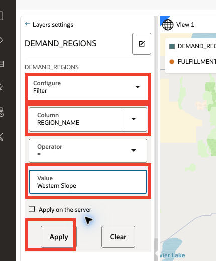

    After you apply the filter, the map retains the Western Slope boundary and the center context around it.

    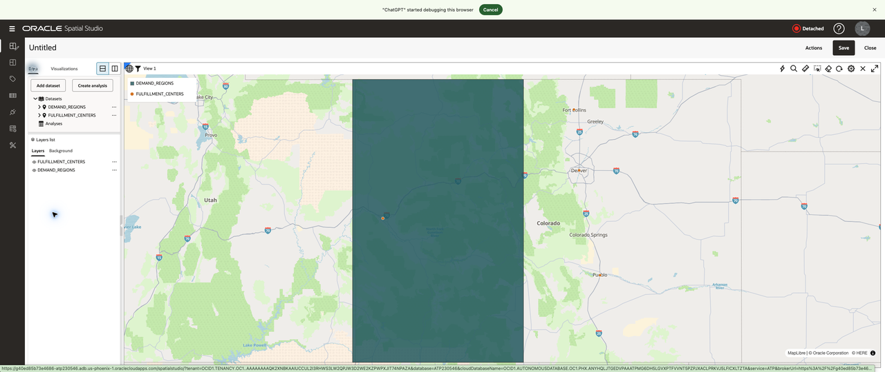

11. Click **Create analysis**, then select **Return shapes within a specified distance of another**. Configure the analysis as follows:

    - **Layer to be filtered:** `FULFILLMENT_CENTERS.LOCATION`
    - **Layer to be used as the filter:** `DEMAND_REGIONS.BOUNDARY`
    - **Distance:** `250000`
    - **Unit:** `Meter`

    Rename the analysis to `Centers within 250,000 meters of Western Slope`, then click **Run**. This returns the service-center points that fall within 250 kilometers of the filtered Western Slope boundary. A confirmation that Spatial Studio is gathering full statistics in the background is informational; the analysis result is already available for the next step.

    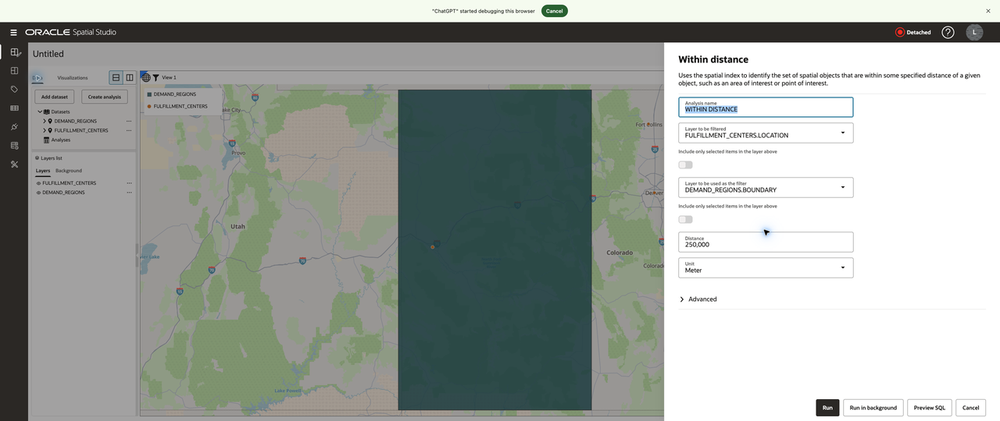

    **Zoom in:** Check both layer fields before running. The service-center point layer is the layer to filter; the demand-region boundary is the layer used as the filter. Then enter `250000` and click **Run**.

    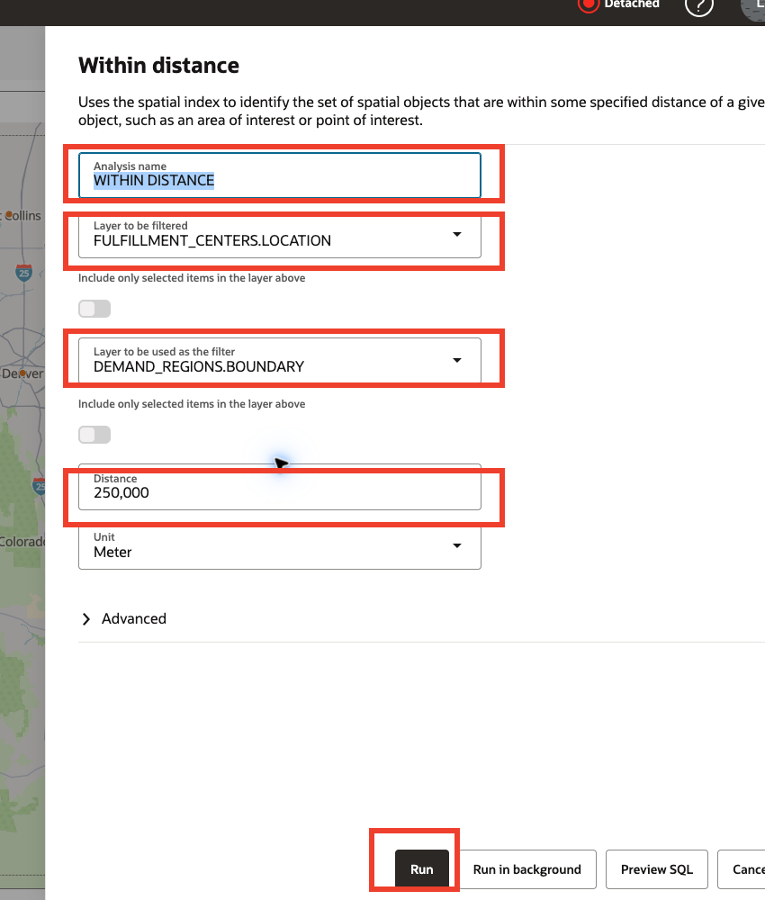

12. In the analysis context menu, choose **Add to current visualization**. The new teal result layer appears in the legend alongside the original orange `FULFILLMENT_CENTERS` layer. Hide the original layer if needed so the nearby-center result is easy to distinguish from the complete center layer.

    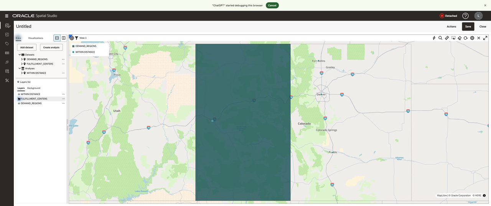

13. Open the analysis result layer's context menu, select **Settings**, and set **Configure** to **Interaction**. Turn on **Show info window**. In **Available columns**, select each column and use **Add info columns** to add it to **Columns to show**:

    - `CENTER_NAME`
    - `CITY`
    - `STATE_PROVINCE`

    This lets a planner select a result point and see the name and location of the service access center without leaving the map.

    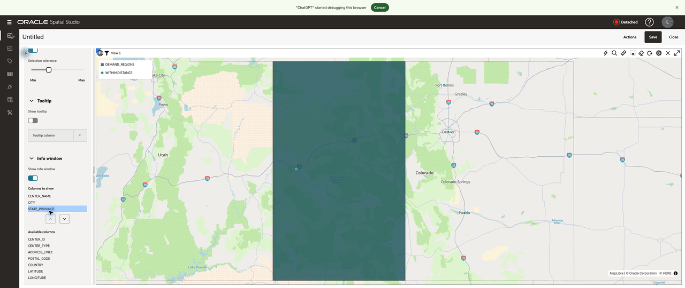

14. Click **Save**. Name the project `Western Slope Service Access Coverage` and add an optional description such as `Service center coverage within 250 kilometers of the Western Slope demand region.`

    Confirm that the project title changes to **Western Slope Service Access Coverage** and that Spatial Studio displays the saved-project confirmation. The saved project preserves the dataset layers, Western Slope filter, analysis result, and information-window configuration for later review.

    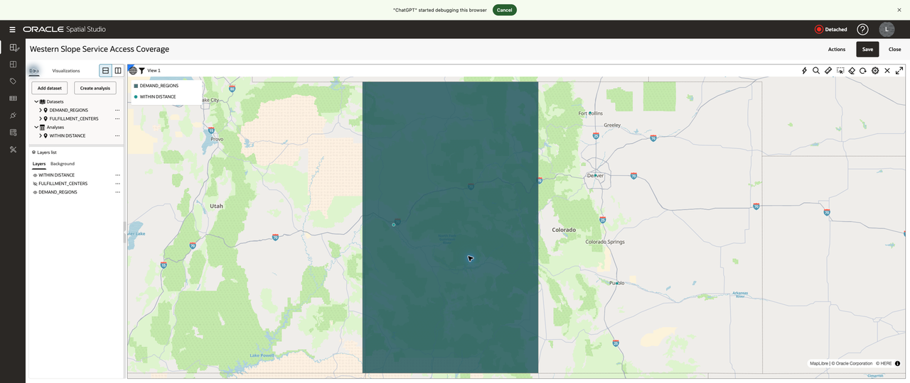

## Business Outcome

You created a map-based coverage view that links a regional demand boundary to nearby service access centers. Maya can use this view to start a capacity and service-availability conversation, then use the SQL results from this lab for exact, repeatable distance measurements.

Oracle Spatial keeps the points, boundaries, analysis, and operational rows in the same governed database foundation. That helps teams avoid maintaining separate copies of resident, center, and regional location data in disconnected mapping tools.

### What have I achieved when the lab ends?

You have connected resident location, service-center distance, regional capacity, and governed application views. Maya can weigh travel distance and regional capacity together before discussing where service support may be practical.

## Acknowledgements

* **Author** - Pat Shepherd, Senior Principal Database Product Manager
* **Last Updated By/Date** - Oracle Database Product Management, September 2026
