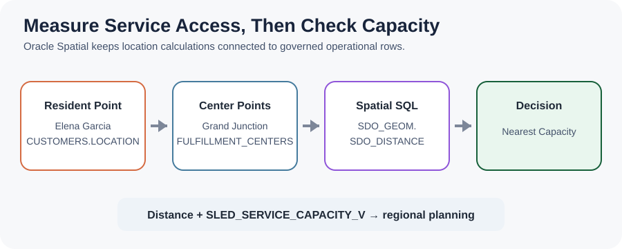
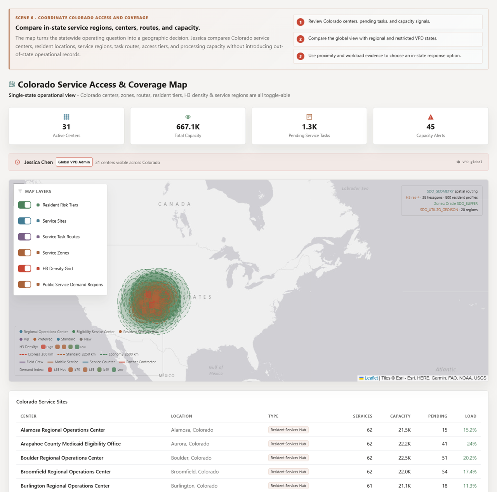
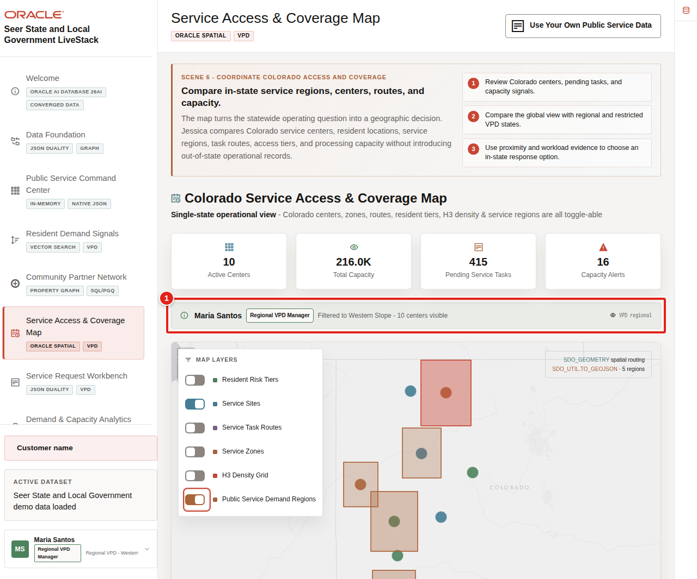

# Service Access and Coverage Map with Oracle Spatial

## Introduction

**Maria Santos** now asks whether regional service capacity is close enough to the residents and requests that need it. A useful response plan needs a reachable service location, an available center, and an authorized viewer who can see the supporting records.

You are the regional operations planner supporting **Maria**. In this lab, you measure distance with **Oracle Spatial**, summarize capacity by Colorado service region, and connect the SQL evidence to governed statewide, regional, and restricted application views.

<details>
<summary><strong>Key terms: point, boundary, spatial reference system, distance, capacity, and Virtual Private Database</strong></summary>

> - A **point** stores a precise location. Residents and service centers use longitude and latitude points in this workshop.
>
> - A **boundary** stores an area, such as a public-service demand region.
>
> - A **spatial reference system** tells the database how coordinates map to the Earth. The sample data uses Spatial Reference System Identifier (SRID) 4326.
>
> - **Distance** measures separation between spatial objects. `SDO_GEOM.SDO_DISTANCE` returns a value in the requested unit.
>
> - **Capacity** is the available service workload a center can accept, not warehouse inventory.
>
> - **Oracle Virtual Private Database (VPD)** adds database-enforced row filtering from trusted application context. The screenshots show that application behavior; the learner worksheet does not establish a VPD identity.

</details>

The diagram connects resident and center points to distance, regional capacity, and an authorized planning decision.



The application map below shows Colorado service centers, demand regions, route layers, capacity, and the global VPD context used by Jessica. The full application displays 31 centers; the compact learner dataset uses four centers so the SQL remains quick and deterministic. The SQL makes those geographic relationships measurable rather than relying on visual judgment.



### Objectives

- Calculate distance from a resident location to service access centers.
- Summarize available and reserved capacity by region.
- Distinguish spatial evidence from application-enforced VPD scope so learners do not treat a distance query as an authorization test.

Estimated Time: **10 minutes**

### Business Scenario

| Step | State and local government focus |
| --- | --- |
| Business Problem | Maria needs an accessible service location with enough capacity for regional work. |
| Technical Challenge | Location, capacity, request, and access-control evidence must remain connected. |
| Persona Focus | A regional operations planner supports the Western Slope decision led by Maria. |
| What You Will Do | Measure point-to-point distance and aggregate capacity by region. |
| Database Capability | Oracle Spatial geometry and SQL calculations work with operational rows. |
| Outcome | Maria can compare geographic feasibility with service capacity. |

**Persona focus:** You support Maria by turning map locations and center capacity into reviewable SQL evidence.

## Task 1: Find service centers nearest to a resident

Start with the resident's nearest service centers so Maria can connect the request to reachable support options.

1. Run the distance query.

    > **SQL Worksheet reminder:** Need a reminder on how to open and use SQL Worksheet? Return to [Getting Started Task 2: Open SQL Worksheet](/workshops/sandbox/index.html?lab=getting-started#Task2:OpenSQLWorksheet).

    `CUSTOMERS.LOCATION` and `FULFILLMENT_CENTERS.LOCATION` are `SDO_GEOMETRY` points. The SLED semantic views provide public-service names. `SDO_GEOM.SDO_DISTANCE` measures kilometers between each center and the location for Elena, and `SDO_UTIL.TO_GEOJSON` exposes the same center point in a map-friendly format.

    <details>
    <summary><strong>Why this matters: geography stays with operations data</strong></summary>

    > A separate mapping system would need copies of resident and center locations. Oracle Spatial lets teams measure distance while the location remains connected to requests, services, capacity, and database governance.

    </details>

    ```sql
    <copy>
    SELECT centers.service_access_center_name,
           centers.city,
           centers.service_access_center_type,
           ROUND(SDO_GEOM.SDO_DISTANCE(
             residents_base.location,
             centers_base.location,
             0.005,
             'unit=KM'
           ), 1) AS distance_km,
           SDO_UTIL.TO_GEOJSON(centers_base.location) AS center_geojson
    FROM sled_residents_v residents
    JOIN customers residents_base
      ON residents_base.customer_id = residents.resident_id
    CROSS JOIN sled_service_access_centers_v centers
    JOIN fulfillment_centers centers_base
      ON centers_base.center_id = centers.service_access_center_id
    WHERE residents.resident_display_name = 'Elena Garcia'
    ORDER BY distance_km;
    </copy>
    ```

    **Expected output: Nearest Colorado Service Centers**

    | Service Access Center Name | City | Service Access Center Type | Distance Km | Center Geojson |
    | --- | --- | --- | --- | --- |
    | Grand Junction Regional Service Center | Grand Junction | Regional Service Hub | 1.8 | `{ "type": "Point", "coordinates": [-108.5506, 39.0639] }` |
    | Denver Human Services Hub | Denver | Service Capacity Center | 317.1 | `{ "type": "Point", "coordinates": [-104.9903, 39.7392] }` |
    | Fort Collins Resident Service Center | Fort Collins | Resident Service Counter | 342.5 | `{ "type": "Point", "coordinates": [-105.0844, 40.5853] }` |
    | Pueblo Community Access Center | Pueblo | Local Access Point | 356.4 | `{ "type": "Point", "coordinates": [-104.6091, 38.2544] }` |

    These values were captured from the development ADB by using the fixed workshop coordinates and one-decimal geodesic rounding. GeoJSON whitespace can vary by client formatting, but the geometry type and coordinates remain the same.

2. Interpret the distance.

    Grand Junction is the nearest center for Elena, so Maria should review its available capacity first. Distance supports prioritization, but it does not decide work assignments by itself.

## Task 2: Compare regional service capacity

Compare regional service capacity so the distance result sits beside the workload Maria can realistically route or rebalance.

1. Run the capacity query.

    `SLED_SERVICE_CAPACITY_V` translates inherited inventory columns into public-service capacity. The query joins capacity to center regions, totals available and reserved work, and reports the highest center utilization in each region.

    ```sql
    <copy>
    SELECT CASE centers.service_region_code
             WHEN 'FRONT_RANGE' THEN 'Front Range'
             WHEN 'WESTERN_SLOPE' THEN 'Western Slope'
             WHEN 'SOUTHERN_COLORADO' THEN 'Southern Colorado'
           END AS service_region,
           SUM(capacity.available_capacity) AS available_capacity,
           SUM(capacity.reserved_capacity) AS reserved_capacity,
           MAX(centers.utilization_pct) AS highest_center_utilization_pct
    FROM sled_service_capacity_v capacity
    JOIN sled_service_access_centers_v centers
      ON centers.service_access_center_id =
         capacity.service_access_center_id
    GROUP BY centers.service_region_code
    ORDER BY highest_center_utilization_pct DESC;
    </copy>
    ```

    **Expected output: Regional Capacity Summary**

    | Service Region | Available Capacity | Reserved Capacity | Highest Center Utilization Pct |
    | --- | --- | --- | --- |
    | Western Slope | 105 | 45 | 91 |
    | Front Range | 670 | 150 | 82 |
    | Southern Colorado | 210 | 50 | 74 |

2. Connect capacity to the service decision.

    The Western Slope has the smallest available-capacity total and the highest center utilization. That combination supports a closer review of scheduling, partner handoffs, or workload rebalancing. It does not prove that capacity caused the eligibility warning.

## Task 3: Understand governed application views

Review the application screenshots as governed views of the same operational evidence, not as SQL Worksheet proof of VPD behavior.

1. Compare the current regional and restricted screenshots.

    

    

2. Keep the validation boundary clear.

    These screenshots document current application behavior. This SQL Worksheet session does not set the trusted application context, so this lab does not claim that the learner query validates VPD. Spatial evidence and VPD work together in the application, but they are separate checks.

## Acknowledgements

* **Author** - Oracle LiveLabs Team
* **Last Updated By/Date** - Oracle LiveLabs Team, August 2026
