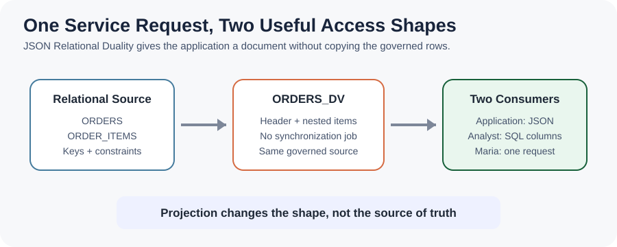
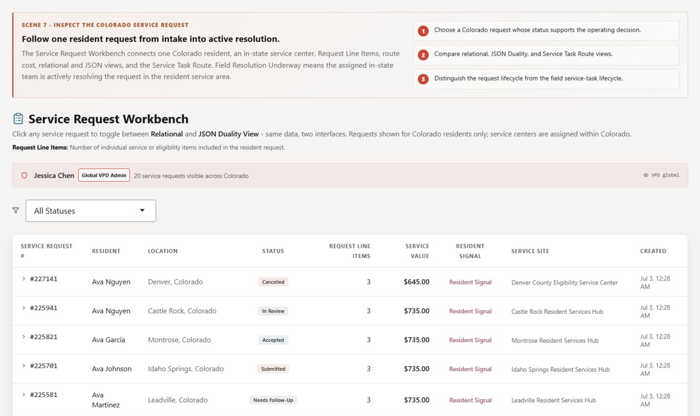
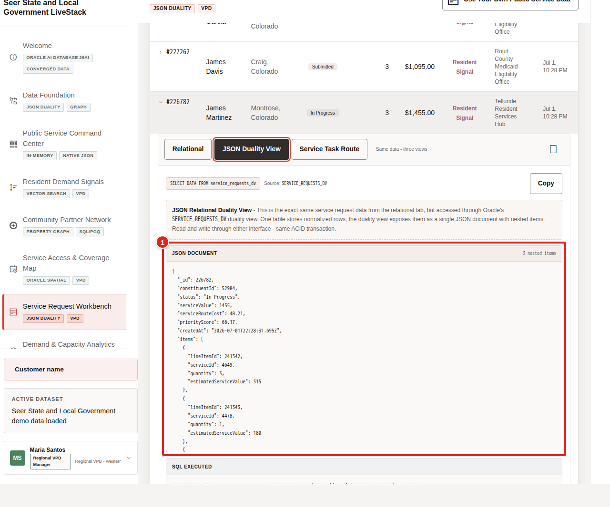
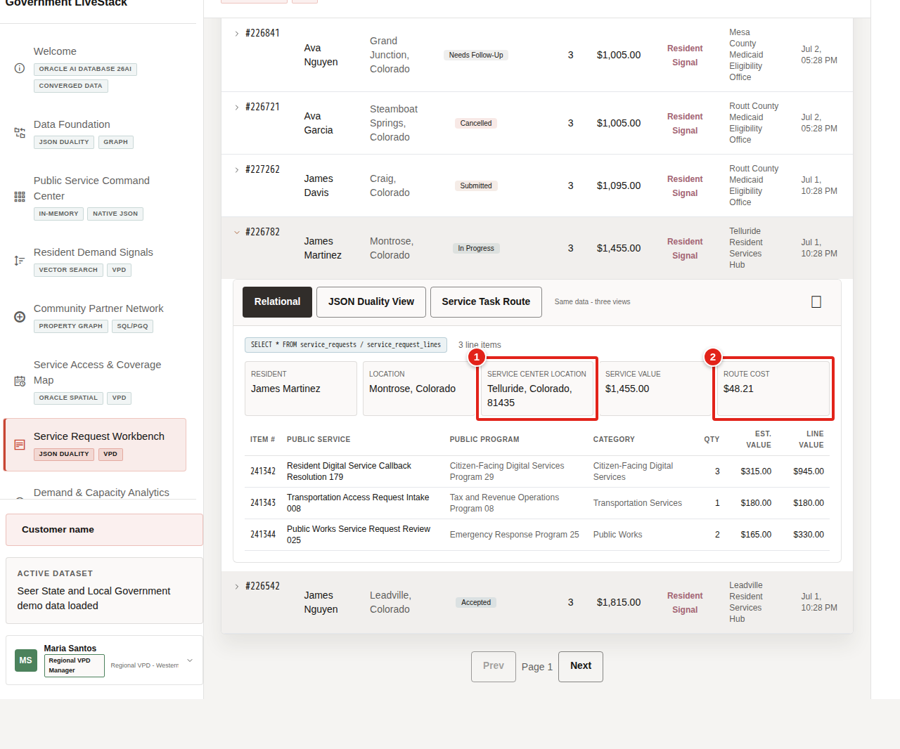

# Service Request Workbench with JSON Relational Duality

## Introduction

After the **Command Center** review, **Maria Santos** needs one complete service request that applications and analysts can use without maintaining separate copies. The application wants a document with a request header and nested service lines, while operations teams need governed relational rows for filtering, joins, and review.

You are the application and database developer supporting **Maria**. In this lab, you read an existing request document, expand the document contract to accept inserts, create and update a reserved workshop request through JSON, and verify the same changes in relational rows.

<details>
<summary><strong>Key terms: JSON, relational tables, duality view, projection, and transaction</strong></summary>

> - **JSON** carries a complete request payload, including a header and nested service lines.
>
> - **Relational tables** store requests and line items as governed rows with keys, constraints, and joinable columns.
>
> - A **JSON Relational Duality view** maps relational rows into an application-friendly JSON document without creating a separate document copy.
>
> - **Projection** extracts document fields as SQL columns, so analysts can filter and join data that an application consumes as JSON.
>
> - A **transaction** groups a database change and its commit. The explicit commits in this lab make the application-style insert and update durable in the temporary workshop schema.

</details>

The diagram shows how `ORDERS_DV` presents one relational request and its line items as a JSON document.



The Service Request Workbench image below gives Maria a relational queue of residents, statuses, service value, assigned sites, and request-line counts. Selecting a request lets the application switch between relational details and the JSON document shape. The full application shows more requests than the compact learner dataset, but both use the same pattern.



The inherited physical name `ORDERS_DV` remains in the current stack. The application displays the business alias `SERVICE_REQUESTS_DV`, while learner SQL uses the physical `ORDERS_DV` view.



### Objectives

- Read a request as one JSON document with nested service lines.
- Inspect and expand the document-write capabilities of `ORDERS_DV`.
- Insert and update a reserved JSON request, then verify the relational rows.
- Project document fields into SQL and join governed resident and service context.
- Explain how JSON Relational Duality avoids another copy of sensitive service data.

Estimated Time: **18 minutes**

### Business Scenario

| Step | State and local government focus |
| --- | --- |
| Business Problem | Maria needs one request record that applications and analysts can both create, update, and review. |
| Technical Challenge | Teams need JSON writes without duplicating requests or weakening relational controls. |
| Persona Focus | Application and database developers support Maria's regional request review. |
| What You Will Do | Read, enable, insert, update, verify, and project a document through `ORDERS_DV`. |
| Database Capability | JSON Relational Duality and SQL/JSON provide document and relational access over the same governed rows. |
| Outcome | One JSON insert creates root and child rows, and one JSON status update changes the root while preserving service-line evidence. |

**Persona focus:** You are the developer showing Maria that an application document contract can preserve relational keys, joins, and governance.

## Task 1: Inspect a document-shaped service request

Start with the request as the application consumes it so the document shape is clear before you change its write contract.

1. Run the document query.

    > **SQL Worksheet reminder:** Need a reminder on how to open and use SQL Worksheet? Return to [Getting Started Task 2: Open SQL Worksheet](/workshops/sandbox/index.html?lab=getting-started#Task2:OpenSQLWorksheet).

    `ORDERS_DV` assembles the header from `ORDERS` and the nested `items` array from `ORDER_ITEMS`. `JSON_SERIALIZE(... PRETTY)` formats the document for review.

    <details>
    <summary><strong>Why this matters: no synchronization gap</strong></summary>

    > A separate document database would require another request copy, security model, and synchronization process. A duality view gives the application a document while the relational source remains authoritative.

    </details>

    ```sql
    <copy>
    SELECT JSON_SERIALIZE(data PRETTY) AS service_request_document
    FROM orders_dv
    WHERE JSON_VALUE(data, '$._id' RETURNING NUMBER) = 1;
    </copy>
    ```

    **Expected output: Service Request Document**

    Oracle Database adds generated `_metadata` values such as an etag and as-of token. Those values can change. Focus on the validated business portion.

    | Service Request Document |
    | --- |
    | { "\_id" : 1, "customerId" : 1, "status" : "processing", "total" : 12500, "routingCost" : 120, "urgencyScore" : 92, "createdAt" : "2026-06-18T08:00:00", "items" : [ { "itemId" : 1, "productId" : 1, "quantity" : 1, "serviceValue" : 12500 } ] } |

2. Review the document shape.

    Root fields describe the request, and the nested `items` array describes its service lines. Maria can review one complete payload while keys and constraints remain in the relational source.

    

## Task 2: Enable document inserts and updates

The loader-created `ORDERS_DV` allows updates to existing documents but does not allow an application to insert a new request document. Inspect that baseline before expanding the contract.

1. Check the current document capabilities.

    `USER_JSON_DUALITY_VIEWS` reports which operations a duality view permits. Look for update enabled and insert and delete disabled.

    ```sql
    <copy>
    SELECT view_name,
           allow_insert,
           allow_update,
           allow_delete
    FROM user_json_duality_views
    WHERE view_name = 'ORDERS_DV';
    </copy>
    ```

    **Expected output: Baseline Document Capabilities**

    | View Name | Allow Insert | Allow Update | Allow Delete |
    | --- | --- | --- | --- |
    | ORDERS\_DV | false | true | false |

2. Enable inserts and updates for the root request and nested service lines.

    The two `WITH INSERT UPDATE` clauses expand the API contract while Oracle Database continues to enforce relational keys and data types. The mapping exposes the service and assigned-center foreign keys required by the child row.

    ```sql
    <copy>
    CREATE OR REPLACE JSON RELATIONAL DUALITY VIEW orders_dv AS
    SELECT JSON {
      '_id' : o.order_id,
      'customerId' : o.customer_id,
      'status' : o.order_status,
      'total' : o.order_total,
      'routingCost' : o.shipping_cost,
      'serviceCenterId' : o.fulfillment_center_id,
      'urgencyScore' : o.demand_score,
      'serviceRegion' : o.service_region_code,
      'createdAt' : o.created_at,
      'updatedAt' : o.updated_at,
      'items' : [
        SELECT JSON {
          'itemId' : oi.item_id,
          'productId' : oi.product_id,
          'quantity' : oi.quantity,
          'serviceValue' : oi.unit_price,
          'lineServiceValue' : oi.line_total,
          'serviceCenterId' : oi.fulfilled_from,
          'serviceRegion' : oi.service_region_code
        }
        FROM order_items oi WITH INSERT UPDATE
        WHERE oi.order_id = o.order_id
      ]
    }
    FROM orders o WITH INSERT UPDATE;
    </copy>
    ```

    **Expected output: Document Contract Updated**

    Oracle confirms that the duality view was created or replaced.

3. Run the capability query again.

    Delete remains disabled because this exercise does not require document deletion.

    ```sql
    <copy>
    SELECT view_name,
           allow_insert,
           allow_update,
           allow_delete
    FROM user_json_duality_views
    WHERE view_name = 'ORDERS_DV';
    </copy>
    ```

    **Expected output: Document Capabilities Enabled**

    | View Name | Allow Insert | Allow Update | Allow Delete |
    | --- | --- | --- | --- |
    | ORDERS\_DV | true | true | false |

## Task 3: Create and update a JSON service request

The reserved identifiers in this task are outside the seed-data range. The committed rows remain for the current workshop reservation and disappear when the environment is rebuilt. The guard prevents a duplicate insert, but a repeated run preserves the latest committed status.

1. Insert the reserved application document.

    Request `900001` uses an existing resident, service, and center, so its foreign keys remain valid. On a fresh workshop schema, the request begins as `pending`.

    ```sql
    <copy>
    INSERT INTO orders_dv (data)
    SELECT JSON(
      '{
        "_id": 900001,
        "customerId": 2,
        "status": "pending",
        "total": 8000,
        "routingCost": 80,
        "serviceCenterId": 1,
        "urgencyScore": 83,
        "serviceRegion": "FRONT_RANGE",
        "createdAt": "2026-06-21T10:00:00",
        "updatedAt": "2026-06-21T10:00:00",
        "items": [
          {
            "itemId": 990001,
            "productId": 3,
            "quantity": 1,
            "serviceValue": 8000,
            "lineServiceValue": 8000,
            "serviceCenterId": 1,
            "serviceRegion": "FRONT_RANGE"
          }
        ]
      }'
    )
    FROM dual
    WHERE NOT EXISTS (
      SELECT 1
      FROM orders
      WHERE order_id = 900001
    );
    </copy>
    ```

    **Expected output: Service Request Document Created**

    On the first run, Oracle inserts one document. Later runs insert zero rows because the reserved request exists.

2. Highlight and run this standalone commit.

    This transaction boundary makes the document and its relational rows durable.

    ```sql
    <copy>
    COMMIT;
    </copy>
    ```

    **Expected output: Insert Committed**

    Oracle confirms that the commit completed.

3. Retrieve the JSON write as relational evidence.

    This query joins root and child tables to governed resident, service, and center views. One document insert should produce one request row and one line-item row.

    ```sql
    <copy>
    SELECT o.order_id AS service_request_id,
           o.order_status AS physical_request_status,
           residents.resident_display_name,
           oi.item_id AS service_request_line_id,
           services.service_name,
           oi.quantity AS requested_quantity,
           oi.unit_price AS service_value_proxy,
           oi.line_total AS line_service_value,
           centers.service_access_center_name
    FROM orders o
    JOIN sled_residents_v residents
      ON residents.resident_id = o.customer_id
    JOIN order_items oi
      ON oi.order_id = o.order_id
    JOIN sled_public_services_v services
      ON services.service_id = oi.product_id
    JOIN sled_service_access_centers_v centers
      ON centers.service_access_center_id = oi.fulfilled_from
    WHERE o.order_id = 900001;
    </copy>
    ```

    **Expected output: Created Request Rows**

    | Request Id | Status | Resident | Line Id | Service | Quantity | Service Value | Line Value | Center |
    | --- | --- | --- | --- | --- | --- | --- | --- | --- |
    | 900001 | pending | Jordan Lee | 990001 | Benefits Appointment Scheduling | 1 | 8000 | 8000 | Denver Human Services Hub |

4. Update only the document status.

    `JSON_TRANSFORM` changes the application-facing `status` field. Oracle Database writes the matching `ORDERS.ORDER_STATUS` value without application-side parsing or synchronization.

    ```sql
    <copy>
    UPDATE orders_dv
    SET data = JSON_TRANSFORM(
      data,
      SET '$.status' = 'processing'
    )
    WHERE JSON_VALUE(data, '$._id' RETURNING NUMBER) = 900001;
    </copy>
    ```

    **Expected output: Document Status Updated**

    Oracle updates one document.

5. Highlight and run the second standalone commit.

    This commit makes the status update durable before verification.

    ```sql
    <copy>
    COMMIT;
    </copy>
    ```

    **Expected output: Update Committed**

    Oracle confirms that the commit completed.

6. 🎯 **Interactive challenge: Predict the relational effect.**

    Before opening the answer, decide which root-table status values should change and which child service-line values should remain unchanged. Use the verification query in the answer only if you need it.

    **Expected output: Changed Root and Unchanged Service Line**

    The physical status should become `processing`, the public-service status should become `in progress`, and the line ID, service, quantity, and values should remain unchanged.

    <details>
    <summary><strong>Challenge answer: one document, one governed request</strong></summary>

    > `ORDERS.ORDER_STATUS` changes because the JSON update targets only `status`. The nested `ORDER_ITEMS` evidence remains unchanged. Oracle AI Database 26ai keeps the application document, relational request, service line, and public-service context together instead of synchronizing sensitive records across disconnected systems.

    If you need the runnable solution, use this query:

    ```sql
    <copy>
    SELECT o.order_id AS service_request_id,
           o.order_status AS physical_request_status,
           requests.request_status,
           oi.item_id AS service_request_line_id,
           services.service_name,
           oi.quantity AS requested_quantity,
           oi.unit_price AS service_value_proxy,
           oi.line_total AS line_service_value
    FROM orders o
    JOIN sled_service_requests_v requests
      ON requests.service_request_id = o.order_id
    JOIN order_items oi
      ON oi.order_id = o.order_id
    JOIN sled_public_services_v services
      ON services.service_id = oi.product_id
    WHERE o.order_id = 900001;
    </copy>
    ```

    **Expected result:** request `900001` has physical status `processing` and public status `in progress`; line `990001`, Benefits Appointment Scheduling, quantity `1`, and both `8000` values are unchanged.

    </details>

## Task 4: Project document fields into SQL

Project the learner-created document into SQL columns and join it to governed resident and service context.

1. Run the projection query.

    `JSON_VALUE` extracts the request, status, resident, and first service identifier. The joins return business-readable names from SLED semantic views.

    ```sql
    <copy>
    SELECT JSON_VALUE(
             od.data, '$._id' RETURNING NUMBER
           ) AS service_request_id,
           JSON_VALUE(od.data, '$.status') AS document_status,
           residents.resident_display_name,
           services.service_name
    FROM orders_dv od
    JOIN sled_residents_v residents
      ON residents.resident_id =
         JSON_VALUE(od.data, '$.customerId' RETURNING NUMBER)
    JOIN sled_public_services_v services
      ON services.service_id =
         JSON_VALUE(
           od.data, '$.items[0].productId' RETURNING NUMBER
         )
    WHERE JSON_VALUE(
            od.data, '$._id' RETURNING NUMBER
          ) = 900001;
    </copy>
    ```

    **Expected output: Projected Learner-Created Request**

    | Request Id | Document Status | Resident | Service |
    | --- | --- | --- | --- |
    | 900001 | processing | Jordan Lee | Benefits Appointment Scheduling |

2. Connect the two access shapes.

    The application inserted and updated one nested document. Maria can immediately review the same root and child evidence with SQL and public-service views. No copied document store, reconciliation process, or second security model is required.

## Next Steps

Congratulations on completing the JSON Relational Duality lab. You expanded a JSON API contract, created and updated a service request as a document, and inspected the same governed data as relational rows. For a deeper hands-on workshop, open the [JSON Relational Duality LiveLabs workshop](https://livelabs.oracle.com/ords/r/dbpm/livelabs/view-workshop?clear=RR,180&wid=3797).

## Acknowledgements

* **Author** - Oracle LiveLabs Team
* **Last Updated By/Date** - Oracle LiveLabs Team, August 2026
