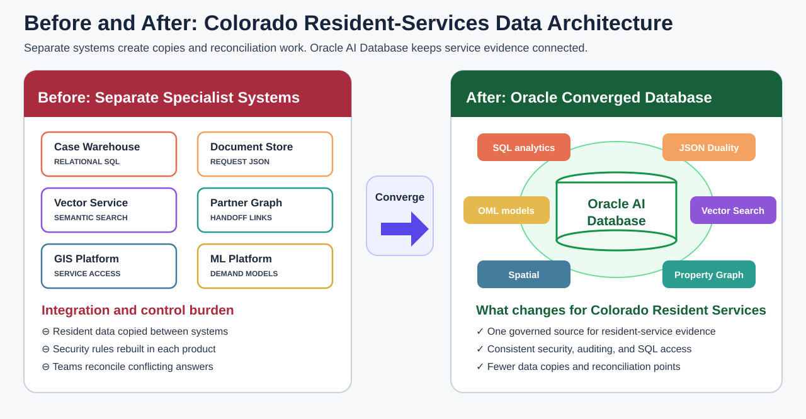

# Data Foundation

## Introduction

Before Jessica Chen acts on the Colorado early warning, she needs to know that service programs, resident requests, demand signals, partner relationships, geographic layers, and predictive models use one governed evidence base.

You are the database developer supporting Jessica. In this lab, you inventory only the object families used by the active workshop and then size the public-service data behind them. The result becomes the map for every later question.

Oracle AI Database 26ai is a converged database. It lets each public-service workload use the access pattern it needs while the source records, SQL access, and governance remain connected.

The diagram compares a fragmented architecture with the converged database foundation for Colorado.



<details>
<summary><strong>Key terms: schema, view, vector, property graph, spatial data, and Oracle Machine Learning</strong></summary>

> - A **schema** owns database objects. In this workshop, `LLUSER` owns the learner-facing tables, views, graph, spatial metadata, and models.
>
> - A **view** is a saved query that gives application and analytics teams a consistent business shape. Names beginning with `SLED_` expose public-service meaning over inherited physical tables.
>
> - A **vector** is a numerical representation of meaning. Stored vectors let the database compare service descriptions and resident concerns even when their words differ.
>
> - A **property graph** represents entities and their relationships. It helps Jessica follow partner and program handoffs that are difficult to see in flat lists.
>
> - **Spatial data** represents points and boundaries. It lets service planners measure distance and coverage with SQL.
>
> - **Oracle Machine Learning (OML)** stores and scores models in Oracle Database, close to the governed data that supplies their features.

</details>

The SQL in this lab inspects the same connected capability groups directly. The compact workshop dataset keeps the exercises fast and repeatable; the full LiveStack application uses a larger demonstration dataset.

### Objectives

- Inventory the database capabilities used by the active labs.
- Count the current public-service data groups.
- Connect each object family to a later business decision.

Estimated Time: **10 minutes**

### Business Scenario

| Step | State and local government focus |
| --- | --- |
| Business Problem | Colorado cannot act confidently if each team uses a different copy of resident-service evidence. |
| Technical Challenge | Platform teams must connect relational, JSON, vector, graph, spatial, and predictive workloads. |
| Persona Focus | A database developer maps the foundation that Jessica and Maria use later. |
| What You Will Do | Query Oracle catalog views and SLED semantic views. |
| Database Capability | One schema exposes business views and specialized database objects. |
| Outcome | Every later result traces to the same governed foundation. |

**Persona focus:** You are the database developer showing Jessica which governed objects support the active decision path.

## Task 1: Inventory the active object families

Start with the object families that the later labs actually use.

1. Run the inventory query.

    > **SQL Worksheet reminder:** Need a reminder on how to open and use SQL Worksheet? Return to [Getting Started Task 2: Open SQL Worksheet](/workshops/sandbox/index.html?lab=getting-started#Task2:OpenSQLWorksheet).

    The query reads Oracle catalog views. Each branch counts one active capability: SLED semantic views, the `ORDERS_DV` JSON Relational Duality view, the `INFLUENCER_NETWORK` graph, vector columns, spatial layers, and the four SLED OML models. `UNION ALL` stacks the counts into one capability map.

    <details>
    <summary><strong>Why this matters: one catalog instead of six inventories</strong></summary>

    > A fragmented design forces teams to inventory a reporting store, document database, vector service, graph system, mapping system, and machine learning platform separately. Oracle Database exposes these capabilities through one governed catalog.

    </details>

    ```sql
    <copy>
    SELECT 'SLED semantic views' AS "Area", COUNT(*) AS "Count"
    FROM user_views
    WHERE view_name IN (
      'SLED_PUBLIC_PROGRAMS_V','SLED_PUBLIC_SERVICES_V',
      'SLED_RESIDENT_SIGNALS_V','SLED_SIGNAL_SOURCES_V',
      'SLED_SERVICE_REQUESTS_V','SLED_SERVICE_REQUEST_LINES_V',
      'SLED_RESIDENTS_V','SLED_SERVICE_ACCESS_CENTERS_V',
      'SLED_SERVICE_CAPACITY_V','SLED_SERVICE_TASK_ROUTES_V',
      'SLED_OPERATIONS_DASHBOARD_V'
    )
    UNION ALL
    SELECT 'JSON duality views', COUNT(*)
    FROM user_json_duality_views
    WHERE view_name = 'ORDERS_DV'
    UNION ALL
    SELECT 'Property graphs', COUNT(*)
    FROM user_property_graphs
    WHERE graph_name = 'INFLUENCER_NETWORK'
    UNION ALL
    SELECT 'Vector columns', COUNT(*)
    FROM user_tab_cols
    WHERE data_type = 'VECTOR'
      AND table_name IN ('PRODUCT_EMBEDDINGS','POST_EMBEDDINGS')
    UNION ALL
    SELECT 'Spatial metadata layers', COUNT(*)
    FROM user_sdo_geom_metadata
    WHERE table_name IN (
      'FULFILLMENT_CENTERS','CUSTOMERS',
      'FULFILLMENT_ZONES','DEMAND_REGIONS'
    )
    UNION ALL
    SELECT 'SLED OML models', COUNT(*)
    FROM user_mining_models
    WHERE model_name IN (
      'SLED_SERVICE_DEMAND_MODEL',
      'SLED_RESIDENT_NEED_SEGMENT_MODEL',
      'SLED_SERVICE_VALUE_MODEL',
      'SLED_CASE_SIGNAL_CLUSTER_MODEL'
    );
    </copy>
    ```

    **Expected output: Active Object Inventory**

    | Area | Count |
    | --- | --- |
    | SLED semantic views | 11 |
    | JSON duality views | 1 |
    | Property graphs | 1 |
    | Vector columns | 2 |
    | Spatial metadata layers | 4 |
    | SLED OML models | 4 |

2. Read the result as a capability checklist.

    The semantic views support dashboard and request analysis. `ORDERS_DV` supplies the application document shape. Vector columns support meaning-based search. `INFLUENCER_NETWORK` supports partner traversal. Spatial metadata explains location columns, and the OML catalog identifies deployed models.

## Task 2: Count the public-service data groups

The next query gives scale to the operating story.

1. Run the data-group count query.

    The `SLED_*_V` objects save queries that translate inherited physical table names into public-service language. Counting these views gives later dashboard, JSON, vector, graph, spatial, and OML results a clear baseline.

    ```sql
    <copy>
    SELECT 'Public programs' AS "Data Group", COUNT(*) AS "Rows"
    FROM sled_public_programs_v
    UNION ALL SELECT 'Public services', COUNT(*) FROM sled_public_services_v
    UNION ALL SELECT 'Resident signals', COUNT(*) FROM sled_resident_signals_v
    UNION ALL SELECT 'Service requests', COUNT(*) FROM sled_service_requests_v
    UNION ALL SELECT 'Residents', COUNT(*) FROM sled_residents_v
    UNION ALL SELECT 'Service access centers', COUNT(*) FROM sled_service_access_centers_v
    UNION ALL SELECT 'Demand regions', COUNT(*) FROM demand_regions;
    </copy>
    ```

    **Expected output: Public-Service Row Counts**

    | Data Group | Rows |
    | --- | --- |
    | Public programs | 3 |
    | Public services | 10 |
    | Resident signals | 8 |
    | Service requests | 8 |
    | Residents | 6 |
    | Service access centers | 4 |
    | Demand regions | 3 |

2. Use the counts as the baseline for later investigation.

    Later labs filter, rank, traverse, or score this population. A short result does not mean the scenario is small; it means SQL has narrowed the governed data to the evidence that matters for one decision.

## Acknowledgements

* **Author** - Oracle LiveLabs Team
* **Last Updated By/Date** - Oracle LiveLabs Team, August 2026
