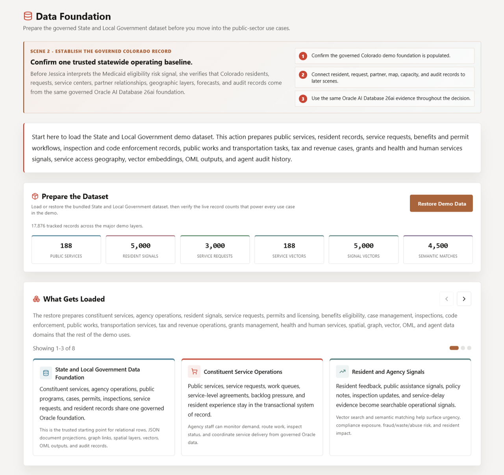
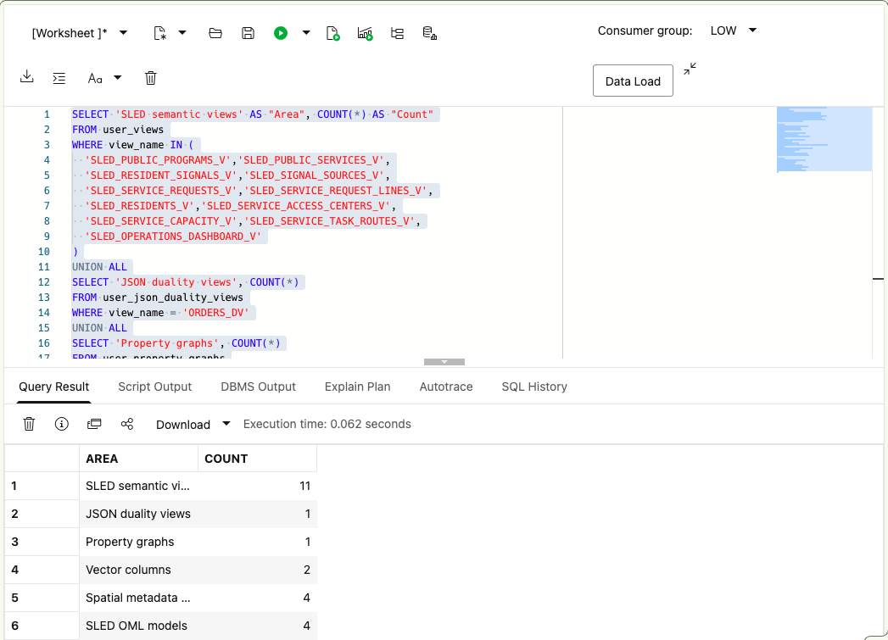
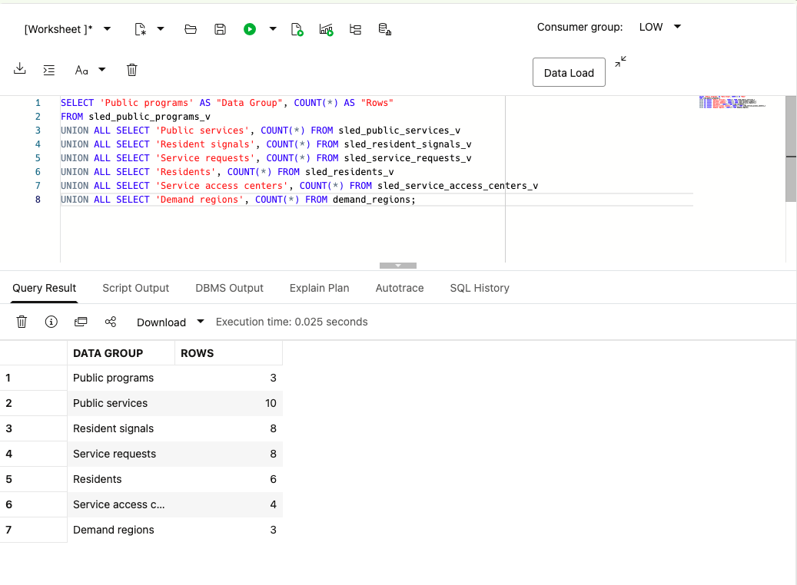

# Data Foundation

## Introduction

Before **Jessica** acts on the Colorado early warning, **Jordan**, the Database Administrator, confirms that the approved database objects include service programs, resident requests, demand signals, partner relationships, geographic layers, and predictive models.

You work with Jordan as the database developer supporting Jessica, Sam, Priya, and Maya. In this lab, you inventory the object families used in the workshop, then count the public-service data behind them. The results give the team a shared starting point for every later question.

**Oracle AI Database** provides the shared foundation for this investigation. Each public-service workload uses the access pattern it needs while working from the same source records and SQL access controls.

The diagram compares a fragmented architecture with the converged database foundation for Colorado.


<details>
<summary><strong>Key terms: schema, view, vector, property graph, spatial data, and Oracle Machine Learning</strong></summary>

> - A **schema** owns database objects. In this workshop, `LLUSER` owns the learner-facing tables, views, graph, spatial metadata, and models.
>
> - A **view** is a saved query that gives application and analytics teams a consistent business shape. Names beginning with `SLED_` expose public-service meaning over inherited physical tables.
>
> - A **vector** is a numerical representation of meaning. Stored vectors let the database compare service descriptions and resident concerns even when their words differ.
>
> - A **property graph** represents entities and their relationships. It helps Jessica follow partner and program handoffs that are difficult to see in flat lists.
>
> - **Spatial data** represents points and boundaries. It lets service planners measure distance and coverage with SQL.
>
> - **Oracle Machine Learning (OML)** stores and scores models in Oracle Database, close to the governed data that supplies their features.

</details>

The image below shows the Data Foundation page in the State and Local Government LiveStack. It shows the full application dataset and the public-service domains loaded for the wider demonstration. The SQL in this lab uses a compact deterministic dataset and inventories only the object families required by the seven active workshop labs.



The SQL in this lab inspects those object families directly. The compact workshop dataset keeps the exercises fast and repeatable; the full LiveStack application uses a larger demonstration dataset.

### Objectives

- Inventory the database objects used by the active resident-services labs.
- Count the current public-service data groups so later results have a clear baseline.
- Connect each object family to the public-service decision it supports later in the workshop.

Estimated Time: **10 minutes**

### Business Scenario

| Step | State and local government focus |
| --- | --- |
| Business Problem | Colorado cannot act confidently if each team uses a different copy of resident-service information. |
| Technical Challenge | Platform teams must connect relational, JSON, vector, graph, spatial, and predictive workloads. |
| Persona Focus | Jordan, the Database Administrator, maps the foundation that Jessica, Sam, Priya, and Maya use later. |
| What You Will Do | Query Oracle catalog views and SLED semantic views. |
| Database Capability | One schema exposes business views and specialized database objects. |
| Outcome | Every later result traces to the same source data and controls. |

**Persona focus:** You join Jordan as he shows Jessica, Sam, Priya, and Maya which database objects support the active workflow.

## Task 1: Inventory the active object families

Jordan confirms the shared foundation before Jessica investigates the warning and before the team relies on later results. Inspect the object counts now. They identify the views, documents, vectors, graph, spatial layers, and models available for the workflow.

Start with the object families that later labs actually use, so the foundation check stays tied to the active resident-services workflow:

1. Run the inventory query to confirm the semantic views, JSON duality view, graph, vector columns, spatial layers, and OML models are available:

    > **SQL Worksheet reminder:** Need a reminder on how to open and use SQL Worksheet? Return to [Getting Started Task 2: Open SQL Worksheet](/workshops/sandbox/index.html?lab=getting-started#Task2:OpenSQLWorksheet).

    The query reads Oracle catalog views. Each branch counts one object family: SLED semantic views, the `ORDERS_DV` JSON Relational Duality view, the `INFLUENCER_NETWORK` graph, vector columns, spatial layers, and the four SLED OML models. `UNION ALL` returns the counts as one list.

    <details>
    <summary><strong>Why this matters: one catalog instead of six inventories</strong></summary>

    > A fragmented design forces teams to inventory a reporting store, document database, vector service, graph system, mapping system, and machine learning platform separately. Oracle Database lists these objects in one catalog.

    </details>

    ```sql
    <copy>
    SELECT 'SLED semantic views' AS "Area", COUNT(*) AS "Count"
    FROM user_views
    WHERE view_name IN (
      'SLED_PUBLIC_PROGRAMS_V','SLED_PUBLIC_SERVICES_V',
      'SLED_RESIDENT_SIGNALS_V','SLED_SIGNAL_SOURCES_V',
      'SLED_SERVICE_REQUESTS_V','SLED_SERVICE_REQUEST_LINES_V',
      'SLED_RESIDENTS_V','SLED_SERVICE_ACCESS_CENTERS_V',
      'SLED_SERVICE_CAPACITY_V','SLED_SERVICE_TASK_ROUTES_V',
      'SLED_OPERATIONS_DASHBOARD_V'
    )
    UNION ALL
    SELECT 'JSON duality views', COUNT(*)
    FROM user_json_duality_views
    WHERE view_name = 'ORDERS_DV'
    UNION ALL
    SELECT 'Property graphs', COUNT(*)
    FROM user_property_graphs
    WHERE graph_name = 'INFLUENCER_NETWORK'
    UNION ALL
    SELECT 'Vector columns', COUNT(*)
    FROM user_tab_cols
    WHERE data_type = 'VECTOR'
      AND table_name IN ('PRODUCT_EMBEDDINGS','POST_EMBEDDINGS')
    UNION ALL
    SELECT 'Spatial metadata layers', COUNT(*)
    FROM user_sdo_geom_metadata
    WHERE table_name IN (
      'FULFILLMENT_CENTERS','CUSTOMERS',
      'FULFILLMENT_ZONES','DEMAND_REGIONS'
    )
    UNION ALL
    SELECT 'SLED OML models', COUNT(*)
    FROM user_mining_models
    WHERE model_name IN (
      'SLED_SERVICE_DEMAND_MODEL',
      'SLED_RESIDENT_NEED_SEGMENT_MODEL',
      'SLED_SERVICE_VALUE_MODEL',
      'SLED_CASE_SIGNAL_CLUSTER_MODEL'
    );
    </copy>
    ```

    **Expected output: Active Object Inventory**

    

2. Read the result as an object checklist.

    The semantic views support dashboard and request analysis. `ORDERS_DV` supplies the application document shape. Vector columns support meaning-based search. `INFLUENCER_NETWORK` supports partner traversal. Spatial metadata explains location columns, and the OML catalog identifies deployed models.

## Task 2: Count the public-service data groups

Once Jordan confirms that the object families are present, the team needs a baseline for the resident-service data behind them. Inspect the row counts so Jessica can see the population that later tasks narrow into a review queue or priority.

Give scale to the operating story before you investigate specific requests, services, and regions:

1. Run the data-group count query to establish the baseline population for the later dashboard, JSON, vector, graph, spatial, and OML results:

    The `SLED_*_V` objects save queries that translate inherited physical table names into public-service language. Their row counts provide a baseline for later dashboard, JSON, vector, graph, spatial, and OML results.

    ```sql
    <copy>
    SELECT 'Public programs' AS "Data Group", COUNT(*) AS "Rows"
    FROM sled_public_programs_v
    UNION ALL SELECT 'Public services', COUNT(*) FROM sled_public_services_v
    UNION ALL SELECT 'Resident signals', COUNT(*) FROM sled_resident_signals_v
    UNION ALL SELECT 'Service requests', COUNT(*) FROM sled_service_requests_v
    UNION ALL SELECT 'Residents', COUNT(*) FROM sled_residents_v
    UNION ALL SELECT 'Service access centers', COUNT(*) FROM sled_service_access_centers_v
    UNION ALL SELECT 'Demand regions', COUNT(*) FROM demand_regions;
    </copy>
    ```

    **Expected output: Public-Service Row Counts**

    

2. Use the counts as the baseline for later investigation.

    Later labs filter, rank, traverse, or score this population. A short result does not make the scenario small. It means SQL has narrowed the data to records that matter for one decision.

### What have I achieved when the lab ends?

You have mapped the database objects and data groups that Jessica, Sam, Priya, and Maya use throughout the workshop. The team now starts from the same requests, documents, language, relationships, locations, and models.

## Acknowledgements

* **Author** - Pat Shepherd, Senior Principal Database Product Manager
* **Last Updated By/Date** - Oracle Database Product Management, September 2026
