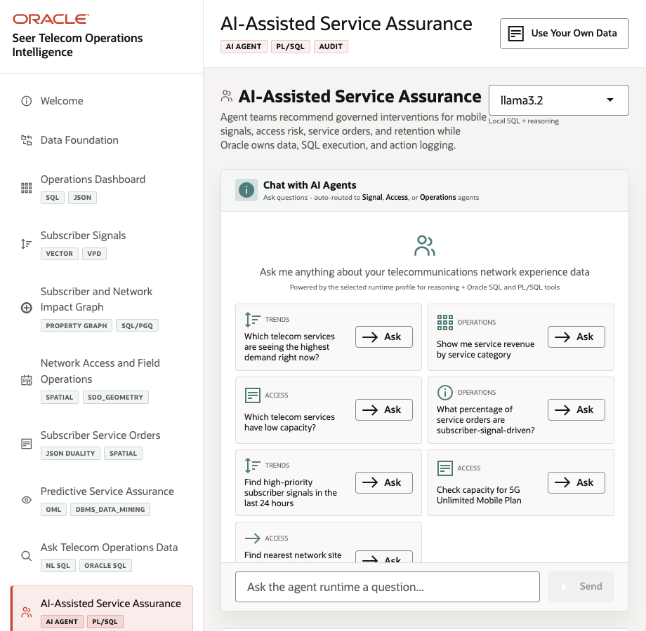
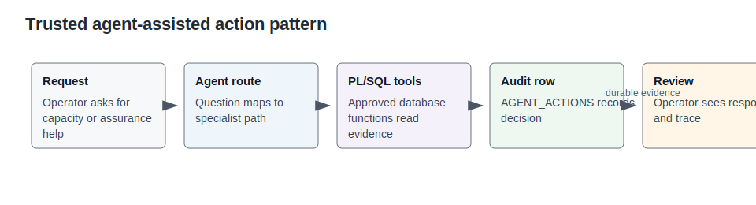

# Lab 9: AI-Assisted Service Assurance

## Introduction

Agent-assisted service assurance is only useful when people can review what the agent did. Operators need to know which tool ran, what evidence it used, how confident it was, and whether the action was recorded.

This lab uses SQL and PL/SQL evidence patterns instead of treating the agent as a black-box chat surface.

Estimated Time: 10 minutes

| Operating Story | Detail |
| --- | --- |
| Business Problem | Operators need recommendations they can review after the conversation ends. |
| Technical Challenge | External agent tools can hide data access, routing, confidence, and action history. |
| Persona Focus | Service assurance leader, AI platform owner, and care operations manager. |
| What You Will Learn | Approved database tools and agent audit rows can make AI-assisted actions reviewable. |
| Database Capability | PL/SQL tools, agent action audit table, Oracle-backed execution. |
| Outcome | AI assistance becomes operationally auditable, not transient chat. |
{: title="What this lab covers"}

**Persona focus:** You are the AI platform owner confirming that every assisted action can be traced to database evidence.

### Objectives

- Review recent AI-assisted interventions as auditable database rows.
- Check capacity evidence that an approved agent tool can return.
- Explain how tool evidence and action history make assisted decisions reviewable.

The image below is the agent console workspace. Service assurance and AI platform teams use this area to see agent-assisted recommendations and the tool context behind them. The SQL in this lab shows how those actions can be reviewed from Oracle.



The concept diagram below introduces the trusted-action pattern. It shows why an assistant should call approved tools, read governed evidence, and write action history instead of answering from an opaque conversation.



## How This Lab Fits the Story

You close the loop with auditable action. The agent action and capacity queries show how an assistant can return useful guidance while Oracle keeps the tool evidence and action history available for review.

## Scene Evidence

The image below shows agent tool badges. They help a reviewer see which approved capability the agent used. The SQL in this lab checks the durable action records behind that visual cue.


## Task 1: Review recent AI-assisted interventions

1. Run this SQL block.

    This query checks whether assisted actions leave a reviewable operational record. It reads the agent action view, orders by the latest timestamp, and returns agent name, action type, entity, confidence, and status. If an operator follows an AI recommendation, the organization needs a durable record of what happened.

    ```sql
    <copy>
    SELECT agent_name,
       action_type,
       telecom_entity_type,
       confidence,
       execution_status,
       created_at
    FROM seer_comms_agent_actions_v
    ORDER BY created_at DESC
    FETCH FIRST 8 ROWS ONLY;
    </copy>
    ```

    **Expected output: Recent agent actions available for review**

    | Agent Name | Action Type | Telecom Entity Type | Confidence | Execution Status | Created At |
    | --- | --- | --- | ---: | --- | --- |
    | Network Access Agent | `capacity_check` | `network_capacity` | 0.90 | COMPLETED | Dynamic timestamp |
    | Service Assurance Agent | `signal_triage` | service | 0.88 | COMPLETED | Dynamic timestamp |
    {: title="Recent agent actions available for review"}

## Task 2: Check capacity for a pressure service

1. Run this SQL block.

    This query shows the kind of approved database evidence an agent tool can return. It filters capacity rows for a pressure service and orders the tightest capacity first. The agent should not guess about capacity; it should call a trusted path that reads current operational data.

    ```sql
    <copy>
    SELECT network_site_name,
       capacity_available,
       capacity_reserved,
       capacity_incoming,
       escalation_threshold
    FROM seer_comms_network_capacity_v
    WHERE service_name = 'Fixed Wireless Home Internet'
    ORDER BY capacity_available
    FETCH FIRST 8 ROWS ONLY;
    </copy>
    ```

    **Expected output: Capacity check returned by the agent tool**

    | Network Site Name | Capacity Available | Capacity Reserved | Capacity Incoming | Escalation Threshold |
    | --- | ---: | ---: | ---: | ---: |
    | Chicago Midwest NOC | 92 | 31 | 75 | 100 |
    | Miami Connected Life Hub | 104 | 28 | 80 | 100 |
    {: title="Capacity check returned by the agent tool"}

## Task 3: Explain the trusted-action pattern

1. Review the explanation and connect it to the lab evidence.

The agent console routes a capacity question to an approved path, uses Oracle-backed tools to read evidence, and writes an action record. The audit table turns a helpful chat response into an operational intervention that managers, auditors, and engineers can review later.


## Learn More

- See `ORACLE_REFERENCE_LINKS.md` in the supporting files directory for official Oracle documentation links.

## Acknowledgements

- **Author** - Oracle LiveLabs Team
