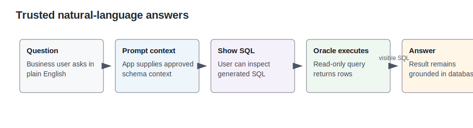
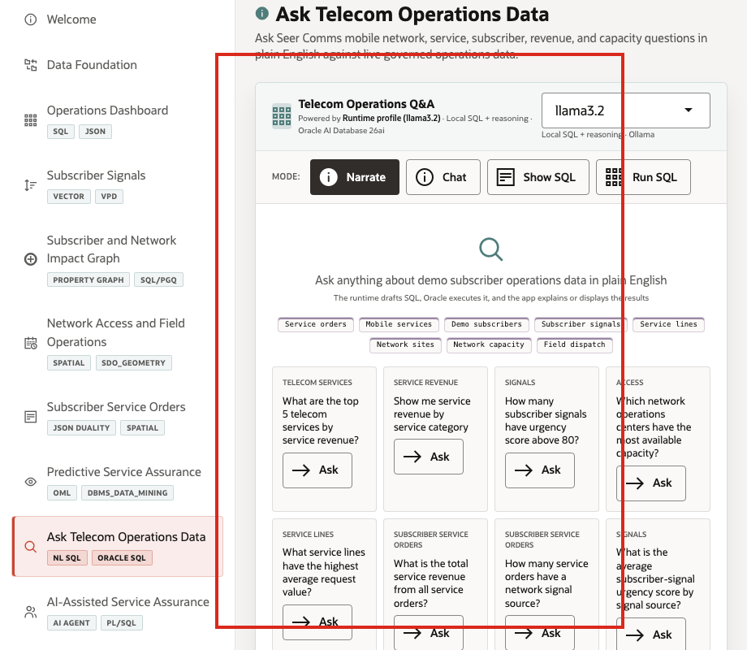

# Lab 8: Ask Telecom Operations Data

## Introduction

Natural-language analytics is useful only when the user can inspect the SQL path and trust Oracle as the execution authority. This lab teaches the trusted-answer pattern without requiring learners to configure a live GenAI provider.

Estimated Time: 10 minutes

| Operating Story | Detail |
| --- | --- |
| Business Problem | Business users need fast answers without waiting for a custom report. |
| Technical Challenge | Generated SQL can create governance risk when the logic is hidden or unbounded. |
| Persona Focus | Telecom business analyst, data engineer, and service assurance manager. |
| What You Will Prove | Approved views and visible SQL can ground natural-language answers in Oracle data. |
| Database Capability | Select AI pattern, read-only SQL, semantic views, governed execution. |
| Outcome | Users can ask business questions while keeping SQL evidence visible. |
{: title="What this lab proves"}

**Persona focus:** You are the data engineer showing how plain-English questions remain inspectable and database-grounded.

### Objectives

- Review the LiveStack scene evidence.
- Run SQL that proves the database pattern.
- Connect the result to the next operating decision.

## How This Lab Fits the Story

You switch from predefined reports to governed questions. The SQL examples show the kind of transparent query path that should sit behind natural-language analytics.

## Scene Evidence

## Task 1: Answer a top-services question with SQL

1. Run this SQL block.

    This query represents the SQL path behind a plain-English revenue question.

    <copy>
SELECT service_name,
       ROUND(SUM(service_value), 0) AS service_revenue,
       COUNT(*) AS service_orders
FROM seer_comms_service_orders_v o
JOIN order_items oi ON oi.order_id = o.service_order_id
JOIN seer_comms_services_v s ON s.service_id = oi.product_id
GROUP BY service_name
ORDER BY service_revenue DESC
FETCH FIRST 5 ROWS ONLY;
    </copy>

Expected output:

| Service Name | Service Revenue | Service Orders |
| --- | ---: | ---: |
| Fixed Wireless Home Internet | 184000 | 230 |
| Device Upgrade Enrollment | 172000 | 216 |
{: title="Revenue answer with visible SQL evidence"}

## Task 2: Answer a high-urgency signal question

1. Run this SQL block.

    This query represents the SQL path behind a plain-English subscriber-signal question.

    <copy>
SELECT signal_channel,
       COUNT(*) AS signals,
       MAX(exposure_count) AS max_exposure,
       MAX(escalations) AS max_escalations
FROM seer_comms_subscriber_signals_v
GROUP BY signal_channel
ORDER BY signals DESC;
    </copy>

Expected output:

| Signal Channel | Signals | Max Exposure | Max Escalations |
| --- | ---: | ---: | ---: |
| threads | 1017 | 19937363 | 95869 |
| twitter | 1012 | 19576775 | 98830 |
{: title="Signal-channel answer with visible SQL evidence"}

## Task 3: Explain why Show SQL matters

1. Review the explanation and connect it to the lab evidence.

The LiveStack page can ask similar questions in natural language, show generated SQL, and then run read-only SQL against Oracle. The governance pattern is the lesson: the answer is useful because the query path remains visible.

## Learn More

- See `ORACLE_REFERENCE_LINKS.md` in the supporting files directory for official Oracle documentation links.

## Acknowledgements

- **Author** - Oracle LiveLabs Team
