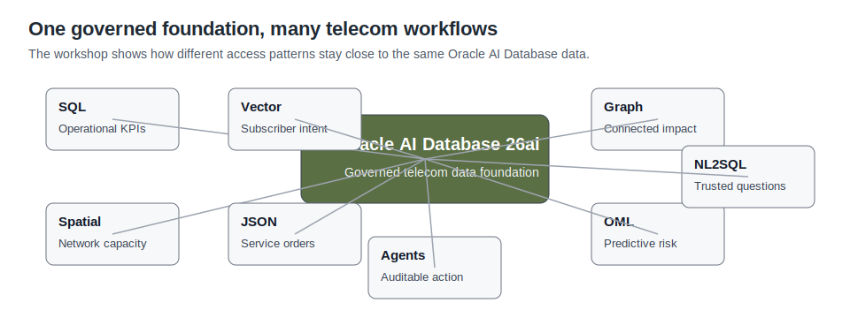

# Lab 10: Conclusion

## Introduction

You have completed the Seer Comms operating loop. The workshop started with a 5G demand-surge problem and ended with database-backed evidence for trusted answers and auditable AI-assisted actions.

The main lesson is practical architecture: different telecom teams can work from the same governed data foundation while using the data shape each workflow needs.

Network teams scan KPIs. Care teams search subscriber language by meaning. Investigators traverse impact relationships. Field teams use spatial context. Application teams expose service orders as JSON. Analytics teams score risk close to the data. AI workflows show SQL, use approved tools, and write audit records.

That is the business value of the workshop: Seer Comms can move from detection to decision without losing the security, context, or audit trail that telecom operations require.

Estimated Time: 5 minutes

### Objectives

- Summarize the business outcome of each lab.
- Connect Oracle Database capabilities to the telecom operating loop.
- Identify how the same data foundation reduces integration work.
- Prepare for the final quiz.

The image below summarizes the workshop outcomes. It connects the Seer Comms operating loop to the Oracle AI Database capabilities that support each step, from first signal to auditable action.

## Task 1: Review the operating loop

1. Review the end-to-end path.

| Operating Step | What You Can Explain | Oracle Capability |
| --- | --- | --- |
| Prepare trusted data | The schema contains services, signals, orders, sites, forecasts, graph entities, embeddings, and audit rows. | Relational SQL and semantic views |
| Observe pressure | Command-center KPIs come from live operating domains, not a static report. | SQL over governed operational data |
| Understand intent | Subscriber language can rank services by meaning. | AI Vector Search |
| Investigate impact | Outages, cases, sites, and subscriber groups form traversable impact paths. | Property Graph and SQL/PGQ |
| Locate capacity | Network sites, capacity, dispatches, and demand regions can be analyzed together. | Oracle Spatial |
| Act on orders | The same service order supports relational operations and document-style access. | JSON Relational Duality |
| Predict risk | Demand and capacity signals can be joined to model-style scores. | Oracle Machine Learning patterns |
| Ask trusted questions | Natural-language questions remain useful because the SQL path is visible. | Governed NL2SQL pattern |
| Record trusted actions | Agent-assisted responses can be checked later through action history. | PL/SQL tools and audit table |
{: title="Operational outcomes proved in the workshop"}

## Task 2: Explain the learner takeaway

1. Use this summary when you explain the workshop to another learner or stakeholder.

Seer Comms does not solve the demand-surge story by adding one more isolated tool. It solves it by keeping the evidence in one governed database platform. Each lab showed a practical operating pattern over that foundation. Business users get a coherent service-assurance workflow. Developers and database professionals can inspect the SQL, views, graph tables, spatial objects, vector artifacts, JSON documents, and audit records that make the workflow trustworthy.

When you explain the workshop, lead with the operating outcome: Oracle AI Database 26ai helps telecom teams act faster because operational evidence and AI evidence remain connected.

## Task 3: Map business questions to database evidence

1. Review the business questions you can now answer with database-backed evidence.

| Business Question | What You Can Explain | Oracle Database Evidence |
| --- | --- | --- |
| Where is service pressure building? | Command-center KPIs and service rankings identify where teams should look first. | SQL over service orders, signals, dispatches, and agent actions |
| What are subscribers actually saying? | Vector search connects different wording to the same service issue. | Vector embeddings, similarity scores, and governed signal rows |
| Who or what is affected by an incident? | Graph relationships connect outages to sites, services, subscriber groups, and crews. | Property graph entities and relationships queried from Oracle |
| Where should field teams act? | Spatial and capacity evidence ties service pressure to sites and open dispatches. | Network site, capacity, spatial, and dispatch rows |
| Can AI-assisted work be trusted? | Visible SQL, approved tools, and action records make answers and interventions reviewable. | Semantic views, PL/SQL tools, and audit tables |
{: title="Business questions answered by the workshop"}

## Task 4: Map value by persona

1. Review how the same foundation helps different teams.

| Persona | What they can now explain | Why it matters |
| --- | --- | --- |
| Network operations leader | Which services and sites show the most pressure. | Teams can focus attention before subscriber experience degrades. |
| Care operations lead | Which subscriber signals cluster around services by meaning. | Care can respond to real subscriber language, not only exact keywords. |
| Service assurance investigator | How outages, sites, cases, subscribers, and crews connect. | Escalations start from connected impact instead of isolated tickets. |
| Field operations manager | Where capacity pressure and open dispatches intersect. | Crews can be coordinated against the sites that need help. |
| Data and AI platform owner | How trusted answers and actions stay tied to SQL, tools, and audit rows. | AI-assisted work remains explainable and reviewable. |
{: title="Workshop value by persona"}

## Task 5: Choose a next step

1. Use the workshop result to decide where you want to go deeper.

| Next Interest | Recommended Follow-up |
| --- | --- |
| Application APIs | Extend the JSON Relational Duality service-order lab with update examples. |
| Semantic search | Add a live query embedding task that compares new subscriber language to stored services. |
| Impact investigation | Expand the graph lab with SQL/PGQ path patterns and Graph Studio. |
| Field operations | Add Spatial Studio or route-service integration for richer map workflows. |
| Predictive assurance | Extend the OML lab with model training, evaluation, and score monitoring tasks. |
| Governed AI | Extend the trusted-answer and trusted-action labs with Select AI or agent configuration. |
{: title="Recommended next steps by learner interest"}

## Acknowledgements

- **Author** - Oracle LiveLabs Team
