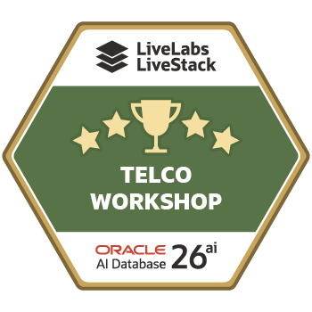

# Lab 11: Final Quiz

## Introduction

Use this quiz to check whether you can connect the telecom operating story to the Oracle Database capabilities used in the workshop.

Estimated Time: 10 minutes

### Objectives

- Check your understanding of the Seer Comms operating story.
- Match business outcomes to Oracle AI Database capabilities.
- Review governance patterns for trusted answers and trusted actions.

## How This Lab Fits the Story

The quiz checks whether you can connect the business workflow to the database capability. Focus on why each capability matters to the operator, not only on the feature name. The badge marks completion of the telecom LiveStack learning path.

## Task 1: Answer the questions

1. Answer each question, then review the explanation.

### Question 1

Why does the workshop start with the telecom data foundation?

- A. To prove the UI has enough screenshots.
- B. To show that the operating story starts from governed services, signals, orders, sites, forecasts, graph entities, embeddings, and audit rows.
- C. To avoid using SQL in later labs.
- D. To replace the LiveStack Demo with a static report.

**Correct answer:** B

### Question 2

What does AI Vector Search help Seer Comms do?

- A. Search subscriber language by meaning while keeping text, vectors, and SQL close to governed data.
- B. Replace all service orders with image files.
- C. Remove the need for access control.
- D. Run only exact keyword searches.

**Correct answer:** A

### Question 3

Why is Property Graph useful in the subscriber and network impact lab?

- A. It stores screenshots in the database.
- B. It turns connected outage, service, case, site, subscriber, and crew relationships into traversable impact paths.
- C. It hides relationships from operators.
- D. It requires a separate graph-only data copy.

**Correct answer:** B

### Question 4

What is the main value of JSON Relational Duality for service orders?

- A. It lets applications use a document-shaped order while Oracle preserves relational truth and transactional consistency.
- B. It removes every relational table.
- C. It makes service orders read-only text files.
- D. It prevents SQL verification.

**Correct answer:** A

### Question 5

Why does the Ask Telecom Operations Data lab emphasize visible SQL?

- A. Visible SQL makes natural-language answers inspectable and keeps Oracle as the execution authority.
- B. Visible SQL is only decorative.
- C. Visible SQL means the language model owns the data.
- D. Visible SQL prevents users from seeing result rows.

**Correct answer:** A

### Question 6

What makes agent-assisted service assurance trustworthy in this workshop pattern?

- A. The agent never records what happened.
- B. Approved database tools return evidence and `AGENT_ACTIONS` records the decision for later review.
- C. The agent bypasses Oracle data.
- D. The UI hides tool usage.

**Correct answer:** B

## Task 2: Finish the workshop

1. Review the explanation and connect it to the lab evidence.

You have completed the quiz. Review the conclusion if you want to revisit how the labs connect into one operating loop.

## Acknowledgements

- **Author** - Oracle LiveLabs Team
