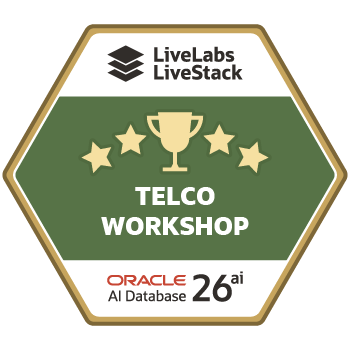

# Final Quiz

```quiz-config
passing: 75
badge: images/livestack-badge-telecommunications.png
```

## Introduction

Use this scored quiz to confirm that you can explain the `TEL-5G-2026-501` response from its business impact to its operational evidence.

### Objectives

- Recall the case, impact, and decision at the center of the workshop.
- Connect each database capability to the evidence it provides for that decision.

Estimated Time: **5 minutes**

## Task 1: Answer the quiz questions

1. Follow the steps below.

    ```quiz score
    Q: What is TEL-5G-2026-501 in this workshop?
    - A subscriber identifier for the Hudson Yards service order.
    * The critical Hudson Yards 5G congestion case that anchors the investigation.
    - The name of the capacity-risk model.
    - A property graph object.
    > The case ID connects the incident to its 31,200 affected-subscriber estimate, service value at risk, signal, site, and response evidence.

    Q: Which value establishes the business urgency of TEL-5G-2026-501?
    - 56 subscriber seed rows.
    - 54 network sites.
    * 31,200 subscribers affected.
    - 8 telecom services.
    > SUBSCRIBERS_AFFECTED is the case-impact measure, not a count of rows in the subscriber table.

    Q: Why does the Operations Center lab include a drill-through query after a summary?
    - To replace dashboard evidence with a screenshot.
    * To show that Hudson Yards is a reviewable 91% load row behind the KPI.
    - To create a separate reporting database.
    - To generate a random capacity score.
    > A dashboard total is useful only when the team can inspect the contributing site and decide what to do next.

    Q: What does the Lab 3 WITH INSERT UPDATE change prove?
    - It creates a second service-order copy for application writes.
    - It enables document deletion for temporary cleanup.
    * A JSON insert or update can change the governed SERVICE_ORDERS and SERVICE_ORDER_ITEMS rows behind ORDERS_DV.
    - It converts service-order rows into vector embeddings.
    > JSON Relational Duality lets an application create and update a document while SQL immediately reads the same governed root and child rows. Delete remains disabled.

    Q: What does AI Vector Search add to the TEL-5G-2026-501 investigation?
    - It replaces the source signal with an embedding only.
    * It lets an analyst review the matched service and retained similarity evidence.
    - It calculates the miles between network sites.
    - It creates a second service-order document.
    > It connects the game-day congestion wording in signal 501 to related services while preserving the signal text and similarity evidence.

    Q: What does the Property Graph reveal about TEL-5G-2026-501?
    - A random data sample.
    - A replacement for the subscriber table.
    * The starting point for an investigation of connected entities.
    - A model confidence score.
    > SQL/PGQ starts from the case and follows its site, outage, subscriber-cluster, and support-case relationships.

    Q: What does the Spatial result contribute to the response plan?
    - To replace operational rows with a map image.
    - To export site coordinates to an unrelated system.
    - To turn graph edges into vectors.
    * It identifies Hudson Yards and Newark as a nearby 9.0-mile site pair for planning review.
    > Spatial keeps the distance calculation beside the case and operational records that explain the choice.

    Q: What does the OML result contribute to the Hudson Yards decision?
    - A guaranteed outage outcome.
    * An ESCALATE priority signal to review beside the 91% load and case evidence.
    - A replacement for the network-site table.
    - A copy of capacity data in a separate machine-learning system.
    > A prediction helps a planner prioritize investigation. It does not replace the operational evidence or make the action automatic.

    Q: What makes the TEL-5G-2026-501 response explainable instead of a black-box recommendation?
    - Each capability requires a separate specialist store.
    * SQL, JSON, vector, graph, spatial, and model evidence stay connected to the case.
    - Screenshots replace the need for database evidence.
    - Teams must reconcile copied data before investigating.
    > The team can inspect every part of the response, from the incident impact to the site, order, signal, relationships, distance, and prediction.
    ```

2. Review your completion badge.

    

## Acknowledgements

* **Author** - Pat Shepherd, Senior Principal Database Product Manager
* **Last Updated By/Date** - Pat Shepherd, August 2026
