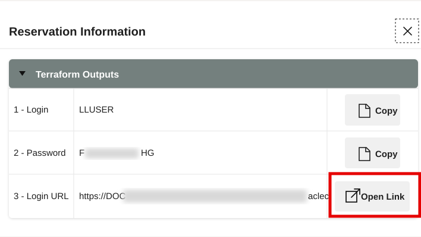
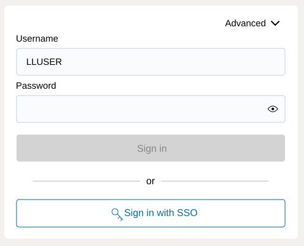
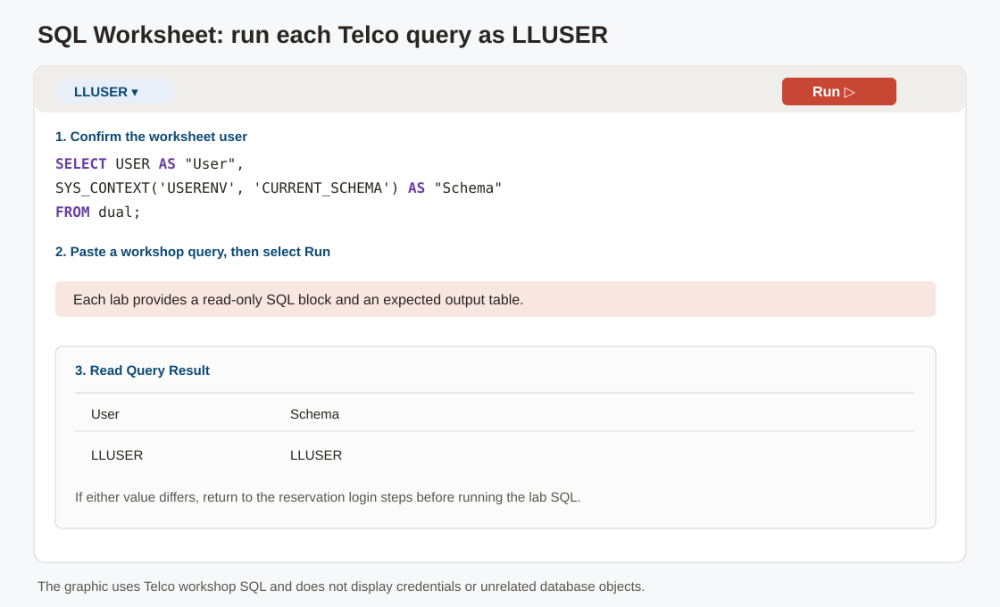

# Getting Started

## Introduction

Start here to open the LiveLabs reservation, sign in to the provisioned **Oracle AI Database 26ai** environment, and prepare **SQL Worksheet** for the **Seer Comms** investigation. Each hands-on query runs as the workshop user against the prepared telecom schema, so you can focus on the business evidence instead of environment setup.

<details>
<summary><strong>Key terms: Database Actions, SQL Worksheet, and LLUSER</strong></summary>

> - **Database Actions** is the browser-based Oracle Database workspace you use in this workshop. It gives you access to SQL Worksheet and other database tools without installing a desktop client.
>
> - **SQL Worksheet** is where you paste and run SQL statements. It shows query results, script output, and errors, so it is where you connect the application screens to database evidence.
>
> - `LLUSER` is the workshop database user and schema owner for the hands-on Telco objects. Using the right user matters because the tables, views, vector data, graph objects, and spatial layers you query are created under this schema.

</details>

Estimated Time: **5 minutes**

### Objectives

- Launch the LiveLabs workshop environment.
- Use the reservation login information to open Database Actions.
- Confirm that SQL Worksheet is ready for the Telco schema.
- Confirm that SQL Worksheet is connected as the workshop schema user.

## Task 1: Launch the LiveLabs environment

Start from the LiveLabs reservation so **Database Actions** opens with the correct workshop resources and credentials. This puts you in the same governed environment used for the rest of the Seer Comms incident investigation:

1. Sign in to [LiveLabs](https://livelabs.oracle.com) with your Oracle account.

2. Open this workshop, select **Start**, and select **Run on LiveLabs Sandbox**.

3. In **My Reservations**, select **Launch Workshop** for this reservation.

4. Select **View Login Info** and keep the database credentials available for the next task.

    

    *Figure 1: The Reservation Information dialog shows the `LLUSER` login, password, and Login URL for Database Actions.*

## Task 2: Open SQL Worksheet

Open SQL Worksheet as the workshop user before running the telecom queries. This is where you ask each business question in SQL and review the evidence returned by **Oracle AI Database 26ai**:

1. In the **Reservation Information** dialog, confirm that **1 - Login** shows `LLUSER`.

2. Select **Copy** for **2 - Password**.

    

    *Figure 2: Copy the `LLUSER` password from the Reservation Information dialog.*

3. Select **Open Link** for **3 - Login URL**.

    

    *Figure 3: Use Open Link for the Login URL, then use the copied password to sign in as `LLUSER`.*

4. On the Database Actions sign-in page, confirm that **Username** shows `LLUSER`, paste the password from the reservation information, and select **Sign in**.

    

    *Figure 4: Sign in to Database Actions as `LLUSER` with the password from the reservation information.*

5. Before SQL Worksheet opens, select **Development**, then select **SQL** from the tools menu.

    

    *Figure 5: Open SQL from the Development tools menu.*

6. Use the same SQL Worksheet pattern throughout the workshop.

    

    *Figure 6: Use SQL Worksheet to confirm the active user, paste each workshop SQL block, run the statement, and review the result table.*

    - Confirm the user dropdown shows `LLUSER`.
    - Paste each workshop SQL block into the editor.
    - Select **Run Statement** or press **Ctrl+Enter** to run the current SQL statement.
    - Review the output in **Query Result** or **Script Output**, depending on the step.
    - Use **Navigator** only when you want to inspect tables, views, or other objects.

7. Run this check.

    This check makes sure SQL Worksheet is connected as the right user before you start. `USER` shows who signed in, while `SYS_CONTEXT('USERENV', 'CURRENT_SCHEMA')` shows where table names resolve. The Telco labs use `LLUSER`, so both values should point to the workshop schema.

    1. `FROM dual` uses Oracle's one-row utility table, so this check needs no Telco table.
    2. `USER` returns the signed-in database user.
    3. `SYS_CONTEXT` reads the schema Oracle will use to resolve unqualified table names.

    ```sql
    <copy>
    SELECT USER AS "User",
           SYS_CONTEXT('USERENV', 'CURRENT_SCHEMA') AS "Schema"
    FROM dual;
    </copy>
    ```

    **Expected output: Connection Check**

    | User | Schema |
    | --- | --- |
    | LLUSER | LLUSER |

    Use this connection check whenever you need to confirm that SQL Worksheet is still running as 'LLUSER' before continuing the telecom investigation.

With SQL Worksheet ready, you can move from setup into the evidence foundation for **TEL-5G-2026-501**.

## Acknowledgements

* **Author** - Pat Shepherd, Senior Principal Database Product Manager
* **Last Updated By/Date** - Pat Shepherd, July 2026
