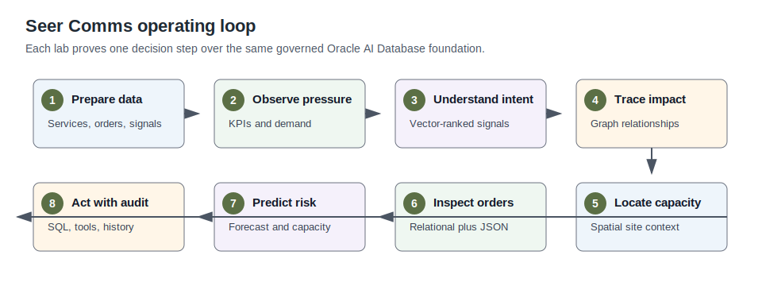

# Build Telecom Operations Intelligence with Oracle Database 26ai

## Introduction

A telecommunications provider cannot manage a demand surge from one dashboard alone. Network operations teams need to know where capacity is tight. Care teams need to understand what subscribers are saying. Field dispatch needs to know where crews can help.

Retention, data engineering, and AI teams need the same evidence, or each team makes a different call from a different version of the truth.

In this workshop, you follow Seer Comms through a South Florida 5G demand-surge scenario. Subscriber pressure is rising, and the provider needs to act before calls drop, installs slip, or care queues fill up.

The technical lesson is practical: the evidence for that decision can stay in Oracle AI Database 26ai instead of being split across separate search, graph, spatial, analytics, document, and AI stores.

You start with the governed data foundation, then move through the same decision loop an operator would use on a busy day: see where pressure is building, understand what subscribers mean, investigate who and what is affected, locate capacity, inspect service orders, review predictive signals, ask governed questions, and record AI-assisted action that someone can audit later.

The Seer Comms application shows the operator workflow. These labs expose the Oracle AI Database evidence that makes the workflow trustworthy. Each lab starts with an operating question, runs SQL against the workshop schema, and explains how the result helps a telecom team act with confidence.

Estimated Workshop Time: 2 hours

### Objectives

In this workshop, you will:

- Inspect the Seer Comms data foundation and semantic views.
- Query telecom KPIs that support a network experience command center.
- Use AI Vector Search to connect subscriber language to telecom services.
- Use Property Graph and SQL/PGQ to investigate subscriber and network impact.
- Use Oracle Spatial to connect demand pressure, network sites, and field capacity.
- Compare relational service orders with JSON Relational Duality documents.
- Review predictive assurance patterns that join model-style scores to operations data.
- Explain trusted natural-language answers and AI-assisted actions with visible database evidence.

The image below is the Seer Comms welcome view. It introduces the telecom operations scenario and frames the workshop around a provider that must react before subscriber experience suffers. Use it as the business anchor for the labs that follow.

## Workshop Story

| Story Element | Description |
| --- | --- |
| Business Problem | A mobile demand surge can create subscriber pain before care, network, field, and retention teams share the same picture. |
| Technical Challenge | Telecom data often spans OSS, BSS, CRM, care, network, dispatch, AI, and analytics systems. |
| Persona Focus | Network operations leader, care operations lead, service assurance analyst, platform engineer, and telecom data developer. |
| What You Will Learn | Oracle AI Database can keep operational, AI-ready, graph, spatial, JSON, ML, and audit data close to one governed foundation. |
| Database Capability | Oracle AI Database 26ai converged data platform capabilities. |
| Outcome | The provider can move from signal detection to explainable, auditable service assurance action. |
{: title="Workshop story at a glance"}

The diagram below shows the decision loop you follow in the workshop. It connects the business flow, from awareness to investigation to action, to the Oracle Database capabilities that keep the evidence connected.

## How to Use the Labs

Each lab follows the same pattern:

1. Read the operating story so you know the decision you are trying to support.
2. Review the screenshot or concept diagram to understand the operating scenario before you query the database.
3. Run the SQL block in Database Actions SQL Worksheet.
4. Compare your result with the expected output.
5. Read the interpretation before moving to the next lab.

The SQL is not just a setup check. Treat each query as evidence in an operations review. The result shows how Oracle AI Database keeps data, search, graph, spatial analysis, prediction, document access, and audit history close enough for a real operator workflow.

Use each screenshot or diagram to orient yourself, then use the SQL result and interpretation to see why the database capability matters.

The image below summarizes the use cases behind the labs. It helps you see that each lab is one part of the same telecom response path, not an isolated feature exercise.

## Acknowledgements

- **Author** - Oracle LiveLabs Team
