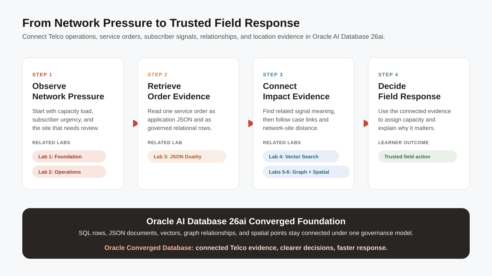
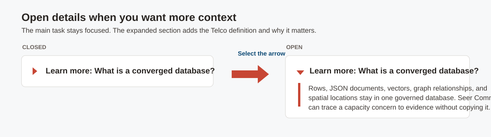

# Build Network Experience Intelligence with Oracle AI Database 26ai

## Introduction

Monday morning starts with a familiar network-operations problem: subscriber experience is slipping, but the evidence is scattered across capacity metrics, service orders, customer signals, case relationships, and location data. At Seer Comms, the incident is **TEL-5G-2026-501**, a critical 5G congestion case near Hudson Yards during an event period.

In this workshop, you investigate one escalating incident: `TEL-5G-2026-501`, a critical 5G congestion case near Hudson Yards during an event period. It affects 31,200 subscribers and puts $2.14M in service value at risk. You use **Oracle AI Database 26ai** to follow the evidence from the first capacity warning to a reviewable field response: the site, the affected service order, the subscriber signal, the connected case entities, nearby response locations, and the capacity-risk prediction.

*Figure 1: Each lab advances the `TEL-5G-2026-501` investigation, from Hudson Yards capacity pressure to a field-response decision.*

Throughout the workshop, expandable **Key terms**, **Learn more**, and **Why this matters** sections give you optional context without interrupting the main investigation. Open them when you want a definition, a telecom example, or the business reason the capability matters; keep them closed when you want to stay focused on the hands-on SQL path.

The example below shows an expandable Telco section before and after it is opened.

<strong>Learn more: What does converged database mean?</strong>

> A **converged database** keeps relational rows, JSON documents, vectors, graphs, and spatial data in one governed database.
>
> For Seer Comms, a service-order document, its subscriber, a related signal, a network site, and a dispatch decision stay connected. Teams do not need to copy the same evidence among specialist systems before they can explain a decision.

<strong>Why this matters: Autonomous Database and a connected evidence foundation</strong>

> **Autonomous Database** is Oracle's managed cloud database service. It automates routine operations such as patching, backups, security maintenance, and scaling so database teams can spend more time on the network-experience decision instead of infrastructure upkeep.
>
> In this workshop, its converged database capabilities keep SQL rows, JSON documents, vectors, graph relationships, and spatial locations under one security and governance model. That reduces sensitive copies and gives Seer Comms a repeatable path from a capacity concern to the evidence that explains the response.

### Objectives

- Trace the Seer Comms incident evidence through SQL, from the data foundation to a reviewable network-response decision.
- Use JSON Relational Duality, AI Vector Search, Property Graph, Oracle Spatial, and Oracle Machine Learning (OML) to connect service orders, subscriber signals, impact relationships, locations, and capacity-risk scores.
- Explain how each dashboard or planning result can be traced back to governed database evidence.
- Describe how one database foundation reduces duplicate data movement, reconciliation work, and fragmented governance during a telecom incident response.

Estimated Workshop Time: **80 minutes**

### Business Scenario

| Step | Telco focus |
| --- | --- |
| Business Problem | Network and service teams need a fast, reviewable way to understand a subscriber-experience issue. |
| Technical Challenge | Orders, signals, relationships, capacity, and geography can otherwise be separated across systems. |
| Persona Focus | You support network operations leaders, service-order developers, and field planners. |
| What You Will Do | Query the evidence behind the Seer Comms application decision journey. |
| Database Capability | SQL, JSON, vectors, graphs, and spatial data operate in one database. |
| Outcome | You can connect an operational observation to explainable, repeatable evidence. |

The labs follow one escalation path: identify the evidence foundation, prioritize loaded sites, inspect the affected service order, interpret the subscriber signal, map the case impact, compare response locations, and review the next capacity-risk decision.

## Acknowledgements

* **Author** - Pat Shepherd, Senior Principal Database Product Manager
* **Last Updated By/Date** - Pat Shepherd, July 2026
