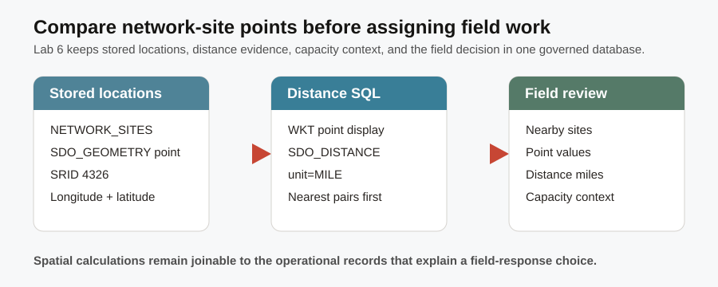
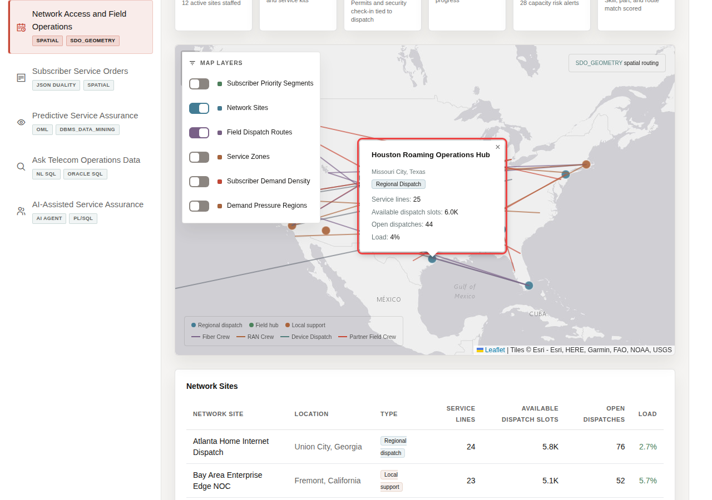

# Network Access and Field Operations

## Introduction

Field response depends on more than a ticket number. You are the field-operations planner deciding which network locations are close enough to support a response. Oracle Spatial keeps network-site and subscriber points, plus the distance calculation between them, connected to the same service and capacity evidence.



The application image below is the Network Sites and Routes map. A field planner uses it to orient a response; the SQL in this lab explains the geographic evidence behind the map.



### Objectives

- Confirm the spatial layers used for network and field planning.
- Inspect the point layers used for site and subscriber location.
- Use a distance calculation to compare network sites.

Estimated Time: **12 minutes**

### Business Scenario

| Step | Telco focus |
| --- | --- |
| Business Problem | Field planners must connect network location, coverage, and capacity before routing work. |
| Technical Challenge | Moving location data to a separate mapping service breaks the evidence path. |
| Persona Focus | You are a network access and field-operations planner. |
| What You Will Do | Inspect spatial layers and compare site locations. |
| Database Capability | Oracle Spatial point layers and SQL distance functions. |
| Outcome | Geographic decisions stay connected to operational data. |

<details>
<summary><strong>Key terms: spatial data, SDO_GEOMETRY, SRID, point, GeoJSON, and distance</strong></summary>

> - **Spatial data** is location information that Oracle Database can store, index, join, and calculate with alongside operational rows. It keeps a field-routing decision connected to the site and capacity facts that explain it.
>
> - **SDO_GEOMETRY** is Oracle Spatial's data type for a location or shape. The `LOCATION` column in this lab uses it to store each network-site or subscriber point.
>
> - An **SRID** (spatial reference identifier) tells Oracle which coordinate system a geometry uses. `4326` means the familiar global longitude-and-latitude system used by many maps.
>
> - A **point** is one latitude-and-longitude location. **GeoJSON** and Well-Known Text (WKT) are readable formats that can show that same point when you need to inspect it outside a map.
>
> - **Spatial distance** is a database calculation that compares locations without separating map evidence from service operations data. `SDO_GEOM.SDO_DISTANCE` returns the miles used in the response comparison.
</details>

## Task 1: Confirm spatial layers

1. Follow the steps below.

    > **SQL Worksheet reminder:** Need a reminder on how to open and use the SQL Worksheet? Return to [Getting Started Task 2: Open SQL Worksheet](?lab=getting-started#Task2:OpenSQLWorksheet) for the step-by-step graphic showing where to paste and run SQL statements.

    The spatial metadata catalog tells Oracle how geometry columns are interpreted. In this lab, each point identifies a network site or subscriber location, and the shared SRID shows that both layers use the same longitude-and-latitude reference system.

    ```sql
    <copy>
    SELECT table_name AS "Spatial Layer",
           column_name AS "Geometry Column",
           srid AS "SRID"
    FROM user_sdo_geom_metadata
    WHERE table_name IN ('NETWORK_SITES','SUBSCRIBERS')
    ORDER BY table_name;
    </copy>
    ```

    **Expected output: Spatial Layers**

    | Spatial Layer | Geometry Column | SRID |
    | --- | --- | --- |
    | NETWORK\_SITES | LOCATION | 4326 |
    | SUBSCRIBERS | LOCATION | 4326 |

## Task 2: Compare the distance between network sites

1. Follow the steps below.

    `SDO_GEOM.SDO_DISTANCE` compares two `SDO_GEOMETRY` point values. The query pairs different sites, displays each point in map-readable Well-Known Text (WKT), calculates a distance in miles, and returns the closest examples. WKT writes a point as `POINT (longitude latitude)`, so you can see the source location values used by the calculation.

    1. `network_sites a` and `network_sites b` are two names for the same table so the query can compare one site with another.
    2. `a.network_site_id < b.network_site_id` prevents a site from pairing with itself and prevents reversed duplicates such as A-to-B and B-to-A.
    3. `SDO_UTIL.TO_WKTGEOMETRY` displays the same stored spatial point that the distance function uses.
    4. `SDO_GEOM.SDO_DISTANCE(..., 'unit=MILE')` calculates miles; sorting and the three-row limit put the nearest pairs first.

    ```sql
    <copy>
    SELECT a.network_site_name AS "From Site",
           a.city || ', ' || a.state_province AS "From Location",
           DBMS_LOB.SUBSTR(
             SDO_UTIL.TO_WKTGEOMETRY(a.location), 60, 1
           ) AS "From Point (Lon Lat)",
           b.network_site_name AS "To Site",
           b.city || ', ' || b.state_province AS "To Location",
           DBMS_LOB.SUBSTR(
             SDO_UTIL.TO_WKTGEOMETRY(b.location), 60, 1
           ) AS "To Point (Lon Lat)",
           ROUND(SDO_GEOM.SDO_DISTANCE(a.location, b.location, 0.005, 'unit=MILE'), 1) AS "Distance Miles"
    FROM network_sites a
    JOIN network_sites b ON a.network_site_id < b.network_site_id
    WHERE a.location IS NOT NULL
      AND b.location IS NOT NULL
    ORDER BY SDO_GEOM.SDO_DISTANCE(a.location, b.location, 0.005, 'unit=MILE')
    FETCH FIRST 3 ROWS ONLY;
    </copy>
    ```

    **Expected output: Nearby Network-Site Pairs**

    | From Site | From Location | From Point (Lon Lat) | To Site | To Location | To Point (Lon Lat) | Distance Miles |
    | --- | --- | --- | --- | --- | --- | ---: |
    | Hudson Yards 5G Macro Site | New York, New York | POINT (-74.002 40.754) | Newark 5G Core Site | Newark, New Jersey | POINT (-74.1724 40.7357) | 9.0 |
    | Wilmington Network Access Hub | Wilmington, Delaware | POINT (-75.5398 39.7391) | Philadelphia Network Core | Philadelphia, Pennsylvania | POINT (-75.1652 39.9526) | 24.8 |
    | Boston Service Assurance Hub | Boston, Massachusetts | POINT (-71.0589 42.3601) | Providence Network Hub | Providence, Rhode Island | POINT (-71.4128 41.824) | 41.2 |

    The shortest listed pair is Atlanta East Fiber Hub and Dallas 5G Dispatch Center. In a live response, a planner would combine this distance with crew availability and the case impact already identified in the graph lab.

## Acknowledgements

* **Author** - Pat Shepherd, Senior Principal Database Product Manager
* **Last Updated By/Date** - Pat Shepherd, July 2026
