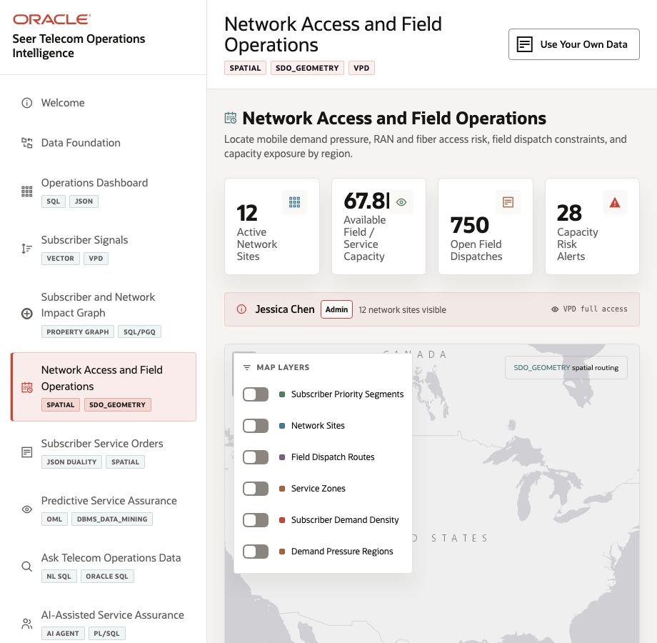
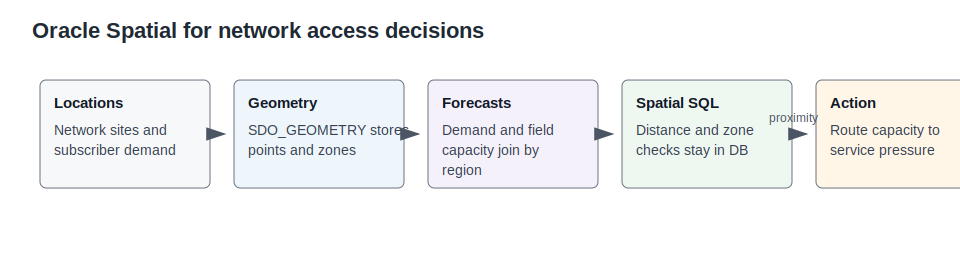

# Lab 5: Network Access and Field Operations

## Introduction

Oracle Spatial connects network sites, service zones, demand density, and field dispatch context to the same operational data foundation.

Estimated Time: 10 minutes

| Operating Story | Detail |
| --- | --- |
| Business Problem | Field teams need to know where capacity and demand are misaligned. |
| Technical Challenge | Location, service orders, network capacity, and demand forecasts often sit in separate tools. |
| Persona Focus | Field operations manager, network access planner, and NOC dispatcher. |
| What You Will Prove | Spatial objects and SQL can support network-site, zone, and dispatch decisions. |
| Database Capability | Oracle Spatial, `SDO_GEOMETRY`, spatial joins, distance calculations. |
| Outcome | Operators can turn map context into capacity action. |
{: title="What this lab proves"}

**Persona focus:** You are the field operations manager deciding which sites need capacity relief.

### Objectives

- Review the LiveStack scene evidence.
- Run SQL that proves the database pattern.
- Connect the result to the next operating decision.

## How This Lab Fits the Story

You turn impact into a field decision. The spatial and capacity queries show where network sites, demand, and dispatch work meet, which helps operations teams decide where capacity relief should start.

## Scene Evidence

Use the screenshot as scene grounding. The SQL tasks below provide the exact values to verify.

## Task 1: Inspect network sites

1. Run this SQL block.

    This query identifies active sites and their current load so the map has operational meaning.

    <copy>
SELECT network_site_name, network_site_type, city, state_province, service_capacity_units, current_capacity_load_pct
FROM seer_comms_network_sites_v
WHERE is_active = 1
ORDER BY current_capacity_load_pct DESC
FETCH FIRST 8 ROWS ONLY;
    </copy>

Expected output:

| Network Site Name | Network Site Type | City | State Province | Service Capacity Units | Current Capacity Load Pct |
| --- | --- | --- | --- | ---: | ---: |
| Atlanta Home Internet Dispatch | NOC / regional operations hub | Atlanta | GA | 5850 | 82 |
| Dallas 5G Dispatch Center | Fiber or device field hub | Dallas | TX | 5500 | 79 |
{: title="Network sites available for spatial analysis"}

## Task 2: Find capacity risk by service and site

1. Run this SQL block.

    This query turns capacity thresholds into a short list of places that may need action.

    <copy>
SELECT service_name,
       network_site_name,
       capacity_available,
       capacity_reserved,
       escalation_threshold,
       CASE WHEN capacity_available <= escalation_threshold THEN 'Capacity risk' ELSE 'Available' END AS capacity_status
FROM seer_comms_network_capacity_v
WHERE capacity_available <= escalation_threshold
ORDER BY capacity_available
FETCH FIRST 8 ROWS ONLY;
    </copy>

Expected output:

| Service Name | Network Site Name | Capacity Available | Capacity Reserved | Escalation Threshold | Capacity Status |
| --- | --- | ---: | ---: | ---: | --- |
| Number Port-In Activation | NYC Network Command Center | 37 | 16 | 50 | Capacity risk |
| Gigabit Fiber Install | Houston Roaming Operations Hub | 55 | 21 | 60 | Capacity risk |
{: title="Capacity risks by service and site"}

## Task 3: Review field dispatch evidence

1. Run this SQL block.

    This query connects capacity pressure to active field work that operations teams can coordinate.

    <copy>
SELECT dispatch_id, service_order_id, network_site_name, dispatch_status
FROM seer_comms_field_dispatch_v
WHERE dispatch_status <> 'Completed'
ORDER BY dispatch_id
FETCH FIRST 6 ROWS ONLY;
    </copy>

Expected output:

| Dispatch ID | Service Order ID | Network Site Name | Dispatch Status |
| ---: | ---: | --- | --- |
| 1 | 3 | Phoenix Device Logistics Hub | In Progress |
| 5 | 11 | Houston Roaming Operations Hub | In Progress |
{: title="Field dispatches tied to network sites"}

## Learn More

- See `ORACLE_REFERENCE_LINKS.md` in the supporting files directory for official Oracle documentation links.

## Acknowledgements

- **Author** - Oracle LiveLabs Team
