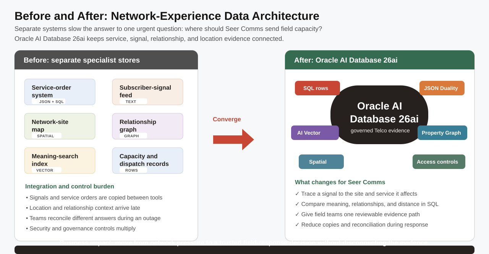

# Data Foundation

## Introduction

The `TEL-5G-2026-501` investigation starts with a simple question: where does the evidence live? This critical Hudson Yards congestion case affects 31,200 subscribers and puts $2.14M at risk. You are the database developer who gives operations, service-order, and field teams one governed starting point. In this lab, you confirm the tables and specialized objects that support every later step of the investigation.



The diagram contrasts a fragmented data estate with the connected foundation used here. Notice that the same operational facts can support relational SQL, JSON documents, semantic matches, graph relationships, and spatial distance without creating separate copies.

### Objectives

- Inventory the core Telco tables and database capabilities.
- Confirm the JSON, vector, graph, and spatial objects used later.

Estimated Time: **10 minutes**

### Business Scenario

| Step | Telco focus |
| --- | --- |
| Business Problem | Operations teams need one trustworthy evidence foundation. |
| Technical Challenge | Disconnected stores create copies and conflicting definitions. |
| Persona Focus | You are a database developer supporting network operations. |
| What You Will Do | Inspect the fixed object families behind the application. |
| Database Capability | Oracle catalog views and a converged database. |
| Outcome | Later decisions can be traced to governed data. |

<details>
<summary><strong>Key terms: evidence table, catalog view, UNION ALL, and converged database</strong></summary>

> - An **evidence table** stores the facts a team needs to review. In this workshop, `NETWORK_SITES`, `SUBSCRIBER_SIGNALS`, and `SERVICE_ORDERS` keep the location, customer-language, and order facts that explain a network response. Keeping those facts in Oracle means later SQL, JSON, vector, graph, and spatial work starts from the same governed source.
>
> - A **catalog view** is Oracle's built-in inventory of database objects. You use catalog views in this lab to see what is available before you build an application query or investigate an incident.
>
> - **UNION ALL** stacks the rows returned by separate `SELECT` statements into one result. Here, each `SELECT` answers one readiness question, and `UNION ALL` preserves every answer so you can read one capability checklist.
>
> - A **converged database** keeps relational, JSON, vector, graph, spatial, and machine-learning evidence connected. That reduces data copies, avoids reconciliation work, and lets Seer Comms use one security and governance model when a capacity decision must be explained.
</details>

## Task 1: Inventory the evidence layer

1. Run the inventory query.

    > **SQL Worksheet reminder:** Need a reminder on how to open and use the SQL Worksheet? Return to [Getting Started Task 2: Open SQL Worksheet](?lab=getting-started#Task2:OpenSQLWorksheet) for the step-by-step graphic showing where to paste and run SQL statements.

    In order to understand this query, read it in six short parts.

    1. The first `SELECT` counts the core Telco tables that store operational facts.
    2. The next four `SELECT` statements count the JSON duality view, property graph, vector columns, and spatial layers used by later labs.
    3. The final `SELECT` counts the Oracle Machine Learning model used for predictive service assurance.
    4. `UNION ALL` stacks those separate counts into one capability checklist without removing any result rows.

    The tables hold Telco facts; the duality view, graph, vectors, spatial metadata, and model add specialized evidence without moving those facts elsewhere.

    ```sql
    <copy>
    SELECT 'Core Telco tables' AS "Area", COUNT(*) AS "Count"
    FROM user_tables
    WHERE table_name IN (
      'SERVICE_LINES', 'TELECOM_SERVICES', 'NETWORK_SITES',
      'NETWORK_CAPACITY', 'SUBSCRIBERS', 'SUBSCRIBER_SIGNALS',
      'SERVICE_ORDERS'
    )
    UNION ALL
    SELECT 'JSON duality views', COUNT(*)
    FROM user_json_duality_views
    WHERE view_name = 'ORDERS_DV'
    UNION ALL
    SELECT 'Property graphs', COUNT(*)
    FROM user_property_graphs
    WHERE graph_name = 'TELECOM_EXPERIENCE_NETWORK'
    UNION ALL
    SELECT 'Vector columns', COUNT(*)
    FROM user_tab_cols
    WHERE data_type = 'VECTOR'
      AND table_name IN ('SERVICE_EMBEDDINGS', 'SIGNAL_EMBEDDINGS')
    UNION ALL
    SELECT 'Spatial layers', COUNT(*)
    FROM user_sdo_geom_metadata
    WHERE table_name IN ('NETWORK_SITES', 'SUBSCRIBERS')
    UNION ALL
    SELECT 'OML models', COUNT(*)
    FROM user_mining_models
    WHERE model_name = 'NETWORK_CAPACITY_SURGE_MODEL';
    </copy>
    ```

    **Expected output: Object Inventory**

    | Area | Count |
    | --- | --- |
    | Core Telco tables | 7 |
    | JSON duality views | 1 |
    | Property graphs | 1 |
    | Vector columns | 2 |
    | Spatial layers | 2 |
    | OML models | 1 |

    Read the six rows as a capability map for the labs ahead. Each row names one object family that stays with the same Telco facts instead of moving to a separate system.

## Task 2: Measure network footprint and case impact

1. Run the row-count query.

    This query measures the Seer Comms network footprint and the business impact of the critical experience case. The 54 network sites span 50 states. `TEL-5G-2026-501` affects 31,200 subscribers and places $2.14M in service value at risk, so the operations team has a clear reason to prioritize the event-venue congestion response.

    **What is `TEL-5G-2026-501`?** It is the Seer Comms case ID for a critical 5G congestion incident near Hudson Yards during an event period. The ID links the incident to its affected-subscriber estimate, service value at risk, signal, site, support case, and later graph investigation. Treat it as the incident number you would use to coordinate a response, not as a database object or a subscriber ID.

    Read the query in four steps.

    1. Each `COUNT(*)` counts all rows in one named evidence table.
    2. `COUNT(DISTINCT state_province)` counts coverage states, even when a state has more than one site.
    3. The case query reads the stored `SUBSCRIBERS_AFFECTED` measure for the critical case. This is the business-reach value an operations leader uses to assess urgency.
    4. `UNION ALL` stacks the seven independent measures without removing an answer or changing the stored data.

    ```sql
    <copy>
    SELECT 'Telecom services' AS "Evidence", COUNT(*) AS "Rows"
    FROM telecom_services
    UNION ALL
    SELECT 'Network sites', COUNT(*)
    FROM network_sites
    UNION ALL
    SELECT 'States with network sites', COUNT(DISTINCT state_province)
    FROM network_sites
    UNION ALL
    SELECT 'Subscribers affected by critical case', subscribers_affected
    FROM telecom_experience_cases
    WHERE case_ref = 'TEL-5G-2026-501'
    UNION ALL
    SELECT 'Subscriber signals', COUNT(*)
    FROM subscriber_signals
    UNION ALL
    SELECT 'Service orders', COUNT(*)
    FROM service_orders
    UNION ALL
    SELECT 'Graph entities', COUNT(*)
    FROM telecom_graph_entities;
    </copy>
    ```

    **Expected output: Data Row Counts**

    | Evidence | Rows |
    | --- | --- |
    | Telecom services | 8 |
    | Network sites | 54 |
    | States with network sites | 50 |
    | Subscribers affected by critical case | 31200 |
    | Subscriber signals | 62 |
    | Service orders | 58 |
    | Graph entities | 62 |

    Read the result as a connected operations picture: national network coverage, subscriber impact, service demand, and the entities that describe the incident all stay in one database. The next lab uses the `NETWORK_SITES` rows to turn this foundation into an operations priority.

## Acknowledgements

* **Author** - Pat Shepherd, Senior Principal Database Product Manager
* **Last Updated By/Date** - Pat Shepherd, July 2026
