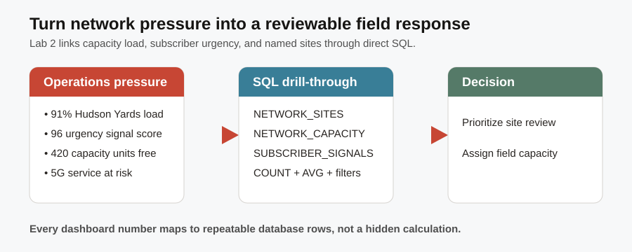

# Telecom Service Assurance Dashboard

## Introduction

**TEL-5G-2026-501** now needs an operations starting point. Hudson Yards is running at **91%** capacity load, so the network operations analyst must decide whether it belongs at the top of the review queue. In this lab, you move from a national capacity summary to the named high-load sites behind it, using direct SQL to make the priority visible and reviewable.

The flow graphic shows the lab pattern: a KPI identifies capacity pressure, SQL reveals the contributing rows, and an operations leader uses those rows to prioritize response. The lab uses the validated **Hudson Yards** load of **91%**, so the learner can connect the dashboard-level signal to the operational evidence behind it.



### Objectives

- Produce an operations summary from the Seer Comms Telco tables.
- Drill from capacity pressure to reviewable network-site rows.
- Understand why direct SQL is useful for transparent dashboard evidence.

Estimated Time: **12 minutes**

### Business Scenario

| Step | Telco focus |
| --- | --- |
| Business Problem | A leader needs to prioritize pressure before it affects service experience. |
| Technical Challenge | A KPI without its contributing rows cannot be reviewed or assigned. |
| Persona Focus | You are a network operations analyst. |
| What You Will Do | Summarize capacity, then drill into the most loaded sites. |
| Database Capability | Relational SQL over the governed `NETWORK_SITES` table. |
| Outcome | The team can explain which sites need follow-up. |

<details>
<summary><strong>Key terms: capacity units, load percentage, key performance indicator (KPI), and drill-through</strong></summary>

> - **Capacity units** are Seer Comms' normalized planning measure of the concurrent service workload a site is engineered to carry in this workshop. They are a comparative capacity measure, not a count of physical towers, subscribers, or network speed.
>
> - **Load percentage** shows how much of that planned capacity is currently committed. A high percentage is a signal to investigate capacity pressure; it is not by itself a dispatch order.
>
> - A **key performance indicator (KPI)** is a summary measure that helps an operations team spot pressure quickly. Here, average capacity load identifies where to look first across the national site set.
>
> - A **drill-through** returns the reviewable rows behind a summary. It lets an operations leader move from a state-level load value to a named network site and capacity figure without exporting the evidence to a separate reporting system.
</details>

## Task 1: Summarize capacity pressure

Start with the capacity summary so you can see where network pressure appears across the national site footprint:

1. Follow the steps below:

    > **SQL Worksheet reminder:** Need a reminder on how to open and use the SQL Worksheet? Return to [Getting Started Task 2: Open SQL Worksheet](?lab=getting-started#Task2:OpenSQLWorksheet) for the step-by-step graphic showing where to paste and run SQL statements.

    In order to understand this query, read it in three parts.

    1. `NETWORK_SITES` supplies one operational row for each location in the national planning set.
    2. `GROUP BY state_province` creates one regional summary row per state; `COUNT(*)` tells you how many sites contributed.
    3. `SUM` shows total planned capacity and `AVG` shows average load, making it easier to compare states before you open the individual sites.

    ```sql
    <copy>
    SELECT state_province AS "State",
           COUNT(*) AS "Sites",
           SUM(service_capacity_units) AS "Capacity Units",
           ROUND(AVG(current_capacity_load_pct), 1) AS "Average Load %"
    FROM network_sites
    GROUP BY state_province
    ORDER BY "Average Load %" DESC, "Capacity Units" DESC
    FETCH FIRST 10 ROWS ONLY;
    </copy>
    ```

    **Expected output: Capacity by State**

    | State | Sites | Capacity Units | Average Load % |
    | --- | ---: | ---: | ---: |
    | Florida | 1 | 34000 | 89.0 |
    | New Jersey | 1 | 33000 | 86.0 |
    | California | 2 | 55000 | 85.5 |
    | Washington | 1 | 33000 | 85.0 |
    | Nevada | 1 | 29000 | 84.0 |

    The table is a review queue, not an automatic dispatch list. Florida has the highest state-level load in this deterministic scenario, while California's two locations show why a state summary can represent more than one site. The next task shows the named sites, capacity units, and units in use that an operations leader needs before assigning work.

## Task 2: Drill into high-load network sites

Drill from the summary into named high-load sites so the operations priority becomes assignable to real locations:

1. Follow the steps below:

    The next query drills through to reviewable rows rather than only a dashboard total.

    1. The `WHERE` clause keeps locations at or above 70% planned capacity, the investigation threshold for this scenario.
    2. `service_capacity_units * current_capacity_load_pct / 100` estimates the planning units already in use.
    3. `ORDER BY` puts the most-loaded named site first, so you can pair the summary with an assignable location.

    ```sql
    <copy>
    SELECT network_site_name AS "Network Site",
           city AS "City",
           state_province AS "State",
           service_capacity_units AS "Capacity Units",
           ROUND(service_capacity_units * current_capacity_load_pct / 100) AS "Units In Use",
           current_capacity_load_pct AS "Load %"
    FROM network_sites
    WHERE current_capacity_load_pct >= 70
    ORDER BY current_capacity_load_pct DESC, network_site_name
    FETCH FIRST 10 ROWS ONLY;
    </copy>
    ```

    **Expected output: High-Load Sites**

    | Network Site | City | State | Capacity Units | Units In Use | Load % |
    | --- | --- | --- | ---: | ---: | ---: |
    | Hudson Yards 5G Macro Site | New York | New York | 52000 | 47320 | 91.0 |
    | Miami Service Assurance Hub | Miami | Florida | 34000 | 30260 | 89.0 |
    | San Francisco Network Edge | San Francisco | California | 31000 | 27280 | 88.0 |
    | Newark 5G Core Site | Newark | New Jersey | 33000 | 28380 | 86.0 |
    | Seattle Network Access Hub | Seattle | Washington | 33000 | 28050 | 85.0 |

    For a production dashboard, indexes on join and filter columns can reduce query cost, and a materialized view can help with stable high-volume summaries. This lab keeps the query direct so you can see exactly how the operational result is formed.

    The high-load site list leads into the service-order lab because every operational response must stay connected to the subscriber order it affects.

## Acknowledgements

* **Author** - Pat Shepherd, Senior Principal Database Product Manager
* **Last Updated By/Date** - Pat Shepherd, July 2026
