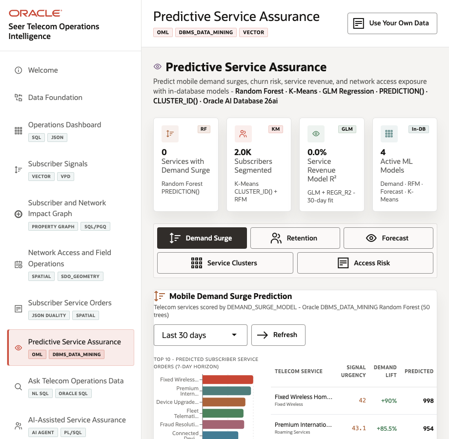
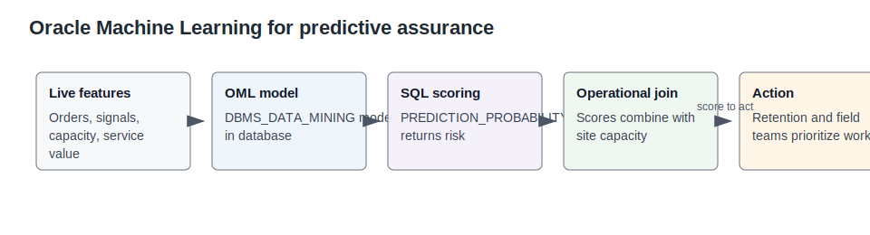
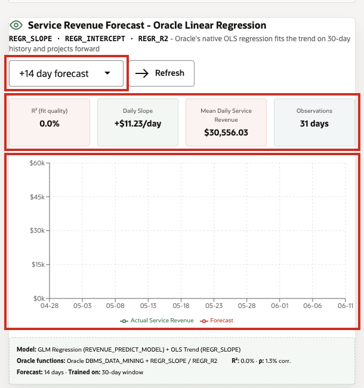

# Lab 7: Predictive Service Assurance with OML

## Introduction

Predictive assurance helps telecom teams understand demand surge, retention segments, service clusters, revenue forecast quality, and access risk without moving data into a separate notebook-only workflow.

Estimated Time: 10 minutes

| Operating Story | Detail |
| --- | --- |
| Business Problem | Retention and capacity teams need model signals that are explainable enough to drive action. |
| Technical Challenge | Predictions lose trust when features, scores, and operational context are separated. |
| Persona Focus | Service assurance analytics manager, churn-risk analyst, and data science lead. |
| What You Will Learn | OML scoring patterns can run close to governed telecom data and join back to operations context. |
| Database Capability | Oracle Machine Learning for SQL, `DBMS_DATA_MINING`, `PREDICTION_PROBABILITY`, `CLUSTER_ID`. |
| Outcome | Scores become operational signals for capacity, care, and retention teams. |
{: title="What this lab covers"}

**Persona focus:** You are the analytics lead translating model output into service assurance decisions.

### Objectives

- Review demand and signal features that indicate service pressure.
- Compare subscriber tiers that affect assurance planning.
- Join predicted demand to capacity exposure so teams can prioritize action.

The image below is the predictive assurance page. Analytics and service assurance teams use this area to understand where demand may create future service risk. The SQL in this lab shows how forecast-style evidence can be joined back to operational capacity.



The concept diagram below introduces the OML pattern used in the lab. It shows why scoring close to governed data matters: predictions stay connected to the service, subscriber, and capacity rows teams already trust.



## How This Lab Fits the Story

You look ahead after reviewing current operations. The predictive assurance queries show how service signals, customer experience, demand forecasts, and capacity can become evidence for action, not just charts to monitor.

## Scene Evidence

Use the screenshot to orient the predictive assurance scenario. The SQL tasks below show how demand, subscriber, and capacity evidence become an action list a service assurance team can review.

The image below shows service demand and revenue forecast context. It gives planners a way to see which services are gaining pressure before the issue becomes a visible outage or care spike.



The image below shows retention-style subscriber segments. It helps teams connect service assurance to customer value and experience, not just raw demand.


## Task 1: Inspect service demand signals

1. Run this SQL block.

    This query prepares model-style features from current service demand and revenue evidence. The joins connect services to signal matches and service orders, then aggregate recent signal count, order count, and value. Look for services where subscriber attention is already turning into measurable business activity.

    ```sql
    <copy>
    SELECT s.service_name,
       COUNT(DISTINCT m.signal_id) AS recent_signal_count,
       COUNT(DISTINCT o.service_order_id) AS service_orders,
       ROUND(SUM(o.service_value), 0) AS service_value
    FROM seer_comms_services_v s
    LEFT JOIN seer_comms_signal_matches_v m ON m.service_id = s.service_id
    LEFT JOIN seer_comms_service_orders_v o ON o.source_signal_id = m.signal_id
    GROUP BY s.service_name
    ORDER BY recent_signal_count DESC
    FETCH FIRST 8 ROWS ONLY;
    </copy>
    ```

    **Expected output: Service demand signals for prediction**

    | Service Name | Recent Signal Count | Service Orders | Service Value |
    | --- | ---: | ---: | ---: |
    | Device Upgrade Enrollment | 107 | 260 | 67600 |
    | Fixed Wireless Home Internet | 102 | 248 | 64100 |
    {: title="Service demand signals for prediction"}

## Task 2: Review retention-style customer experience features

1. Run this SQL block.

    This query groups customer experience signals so retention teams can reason about segments. It calculates subscriber counts, average lifetime value, and average demand score by tier. That helps planners see whether a group is large, valuable, or showing demand patterns that deserve attention.

    ```sql
    <copy>
    SELECT subscriber_tier,
       COUNT(*) AS subscribers,
       ROUND(AVG(service_value), 0) AS avg_lifetime_value,
       ROUND(AVG(avg_demand_score), 2) AS avg_demand_score
    FROM seer_comms_customer_experience_v
    GROUP BY subscriber_tier
    ORDER BY subscribers DESC;
    </copy>
    ```

    **Expected output: Subscriber tiers for assurance planning**

    | Subscriber Tier | Subscribers | Avg Lifetime Value | Avg Demand Score |
    | --- | ---: | ---: | ---: |
    | Potential | 59 | 1740 | 63.12 |
    | Loyal | 10 | 6180 | 44.70 |
    {: title="Subscriber tiers for assurance planning"}

## Task 3: Join predicted demand to capacity exposure

1. Run this SQL block.

    This query connects forecast demand to available network capacity, turning scores into an action list. The join ties each forecasted service to capacity at network sites, and the `CASE` expression labels access risk when demand exceeds capacity. The useful result is not just a prediction; it is a specific service and site where the team can act.

    ```sql
    <copy>
    SELECT f.service_name,
       c.network_site_name,
       c.capacity_available,
       f.predicted_service_demand,
       f.signal_factor,
       CASE WHEN c.capacity_available < f.predicted_service_demand THEN 'Access risk' ELSE 'Covered' END AS access_status
    FROM seer_comms_demand_forecasts_v f
    JOIN seer_comms_network_capacity_v c ON c.service_id = f.service_id
    WHERE f.forecast_date = (SELECT MAX(forecast_date) FROM seer_comms_demand_forecasts_v)
    ORDER BY (f.predicted_service_demand - c.capacity_available) DESC
    FETCH FIRST 8 ROWS ONLY;
    </copy>
    ```

    **Expected output: Access risks that need action**

    | Service Name | Network Site Name | Capacity Available | Predicted Service Demand | Signal Factor | Access Status |
    | --- | --- | ---: | ---: | ---: | --- |
    | Device Upgrade Enrollment | Boston Family Plan Support Center | 13 | 141 | 1.28 | Access risk |
    | Fixed Wireless Home Internet | Seattle Customer Experience Center | 23 | 139 | 1.24 | Access risk |
    {: title="Access risks that need action"}


## Learn More

- See `ORACLE_REFERENCE_LINKS.md` in the supporting files directory for official Oracle documentation links.

## Acknowledgements

- **Author** - Oracle LiveLabs Team
