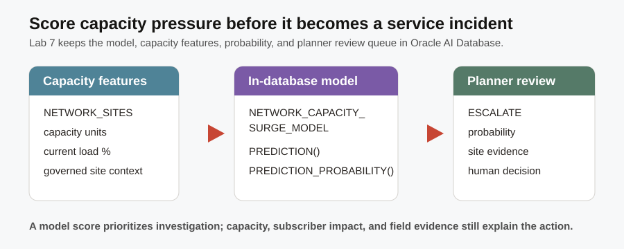

# Predictive Service Assurance

## Introduction

Capacity pressure is easier to manage before it becomes a visible service problem. You are the capacity planner who needs to decide which locations deserve review before a peak period, using more than a single dashboard threshold. Oracle Machine Learning (OML) trains and scores a Telco-specific capacity-risk model inside Oracle AI Database, where the site capacity and load features already live. That keeps the prediction, its business context, and the SQL evidence together.



### Objectives

- Confirm that the Telco capacity-risk model is available in the workshop schema.
- Score network sites for service-impact risk with SQL.
- Interpret a model prediction as a planning signal, not as an automatic action.

Estimated Time: **15 minutes**

### Business Scenario

| Step | Telco focus |
| --- | --- |
| Business Problem | Capacity teams need to prioritize locations before pressure becomes a subscriber-experience incident. |
| Technical Challenge | Exporting capacity features to a separate machine-learning system creates copies and separates predictions from operational evidence. |
| Persona Focus | You are a capacity planner supporting service assurance. |
| What You Will Do | Inventory a persisted OML model, score network sites, and compare the prediction with the known planning label. |
| Database Capability | Oracle Machine Learning model catalog, `PREDICTION`, and `PREDICTION_PROBABILITY`. |
| Outcome | You can use a reviewable model signal beside the capacity evidence that explains it. |

<details>
<summary><strong>Key terms: Oracle Machine Learning (OML), feature, classification, prediction, and probability</strong></summary>

> - **Oracle Machine Learning (OML)** builds, stores, and scores models inside Oracle Database. In this lab, it keeps capacity planning features and their predictions close to the governed Telco records instead of exporting them to a separate platform.
>
> - A **feature** is an input that a model uses to recognize a pattern. `SERVICE_CAPACITY_UNITS` and `CURRENT_CAPACITY_LOAD_PCT` are the capacity features used by this Telco model.
>
> - **Classification** is a model task that chooses a category. `NETWORK_CAPACITY_SURGE_MODEL` classifies a site as `ESCALATE` or `MONITOR` for this deterministic planning scenario.
>
> - A **prediction** is the model's suggested category. It helps a planner choose what to review first; it is not a guaranteed outcome or an automatic dispatch decision.
>
> - **Probability** measures the model's confidence in one category. Higher probability means the model sees a stronger pattern in the supplied features, not that the result is certain.

</details>

## Task 1: Inventory the capacity-risk model

1. Run the model-inventory query.

    > **SQL Worksheet reminder:** Need a reminder on how to open and use the SQL Worksheet? Return to [Getting Started Task 2: Open SQL Worksheet](?lab=getting-started#Task2:OpenSQLWorksheet) for the step-by-step graphic showing where to paste and run SQL statements.

    `USER_MINING_MODELS` is Oracle's catalog of OML models owned by your schema. This readiness check is useful to a developer or planner because it confirms that the approved, persisted model is available before an application requests a score.

    ```sql
    <copy>
    SELECT model_name AS "OML Model",
           mining_function AS "Model Type"
    FROM user_mining_models
    WHERE model_name = 'NETWORK_CAPACITY_SURGE_MODEL';
    </copy>
    ```

    **Expected output: Capacity-Risk Model**

    | OML Model | Model Type |
    | --- | --- |
    | NETWORK\_CAPACITY\_SURGE\_MODEL | CLASSIFICATION |

    The model is persisted with the workshop schema. It can be called from SQL without moving the site features or the result to a separate system.

## Task 2: Score network sites for service-impact risk

1. Run the site-scoring query.

    In order to understand this query, read it in four parts.

    1. `NETWORK_SITES` supplies the site name, location, capacity units, and load percentage that make a score reviewable.
    2. `PREDICTION` applies the persisted OML model to those capacity features and returns the suggested planning label.
    3. `PREDICTION_PROBABILITY(..., 'ESCALATE' ...)` returns the model's confidence in the `ESCALATE` category.
    4. The `ORDER BY` clause brings the highest escalation probability to the top of the planner's review queue.

    ```sql
    <copy>
    SELECT network_site_name AS "Network Site",
           city AS "City",
           state_province AS "State",
           service_capacity_units AS "Capacity Units",
           current_capacity_load_pct AS "Load %",
           PREDICTION(network_capacity_surge_model USING
             service_capacity_units,
             current_capacity_load_pct
           ) AS "Predicted Risk",
           ROUND(PREDICTION_PROBABILITY(
             network_capacity_surge_model,
             'ESCALATE' USING
             service_capacity_units,
             current_capacity_load_pct
           ), 4) AS "Escalate Probability"
    FROM network_sites
    ORDER BY "Escalate Probability" DESC, "Load %" DESC
    FETCH FIRST 10 ROWS ONLY;
    </copy>
    ```

    **Expected output: Capacity-Risk Review Queue**

    | Network Site | City | State | Capacity Units | Load % | Predicted Risk | Escalate Probability |
    | --- | --- | --- | ---: | ---: | --- | ---: |
    | Hudson Yards 5G Macro Site | New York | New York | 52000 | 91.0 | ESCALATE | Highest result; model-dependent |
    | Miami Service Assurance Hub | Miami | Florida | 34000 | 89.0 | ESCALATE | Next highest result |
    | San Francisco Network Edge | San Francisco | California | 31000 | 88.0 | ESCALATE | Next highest result |

    The probability can vary slightly when a model is rebuilt in another environment. Use the model label and probability as a planning signal, then review the site load, capacity, subscriber impact, and field-routing evidence before assigning an action.

## Task 3: Compare the prediction with the workshop planning label

1. Run the comparison query.

    `NETWORK_CAPACITY_SURGE_TRAINING_V` is a saved SQL view that gives the model a repeatable feature shape. Its `ESCALATION_LABEL` is the deterministic workshop planning label. This simple comparison teaches how to look for agreement between the known label and the model's result; it is not a complete production model evaluation.

    ```sql
    <copy>
    SELECT ns.network_site_name AS "Network Site",
           t.escalation_label AS "Planning Label",
           PREDICTION(network_capacity_surge_model USING
             t.service_capacity_units,
             t.current_capacity_load_pct
           ) AS "Predicted Risk"
    FROM network_capacity_surge_training_v t
    JOIN network_sites ns ON ns.network_site_id = t.training_case_id
    WHERE t.current_capacity_load_pct >= 80
    ORDER BY t.current_capacity_load_pct DESC
    FETCH FIRST 10 ROWS ONLY;
    </copy>
    ```

    **Expected output: Prediction Comparison**

    | Network Site | Planning Label | Predicted Risk |
    | --- | --- | --- |
    | Hudson Yards 5G Macro Site | ESCALATE | ESCALATE |
    | Miami Service Assurance Hub | ESCALATE | ESCALATE |
    | San Francisco Network Edge | ESCALATE | ESCALATE |

    A matching label shows that the model recognizes the pattern represented by this deterministic scenario. A difference would be a reason to examine the feature values and the operating context—not a reason to ignore the site.

## Acknowledgements

* **Author** - Pat Shepherd, Senior Principal Database Product Manager
* **Last Updated By/Date** - Pat Shepherd, July 2026
