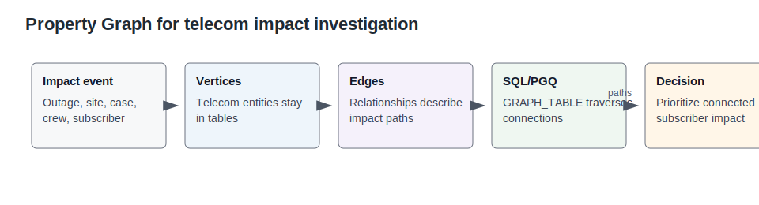

# Lab 4: Subscriber and Network Impact Graph

## Introduction

A telecom incident is rarely isolated. One outage can affect a service line, trigger cases, overload a site, and send crews into the field. Property Graph helps service assurance teams follow those connections instead of reading each record separately.

Estimated Time: 10 minutes

| Operating Story | Detail |
| --- | --- |
| Business Problem | An incident response team needs connected impact, not isolated ticket order. |
| Technical Challenge | Relationship analysis is hard when telecom entities live in separate OSS, BSS, CRM, NOC, and field systems. |
| Persona Focus | Network operations analyst and escalation manager. |
| What You Will Learn | SQL/PGQ can traverse telecom impact relationships stored in Oracle. |
| Database Capability | Oracle Property Graph and `GRAPH_TABLE` SQL/PGQ. |
| Outcome | Teams can prioritize response from connected subscriber impact. |
{: title="What this lab covers"}

**Persona focus:** You are the service assurance investigator moving from a named event to subscribers, sites, cases, and crews.

### Objectives

- Verify that impact entities and relationships are available for graph analysis.
- Identify high-risk outage, site, and service entities.
- Traverse connected impact paths from an event to affected subscribers and response context.

The image below is the impact graph workspace. A service assurance investigator would use it to move from a reported event to related sites, subscriber groups, cases, and crews. The SQL in this lab shows the graph evidence behind that investigation path.


The concept diagram below introduces the property graph pattern. It shows why relationships matter: the business question is not just what happened, but what else is connected to it and who may be affected.



## How This Lab Fits the Story

You investigate relationships after you know a service is under pressure. The graph queries show how an outage connects to cases, sites, subscribers, and response teams without forcing you to copy the data into a separate graph-only system.

## Scene Evidence

Use the screenshot to orient the impact investigation. The SQL tasks below show how graph relationships turn isolated records into a response path an escalation team can follow.

The image below is the SQL/PGQ query explorer. It shows how graph-style investigation can still be expressed through database-backed query evidence instead of a separate graph-only copy.


## Task 1: Count graph entities and relationships

1. Run this SQL block.

    This query checks that the graph has both the things you care about and the links between them. It counts entities and relationships from the graph tables. A list of entities is only an inventory; the relationships explain impact.

    ```sql
    <copy>
    SELECT 'Impact entities' AS graph_item, COUNT(*) AS records FROM telecom_graph_entities
    UNION ALL
    SELECT 'Impact relationships', COUNT(*) FROM telecom_graph_relationships;
    </copy>
    ```

    **Expected output: Impact graph inventory**

    | Graph Item | Records |
    | --- | ---: |
    | Impact entities | 36 |
    | Impact relationships | 50 |
    {: title="Impact graph inventory"}

## Task 2: Find high-impact events

1. Run this SQL block.

    This query surfaces the events and entities with the highest risk. The `WHERE` clause focuses on outage events, network sites, and service lines, while `ORDER BY risk_score DESC` puts the most urgent records first. That helps an investigator start with incidents most likely to affect subscribers.

    ```sql
    <copy>
    SELECT entity_key, display_name, entity_type, region, affected_count, risk_score, experience_score
    FROM telecom_graph_entities
    WHERE entity_type IN ('outage_event', 'network_site', 'service_line')
    ORDER BY risk_score DESC
    FETCH FIRST 6 ROWS ONLY;
    </copy>
    ```

    **Expected output: High-risk entities in the impact graph**

    | Entity Key | Display Name | Entity Type | Region | Affected Count | Risk Score | Experience Score |
    | --- | --- | --- | --- | ---: | ---: | ---: |
    | OUT-EVENT-501 | Game-day 5G congestion spike | `outage_event` | Northeast | 31200 | 96 | 35 |
    | OUT-EVENT-502 | Fiber cut affecting enterprise corridor | `outage_event` | Southeast | 7100 | 95 | 38 |
    {: title="High-risk entities in the impact graph"}

## Task 3: Traverse connected impact

1. Run this SQL block.

    This query follows one named event to connected sites, subscriber groups, and response context. The joins connect relationship rows to source and destination entities, turning a single event name into a practical investigation path. Keeping those relationships in Oracle avoids copying sensitive investigation data into a separate graph store.

    ```sql
    <copy>
    SELECT src.display_name AS source_entity,
       r.relationship_type,
       dst.display_name AS connected_entity,
       dst.entity_type,
       dst.risk_score
    FROM telecom_graph_relationships r
    JOIN telecom_graph_entities src ON src.entity_id = r.from_entity
    JOIN telecom_graph_entities dst ON dst.entity_id = r.to_entity
    WHERE src.entity_key = 'OUT-EVENT-501'
    ORDER BY dst.risk_score DESC;
    </copy>
    ```

    **Expected output: Connected impact paths to investigate**

    | Source Entity | Relationship Type | Connected Entity | Entity Type | Risk Score |
    | --- | --- | --- | --- | ---: |
    | Game-day 5G congestion spike | IMPACTS | Miami Connected Life Hub | `network_site` | 88 |
    | Game-day 5G congestion spike | AFFECTS | South Florida family-plan subscribers | `subscriber_cluster` | 86 |
    {: title="Connected impact paths to investigate"}


## Learn More

- See `ORACLE_REFERENCE_LINKS.md` in the supporting files directory for official Oracle documentation links.

## Acknowledgements

- **Author** - Oracle LiveLabs Team
