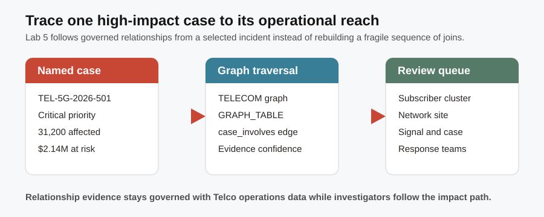

# Subscriber and Network Impact Graph

## Introduction

Now that you know the Hudson Yards site, the source signal, and the related service order, you need to see the full reach of **TEL-5G-2026-501**. This case connects a subscriber cluster, a network site, an outage event, and a support case. In this lab, you use the property graph to make those relationships visible before a response is assigned.



The flow graphic names the case, the `GRAPH_TABLE` traversal, and the review queue. The SQL in this lab turns the one-hop case-to-entity traversal into a repeatable evidence path for the impact investigator.

### Objectives

- Confirm that the telecom property graph exists before querying case relationships.
- Start from the named TEL-5G-2026-501 experience case and follow the connected entities.
- Follow case-to-entity relationship evidence with SQL/PGQ.

Estimated Time: **12 minutes**

### Business Scenario

| Step | Telco focus |
| --- | --- |
| Business Problem | A critical case can spread across entities that are not obvious in a dashboard. |
| Technical Challenge | Joins become difficult when the investigation follows changing relationship paths. |
| Persona Focus | You are a network-impact investigator. |
| What You Will Do | Traverse the entities directly connected to a case. |
| Database Capability | Property Graph and SQL/PGQ. |
| Outcome | You can identify the entities that need coordinated review. |

<details>
<summary><strong>Key terms: property graph, vertex, edge, named seed case, and traversal</strong></summary>

> - A **property graph** is a database model for investigating connected entities and the facts held on their relationships. In this lab, `TELECOM_EXPERIENCE_NETWORK` keeps Telco impact relationships governed beside the operational data that explains them.
>
> - A **vertex** is a graph entity, such as a site, subscriber cluster, or outage event. In this lab, the graph stores those entities with business-readable names and impact measures.
>
> - An **edge** is a relationship that links vertices. The `case_involves` edge connects one experience case to the entities that require review, including why each entity matters and the confidence of that evidence.
>
> - A **named seed case** is not special Oracle vocabulary. It is simply the incident reference an analyst deliberately chooses as the start of an investigation, much like a ticket number. Here, `TEL-5G-2026-501` is the selected case, not a random sample.
>
> - A **traversal** follows a chosen relationship path from one vertex to another. It lets an investigator ask “what is connected to this case?” without moving the incident data to a separate graph system.
</details>

## Task 1: Confirm the impact graph

Confirm the impact graph before you traverse it, so the case relationship query starts from a known governed graph object:

1. Follow the steps below:

    > **SQL Worksheet reminder:** Need a reminder on how to open and use the SQL Worksheet? Return to [Getting Started Task 2: Open SQL Worksheet](?lab=getting-started#Task2:OpenSQLWorksheet) for the step-by-step graphic showing where to paste and run SQL statements.

    `USER_PROPERTY_GRAPHS` inventories graph definitions. The result names the graph used for subscriber and network impact investigation.

    1. `USER_PROPERTY_GRAPHS` limits the catalog to graph definitions owned by `LLUSER`.
    2. `WHERE graph_name = ...` asks for the one graph this lab uses, rather than listing unrelated catalog entries.
    3. `SELECT graph_name` returns the name the SQL/PGQ query uses in Task 2.

    ```sql
    <copy>
    SELECT graph_name AS "Property Graph"
    FROM user_property_graphs
    WHERE graph_name = 'TELECOM_EXPERIENCE_NETWORK';
    </copy>
    ```

    **Expected output: Property Graph**

    | Property Graph |
    | --- |
    | TELECOM\_EXPERIENCE\_NETWORK |

## Task 2: Find entities linked to an experience case

Trace the entities connected to TEL-5G-2026-501 so each response team can see why it is part of the coordinated review:

1. Follow the steps below:

    The graph pattern starts at the named experience case `TEL-5G-2026-501`, follows its `case_involves` relationships, and returns the connected entities. This is the case ID for the critical Hudson Yards event-venue congestion incident introduced in Lab 1. It is a focused investigation because 31,200 subscribers are affected and $2.14M of service value is at risk.

    1. `GRAPH_TABLE (telecom_experience_network ...)` selects the governed graph to query.
    2. `MATCH` starts at the `experience_case` vertex and follows each `case_involves` edge to a connected `entity` vertex.
    3. The `WHERE` clause selects the one named case an analyst wants to investigate.
    4. `COLUMNS` chooses the case context, entity details, role, and evidence confidence to return as a normal SQL table.
    5. `ORDER BY` groups the response roles so the analyst can create a coordinated follow-up list.

    ```sql
    <copy>
    SELECT case_ref AS "Case",
           priority AS "Priority",
           subscribers_affected AS "Subscribers Affected",
           service_value_at_risk AS "Value at Risk",
           display_name AS "Connected Entity",
           entity_type AS "Entity Type",
           role_in_case AS "Role",
           ROUND(confidence * 100, 1) AS "Evidence Confidence %"
    FROM GRAPH_TABLE (telecom_experience_network
      MATCH (c IS experience_case)-[e IS case_involves]->(n IS entity)
      WHERE c.case_ref = 'TEL-5G-2026-501'
      COLUMNS (
        c.case_ref,
        c.priority,
        c.subscribers_affected,
        c.service_value_at_risk,
        n.display_name,
        n.entity_type,
        e.role_in_case,
        e.confidence
      )
    )
    ORDER BY role_in_case, entity_type, display_name;
    </copy>
    ```

    **Expected output: Case Impact Entities**

    | Case | Priority | Subscribers Affected | Value at Risk | Connected Entity | Entity Type | Role | Evidence Confidence % |
    | --- | --- | ---: | ---: | --- | --- | --- | ---: |
    | TEL-5G-2026-501 | critical | 31200 | 2140000 | Hudson Yards 5G macro site | network_site | network_site | 96.5 |
    | TEL-5G-2026-501 | critical | 31200 | 2140000 | Game-day 5G congestion spike | outage_event | seed_signal | 99.0 |
    | TEL-5G-2026-501 | critical | 31200 | 2140000 | Stadium district family plan cluster | subscriber | subscriber_cluster | 98.2 |
    | TEL-5G-2026-501 | critical | 31200 | 2140000 | Capacity reroute case CAP-501 | support_case | support_case | 97.5 |

    Read each row as a coordinated follow-up candidate, not as an automatic action. **Entity Type** tells you what kind of evidence was reached, **Role** tells you why it matters to the case, and **Evidence Confidence %** shows how strongly the relationship is supported in this scenario.

    Because the relationship evidence stays beside the operational facts in the database, teams can reduce data copies and repeat the investigation path when a new network-experience case appears.

    The graph identifies who and what is affected. The next lab adds location evidence so a field-operations planner can compare possible response sites.

## Acknowledgements

* **Author** - Pat Shepherd, Senior Principal Database Product Manager
* **Last Updated By/Date** - Pat Shepherd, July 2026
