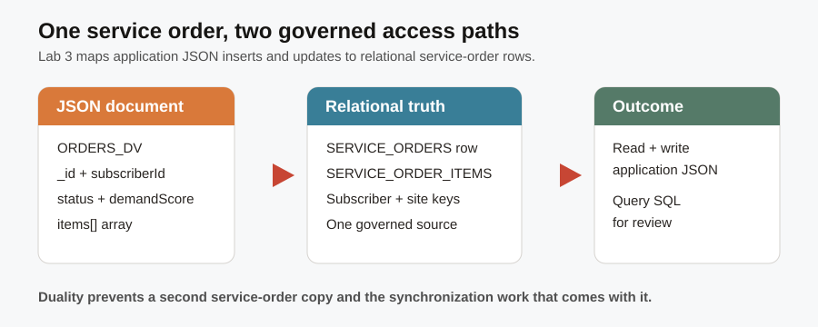

# Subscriber Service Orders

## Introduction

After Hudson Yards becomes the priority, the `TEL-5G-2026-501` team must understand the service action tied to the incident. Order `601` links the case's source signal to a subscriber, the Hudson Yards site, and the assigned 5G service. You are the service-order developer who must present that order as application JSON while preserving relational evidence for operations. JSON Relational Duality gives both teams one governed source.



### Objectives

- Confirm that the `ORDERS_DV` JSON Relational Duality view is available for application-style access.
- Read selected service-order fields from a JSON document without losing the relational evidence behind it.
- Relate JSON fields to relational service-order evidence.

Estimated Time: **10 minutes**

### Business Scenario

| Step | Telco focus |
| --- | --- |
| Business Problem | Applications need a complete service-order document while operations need SQL evidence. |
| Technical Challenge | Separate document and relational stores can drift apart. |
| Persona Focus | You are a service-order application developer. |
| What You Will Do | Inspect the duality view and a document projection. |
| Database Capability | JSON Relational Duality. |
| Outcome | One source serves application JSON and relational analysis. |

<details>
<summary><strong>Key terms: JSON document, duality view, projection, and source of truth</strong></summary>

> - A **JSON document** is an application-friendly representation of one service order and its items. It groups the fields a service-order screen needs to display, such as subscriber, site, status, and service details.
>
> - A **duality view** gives an application a document-shaped interface while the underlying relational rows remain queryable in SQL. In this lab, `ORDERS_DV` is the named contract between the application and the service-order foundation.
>
> - A **projection** selects useful fields from the document into a readable result. It helps an application developer inspect the document interface without forcing a person to scan one large JSON cell.
>
> - A **source of truth** is the governed record that teams rely on when they need a consistent answer. JSON Relational Duality lets `ORDERS_DV` serve the application while `SERVICE_ORDERS` remains SQL-queryable, so application and operations teams do not reconcile duplicate order copies.
</details>

## Task 1: Confirm the service-order duality view

Confirm the JSON duality view before reading service-order documents, so the application interface is proven before the workshop relies on it:

1. Follow the steps below:

    > **SQL Worksheet reminder:** Need a reminder on how to open and use the SQL Worksheet? Return to [Getting Started Task 2: Open SQL Worksheet](?lab=getting-started#Task2:OpenSQLWorksheet) for the step-by-step graphic showing where to paste and run SQL statements.

    This is a small but reusable application-contract check, not an analytics query. A developer can run it in a deployment smoke test, continuous-integration check, or application startup diagnostic to confirm that the expected document interface exists and that its document count matches the relational order count.

    1. `USER_JSON_DUALITY_VIEWS` confirms that `ORDERS_DV` is registered in the current schema.
    2. The first subquery counts the JSON documents that the application can read.
    3. The second subquery counts the relational orders that operations can analyze.
    4. Matching counts show two interfaces over the same governed order foundation, rather than two separately synchronized copies.

    ```sql
    <copy>
    SELECT view_name AS "Duality View",
           (SELECT COUNT(*) FROM orders_dv) AS "JSON Documents",
           (SELECT COUNT(*) FROM service_orders) AS "Relational Orders"
    FROM user_json_duality_views
    WHERE view_name = 'ORDERS_DV';
    </copy>
    ```

    **Expected output: Duality View**

    | Duality View | JSON Documents | Relational Orders |
    | --- | ---: | ---: |
    | ORDERS\_DV | 58 | 58 |

## Task 2: Read service-order fields from the JSON document

Project the service-order document into business-readable fields so an application developer can inspect the order without scrolling through a long JSON payload:

1. Follow the steps below:

    `ORDERS_DV` returns a JSON document with a root order and nested `items`. Instead of displaying one long document in a worksheet cell, this query projects the fields an application developer most often needs to inspect.

    1. `JSON_VALUE` reads one named field from each JSON document and returns it as a SQL value with a useful data type.
    2. The `items[0].serviceId` path reaches the first ordered service in the nested item list.
    3. `ORDER BY` makes the result repeatable, and `FETCH FIRST 5 ROWS ONLY` keeps the worksheet result easy to scan.

    ```sql
    <copy>
    SELECT JSON_VALUE(data, '$._id' RETURNING NUMBER) AS "Order ID",
           JSON_VALUE(data, '$.subscriberId' RETURNING NUMBER) AS "Subscriber ID",
           JSON_VALUE(data, '$.networkSiteId' RETURNING NUMBER) AS "Network Site ID",
           JSON_VALUE(data, '$.status' RETURNING VARCHAR2(30)) AS "Status",
           JSON_VALUE(data, '$.serviceValue' RETURNING NUMBER) AS "Monthly Value",
           JSON_VALUE(data, '$.demandScore' RETURNING NUMBER) AS "Demand Score",
           JSON_VALUE(data, '$.items[0].serviceId' RETURNING NUMBER) AS "Service ID"
    FROM orders_dv
    ORDER BY "Order ID"
    FETCH FIRST 5 ROWS ONLY;
    </copy>
    ```

    **Expected output: Service-Order Document Fields**

    | Order ID | Subscriber ID | Network Site ID | Status | Monthly Value | Demand Score | Service ID |
    | ---: | ---: | ---: | --- | ---: | ---: | ---: |
    | 601 | 401 | 201 | Assigned | 85 | 96 | 101 |
    | 602 | 402 | 202 | Routed | 95 | 95 | 104 |
    | 603 | 404 | 204 | Completed | 25 | 86 | 107 |

    The nested item list helps an application display the order, while the governed relational source keeps reporting, updates, and application reads aligned.

    You have connected an operational action to its document representation. The next lab uses subscriber-signal evidence to explain why the service issue may need attention.

## Acknowledgements

* **Author** - Pat Shepherd, Senior Principal Database Product Manager
* **Last Updated By/Date** - Pat Shepherd, July 2026
