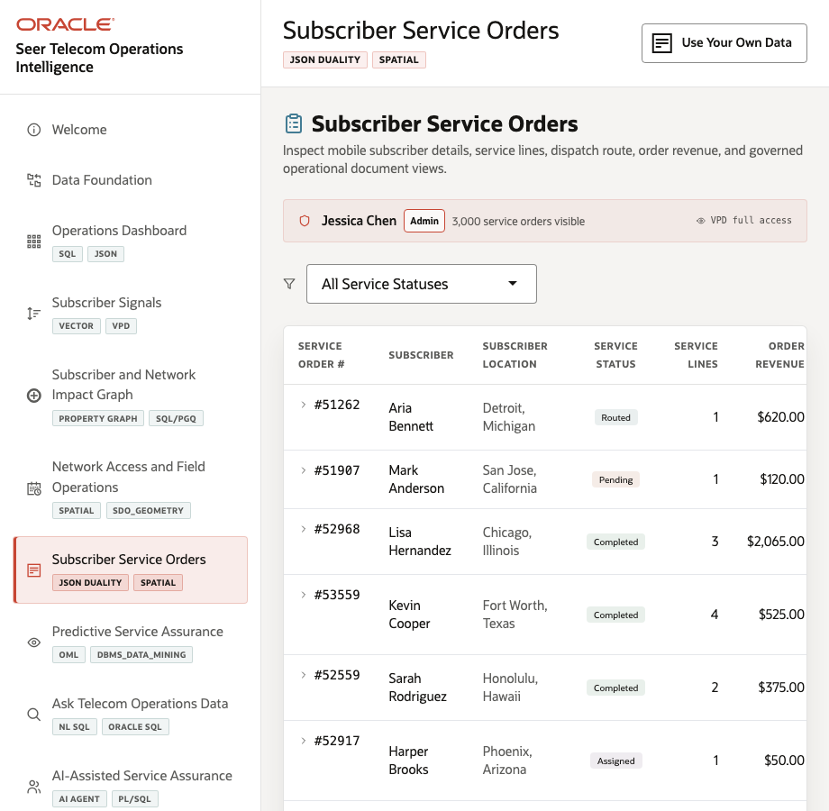
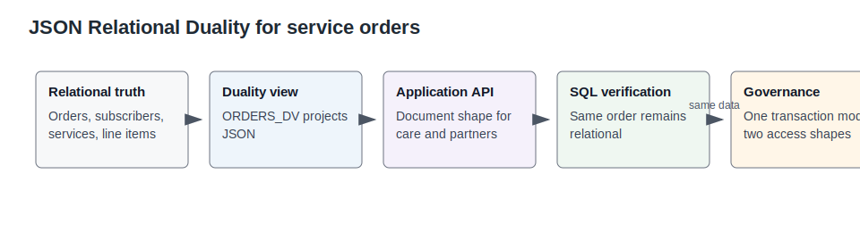

# Lab 6: Subscriber Service Orders with JSON Relational Duality

## Introduction

A subscriber service order must support care workflows, field dispatch, operational SQL, and API-friendly JSON without creating separate copies of the same transaction.

Estimated Time: 10 minutes

| Operating Story | Detail |
| --- | --- |
| Business Problem | Care and partner teams need document-shaped order access while operations teams need relational truth. |
| Technical Challenge | Duplicating service orders into document stores creates synchronization and governance risk. |
| Persona Focus | Service operations manager, care lead, and API platform owner. |
| What You Will Prove | JSON Relational Duality can expose the same service order as relational rows and a nested JSON document. |
| Database Capability | JSON Relational Duality Views, SQL/JSON, relational constraints. |
| Outcome | The same transaction can serve operational SQL and application document access. |
{: title="What this lab proves"}

**Persona focus:** You are the API platform owner proving that document-style service-order access does not require a separate document database.

### Objectives

- Review the LiveStack scene evidence.
- Run SQL that proves the database pattern.
- Connect the result to the next operating decision.

## How This Lab Fits the Story

You inspect the service order that records operational action. The relational and JSON queries show how one transaction can support care teams, field dispatch, and API-style document access at the same time.

## Scene Evidence

Use the screenshot as scene grounding. The SQL tasks below provide the exact values to verify.

## Task 1: Query a service order relationally

1. Run this SQL block.

    This query starts with the traditional operational view of one service order.

    <copy>
SELECT service_order_id, subscriber_name, city, state_province, service_status, service_value, dispatch_cost
FROM seer_comms_service_orders_v
WHERE service_order_id = 2870;
    </copy>

Expected output:

| Service Order ID | Subscriber Name | City | State Province | Service Status | Service Value | Dispatch Cost |
| ---: | --- | --- | --- | --- | ---: | ---: |
| 2870 | Jack Hill | Portland | Oregon | Completed | 4160 | 14.99 |
{: title="Service order selected for duality review"}

## Task 2: Inspect line items for the same order

1. Run this SQL block.

    This query verifies the detail rows that make up the order total and service mix.

    <copy>
SELECT oi.order_id AS service_order_id,
       p.product_name AS service_name,
       p.category AS service_category,
       oi.quantity,
       oi.unit_price,
       oi.line_total
FROM order_items oi
JOIN products p ON p.product_id = oi.product_id
WHERE oi.order_id = 2870
ORDER BY oi.item_id;
    </copy>

Expected output:

| Service Order ID | Service Name | Service Category | Quantity | Unit Price | Line Total |
| ---: | --- | --- | ---: | ---: | ---: |
| 2870 | LTE Backup Gateway | Devices | 2 | 115 | 230 |
| 2870 | Fraud Resolution Case | Security | 2 | 45 | 90 |
| 2870 | Edge Compute Reservation | Enterprise Connectivity | 3 | 640 | 1920 |
{: title="Line items inside the service order"}

## Task 3: Return the service order document

1. Run this SQL block.

    This query returns the same order through the JSON document shape used by application workflows.

    <copy>
SELECT JSON_SERIALIZE(data PRETTY) AS service_order_document
FROM orders_dv
WHERE JSON_VALUE(data, '$._id') = '2870';
    </copy>

Expected output:

| Service Order Document |
| --- |
| JSON document for service order 2870 with subscriber, status, total, dispatch cost, and nested line items. |
{: title="Document view of the same service order"}

The JSON document and relational rows come from the same Oracle transaction model. That is the value of JSON Relational Duality for telecom service-order APIs.

## Learn More

- See `ORACLE_REFERENCE_LINKS.md` in the supporting files directory for official Oracle documentation links.

## Acknowledgements

- **Author** - Oracle LiveLabs Team
