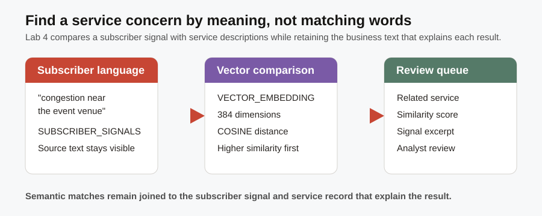

# Subscriber Experience Signal Feed

## Introduction

The source signal for `TEL-5G-2026-501` says that game-day 5G congestion is affecting families near Hudson Yards. It does not need to use the exact name of a service plan for an analyst to find a relevant response. You are the customer-experience analyst who connects that subscriber language to the likely service concern. Oracle AI Vector Search stores the meaning of the signal and service text as embeddings, while retaining the business text that explains the match.



### Objectives

- Verify that subscriber signals and telecom services have compatible vector evidence.
- Search subscriber signals by meaning, even when the analyst phrase does not match the stored wording exactly.
- Interpret cosine distance as a similarity score.

Estimated Time: **12 minutes**

### Business Scenario

| Step | Telco focus |
| --- | --- |
| Business Problem | Operations needs to find relevant subscriber language even when exact keywords differ. |
| Technical Challenge | Exact-match search can miss related wording. |
| Persona Focus | You are a customer-experience analyst. |
| What You Will Do | Compare a phrase vector with stored subscriber-signal vectors. |
| Database Capability | Oracle AI Vector Search. |
| Outcome | Related signals remain connected to their source rows. |

<details>
<summary><strong>Key terms: embedding, vector dimension, cosine distance, semantic search, and similarity score</strong></summary>

> - An **embedding** is a vector: a list of numbers that represents the meaning of a service description or subscriber signal. It lets the database compare intent, not only identical words, while the original business text remains in the same governed schema.
>
> - A **vector dimension** is one coordinate in that numerical representation. Both collections in this lab use 384 dimensions, so their meanings can be compared consistently.
>
> - **Cosine distance** measures how far apart two vectors point in meaning. A lower distance means the texts are closer in meaning.
>
> - **Semantic search** uses those meaning representations to find related text even when the exact words differ. For Seer Comms, it helps an analyst locate congestion or service concerns written in subscriber language.
>
> - A **similarity score** ranks semantic closeness. This lab converts cosine distance to a higher-is-better score so an analyst can review a recommendation beside the signal and service text that explain it.
</details>

## Task 1: Verify the vector evidence

First confirm that the signal and service embeddings use the same vector shape, so later similarity searches are valid:

1. Follow the steps below:

    > **SQL Worksheet reminder:** Need a reminder on how to open and use the SQL Worksheet? Return to [Getting Started Task 2: Open SQL Worksheet](?lab=getting-started#Task2:OpenSQLWorksheet) for the step-by-step graphic showing where to paste and run SQL statements.

    The query samples one stored vector from each collection. That is enough because a vector's dimension count describes its stored shape, not a value that changes from row to row. `VECTOR_DIMENSION_COUNT` is a documented Oracle AI Vector Search SQL function; it returns the number of numerical coordinates in a vector. It does not expose an internal model detail or create a new embedding.

    1. Each inner query selects one representative embedding from its collection.
    2. `VECTOR_DIMENSION_COUNT` reads the embedding length; `384` means 384 numerical coordinates.
    3. Matching dimensions show that service and subscriber-signal vectors use the same shape, so `VECTOR_DISTANCE` can compare their meaning.

    ```sql
    <copy>
    SELECT 'Service embeddings' AS "Evidence", VECTOR_DIMENSION_COUNT(embedding) AS "Dimensions"
    FROM (SELECT embedding FROM service_embeddings FETCH FIRST 1 ROW ONLY)
    UNION ALL
    SELECT 'Subscriber signal embeddings', VECTOR_DIMENSION_COUNT(embedding)
    FROM (SELECT embedding FROM signal_embeddings FETCH FIRST 1 ROW ONLY);
    </copy>
    ```

    **Expected output: Vector Evidence**

    | Evidence | Dimensions |
    | --- | --- |
    | Service embeddings | 384 |
    | Subscriber signal embeddings | 384 |

    Both evidence types use the same embedding shape. That common structure lets the database compare meaning while keeping the source signal and service identity available for analyst review.

## Task 2: Search subscriber signals by meaning

Use the analyst phrase to find subscriber signals with the closest meaning, not just matching keywords:

1. Follow the steps below:

    This query performs the semantic search. Read it in five parts.

    1. The `search_phrase` common table expression (CTE) uses `VECTOR_EMBEDDING` to turn the analyst's phrase into the same kind of 384-value vector stored for every signal.
    2. `DBMS_LOB.SUBSTR(ss.signal_text, 70, 1)` returns the first 70 characters of a signal CLOB, starting at character 1, so the worksheet result stays readable while the full text remains stored.
    3. `VECTOR_DISTANCE(se.embedding, search_phrase.embedding, COSINE)` measures semantic distance. Lower distance means closer meaning.
    4. `1 - VECTOR_DISTANCE(...)`, rounded to five decimals, converts distance into a higher-is-better similarity score.
    5. `ORDER BY` ranks the closest meanings first and `FETCH FIRST 3 ROWS ONLY` creates a focused review queue.

    Look for the event-venue congestion signal at the top of the result; it matches the phrase even though its wording is not identical.

    ```sql
    <copy>
    WITH search_phrase AS (
      SELECT VECTOR_EMBEDDING(
               ADMIN.ALL_MINILM_L12_V2
               USING 'game-day 5G congestion near Hudson Yards' AS DATA
             ) AS embedding
      FROM dual
    )
    SELECT ss.signal_id AS "Signal ID",
           DBMS_LOB.SUBSTR(ss.signal_text, 70, 1) AS "Signal",
           ROUND(
             1 - VECTOR_DISTANCE(se.embedding, search_phrase.embedding, COSINE),
             5
           ) AS "Similarity"
    FROM signal_embeddings se
    JOIN subscriber_signals ss ON ss.signal_id = se.signal_id
    CROSS JOIN search_phrase
    ORDER BY VECTOR_DISTANCE(se.embedding, search_phrase.embedding, COSINE)
    FETCH FIRST 3 ROWS ONLY;
    </copy>
    ```

    **Expected output: Closest Signals**

    | Signal ID | Signal | Similarity |
    | ---: | --- | ---: |
    | 501 | Game-day 5G congestion is affecting families near Hudson Yards... | 0.83805 |
    | 504 | Families are comparing mobile plans after repeated 5G congestion... | 0.54690 |
    | 510 | 5G capacity is tight at the event venue... | 0.51720 |

    Similarity values can vary slightly by model and environment. The meaningful result is the ranked order and the business text you can now review with the score.

## Task 3: Match one subscriber signal to related services

Move from the selected subscriber signal to related services so the customer-experience analyst has a review queue, not just a single isolated complaint:

1. Follow the steps below:

    Task 2 searched signals using an analyst phrase. This task uses the stored embedding for one high-impact subscriber signal and compares it with every service embedding. It is a genuine vector comparison that helps an analyst move from the subscriber's wording to the service options most likely to be relevant.

    1. `signal_embeddings` supplies the stored vector for signal `501`; its join to `subscriber_signals` keeps the readable subscriber wording beside that vector.
    2. `WHERE ss.signal_id = 501` chooses one known, high-impact signal before any comparison happens. The query does not search every signal.
    3. `CROSS JOIN service_embeddings` makes one comparison pair between that signal and each stored service vector.
    4. The join to `telecom_services` adds the business-readable service name for each candidate pair.
    5. `VECTOR_DISTANCE(..., COSINE)` calculates semantic distance. Subtracting it from `1` produces the displayed higher-is-better similarity score.
    6. `ORDER BY` puts the smallest distance first. `FETCH FIRST 3 ROWS ONLY` keeps the result to the first three services an analyst should review.

    ```sql
    <copy>
    SELECT ss.signal_id AS "Signal ID",
           DBMS_LOB.SUBSTR(ss.signal_text, 70, 1) AS "Subscriber Signal",
           ts.service_name AS "Recommended Service",
           ROUND(
             1 - VECTOR_DISTANCE(
                   signal_embedding.embedding,
                   service_embedding.embedding,
                   COSINE
                 ),
             5
           ) AS "Similarity"
    FROM signal_embeddings signal_embedding
    JOIN subscriber_signals ss
      ON ss.signal_id = signal_embedding.signal_id
    CROSS JOIN service_embeddings service_embedding
    JOIN telecom_services ts
      ON ts.service_id = service_embedding.service_id
    WHERE ss.signal_id = 501
    ORDER BY VECTOR_DISTANCE(
               signal_embedding.embedding,
               service_embedding.embedding,
               COSINE
             )
    FETCH FIRST 3 ROWS ONLY;
    </copy>
    ```

    **Expected output: Related Services**

    | Signal ID | Subscriber Signal | Recommended Service | Similarity |
    | ---: | --- | --- | ---: |
    | 501 | Game-day 5G congestion is affecting families near Hudson Yards... | 5G Unlimited Mobile Plan | 0.63614 |
    | 501 | Game-day 5G congestion is affecting families near Hudson Yards... | 5G Business Consultation | 0.46385 |
    | 501 | Game-day 5G congestion is affecting families near Hudson Yards... | Gigabit Fiber Install | 0.34430 |

    Use the highest-ranked service as a starting point for investigation, not as an automatic decision. Review the subscriber signal, service description, capacity evidence, and relationship context before choosing an action.

## Acknowledgements

* **Author** - Pat Shepherd, Senior Principal Database Product Manager
* **Last Updated By/Date** - Pat Shepherd, July 2026
