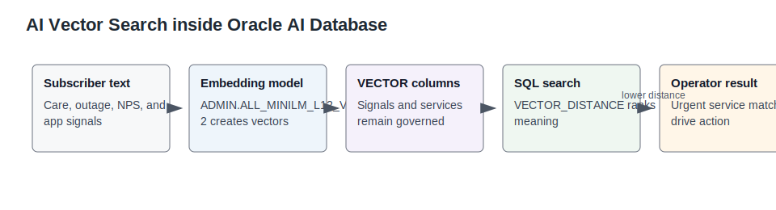
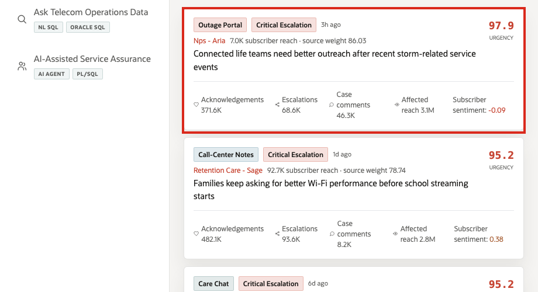

# Lab 3: Subscriber Signals with AI Vector Search

## Introduction

Care and network teams need to search subscriber language by meaning, not only by exact keywords. Oracle AI Vector Search keeps signal text, embeddings, vector distance, SQL filters, and governance near the same telecom data.

Estimated Time: 10 minutes

| Operating Story | Detail |
| --- | --- |
| Business Problem | Subscriber pain can surface in app feedback, outage reports, care chats, and community posts before traditional KPIs move. |
| Technical Challenge | Vector search is risky when sensitive signal text and embeddings must leave the governed database. |
| Persona Focus | Care operations leader, network experience analyst, and AI engineer. |
| What You Will Prove | Oracle AI Database can rank telecom services and subscriber signals by semantic meaning using in-database vectors. |
| Database Capability | Oracle AI Vector Search, VECTOR columns, `VECTOR_DISTANCE`, in-database embedding model. |
| Outcome | Teams can prioritize urgent subscriber intent without splitting the signal corpus into a separate vector store. |
{: title="What this lab proves"}

**Persona focus:** You are the care operations analyst looking for urgent meaning across subscriber language.

### Objectives

- Inspect signal embeddings.
- Run a vector-style semantic match query.
- Interpret similarity as operational priority.

## How This Lab Fits the Story

You move from dashboard symptoms to subscriber language. The vector and semantic-match queries show how Oracle AI Database can rank telecom intent by meaning while keeping signal text and embeddings governed.

## Scene Evidence

## Task 1: Verify signal and service embeddings

1. Run this SQL block.

    This query confirms that both sides of semantic matching exist: services and subscriber signals.

    <copy>
SELECT 'Service embeddings' AS vector_set, COUNT(*) AS rows_loaded FROM service_embeddings
UNION ALL
SELECT 'Signal embeddings', COUNT(*) FROM signal_embeddings;
</copy>

Expected output:

| Vector Set | Rows Loaded |
| --- | ---: |
| Service embeddings | 32 |
| Signal embeddings | 5000 |
{: title="Vector data available for semantic search"}

Embeddings are stored in Oracle AI Database with the rest of the operational data. That reduces the need to move sensitive signal text into a separate search platform.

## Task 2: Rank services by signal similarity history

1. Run this SQL block.

    This query summarizes which services attract the most semantically similar subscriber signals.

    <copy>
SELECT service_name,
       service_line_name,
       COUNT(*) AS matching_signals,
       ROUND(MAX(similarity_score), 3) AS strongest_similarity,
       ROUND(AVG(similarity_score), 3) AS avg_similarity
FROM seer_comms_signal_matches_v
GROUP BY service_name, service_line_name
ORDER BY matching_signals DESC, strongest_similarity DESC
FETCH FIRST 8 ROWS ONLY;
</copy>

Expected output:

| Service Name | Service Line Name | Matching Signals | Strongest Similarity | Avg Similarity |
| --- | --- | ---: | ---: | ---: |
| Fixed Wireless Home Internet | Seer Home Broadband | 57 | 0.89 | 0.72 |
| Device Upgrade Enrollment | Seer Mobile | 55 | 0.88 | 0.71 |
| Gigabit Fiber Install | Seer Fiber | 53 | 0.87 | 0.70 |
{: title="Services ranked by signal meaning"}

This is the operating signal behind the LiveStack page. Semantic matches show where subscriber language is clustering around services.

## Task 3: Inspect high-priority subscriber signals

1. Run this SQL block.

    This query shows the raw subscriber evidence behind the ranked service pressure.

    <copy>
SELECT signal_channel,
       advocate_handle,
       exposure_count,
       escalations,
       SUBSTR(signal_text, 1, 90) AS signal_excerpt
FROM seer_comms_subscriber_signals_v
ORDER BY exposure_count DESC, escalations DESC
FETCH FIRST 5 ROWS ONLY;
</copy>

Expected output:

| Signal Channel | Advocate Handle | Exposure Count | Escalations | Signal Excerpt |
| --- | --- | ---: | ---: | --- |
| threads | @roamflow_vince | 19937363 | 15923 | Subscribers are asking for clearer instructions after fiber installation and fas |
| instagram | @signalbridge_leo | 19878738 | 89853 | Subscribers are asking about IoT Sensor Gateway Kit through OrbitMotion IoT |
{: title="Subscriber signals behind the match"}

Exposure and escalations help triage. The text explains why the issue matters. Oracle keeps both available to SQL, vector search, and security policy enforcement.

## Learn More

- [Oracle AI Vector Search documentation](https://docs.oracle.com/en/database/oracle/oracle-database/26/vecse/)

## Acknowledgements

- **Author** - Oracle LiveLabs Team
