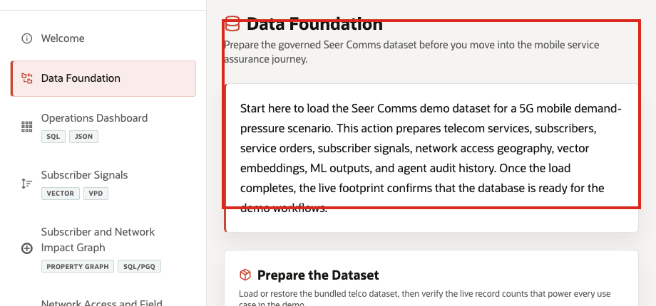

# Lab 1: Telecom Data Foundation

## Introduction

The Seer Comms data foundation prepares the governed data used across the South Florida 5G demand-surge story. Before a network, care, field, or retention team can act, the platform team needs to prove that services, subscriber signals, service orders, network sites, forecasts, graph entities, embeddings, and audit rows are loaded in one schema.

Estimated Time: 10 minutes

| Operating Story | Detail |
| --- | --- |
| Business Problem | Teams need one trusted operating picture before responding to service pressure. |
| Technical Challenge | The data foundation must combine transactional, JSON, vector, graph, spatial, ML, and audit objects without copying data into disconnected stores. |
| Persona Focus | Platform engineer and database developer. |
| What You Will Prove | The workshop schema contains the telecom domains and Oracle feature objects used by the LiveStack Demo. |
| Database Capability | Relational SQL, semantic views, Oracle data dictionary, VECTOR columns, JSON Duality, Spatial, Property Graph. |
| Outcome | Learners can trust the following labs because the schema has a visible governed foundation. |
{: title="What this lab proves"}

**Persona focus:** You are the platform engineer proving that the operating story starts from a complete Oracle data foundation, not from separate demo files.

### Objectives

- Count core telco domains.
- Inspect views that translate the portable stack into Seer Comms vocabulary.
- Verify feature-specific database objects.

## How This Lab Fits the Story

You prove that the workshop has a complete telecom data foundation. The counts and object checks explain why later labs can move across dashboard, vector, graph, spatial, JSON, prediction, and audit workflows without switching databases.

## Scene Evidence

## Task 1: Count the operating domains

1. Run this SQL block.

    This query counts the major domains that power the rest of the workshop. You are checking breadth, not just row volume.

    <copy>
SELECT 'Telecom services' AS domain, COUNT(*) AS records FROM seer_comms_services_v
UNION ALL SELECT 'Subscriber signals', COUNT(*) FROM seer_comms_subscriber_signals_v
UNION ALL SELECT 'Service orders', COUNT(*) FROM seer_comms_service_orders_v
UNION ALL SELECT 'Network sites', COUNT(*) FROM seer_comms_network_sites_v
UNION ALL SELECT 'Demand forecasts', COUNT(*) FROM seer_comms_demand_forecasts_v
UNION ALL SELECT 'AI-assisted actions', COUNT(*) FROM seer_comms_agent_actions_v
ORDER BY domain;
</copy>

Expected output:

| Domain | Records |
| --- | ---: |
| AI-assisted actions | 25 |
| Demand forecasts | 360 |
| Network sites | 12 |
| Service orders | 3000 |
| Subscriber signals | 5000 |
| Telecom services | 32 |
{: title="Seeded telecom data volumes"}

The counts show that the workshop is not a single-feature exercise. The same schema carries the operating data needed by dashboard, signal, graph, spatial, service order, ML, answer, and agent workflows.

## Task 2: Inspect telecom semantic views

1. Run this SQL block.

    This query confirms that learners can use telecom-friendly view names instead of the portable source table names.

    <copy>
SELECT view_name
FROM user_views
WHERE view_name LIKE 'SEER_COMMS%'
ORDER BY view_name;
</copy>

Expected output:

| View Name |
| --- |
| `SEER_COMMS_AGENT_ACTIONS_V` |
| `SEER_COMMS_NETWORK_CAPACITY_V` |
| `SEER_COMMS_SERVICE_ORDERS_V` |
| `SEER_COMMS_SERVICES_V` |
| `SEER_COMMS_SUBSCRIBER_SIGNALS_V` |
{: title="Core views for learner queries"}

Your output may include additional Seer Comms views. These views are the bridge between the portable LiveStack schema and telecom language such as service lines, subscriber signals, network capacity, and field dispatches.

## Task 3: Verify Oracle feature objects

1. Run this SQL block.

    This query checks the database objects that make the workshop more than a dashboard exercise.

    <copy>
SELECT object_type, object_name
FROM user_objects
WHERE object_name IN (
  'ORDERS_DV', 'PRODUCTS_INVENTORY_DV', 'TELECOM_EXPERIENCE_NETWORK',
  'PRODUCT_EMBEDDINGS', 'POST_EMBEDDINGS', 'FULFILLMENT_ZONES',
  'DEMAND_REGIONS', 'AGENT_ACTIONS'
)
ORDER BY object_type, object_name;
</copy>

Expected output:

| Object Type | Object Name |
| --- | --- |
| JSON RELATIONAL DUALITY VIEW | `ORDERS_DV` |
| JSON RELATIONAL DUALITY VIEW | `PRODUCTS_INVENTORY_DV` |
| PROPERTY GRAPH | `TELECOM_EXPERIENCE_NETWORK` |
| TABLE | `AGENT_ACTIONS` |
| TABLE | `DEMAND_REGIONS` |
| TABLE | `FULFILLMENT_ZONES` |
| TABLE | `POST_EMBEDDINGS` |
| TABLE | `PRODUCT_EMBEDDINGS` |
{: title="Oracle objects behind the workshop"}

These objects are the evidence that Oracle AI Database is the protagonist of the workshop. Each later lab uses one or more of these objects to answer a telecom operations question.

## Learn More

- [Oracle Database 26ai documentation](https://docs.oracle.com/en/database/oracle/oracle-database/26/)

## Acknowledgements

- **Author** - Oracle LiveLabs Team
