# Investigate an Activation Fraud Network

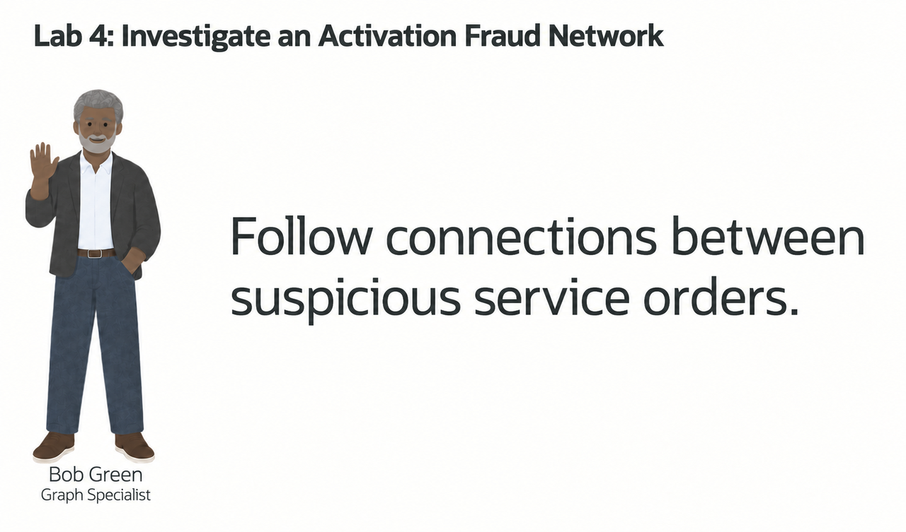

## Introduction

Bob Green is a graph specialist at SEER Telecomms. He uses property graphs to investigate activation fraud.

A service order row may not show coordinated activity. Shared devices, phone numbers, payment tokens, or IP addresses can reveal connections between service orders.

First, use SQL/PGQ to follow connections between service orders. Then open Graph Studio to view the same relationships as an interactive network.

Graph Studio is Oracle Database’s visual workspace for property graphs. SQL/PGQ returns tables you can sort and compare. Graph Studio shows nodes, edges, and paths you can explore. You will use both to investigate service order `ORD-8841`.

<details>
<summary><strong>Key terms: property graph, vertex, edge, and SQL Property Graph Queries (SQL/PGQ)</strong></summary>

> - A **property graph** represents things and how they are connected. In this lab, things include service orders, devices, IP addresses, phone numbers, payment tokens, network sites, and cases. A graph makes relationship patterns easier to see than they are in a flat table.
>
> - A **vertex** is a graph node that represents something investigators care about, such as a service order, device, IP address, payment token, phone number, or case. In this graph, vertices use the `entity` label and carry properties such as a risk score, channel, or total amount.
>
> - An **edge** is a connection between vertices, such as a service order using a device, sharing a phone number, paying with a token, or opening activity from an IP address. In this graph, edges use the `related_to` label and carry properties such as the relationship type.
>
> - A **hop** is one step across an edge from one vertex to another. `ORD-8841` to a device is one hop. `ORD-8841` to that device and then to another service order is two hops. The hop count tells investigators how far the search travels from the starting service order; it does not describe physical distance or service order time.
>
> - **SQL Property Graph Queries (SQL/PGQ)** let you describe graph patterns in SQL, such as "start with this service order and follow related entities." That lets investigators ask relationship questions in SQL without moving activation fraud data into a separate graph-only database.

</details>

### Objectives

- Identify vertices and edges in a property graph.
- Follow connections from a suspicious service order.
- Find service order pairs that share identifying information.
- Open Graph Studio from Database Actions.
- Import and run the telecommunications activation-fraud-network notebook.
- Explain the result in terms a fraud analyst can act on.

Estimated Time: **10 minutes**

### Hands-on Scenario

| Step                | Telecommunications focus                                                                                                  |
| ---------------------| ----------------------------------------------------------------------------------------------------------------|
| Problem    | Activation Fraud teams need to see relationships that are hard to detect from service order tables alone.                   |
| Database task | Bob needs to follow paths and find shared identifiers without writing long chains of self-joins.                  |
| Your role       | You review Bob's graph design and interpret its results for an activation fraud review.                                     |
| What You Will See   | A property graph shows connected entities and service order pairs with SQL.                                           |
| Oracle features | ACTIVATION\_FRAUD\_NETWORK and GRAPH\_TABLE support SQL/PGQ traversal.                                                     |
| Result             | A fraud analyst can see which service orders are connected, what they share, and which relationships deserve review. |

Persona focus: You are reviewing Bob's graph solution with an activation fraud analyst.

> **SQL Worksheet reminder:** See [Getting Started Task 2: Open SQL Worksheet](?lab=getting-started#Task2:OpenSQLWorksheet) for the steps to paste and run SQL.

## Task 1: Follow a suspicious service order with SQL

Jessica has already written a query for Bob. It shows the entities directly connected to suspicious service order `ORD-8841`. The query works, but Jessica is concerned about what happens when investigators need to follow relationships several steps away.

In this lab, a **hop** means one relationship step. The service order to a device is one hop. The service order to that device and then to another service order is two hops. A four-hop search follows four such steps from `ORD-8841`, so it can reveal entities that are not directly connected to the service order.

1. Run Jessica's ordinary SQL query:

    ```sql
    <copy>
    SELECT order_node.entity_key AS order_key,
           connected.entity_key AS connected_key,
           connected.entity_type AS connected_type,
           rel.relationship_type,
           connected.risk_score AS connected_risk
    FROM activation_entities order_node
    JOIN activation_relationships rel
      ON rel.from_entity = order_node.entity_id
    JOIN activation_entities connected
      ON connected.entity_id = rel.to_entity
    WHERE order_node.entity_key = 'ORD-8841'
    ORDER BY connected_risk DESC;
    </copy>
    ```

    The query joins `ACTIVATION_ENTITIES` twice: once for the service order and once for the connected entity. `ACTIVATION_RELATIONSHIPS` supplies the edge between them.

    **Expected output: Direct service order Connections**

    The result lists the device, reused payment token, IP address, phone, or network site directly connected to `ORD-8841`.

2. Extend Jessica's query to follow one through four hops without using a graph query:

    ```sql
    <copy>
    SELECT order_key, connected_key, connected_type,
           relationship_path, connected_risk
    FROM (
      SELECT seed.entity_key AS order_key,
             reached.entity_key AS connected_key,
             reached.entity_type AS connected_type,
             r1.relationship_type AS relationship_path,
             reached.risk_score AS connected_risk
      FROM activation_entities seed
      JOIN activation_relationships r1
        ON r1.from_entity = seed.entity_id
      JOIN activation_entities reached
        ON reached.entity_id = r1.to_entity
      WHERE seed.entity_key = 'ORD-8841'

      UNION

      SELECT seed.entity_key,
             reached.entity_key,
             reached.entity_type,
             r1.relationship_type || ' -> ' || r2.relationship_type,
             reached.risk_score
      FROM activation_entities seed
      JOIN activation_relationships r1
        ON r1.from_entity = seed.entity_id
      JOIN activation_entities v1
        ON v1.entity_id = r1.to_entity
      JOIN activation_relationships r2
        ON r2.from_entity = v1.entity_id
      JOIN activation_entities reached
        ON reached.entity_id = r2.to_entity
      WHERE seed.entity_key = 'ORD-8841'

      UNION

      SELECT seed.entity_key,
             reached.entity_key,
             reached.entity_type,
             r1.relationship_type || ' -> ' ||
               r2.relationship_type || ' -> ' ||
               r3.relationship_type,
             reached.risk_score
      FROM activation_entities seed
      JOIN activation_relationships r1
        ON r1.from_entity = seed.entity_id
      JOIN activation_entities v1
        ON v1.entity_id = r1.to_entity
      JOIN activation_relationships r2
        ON r2.from_entity = v1.entity_id
      JOIN activation_entities v2
        ON v2.entity_id = r2.to_entity
      JOIN activation_relationships r3
        ON r3.from_entity = v2.entity_id
      JOIN activation_entities reached
        ON reached.entity_id = r3.to_entity
      WHERE seed.entity_key = 'ORD-8841'

      UNION

      SELECT seed.entity_key,
             reached.entity_key,
             reached.entity_type,
             r1.relationship_type || ' -> ' ||
               r2.relationship_type || ' -> ' ||
               r3.relationship_type || ' -> ' ||
               r4.relationship_type,
             reached.risk_score
      FROM activation_entities seed
      JOIN activation_relationships r1
        ON r1.from_entity = seed.entity_id
      JOIN activation_entities v1
        ON v1.entity_id = r1.to_entity
      JOIN activation_relationships r2
        ON r2.from_entity = v1.entity_id
      JOIN activation_entities v2
        ON v2.entity_id = r2.to_entity
      JOIN activation_relationships r3
        ON r3.from_entity = v2.entity_id
      JOIN activation_entities v3
        ON v3.entity_id = r3.to_entity
      JOIN activation_relationships r4
        ON r4.from_entity = v3.entity_id
      JOIN activation_entities reached
        ON reached.entity_id = r4.to_entity
      WHERE seed.entity_key = 'ORD-8841'
    ) paths
    ORDER BY connected_risk DESC;
    </copy>
    ```

    Jessica now needs four separate SELECT statements. The first branch follows one relationship step, the second follows two, the third follows three, and the fourth follows four. Each additional hop adds another relationship join and another entity join. The `UNION` combines the four path lengths and removes duplicate rows. This returns the same one-through-four-hop range as Bob's graph query, but it is much longer and harder to change.

3. Review how the SQL grows more complex when it does not use a graph query.

    Jessica can add another relationship step, but she must join `ACTIVATION_ENTITIES` and `ACTIVATION_RELATIONSHIPS` again. Four hops need four relationship joins and five instances of the entity table. If she wants to support several possible path lengths, the query needs more joins, unions, and duplicate handling. Each added hop makes the query longer.

    Bob's graph query expresses the path directly over the existing relational tables.

## Task 2: Read the same connections as a graph

Bob has already created the `ACTIVATION_FRAUD_NETWORK` property graph for this lab. You do not need to create it before running the queries. The graph definition uses the existing relational tables as its source; it does not create a second copy of the activation fraud data. Check the appendix to learn how Bob created the graph and mapped the relational tables to vertices and edges.

In graph terms, the service order and connected objects are **vertices**. The row in `ACTIVATION_RELATIONSHIPS` between them is an **edge**. `GRAPH_TABLE` lets Bob query those vertices and edges with a graph pattern while Oracle keeps the source data in the database.

1. Run Bob's SQL/PGQ query:

    ```sql
    <copy>
    SELECT order_key,
           connected_key,
           connected_type,
           relationship_type,
           connected_risk
    FROM GRAPH_TABLE ( activation_fraud_network
      MATCH (order_node IS entity) -[edge IS related_to]-> (connected IS entity)
      WHERE order_node.entity_key = 'ORD-8841'
      COLUMNS (
        order_node.entity_key AS order_key,
        connected.entity_key AS connected_key,
        connected.entity_type AS connected_type,
        edge.relationship_type AS relationship_type,
        connected.risk_score AS connected_risk
      )
    )
    ORDER BY connected_risk DESC;
    </copy>
    ```

    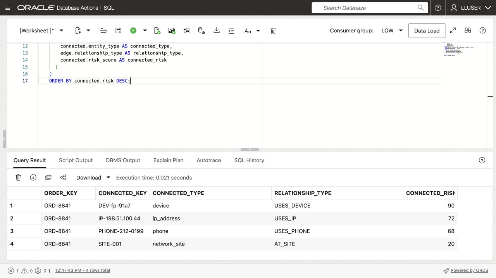

    In the `MATCH` pattern, `order_node` and `connected` are vertices. `edge` connects them, so this pattern follows one hop. `IS entity` and `IS related_to` refer to the labels defined in `ACTIVATION_FRAUD_NETWORK`.

    The result has the same shape as Jessica's query. The difference is the way Bob describes the investigation: start at one vertex, follow one edge, and return the connected vertex.

For an application example of following a set number of graph connections, open **Subscriber and Network Impact Graph** and select **2 Steps** for the game-day congestion event. The demo follows incident impact across sites, services and crews. This illustrates graph traversal; the activation-evidence graph in this lab has different entities and relationships.

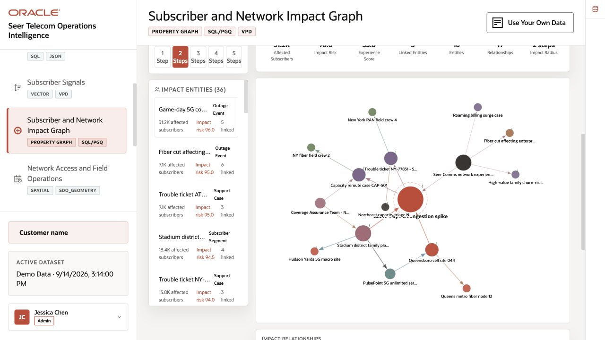

## Task 3: Trace activation evidence across four hops

Start from suspicious service order `ORD-8841` and trace the connected entities within four relationship hops.

1. Run the SQL/PGQ traversal from `ORD-8841`.

    This query treats the activation fraud data as a graph. In the `MATCH` pattern, `(seed IS entity)` is the starting service order, `-[e IS related_to]->{1,4}` means follow a path of one, two, three, or four hops, and `(reached IS entity)` is every entity reached from that starting point. The database counts each relationship in the path as one hop. `COUNT(e.relationship_type)` returns that count as `relationship_hops`; `relationship_type` is an edge property exposed by the graph definition.

    The `WHERE` clause starts the search at `ORD-8841`, and the `COLUMNS` clause returns graph properties in a normal SQL result table.

    Compare this path pattern with the joins in Task 1. It follows one through four hops without a separate SELECT statement for each path length.

    ```sql
    <copy>
    SELECT DISTINCT entity_key, display_name, entity_type,
           relationship_hops, risk_score, risk_level,
           total_amount, channel
    FROM GRAPH_TABLE ( activation_fraud_network
      MATCH (seed IS entity) -[e IS related_to]->{1,4} (reached IS entity)
      WHERE seed.entity_key = 'ORD-8841'
      COLUMNS (
        reached.entity_key AS entity_key,
        reached.display_name AS display_name,
        reached.entity_type AS entity_type,
        COUNT(e.relationship_type) AS relationship_hops,
        reached.risk_score AS risk_score,
        reached.risk_level AS risk_level,
        reached.total_amount AS total_amount,
        reached.channel AS channel
      )
    )
    ORDER BY risk_score DESC
    FETCH FIRST 25 ROWS ONLY;
    </copy>
    ```

    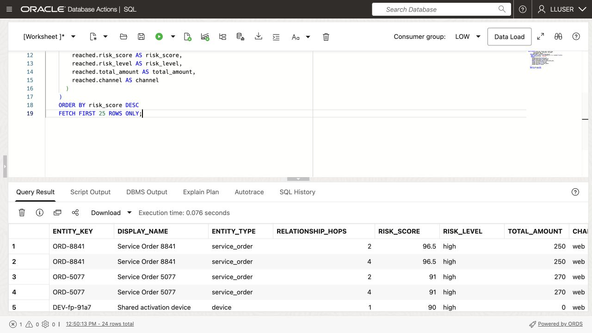

    RELATIONSHIP_HOPS shows the entity's level in the search. A value of `1` means the entity is directly connected to `ORD-8841`; a value of `2` means the query reached it after one intermediate vertex; values `3` and `4` show deeper connections.

    **Expected output: High Risk Activation Fraud Entities**

    Compare the returned columns with the capture above.

2. Review the high-risk entities.
    The query returns connected entities as a risk-sorted table, not as a visual network. That makes the graph result usable in the same SQL review workflow as the dashboard, vector search, and service order labs.

    The expected rows show the entities connected to suspicious service order `ORD-8841`. 
    For example:
    * `DEV-fp-91a7` is a device 
    * `TOKEN-REUSED-017` is a tokenized payment reference reused across service orders
    * `IP-198.51.100.44` is an IP address
    * `PHONE-212-0199` is a phone number
    
    These rows matter because they show what the suspicious service order touched or shared.

    The result gives investigators a risk-sorted list of connected entities. Instead of reviewing a tangle of connections, the analyst gets a table sorted by risk score. High risk scores and large amounts point to entities that may require manual activation review, case escalation, or deeper review before looking at lower-risk connections.

## Task 4: Find service orders that share identifying information

Bob now moves from one suspicious service order to a broader activation fraud question: **which service order pairs share a device, IP address, phone number, or email address?** This is the kind of relationship pattern that can be difficult to find with ordinary joins.

1. Run Bob's service order-pair query:

    ```sql
    <copy>
    SELECT order_a, shared_entity, shared_type, order_b,
           a_risk, b_risk,
           ROUND((a_risk + b_risk) / 2, 1) AS combined_risk,
           e1_type, e2_type
    FROM GRAPH_TABLE ( activation_fraud_network
        MATCH (a IS entity)
              -[e1 IS related_to]-> (shared IS entity)
              <-[e2 IS related_to]- (b IS entity)
        WHERE a.entity_type = 'service_order'
          AND b.entity_type = 'service_order'
          AND a.entity_id < b.entity_id
          AND shared.entity_type IN ('device','ip_address','phone','email')
          AND (a.risk_score >= 70 OR b.risk_score >= 70)
        COLUMNS (
            a.entity_key AS order_a,
            shared.entity_key AS shared_entity,
            shared.entity_type AS shared_type,
            b.entity_key AS order_b,
            a.risk_score AS a_risk,
            b.risk_score AS b_risk,
            e1.relationship_type AS e1_type,
            e2.relationship_type AS e2_type
        )
    )
    ORDER BY combined_risk DESC, shared_entity
    FETCH FIRST 25 ROWS ONLY;
    </copy>
    ```

    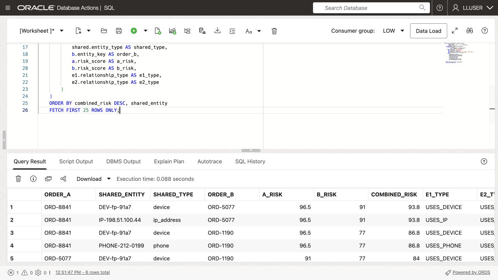

    The pattern starts at service order `a`, follows an edge to a shared entity, and follows another edge back to service order `b`. The two service orders can therefore be connected through the same device, IP address, phone number, or email address. `a.entity_id < b.entity_id` keeps the result from returning the same pair twice in reverse order.

2. Review the business result.

    The result shows the two service orders, the information they share, the relationship type on each side, and the risk score for each service order. `COMBINED_RISK` helps the analyst review the strongest service order pairs first. A shared identifier does not prove activation fraud, but it gives the activation fraud team a clear reason to investigate the service orders together.

## Task 5: Visualize the relationship using Oracle Graph Studio

Oracle Graph Studio displays the service orders and identifiers as an interactive network. Bob can select nodes and follow relationships to find clusters, shared devices, and links between service orders.

In the following tasks, use Graph Studio to turn the SQL results for `ORD-8841` into an investigation map.

1. Start from the Database Actions Launchpad. Confirm that the upper-right corner shows `LLUSER`. If the dark-theme message appears, click **Done**.

    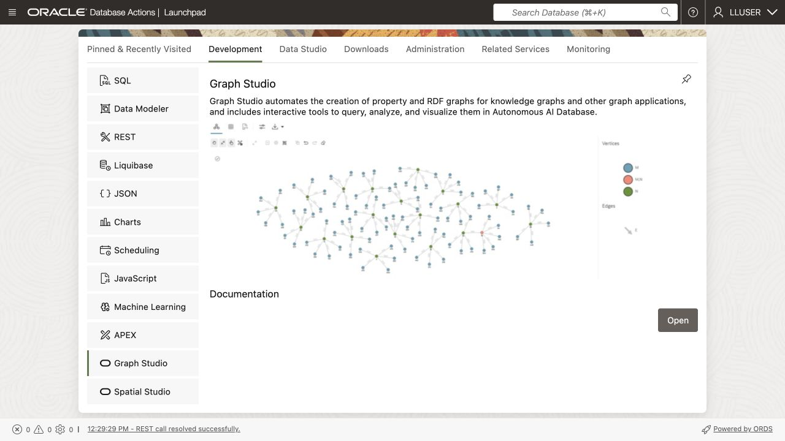

3. On the **Development** tab, select **Graph Studio** from the left-side tool list and click **Open**.

4. If prompted, sign in with the `LLUSER` and the workshop password supplied.

5. Confirm that the Graph Studio home page opens. The landing page provides **Graphs**, **Notebooks**, **Templates**, and **Jobs**.

    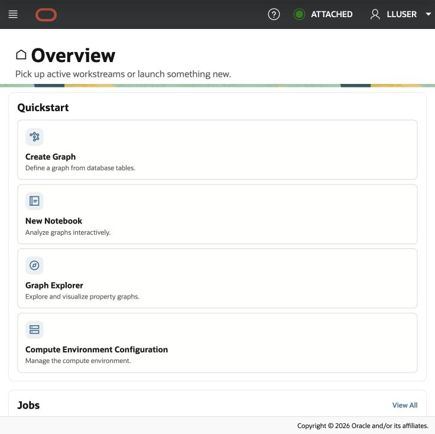

## Task 6: Download and import the telecommunications notebook

The supplied `.dsnb` file is a native Graph Studio notebook: a reusable, runnable investigation guide that combines SQL/PGQ paragraphs and graph visualizations.

1. Download [telecommunications-activation-fraud-graph-studio.dsnb](files/telecommunications-activation-fraud-graph-studio.dsnb).

    If the notebook opens in your browser instead of downloading, right-click the link and select **Save Link As**.

2. In Graph Studio, click **Notebooks** in the landing page.

    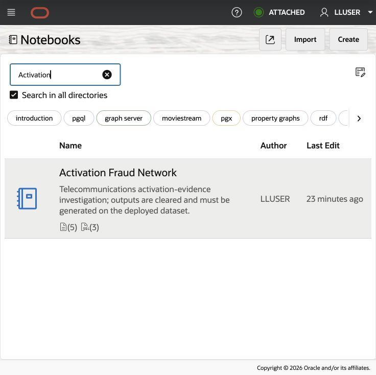

3. Select **Import** in the upper-right corner.

    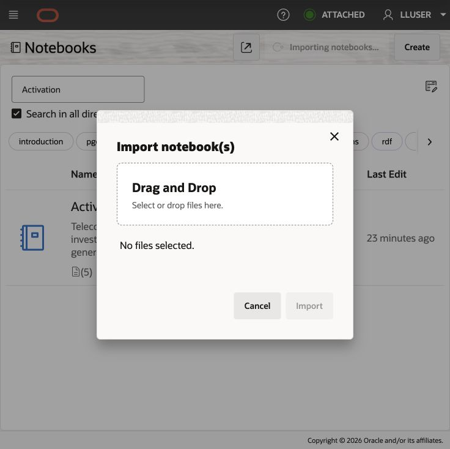

4. Once the import notebooks tab opens, drag & drop the `telecommunications-activation-fraud-graph-studio.dsnb` file from your local computer into the import window, or browse to the file on your computer. Review the selected filename and click **Import**. Open **Activation Fraud Network** after the import completes.

    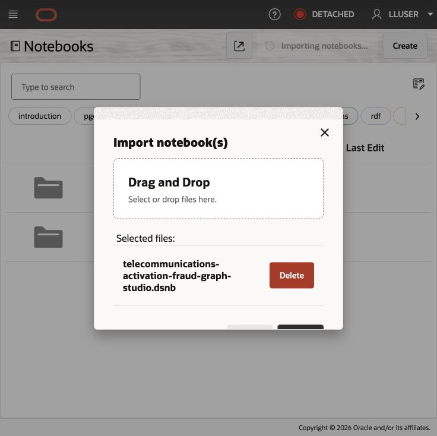

## Task 7: Run and interpret the Graph Studio notebook

You already ran the SQL/PGQ patterns in SQL Worksheet. Now run selected parts of that investigation in Graph Studio so you can compare the query results with the visual graph experience. The notebook shows the `ORD-8841` path and the `DEV-fp-91a7` shared-device view.

Use the table to rank connected entities. Use the graph to follow the paths and shared identifiers that connect them.

1. Start at the top of the **Activation Fraud Network** notebook. Read the explanation for the `ORD-8841` traversal, then run the first SQL paragraph.

    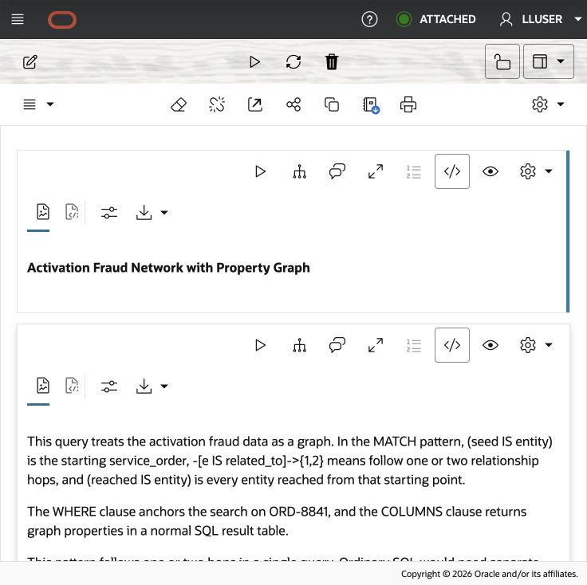

2. Review the results in table format in the graph studio notebook:

    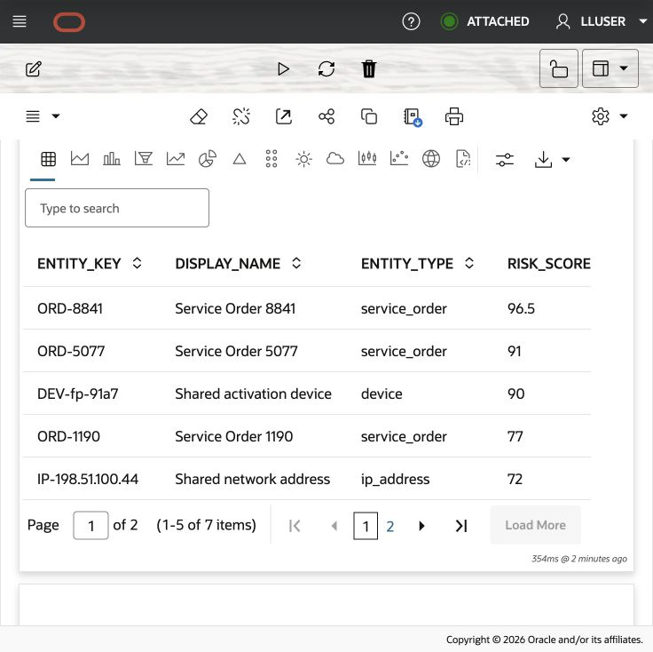

    This uses the investigation pattern from Task 3 with a shorter one-to-two-hop limit: start from `ORD-8841`, follow one or two relationship hops, and return the connected entities as a table sorted by risk score.

    | Paragraph | Result | Investigation purpose |
    | --- | --- | --- |
    | `SELECT DISTINCT ... WHERE seed.entity_key = 'ORD-8841'` | Table | Ranks entities reached within one or two hops of `ORD-8841`. |
    | `Graph Visualization of previous query` | Markdown label | Introduces the visual version of the first traversal. |
    | `SELECT * ... WHERE src.entity_key = 'ORD-8841'` | Graph visualization | Draws the one-hop and two-hop path from the suspicious service order. |
    | `Shared Entity Connections` | Markdown label and explanation | Introduces the device-centered relationship view. |
    | `SELECT * ... WHERE device.entity_key = 'DEV-fp-91a7'` | Graph visualization | Centers on `DEV-fp-91a7` and draws its directly connected service orders. |

3. Under **Graph Visualization of previous query**, run the SQL paragraph that begins with `SELECT *` and follows connections from `ORD-8841`. Review the graph visualization that appears below the paragraph.

    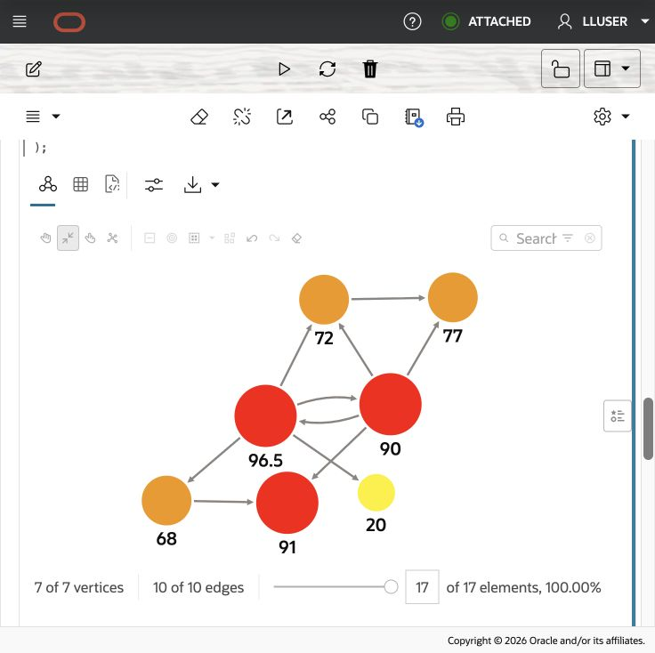

    Note how the service orders and devices in the previous query were turned into vertices and edges in Graph Studio to display an interactive network.

4. Under **Shared Entity Connections**, read the device-centered explanation, then run the final SQL paragraph that starts at `DEV-fp-91a7`. Review the graph visualization that appears below the paragraph. This visualization narrows the investigation to the device DEV-fp-91a7.

    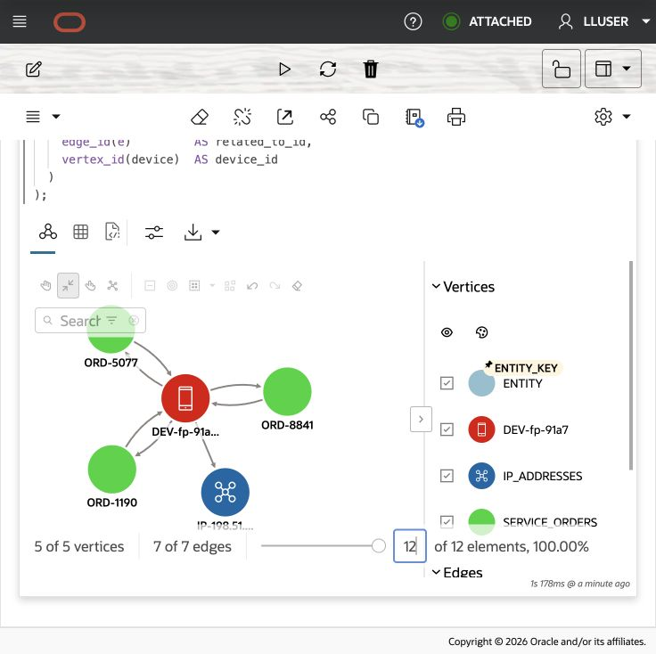

    Check that the visualization includes ORD-8841, ORD-5077, and ORD-1190 around the shared device; display filters can hide graph elements.

The sample data requires device `DEV-fp-91a7` to link service order vertices ORD-8841, ORD-5077, and ORD-1190. These links illustrate how service orders can share an activation device; verify the edges in your loaded data. This graph matters because it shows what the suspicious service order touched or shared.

> **Result note:** Graph layouts and node positions can vary between runs. Compare entity keys, relationships, and query results.

You have used SQL/PGQ to list connected entities and Graph Studio to explore their relationships. Together, these views help you explain the connections around `ORD-8841`.

### Optional graph-algorithms extension

The companion [airtime graph notebook](files/getting-started-airtime-graph.dsnb) lets you practice PGX graph algorithms: parameterized paths, degree counts, PageRank, shortest paths, personalized PageRank, and hop distance. It uses `AIRTIME_GRAPH`, with prepaid account holders connected by sample airtime transfers. It is separate from `ACTIVATION_FRAUD_NETWORK` and requires the optional PGQL graph and PGX service described in the tables and sample-data reference. Before running it, ask the administrator to create the PGQL graph and enable PGX. Closely connected accounts deserve a closer look, but their connections do not prove abuse.

## Conclusion: Make Relationships Easy to Review

Bob's graph queries show why a property graph fits activation-fraud investigations. Bob can start with one suspicious service order, follow its relationships, limit the search to a chosen number of hops, and find service order pairs that share identifying information. The queries stay readable as the network grows, while the results still include the risk and activity details needed for review.

Graph Studio displayed the same relationships as an interactive network. Bob compared the notebook results with the earlier SQL Worksheet results, then explored clusters, shared devices, and links between service orders.

## Appendix: Create the Property Graph

Bob creates a property graph by mapping relational tables to graph elements. `ACTIVATION_ENTITIES` becomes the vertex table, and each row receives the `entity` label. `ACTIVATION_RELATIONSHIPS` becomes the edge table, with foreign keys identifying the source and destination vertices. The graph queries in this lab use those two labels.

This statement is provided for reference. The `ACTIVATION_FRAUD_NETWORK` graph has already been created in the workshop database.

```sql
<copy>
CREATE PROPERTY GRAPH activation_fraud_network
  VERTEX TABLES (
    activation_entities KEY (entity_id)
      LABEL entity
      PROPERTIES (
        entity_id,
        entity_key,
        display_name,
        entity_type,
        risk_score,
        risk_level,
        channel,
        total_amount,
        event_count,
        is_confirmed_fraud
      ),
    activation_cases KEY (case_id)
      LABEL activation_case
      PROPERTIES (
        case_id,
        case_ref,
        case_type,
        status,
        risk_score,
        loss_amount,
        event_count
      )
  )
  EDGE TABLES (
    activation_relationships KEY (relationship_id)
      SOURCE KEY (from_entity)
        REFERENCES activation_entities (entity_id)
      DESTINATION KEY (to_entity)
        REFERENCES activation_entities (entity_id)
      LABEL related_to
      PROPERTIES (
        relationship_type,
        strength,
        event_count,
        total_amount
      ),
    activation_case_entities KEY (case_entity_id)
      SOURCE KEY (case_id)
        REFERENCES activation_cases (case_id)
      DESTINATION KEY (entity_id)
        REFERENCES activation_entities (entity_id)
      LABEL contains_entity
      PROPERTIES (
        role,
        evidence_score
      )
  );
</copy>
```

The statement defines the graph structure over the relational tables. It does not move the rows to a separate graph database. `ACTIVATION_FRAUD_NETWORK` can then be queried with `GRAPH_TABLE` while the relational tables remain the source of the data.

## Acknowledgements

* **Author** - Matt Kowalik
* **Contributor** - Kevin Lazarz
* **Last Updated By/Date** - Matt Kowalik, September 2026
