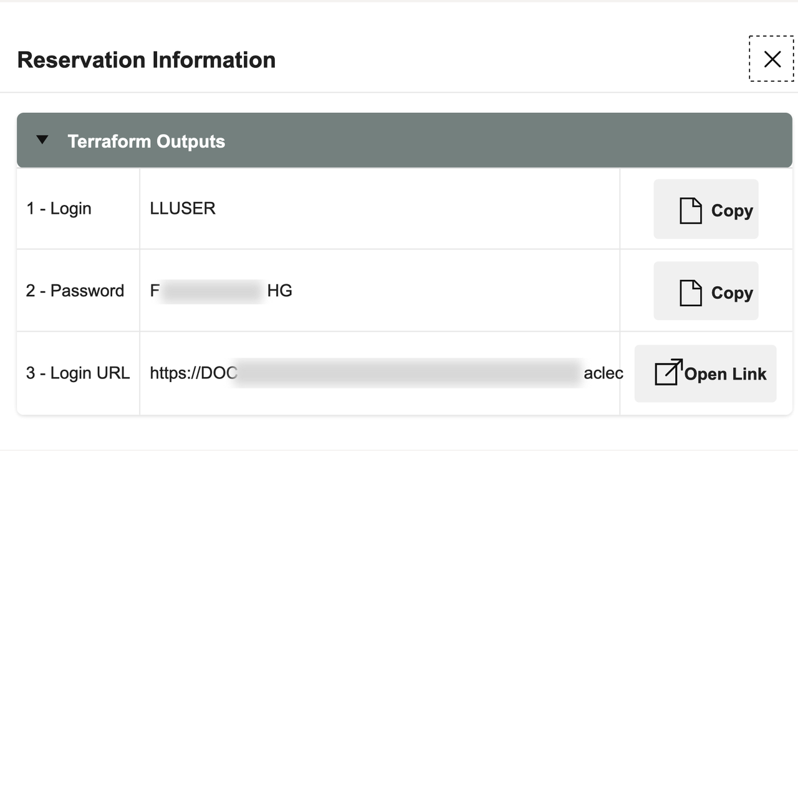
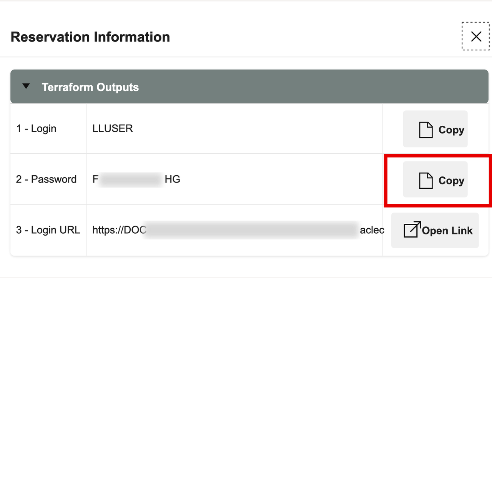
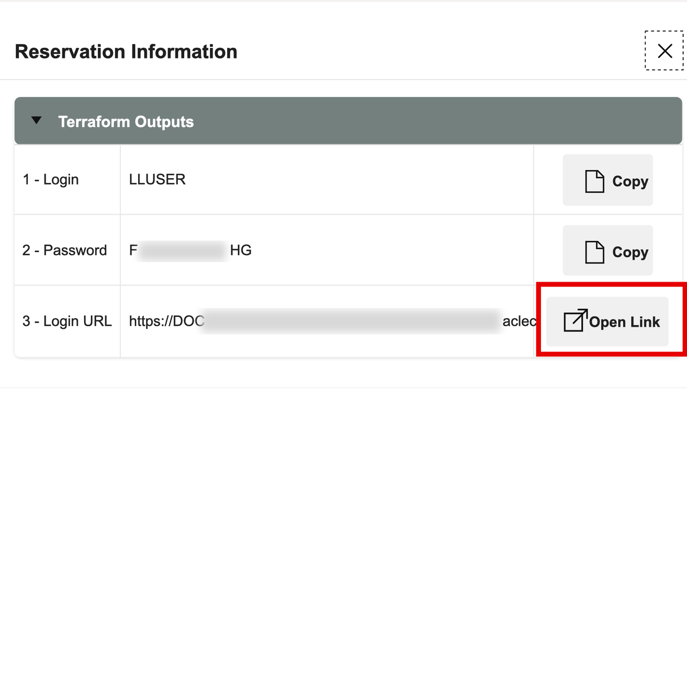
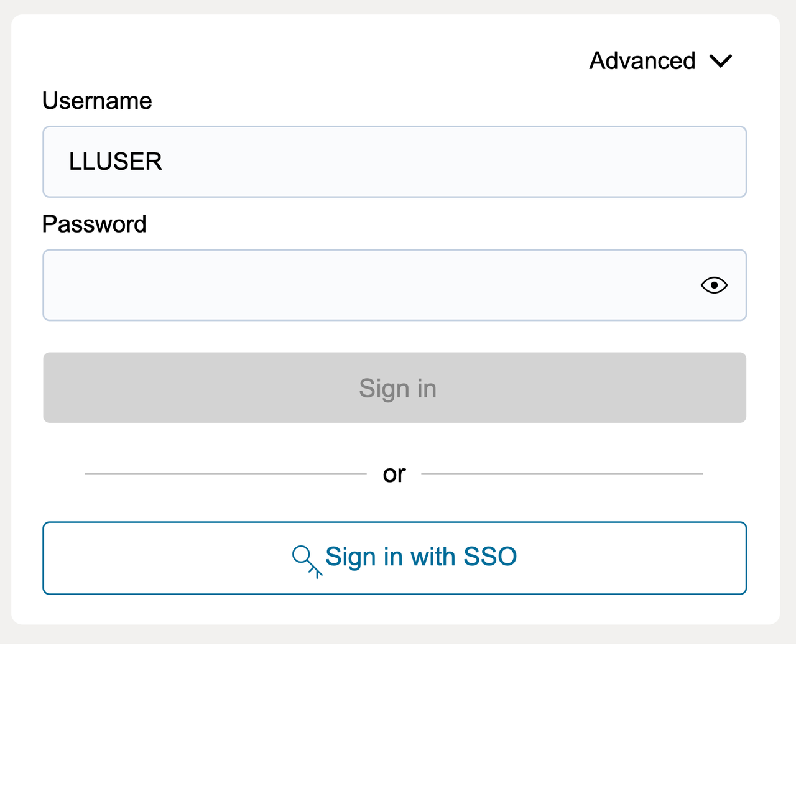
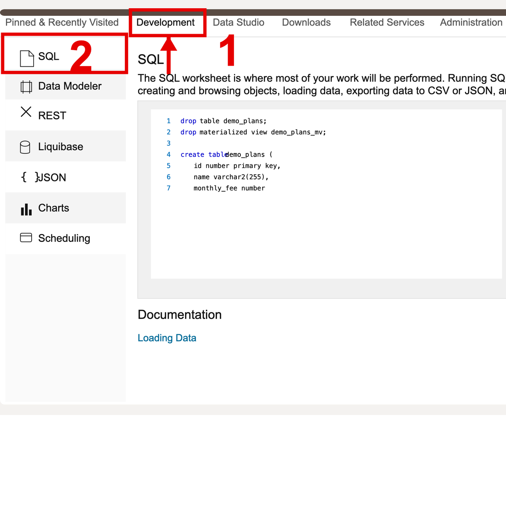
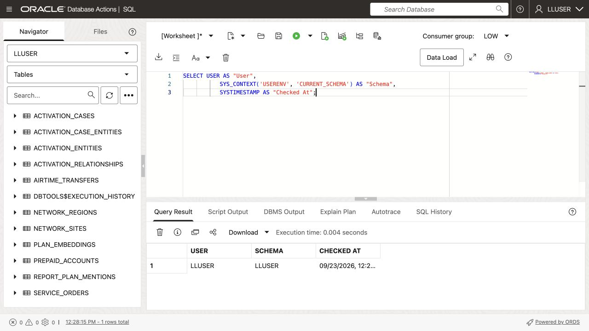

# Getting Started

## Introduction

Open your LiveLabs reservation, sign in to **Autonomous Database 26ai**, and prepare SQL Worksheet. Run the telecommunications exercises as `LLUSER`, the workshop database user.

<details>
<summary><strong>Key terms: Database Actions, SQL Worksheet, and LLUSER</strong></summary>

> - **Database Actions** is the browser workspace for Oracle Database. You use it to run SQL, browse objects, load data, and open development tools without installing a desktop database client.
>
> - **SQL Worksheet** is the Database Actions tool where you paste and run SQL. It displays query results, script output, and errors.
>
> - `LLUSER` is the workshop database user and schema owner for the hands-on telecommunications objects. Using the right user matters because the tables, views, models, graph objects, and functions you query are created under this schema.

</details>

The sign-in illustrations show where to find the controls used below.

### Environment prerequisites

The LiveLabs sandbox loads the telecommunications dataset into `LLUSER` before you begin. The [telecommunications tables and sample data](../reference/tables-and-sample-data.md) describe what the labs expect. For a manually provisioned database, the instructor must prepare a fresh schema using the [stack runbook](../stack/README.md); do not run the loader over an occupied schema.

Required capabilities are Database Actions SQL Worksheet, Graph Studio, native JSON and duality views, Oracle Spatial, Oracle Machine Learning, access to `ADMIN.ALL_MINILM_L12_V2`, and an enabled `GENAI` profile with an approved provider. Labs 1 and 4 require preloaded embeddings and a precreated activation graph. Lab 3 creates a separate teaching vector column. Lab 8 depends on Lab 7. AutoML and the supplemental PGX notebook also need their respective services and privileges.

Follow the sandbox launch steps below. If you use a manually provisioned database, open the Database Actions URL supplied by your instructor and sign in as `LLUSER`.

Estimated Time: **5 minutes**

### Objectives

In this lab, you will:

- Launch the LiveLabs workshop environment.
- Use the reservation login information to open Database Actions.
- Confirm that SQL Worksheet is ready for the telecommunications schema.
- Confirm that SQL Worksheet is connected as the workshop schema user.

## Task 1: Launch the LiveLabs environment

Open the LiveLabs reservation for this workshop. It contains the database link and sign-in details.

1. Sign in to [LiveLabs](https://livelabs.oracle.com) with your Oracle account.

2. Open this workshop, select **Start**, and select **Run on LiveLabs Sandbox**.

3. In **My Reservations**, select **Launch Workshop** for this reservation.

4. Select **View Login Info** and keep the database credentials available for the next task.

    

    *Figure 1: The Reservation Information dialog shows the `LLUSER` login, password, and Login URL for Database Actions.*

## Task 2: Open SQL Worksheet

Open SQL Worksheet as `LLUSER`. Run each query there and review the returned table.

1. In the **Reservation Information** dialog, confirm that **1 - Login** shows `LLUSER`.

2. Select **Copy** for **2 - Password**.

    

    *Figure 2: Copy the `LLUSER` password from the Reservation Information dialog.*

3. Select **Open Link** for **3 - Login URL**.

    

    *Figure 3: Use Open Link for the Login URL, then use the copied password to sign in as `LLUSER`.*

4. On the Database Actions sign-in page, confirm that **Username** shows `LLUSER`, paste the password from the reservation information, and select **Sign in**.

    

    *Figure 4: Sign in to Database Actions as `LLUSER` with the password from the reservation information.*

5. Before SQL Worksheet opens, select **Development**, then select **SQL** from the tools menu.

    

    *Figure 5: Open SQL from the Development tools menu.*

6. Use the same SQL Worksheet pattern throughout the workshop.

    - Confirm the user dropdown shows the main workshop user, usually `LLUSER`.
    - Replace the editor contents with the next workshop SQL block.
    - For one SQL statement, select **Run Statement** or press **Ctrl+Enter** (**Command+Enter** on macOS).
    - For a block containing multiple statements or PL/SQL ending with `/`, select **Run Script (F5)**. This runs the whole block, including any `COMMIT` statements.
    - Review **Query Result** for a statement or **Script Output** for a script. Check every statement in the script output for errors before continuing.
    - Use **Navigator** only when you want to inspect tables, views, or other objects.

7. Run this check.

    This check makes sure SQL Worksheet is connected as the right user before you start. `USER` shows who signed in, while `SYS_CONTEXT('USERENV', 'CURRENT_SCHEMA')` shows where table names resolve. The telecommunications labs use `LLUSER`, so both values should point to the workshop schema.

    ```sql
    <copy>
    SELECT USER AS "User",
           SYS_CONTEXT('USERENV', 'CURRENT_SCHEMA') AS "Schema",
           SYSTIMESTAMP AS "Checked At";
    </copy>
    ```

    

    **Expected output: Connected SQL Worksheet Session**

    | User | Schema | Checked At |
    | --- | --- | --- |
    | LLUSER | LLUSER | Current SQL Worksheet timestamp |

8. You can use this same connection check whenever you want to confirm that SQL Worksheet is still running as `LLUSER`.

You can now continue to the telecommunications labs.

## Acknowledgements

* **Author** - Matt Kowalik
* **Contributor** - Kevin Lazarz
* **Last Updated By/Date** - Matt Kowalik, September 2026

