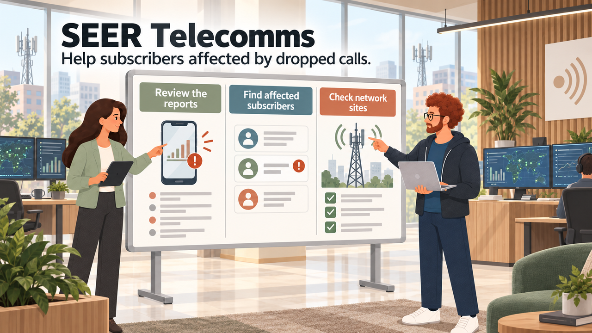
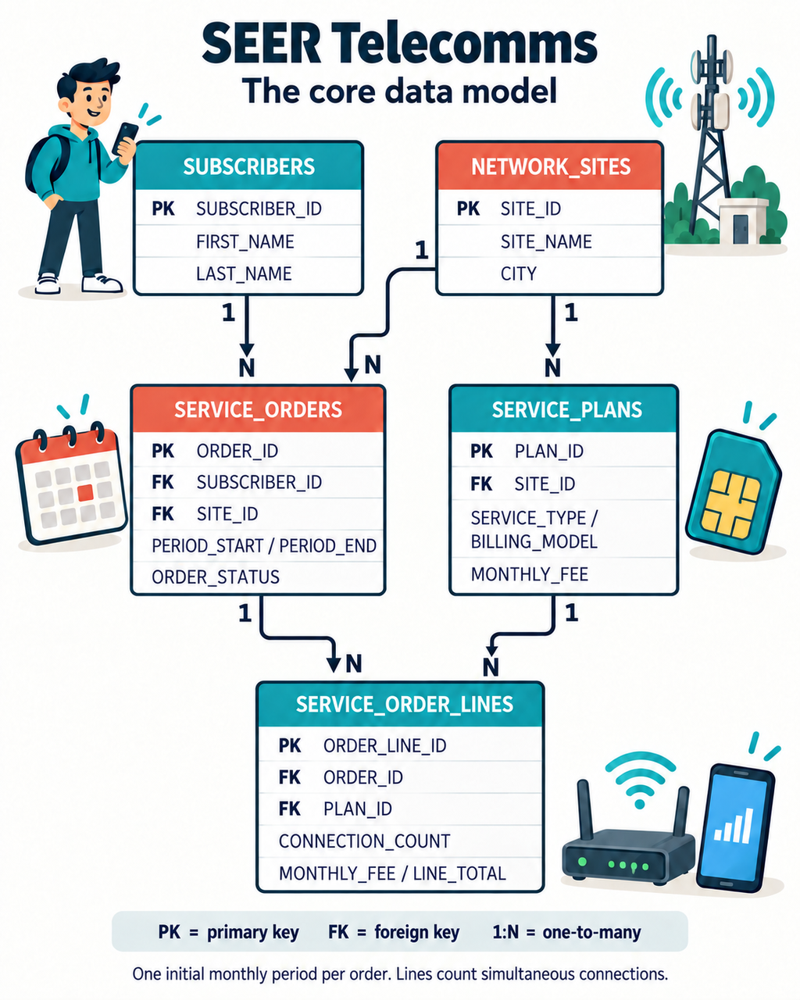
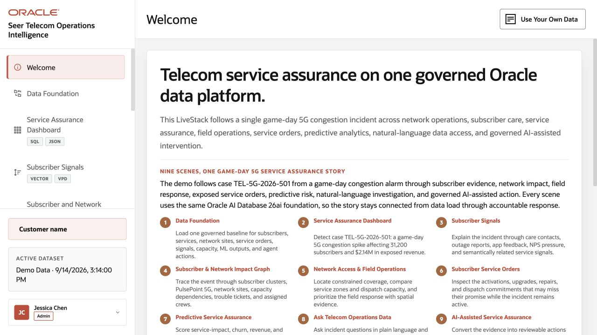

# Build Connected Telecommunications Solutions with Oracle AI Database

## Introduction

Jessica Chan, the DBA at SEER Telecomms, starts the morning with a request from subscriber support. Several callers report dropped calls indoors. Which service plans match the complaint, which subscribers ordered them, and which network sites should the radio team review?

Thomas needs service-order details as JSON for the subscriber application. Gilly will find plans by meaning. Bob will follow shared devices and contact identifiers in an activation-fraud review. Moon will locate nearby network sites, Otto will build an activation-demand watchlist, and Nina will ask questions about contracted monthly charges.

Jessica brings the team together around records in Oracle AI Database. Each lab follows one part of their work. A nearby site or a matching plan description does not prove the cause of an outage. Support staff still check device compatibility, measured coverage, site alarms, and available capacity before recommending a change.

The teams need different ways to use the same records:

- Thomas needs service orders as JSON for a web and mobile application.
- Gilly needs semantic search to find relevant service plans when callers use different words.
- Bob needs to trace service orders linked by activation evidence.
- Moon needs to compare subscriber service addresses, access sites, and network regions.
- Otto needs to classify plan demand from accepted orders and support diagnostics.
- Nina needs to ask telecom questions and inspect the SQL behind each answer.

### SEER Telecomms data model

SEER Telecomms is a fictional communications provider. All people, sites, orders, observations, and graph evidence are made-up sample data for this workshop.

*A service order covers one initial monthly period. Each line selects a plan offered for that site’s service area and a number of simultaneous connections. Monthly charges equal connections multiplied by the agreed monthly fee. The one-time activation fee is separate.* [Open the full-size diagram](images/seer-telecomms-erd.png) or use the [text-based SVG diagram](images/seer-telecomms-erd.svg) and read the [complete table and sample-data reference](../reference/tables-and-sample-data.md).

Plans cover mobile voice and data, fixed wireless, fiber, and IoT. Each plan includes access technology, advertised download speed, and a data allowance; a null allowance means unlimited. The workshop links each plan to a site to represent a service area. Commercial mobile plans are not tied to a single radio tower. Subscriber locations are service addresses, not live handset tracking.

The [running telecom application](http://141.144.192.27:8505/) follows a game-day 5G congestion incident. Open **Welcome** to see how its screens connect. Its demo dataset and current user, Jessica Chen, differ from the workshop sample data and teaching personas. Use the lab queries and sample data for the database exercises.

### What the team builds

| Team member | Requirement | What you will see |
| --- | --- | --- |
| Jessica, Telecom DBA | Prioritize plans and subscribers needing support. | One query combines service reports, vector matches, JSON order activity, and network-site geography. |
| Thomas, application developer | Serve and update service-order documents. | JSON columns, JSON collections, and JSON Relational Duality expose three application-data patterns. |
| Gilly, AI engineer | Match a caller's concern to plans and subscribers. | An in-database embedding model turns plan descriptions into vectors; SQL adds order and contact details. |
| Bob, graph specialist | Review suspicious activation connections. | SQL/PGQ and Graph Studio show shared devices, payment tokens, contacts, and paths. |
| Moon, spatial specialist | Find sites near subscribers needing support. | Spatial SQL filters service addresses by region and ranks active sites by distance. |
| Otto, data scientist | Build a service-plan demand watchlist. | Oracle Machine Learning classifies synthetic demand and joins scores to supporting activity. |
| Nina, subscriber experience analyst | Review monthly charges without writing every query. | Select AI shows generated SQL; an agent uses its SQL tool and records the activity. |

The relational records also support documents, semantic search, graph investigations, spatial analysis, model scores, and natural-language questions. The teams can combine those results without maintaining separate copies for each database capability.

<strong>Learn more: What does "converged database" mean?</strong>

> A **converged database** handles several data types and kinds of work in one database. Here, teams use relational rows, JSON documents, vectors, graphs, geographic data, machine learning, and AI-assisted SQL.
>
> Applications choose the form they need while records, relationships, and access controls remain together.

### Objectives

- Follow the SEER Telecomms team through subscriber support, activation review, network planning, and commercial analysis.
- Use relational SQL, JSON, vectors, graphs, spatial data, Oracle Machine Learning, Select AI, and Select AI Agent.
- Explain how these capabilities work on connected records without separate stores.
- Distinguish AI instructions and AI profile settings from database-enforced privileges.
- Review each result against its source data and the limits of the sample data.

Estimated Workshop Time: **90 minutes**

## Acknowledgements

* **Author** - Matt Kowalik
* **Contributor** - Kevin Lazarz
* **Last Updated By/Date** - Matt Kowalik, September 2026
