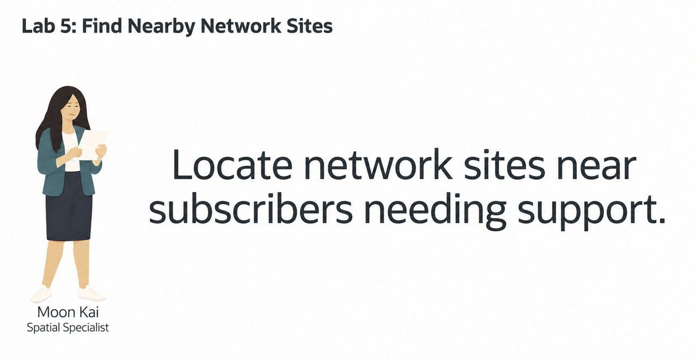
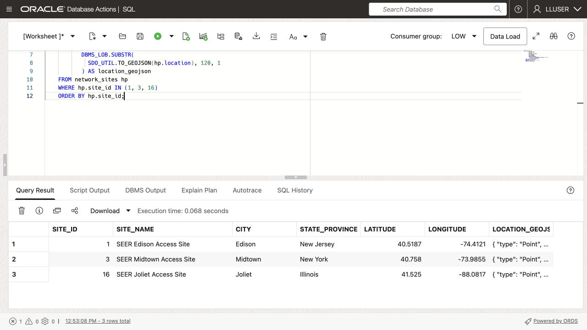
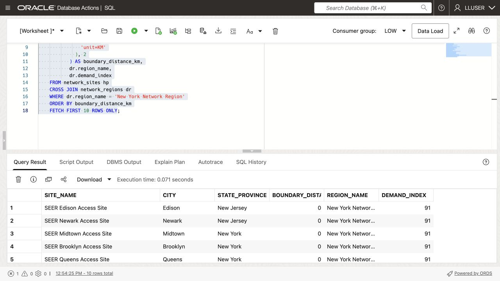
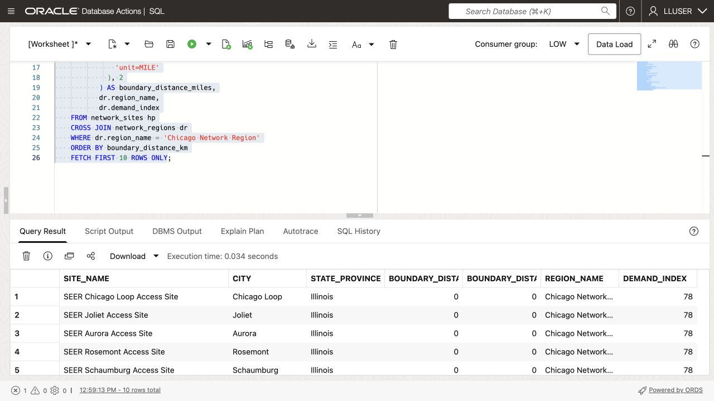
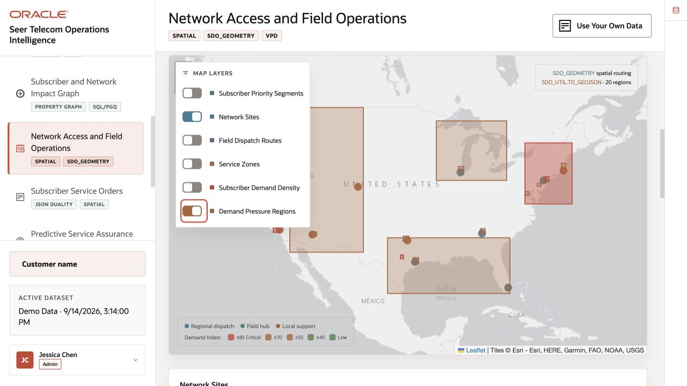
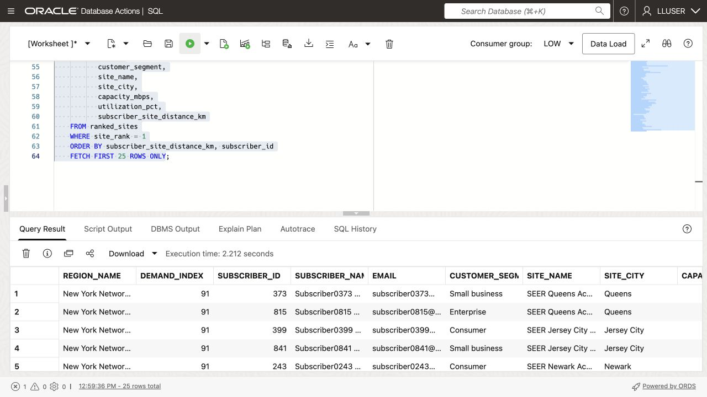

# Find Nearby Network Sites



## Introduction

Moon Kai is SEER Telecomms’ spatial specialist. Operations teams ask Moon for help when location affects a service decision: which site is closest to a region with growing demand, and which subscriber addresses lie nearby?

Oracle AI Database stores network site and subscriber locations as map points. It stores demand regions as map areas, each with a demand score.

Moon wants a query that a service team can use in a dashboard and map:

> Subscribers in a busy network region report poor connectivity. **Which subscribers are in that region, and which site is closest to each one?**

In this lab, you follow Moon's approach. You start with a single point, measure distance to a region, find subscribers inside that region, and finish with a list of subscribers and nearby sites for the support team.

<details>
<summary><strong>Key terms: point, polygon, distance, spatial relationship, and GeoJSON</strong></summary>

> - A **point** is one location, represented by longitude and latitude. In this lab, a network site is stored as an `SDO_GEOMETRY` point.
>
> - A **polygon** is an area made from connected points. Demand regions are stored as polygons.
>
> - **Distance** measures how far two spatial objects are from each other. Here, it shows how far a network site is from a demand-region boundary. A distance of zero means the site is inside or touching the region.
>
> - A **spatial relationship** describes how two shapes relate to each other. `SDO_GEOM.RELATE` can test whether a subscriber point is inside or touches a demand region.
>
> - **GeoJSON** is a JSON format for map locations and shapes. `SDO_UTIL.TO_GEOJSON` lets an application display the same database location on a map.
>
</details>

Oracle Spatial can support a subscriber-service review map using the distances calculated in this lab.

### Objectives

- Identify spatial points and polygons in the telecommunications data.
- Convert a database point to GeoJSON for an application map.
- Measure which network sites are closest to a demand region.
- Find subscribers inside a demand region.
- Match each subscriber to the closest active network site.

Estimated Time: **10 minutes**

### Hands-on Scenario

| Step | Telecommunications focus |
| --- | --- |
| Problem | Subscriber-service staff need nearby network sites to consider when arranging subscriber service reviews. |
| Database task | Moon needs to compare subscriber points with a region, then find the closest site for each subscriber. |
| Your role | You review Moon's spatial approach and interpret the result for an operations user. |
| What You Will See | Oracle Spatial turns location data into network-support review results with SQL. |
| Oracle features | `SDO_GEOMETRY`, `SDO_GEOM.SDO_DISTANCE`, `SDO_GEOM.RELATE`, and GeoJSON conversion support the analysis. |
| Result | An operations user can see which subscribers need service in a region and which site is closest to each one. |

> **SQL Worksheet reminder:** See [Getting Started Task 2: Open SQL Worksheet](?lab=getting-started#Task2:OpenSQLWorksheet) for the steps to paste and run SQL.

## Task 1: Look at the locations as points

Moon starts with the simplest spatial question: **where are the network sites?** The database stores each site as an `SDO_GEOMETRY` point, while the application can use the same point as GeoJSON.

An `SDO_GEOMETRY` point is Oracle Spatial's structured representation of one location. An illustrative network site point could use a point type, the WGS84 coordinate system, and the coordinate pair longitude `-74.4121` and latitude `40.5187`. This example explains the format; check the actual coordinates supplied by the telecommunications loader. Because Oracle stores the location as geometry, Spatial functions can calculate distance and test spatial relationships instead of treating the coordinates as two unrelated numbers.

`SDO_UTIL.TO_GEOJSON` converts that geometry into a standard JSON map object such as `{ "type": "Point", "coordinates": [-74.4121, 40.5187] }`. The application can send this object to a map without maintaining a second location format or a separate conversion service. Oracle uses the same stored geometry for SQL analysis and application display.

The same stored location supports distance calculations, relational joins, and JSON map output.

1. Run this query:

    ```sql
    <copy>
    SELECT hp.site_id,
           hp.site_name,
           hp.city,
           hp.state_province,
           hp.latitude,
           hp.longitude,
           DBMS_LOB.SUBSTR(
             SDO_UTIL.TO_GEOJSON(hp.location), 120, 1
           ) AS location_geojson
    FROM network_sites hp
    WHERE hp.site_id IN (1, 3, 16)
    ORDER BY hp.site_id;
    </copy>
    ```

    

    `LOCATION` is the database point. `LATITUDE` and `LONGITUDE` make the value easy to read, and `LOCATION_GEOJSON` gives an application a map-ready representation of the same point. GeoJSON lists longitude first and latitude second. `SDO_UTIL.TO_GEOJSON` returns a CLOB, so `DBMS_LOB.SUBSTR` limits the displayed text to 120 characters; it does not change the stored geometry.

    **Expected output: Network Site Points**

    Compare the returned columns with the capture above.

2. Review the point data.

    Moon has not created a second map database. The point used by the application and the point used by SQL are the same value. The database can calculate with it, and the application can display it.

    Moon keeps each site’s location beside its name, capacity, status, and current load. SQL returns the distance and site details. `SDO_UTIL.TO_GEOJSON` returns the same location for the application map.

## Task 2: Find the closest sites to a demand region

The sample data gives New York Network Region a demand index of `91` for the first routing review. Moon now measures the distance from each network-site point to the region boundary.

1. Run the distance query:

    ```sql
    <copy>
    SELECT hp.site_name,
           hp.city,
           hp.state_province,
           ROUND(
             SDO_GEOM.SDO_DISTANCE(
               hp.location,
               dr.boundary,
               0.005,
               'unit=KM'
             ), 2
           ) AS boundary_distance_km,
           dr.region_name,
           dr.demand_index
    FROM network_sites hp
    CROSS JOIN network_regions dr
    WHERE dr.region_name = 'New York Network Region'
    ORDER BY boundary_distance_km
    FETCH FIRST 10 ROWS ONLY;
    </copy>
    ```

    

    `SDO_GEOM.SDO_DISTANCE` compares the network-site point with the demand-region polygon. The function returns the shortest distance between the two shapes. A value of `0` means the point is inside or touching the region.

    The four arguments in this query have simple roles:

    - `hp.location` is the first geometry: the network-site point.
    - `dr.boundary` is the second geometry: the demand-region polygon.
    - `0.005` is the tolerance used when Oracle compares the geometries. It helps Oracle handle small differences in the stored coordinates.
    - `'unit=KM'` tells Oracle to return the distance in kilometers. Change it to `'unit=MILE'` when the application needs miles.

    The `ROUND(..., 2)` around the function result only formats the answer to two decimal places. It does not change the spatial calculation.

    The query also returns `DEMAND_INDEX`, so Moon can read location and demand together. The site with the smallest distance is the first site operations should check for available capacity.

    **Expected output: Sites nearest New York Network Region**

    Review the closest site and its distance. Rankings depend on the data your loader supplied. Verify the distances after loading the sample data.

2. Try another region.

    Change the region name to `Chicago Network Region`, add a miles calculation, and run the modified query:

    ```sql
    <copy>
    SELECT hp.site_name,
           hp.city,
           hp.state_province,
           ROUND(
             SDO_GEOM.SDO_DISTANCE(
               hp.location,
               dr.boundary,
               0.005,
               'unit=KM'
             ), 2
           ) AS boundary_distance_km,
           ROUND(
             SDO_GEOM.SDO_DISTANCE(
               hp.location,
               dr.boundary,
               0.005,
               'unit=MILE'
             ), 2
           ) AS boundary_distance_miles,
           dr.region_name,
           dr.demand_index
    FROM network_sites hp
    CROSS JOIN network_regions dr
    WHERE dr.region_name = 'Chicago Network Region'
    ORDER BY boundary_distance_km
    FETCH FIRST 10 ROWS ONLY;
    </copy>
    ```

    

    The `unit` parameter controls the measurement unit. Review whether a site lies inside the Chicago Network Region polygon. A point inside or touching the polygon has distance zero. The sample data gives this region a demand index of 78. Check the site rankings in your result.

    This is a useful regional result, but distance to the region boundary does not identify the subscribers who need service. Moon now uses the region polygon to find those subscribers and then ranks the closest active site for each address.

In **Network Access and Field Operations**, enable **Network Sites** and **Demand Pressure Regions**. Compare the site markers with the region overlays. The demo uses its own locations and capacity data, so this map illustrates spatial presentation rather than the expected New York or Chicago SQL result.



## Task 3: Find the closest site for each subscriber

Moon now needs a result that an operations application can use: subscribers inside New York Network Region, their demand region, and the closest active network site. The query uses the subscriber point (**`g.location`**) and demand-region polygon (**`dr.boundary`**) to find the subscribers first. It then compares each subscriber point with every active site and keeps the closest one.

1. Run the subscriber-to-site query:

    ```sql
    <copy>
    WITH regional_subscribers AS (
      SELECT dr.region_name,
             dr.demand_index,
             g.subscriber_id,
             g.first_name || ' ' || g.last_name AS subscriber_name,
             g.email,
             g.customer_segment,
             g.location
      FROM subscribers g
      CROSS JOIN network_regions dr
      WHERE dr.region_name = 'New York Network Region'
        AND SDO_GEOM.RELATE(
              dr.boundary,
              'ANYINTERACT',
              g.location,
              0.005
            ) = 'TRUE'
    ), ranked_sites AS (
      SELECT rg.region_name,
             rg.demand_index,
             rg.subscriber_id,
             rg.subscriber_name,
             rg.email,
             rg.customer_segment,
             hp.site_name,
             hp.city AS site_city,
             hp.capacity_mbps,
             hp.utilization_pct,
             ROUND(
               SDO_GEOM.SDO_DISTANCE(
                 rg.location,
                 hp.location,
                 0.005,
                 'unit=KM'
               ), 2
             ) AS subscriber_site_distance_km,
             ROW_NUMBER() OVER (
               PARTITION BY rg.subscriber_id
               ORDER BY SDO_GEOM.SDO_DISTANCE(
                          rg.location,
                          hp.location,
                          0.005,
                          'unit=KM'
                        )
             ) AS site_rank
      FROM regional_subscribers rg
      CROSS JOIN network_sites hp
      WHERE hp.is_active = 1
    )
    SELECT region_name,
           demand_index,
           subscriber_id,
           subscriber_name,
           email,
           customer_segment,
           site_name,
           site_city,
           capacity_mbps,
           utilization_pct,
           subscriber_site_distance_km
    FROM ranked_sites
    WHERE site_rank = 1
    ORDER BY subscriber_site_distance_km, subscriber_id
    FETCH FIRST 25 ROWS ONLY;
    </copy>
    ```

    

    `SDO_GEOM.RELATE` keeps subscribers whose point falls inside or touches the New York Network Region polygon. `SDO_GEOM.SDO_DISTANCE` then measures the distance from each matching subscriber to every active site. `ROW_NUMBER` keeps the nearest site for each subscriber.

2. Review the result as an operations decision.

    Subscriber `LOCATION` is the service address supplied in the sample data. Each row gives an operations analyst a subscriber to contact, the closest site, and the information needed to decide where the work should go. The result combines the region's demand score, subscriber details, site capacity, current load, and spatial distance in one SQL result.

    A dashboard can use this result to show subscribers in the selected region and the closest network site to each subscriber. The service team can review the location and capacity details together before opening a network-support investigation.

3. Change the query to `Chicago Network Region`.

    Compare the subscribers and nearest sites with the New York result. The spatial predicates stay the same; only the region changes. This is the kind of query an operations dashboard can run when an operations analyst selects a different demand region.

> **Recommendation boundary:** The query finds the nearest active network site by straight-line distance. It does not establish serving-cell attachment, radio coverage, fiber reach, or available throughput. Check signal measurements, access technology, backhaul, alarms, and current capacity before recommending a service change. `CAPACITY_MBPS` and `UTILIZATION_PCT` are snapshots.

## Conclusion: Turn Location into a Service Decision

Moon used points and polygons to find subscribers in a demand region and rank nearby network sites. The result gives the service team subscribers to contact and network sites to investigate.

One SQL query finds subscribers by location, joins their records to network site details, and returns distance, capacity, and current load. A dashboard can use these results for both its map and subscriber list.

## Next Steps

You used points and polygons to find subscribers in a region and nearby sites for the operations team to review. For a deeper hands-on workshop focused on Oracle Spatial, open the [Oracle Spatial LiveLabs workshop](https://livelabs.oracle.com/ords/r/dbpm/livelabs/view-workshop?clear=RR,180&wid=800).

## Acknowledgements

* **Author** - Matt Kowalik
* **Contributor** - Kevin Lazarz
* **Last Updated By/Date** - Matt Kowalik, September 2026
