# Build a Service Plan Demand Watchlist with Oracle Machine Learning

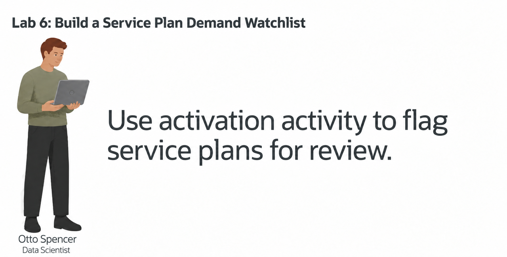

## Introduction

> **Validation status:** Tested as LLUSER in a manually provisioned database on 23 September 2026. Screenshots show that run. Load a fresh workshop schema before starting these exercises.

Otto Spencer is SEER Telecomms’ data scientist. His team supplies the predictions used in analytics charts and dashboards.

The service plan team wants a demand watchlist. A plan analyst should be able to see which service plans may need more attention, why the model flagged them, and which service plans are already showing strong activations or subscriber activity.

Otto has plan details, activation orders, support reports, and network measurements in Oracle AI Database. He could copy the data to a separate machine learning platform, train a model there, and copy the scores back. That would create another copy of telecommunications data and another process for keeping scores current.

Instead, Otto builds and scores the model in the database. The model classifies the September snapshot as `SURGE` or `STABLE`, using order demand and network-support diagnostics. SQL then joins the prediction to the service plan name, activations, and diagnostic values that a dashboard needs.

In this lab, you build Otto's demand-surge model and turn its output into a review list for a plan analyst.


<details>
<summary><strong>Key terms: model, feature, classification, probability, and in-database machine learning</strong></summary>

> - A **model** is a set of learned rules that turns input data into a prediction.
>
> - A **feature** is an input value used by the model. In this lab, features include service plan category, price, support reports and network diagnostics, and activations.
>
> - **Classification** predicts a label. Otto's model predicts either `SURGE` or `STABLE`.
>
> - A **probability** is the model's value for a class. In this lab, the value is displayed as a `SURGE_SCORE` to rank service plans for review. It is not a guarantee.
>
> - **In-database machine learning** means the model is trained or scored where the source data already lives. The SQL result can include the prediction and the data used to explain it.

</details>


### Objectives

- Read the prepared training data and identify the model target.
- Optionally use AutoML to compare classification models and inspect their predictions.
- Create the selected Generalized Linear Model inside Oracle AI Database.
- Score service plans with `PREDICTION` and `PREDICTION_PROBABILITY`.
- Combine model output with service plan, activations, and diagnostic data for a dashboard result.

Estimated Time: **10 minutes**

### Hands-on Scenario

| Step                | Telecommunications focus                                                                                                        |
| ---------------------| ----------------------------------------------------------------------------------------------------------------------|
| Problem    | A plan analyst needs a short list of service plans that may require attention.                                           |
| Database task | Otto needs to train and score a model without copying service plan activity to another machine learning system.           |
| Your role       | You follow Otto as he builds the model and checks the result before it reaches a dashboard.                          |
| What You Will See   | Optionally compare models with AutoML, then use SQL Developer Web to create and score the selected model.             |
| Oracle features | AutoML, `DBMS_DATA_MINING`, `PREDICTION`, and `PREDICTION_PROBABILITY` support machine learning inside the database. |
| Result             | A watchlist for a dashboard combines the model result with the service plan and activity data behind it.                  |

> **SQL Worksheet reminder:** See [Getting Started Task 2: Open SQL Worksheet](?lab=getting-started#Task2:OpenSQLWorksheet) for the steps to paste and run SQL.

## Task 1: Read the training data

Before Otto creates a model, he checks the data that will teach it. The workshop already provides `OML_PLAN_DEMAND_TRAINING_V`, a view that combines service plan, support reports and network diagnostics, and activations data into one row per active service plan.

The view also contains `SURGE_LABEL`. This is the known label used during training. The sample data assigns `SURGE` when at least 45 connections were ordered and at least two observation intervals had utilization of 60% or more; other plans are `STABLE`. Both aggregations use September 2026. The 192 plans split into 96 examples per class. These labels come from the same month as the model inputs. They teach you how to train and call a classification model, not how to predict future demand. To test a forecast, train on earlier periods and reserve a later period for testing.

1. Run the training-data query:

    ```sql
    <copy>
    SELECT plan_id,
           category,
           monthly_fee,
           total_reports,
           avg_sentiment,
           congested_intervals,
           busy_intervals,
           connections_ordered,
           monthly_charges,
           surge_label
    FROM oml_plan_demand_training_v
    ORDER BY plan_id
    FETCH FIRST 10 ROWS ONLY;
    </copy>
    ```

    <!-- capture:CAP-34 -->
    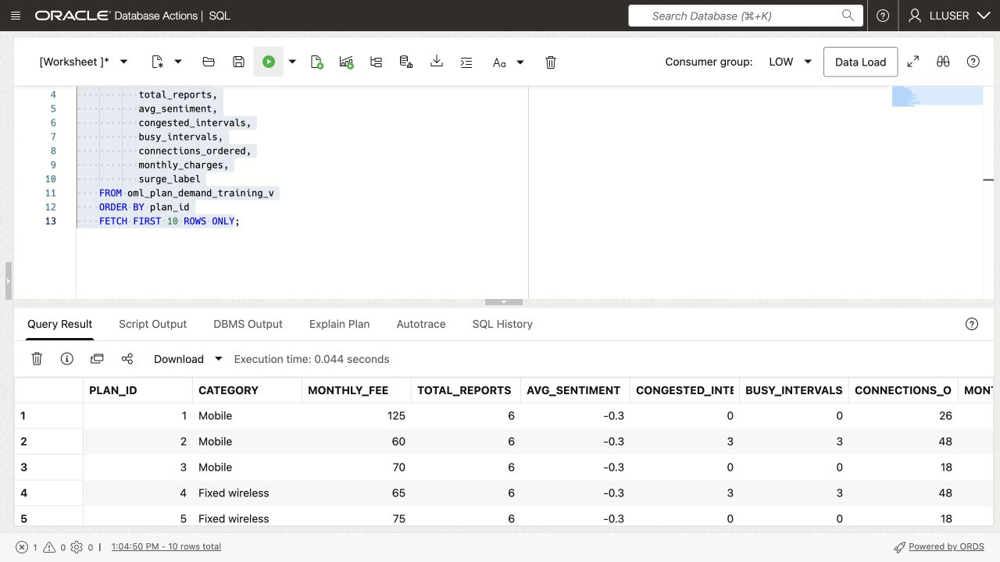

    *Live LLUSER capture, 23 September 2026.*


2. Identify the parts of each row.

    The numeric and category columns are the model inputs. `SURGE_LABEL` is the answer the model learns to predict. `PLAN_ID` identifies the service plan but is not a business feature for this example.

    

    Otto is checking that the training data already brings together the values he needs. He does not have to export support reports and network diagnostics, activations, and service plan data into separate files before training.

## Task 2: Compare models with AutoML (optional)

Otto first uses the Oracle Machine Learning AutoML interface to compare candidate models. AutoML can select algorithms, tune them, and show how well each model identifies the two labels.

This shows how a data scientist chooses a model: the leaderboard is a starting point, but Otto also checks whether the model identifies the business outcome he cares about.

This task is optional. AutoML can take several minutes to complete, so you can continue with Task 3 if you want to focus on creating and using the model in SQL Developer Web.

1. Open **Machine Learning** from Database Actions.

    Open **Database Actions**, select **Machine Learning**. Use the username and password you can find on the **View Login Info screen**.
    
    
    
<!-- capture:CAP-35 -->
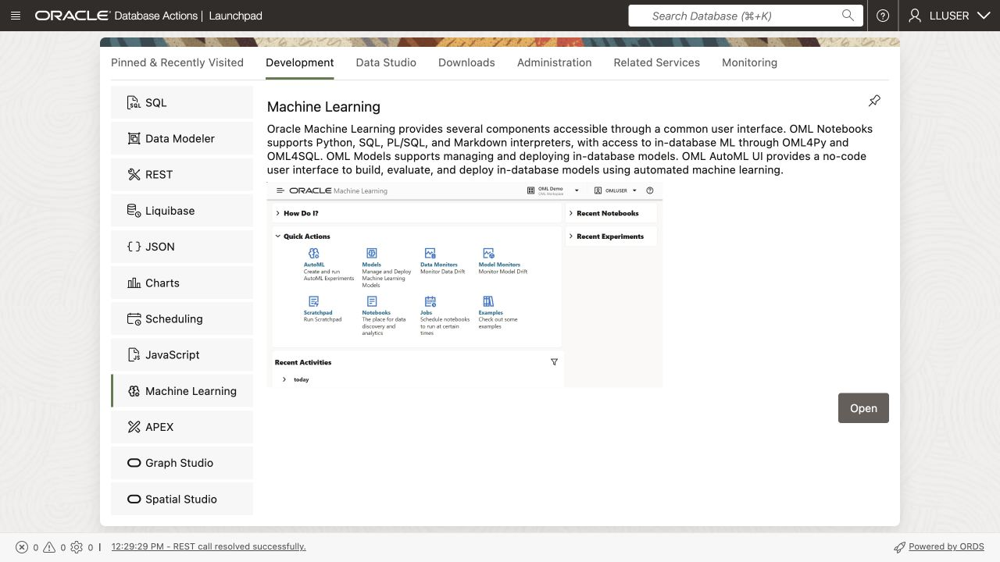

*Live LLUSER capture, 23 September 2026.*

2. Click **AutoML**.

    <!-- capture:CAP-36 -->
    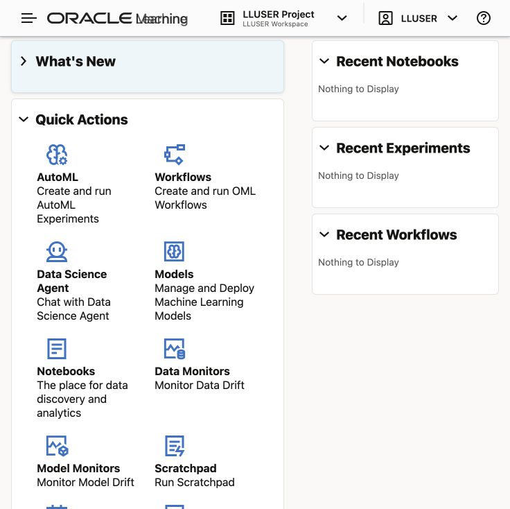

    *Live LLUSER capture, 23 September 2026.*

3. Create a new experiment with these settings:
  
    | Setting         | Value                   |
    | -----------------| -------------------------|
    | Experiment name | `Service Plan Demand Surge`  |
    | Data source     | `OML_PLAN_DEMAND_TRAINING_V` |
    | Predict         | `SURGE_LABEL`           |
    | Prediction type | `Classification`        |
    | Case ID         | `PLAN_ID`            |
  
    <!-- capture:CAP-37 -->
    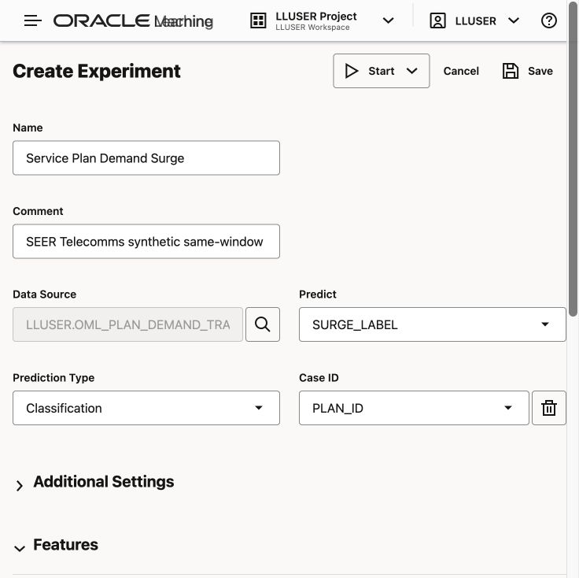

    *Live LLUSER capture, 23 September 2026.*

    Choose **Start → Faster Results** and wait for the model leaderboard. Runtime depends on database resources and model settings.

    

4. Review the leaderboard and model details.

    <!-- capture:CAP-38 -->
    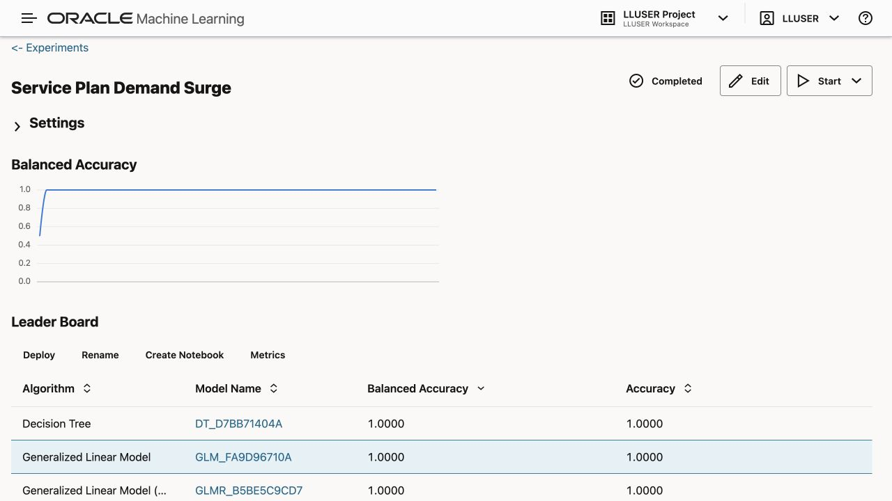

    *Live LLUSER capture, 23 September 2026.*

  
  
  The leaderboard may show several models with a higher balanced-accuracy value than the Generalized Linear Model. Otto does not choose from that number alone. Open the different model details and inspect the confusion matrix.

  <!-- capture:CAP-39 -->
  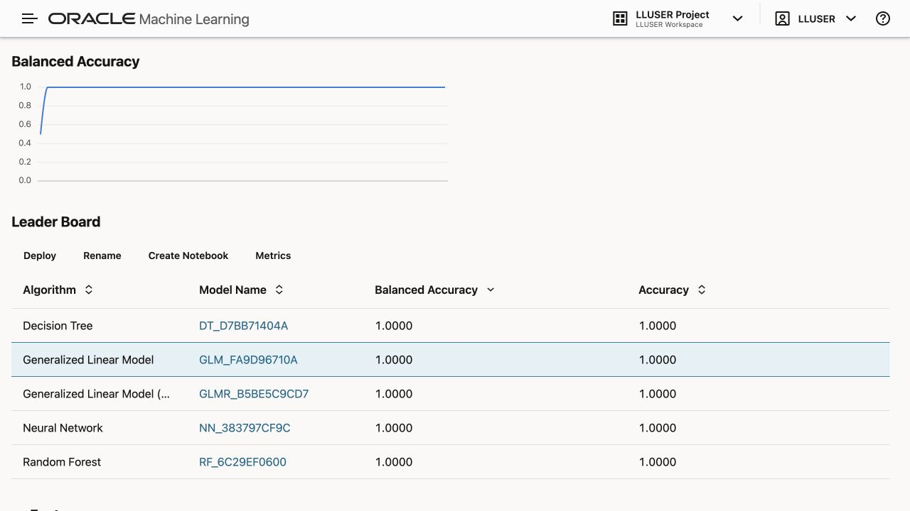

  *Live LLUSER capture, 23 September 2026.*

  **Balanced accuracy** averages the proportion of correct predictions for each class. A **confusion matrix** counts correct and incorrect predictions for each class. Inspect that matrix for both `STABLE` and `SURGE`. A model that predicts only `STABLE` cannot identify demand surges, even if its overall accuracy looks high. Check false positives and missed surges before choosing a model.

  Record the measured balanced accuracy and confusion matrix from your run. The label is derived from connections and utilization from the same month, so even a high score shows how to train and call the model, not how accurately it predicts future demand. The next task creates a separate GLM using SQL.

  <!-- capture:CAP-40 -->
  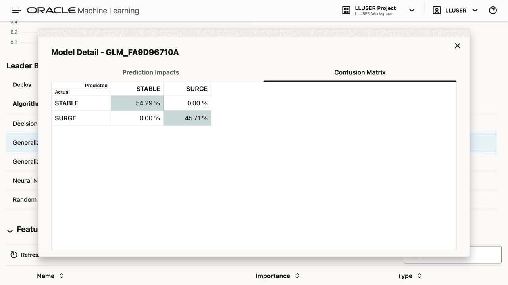

  *Live LLUSER capture, 23 September 2026.*

  Review prediction impact for the selected model. Check which features your model used. A feature’s influence on a prediction does not prove that it causes the outcome.

  <!-- capture:CAP-41 -->
  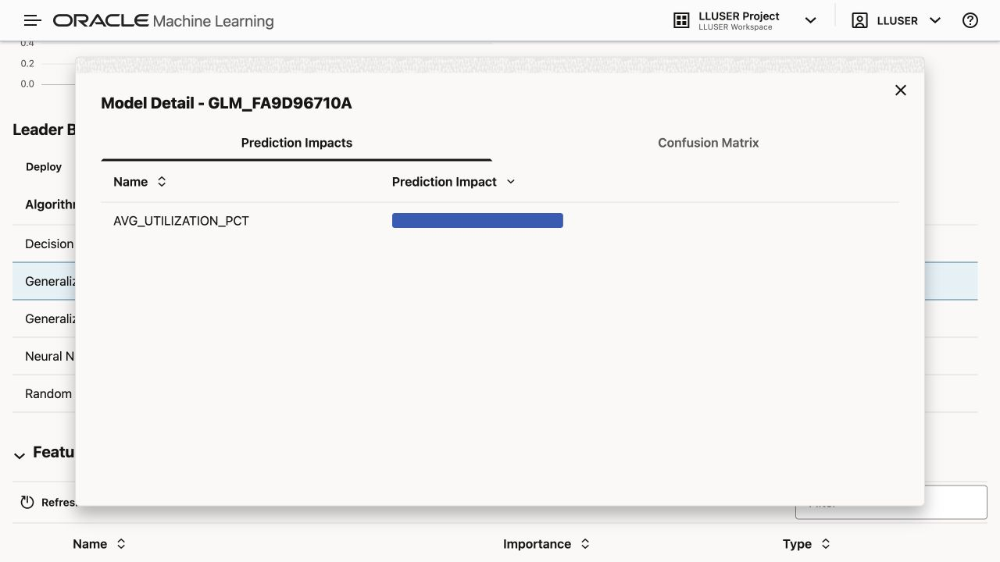

  *Live LLUSER capture, 23 September 2026.*

## Task 3: Create the selected model in SQL Developer Web

If you ran AutoML, compare its results with the SQL model. Now create `OTTO_PLAN_DEMAND_SURGE_MODEL` in SQL Developer Web so you can call it from a query.

The settings table tells Oracle to use the **Generalized Linear Model** used in this exercise. `PREP_AUTO` lets the database handle standard preparation of the input columns.

If you skipped the optional AutoML task, use this setting as the example model for the workshop.

1. Create the settings table and train the model:

    ```sql
    <copy>
    
    DROP TABLE IF EXISTS otto_plan_demand_settings;
    
    CREATE TABLE otto_plan_demand_settings (
          setting_name  VARCHAR2(30),
          setting_value VARCHAR2(4000)
        );

    INSERT INTO otto_plan_demand_settings (setting_name, setting_value)
    VALUES ('ALGO_NAME', 'ALGO_GENERALIZED_LINEAR_MODEL');

    INSERT INTO otto_plan_demand_settings (setting_name, setting_value)
    VALUES ('PREP_AUTO', 'ON');

    INSERT INTO otto_plan_demand_settings (setting_name, setting_value)
    VALUES ('ODMS_RANDOM_SEED', '20260604');

    COMMIT;

    DECLARE
      l_model_count NUMBER;
    BEGIN
      SELECT COUNT(*)
      INTO l_model_count
      FROM user_mining_models
      WHERE model_name = 'OTTO_PLAN_DEMAND_SURGE_MODEL';

      IF l_model_count > 0 THEN
        DBMS_DATA_MINING.DROP_MODEL('OTTO_PLAN_DEMAND_SURGE_MODEL');
      END IF;
    END;
    /

    BEGIN
      DBMS_DATA_MINING.CREATE_MODEL(
        model_name           => 'OTTO_PLAN_DEMAND_SURGE_MODEL',
        mining_function      => DBMS_DATA_MINING.CLASSIFICATION,
        data_table_name      => 'OML_PLAN_DEMAND_TRAINING_V',
        case_id_column_name  => 'PLAN_ID',
        target_column_name   => 'SURGE_LABEL',
        settings_table_name  => 'OTTO_PLAN_DEMAND_SETTINGS'
      );
    END;
    /
    </copy>
    ```

    The model reads the training view, learns the relationship between the features and `SURGE_LABEL`, and stores the trained model in the database. No service plan or support and diagnostic data leaves Oracle Database during training.

2. Confirm that Oracle created the model:

    ```sql
    <copy>
    SELECT model_name,
           mining_function,
           algorithm
    FROM user_mining_models
    WHERE model_name = 'OTTO_PLAN_DEMAND_SURGE_MODEL';
    </copy>
    ```

    <!-- capture:CAP-42 -->
    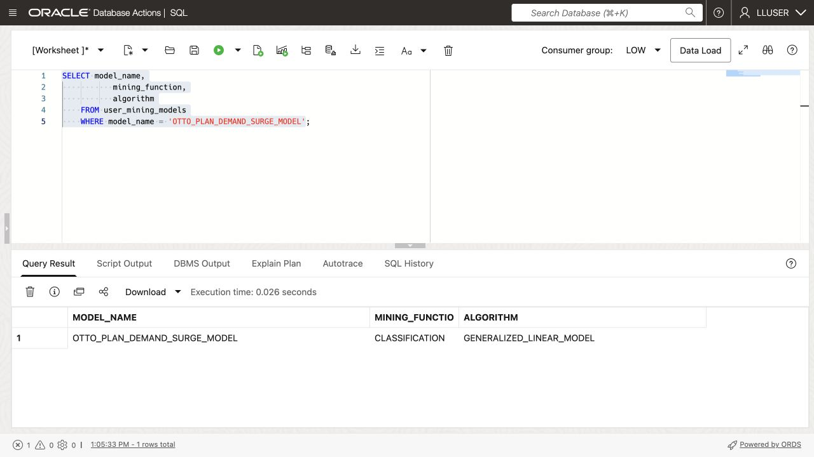

    *Live LLUSER capture, 23 September 2026.*

    The result should show `CLASSIFICATION` and `GENERALIZED_LINEAR_MODEL`. Otto now has a database model that SQL can call.

## Task 4: Score new service plan activity in SQL

Otto creates sample scoring data by changing values from the training view. This shows how to score a separate table without including the target label. Because the rows come from training data, they cannot measure accuracy on new, independent data.

1. Create the scoring table and add the new activity snapshot:

    ```sql
    <copy>
    
    DROP TABLE IF EXISTS otto_plan_demand_scoring_data;

    CREATE TABLE otto_plan_demand_scoring_data (
      plan_id    NUMBER,
      category      VARCHAR2(100),
      monthly_fee    NUMBER,
      total_reports   NUMBER,
      avg_sentiment NUMBER,
      dropped_sessions   NUMBER,
      outage_minutes  NUMBER,
      data_volume_gb   NUMBER,
      avg_utilization_pct  NUMBER,
      congested_intervals   NUMBER,
      busy_intervals  NUMBER,
      connections_ordered    NUMBER,
      monthly_charges       NUMBER
    );

    INSERT INTO otto_plan_demand_scoring_data (
      plan_id,
      category,
      monthly_fee,
      total_reports,
      avg_sentiment,
      dropped_sessions,
      outage_minutes,
      data_volume_gb,
      avg_utilization_pct,
      congested_intervals,
      busy_intervals,
      connections_ordered,
      monthly_charges
    )
    SELECT plan_id,
           category,
           monthly_fee,
           total_reports + 4,
           avg_sentiment,
           dropped_sessions + 25,
           outage_minutes + 10,
           data_volume_gb + 500,
           LEAST(avg_utilization_pct + 5, 100),
           congested_intervals + 1,
           busy_intervals + 1,
           connections_ordered + 3,
           monthly_charges + (monthly_fee * 3)
    FROM (
      SELECT plan_id,
             category,
             monthly_fee,
             total_reports,
             avg_sentiment,
             dropped_sessions,
             outage_minutes,
             data_volume_gb,
             avg_utilization_pct,
             congested_intervals,
             busy_intervals,
             connections_ordered,
             monthly_charges,
             ROW_NUMBER() OVER (ORDER BY plan_id) AS row_num
      FROM oml_plan_demand_training_v
    )
    WHERE row_num <= 12;

    COMMIT;
    </copy>
    ```

    This creates a small synthetic scenario from the workshop data, not observed future activations. 
    >Note: The table has the model inputs, but it does not contain `SURGE_LABEL`. That label belongs to the historical training data and must not be passed to the model as an input.

2. Run the scoring query:

    ```sql
    <copy>
    WITH scored_offers AS (
      SELECT plan_id,
             category,
             connections_ordered,
             monthly_charges,
             total_reports,
             congested_intervals,
             busy_intervals,
             PREDICTION(
               OTTO_PLAN_DEMAND_SURGE_MODEL USING
               category, monthly_fee, total_reports, avg_sentiment,
               dropped_sessions, outage_minutes, data_volume_gb, avg_utilization_pct,
               congested_intervals, busy_intervals, connections_ordered, monthly_charges
             ) AS predicted_surge,
             ROUND(
               PREDICTION_PROBABILITY(
                 OTTO_PLAN_DEMAND_SURGE_MODEL,
                 'SURGE' USING
                 category, monthly_fee, total_reports, avg_sentiment,
                 dropped_sessions, outage_minutes, data_volume_gb, avg_utilization_pct,
                 congested_intervals, busy_intervals, connections_ordered, monthly_charges
               ), 8
             ) AS surge_score
      FROM otto_plan_demand_scoring_data
    )
    SELECT so.plan_id,
           so.plan_name,
           scored_offer.category,
           scored_offer.predicted_surge,
           scored_offer.surge_score,
           ROUND(scored_offer.surge_score * 100, 2) AS surge_pct,
           scored_offer.connections_ordered,
           scored_offer.monthly_charges,
           scored_offer.total_reports,
           scored_offer.congested_intervals,
           scored_offer.busy_intervals
    FROM scored_offers scored_offer
    JOIN service_plans so
      ON so.plan_id = scored_offer.plan_id
    ORDER BY scored_offer.surge_score DESC,
             so.plan_id;
    </copy>
    ```

    <!-- capture:CAP-43 -->
    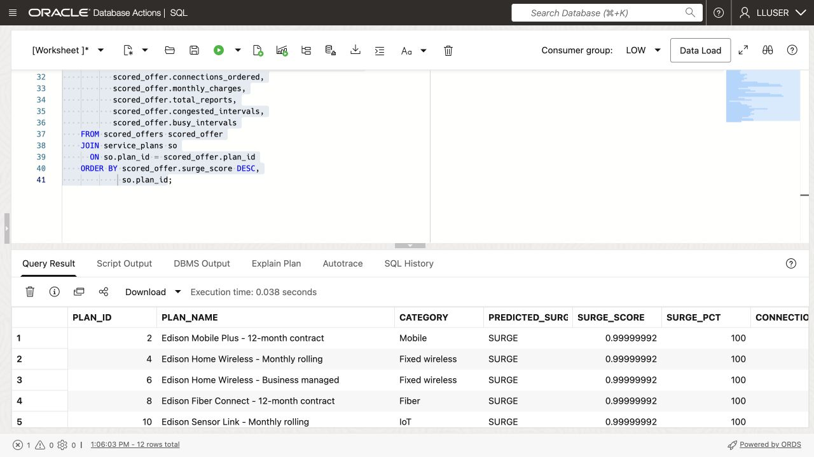

    *Live LLUSER capture, 23 September 2026.*


3. Read the result as a dashboard user.

  `PREDICTED_SURGE` tells the dashboard which label the model selected. `SURGE_SCORE` is the model value between 0 and 1, while `SURGE_PCT` presents the same value as a percentage for a dashboard user. The activations and activity columns give the plan analyst something to review alongside the prediction.

  One SQL result returns the prediction, service plan name, activations, and support reports and network diagnostics. Otto can use the model without moving the data to an external machine learning platform.

  

<!-- application-capture:APP-07 -->

Open **Predictive Service Assurance** and review **Impact Risk** to see model scores beside service information. The running application uses a separate model and dataset. Its scores and confidence values are not validation results for `OTTO_PLAN_DEMAND_SURGE_MODEL`.

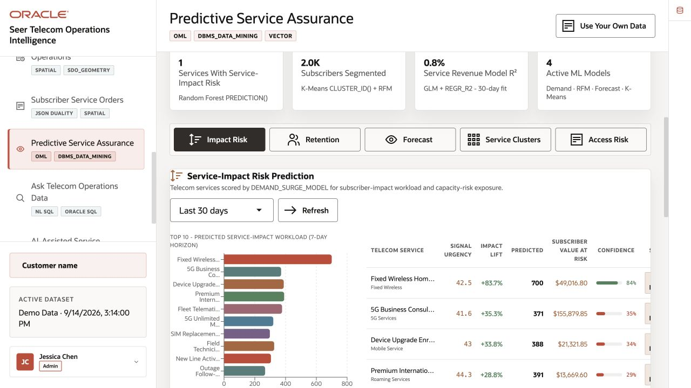

*Application capture, 23 September 2026. Separate demo dataset.*

## Conclusion: Put the Prediction Beside the Business Data

You trained a Generalized Linear Model in SQL Developer Web and scored sample service plan activity. If you completed the optional AutoML task, you also compared candidate models. The final query returns a watchlist with the activity values behind each score.

The model, training data, scores, and service plan details stay in the database. The dashboard can query them together without combining results from separate systems.

Oracle AI Database makes the model part of the dashboard query. A plan analyst can read the watchlist, inspect the supporting values, and repeat the query using the same access controls that protect the source data.

## Acknowledgements

* **Author** - Matt Kowalik
* **Contributor** - Kevin Lazarz
* **Last Updated By/Date** - Matt Kowalik, September 2026
